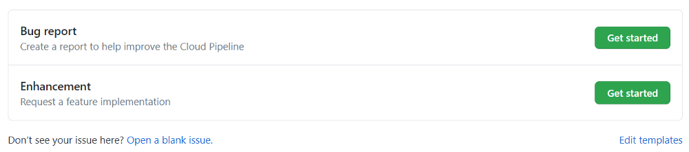
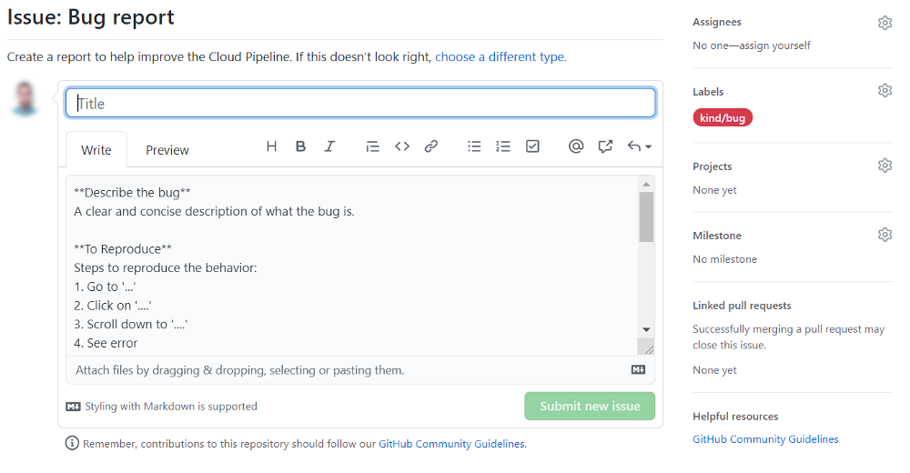
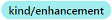
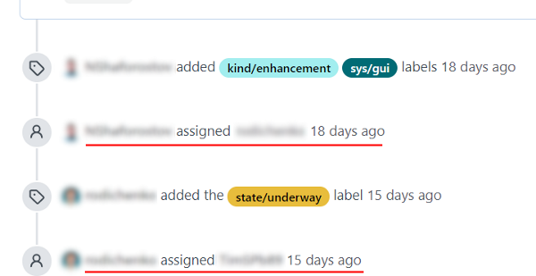
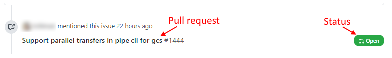
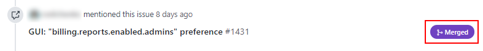
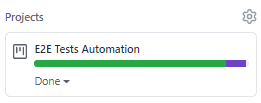

# Cloud Pipeline development contribution processes

All contribution process in **`Cloud Pipeline`** development can be observed at GitHub.  
Let's take a look.

## Task formulation

All customer/inner tasks to be implemented are being described as GitHub issues.  
There are two main task types:

- **`enhancement`** - for description of new features that shall be added to the Cloud Pipeline functionality
- **`bug`** - for description bugs/errors found during the Cloud Pipeline usage

When somebody from the developer team wants to create a new task, he/she clicks the "**New issue**" button at the [Issues](https://github.com/epam/cloud-pipeline/issues) page. The page with the selection of possible issue types described above appears:  
      
After the issue type is selected ("**Get started**" button), the template of the corresponding issue type (with hints that simple the task creation) appears, e.g. the template for the `bug` type:  
      
**_Note_**: if none of the proposed template are suitable for the task, author can create a blank issue.  
Then, the issue author:

- fills in all necessary fields (title and detailed description)
- (_optionally_) sets labels for simpler search/sorting issues. By default, to `bug` and `enhancement` issues the corresponding labels are being set automatically ( and ). Author can remove them or add another ones.
- (_optionally_) sets the "Milestone" that defines the version of the Platform for which the task shall be implemented
- (_optionally_) assigns the implementation of the task to a specific member of the development team
- confirms the issue creation - clicks the "**Submit new issue**" button

**_Note_**: all optional actions can be also performed in any moment after the issue creation

## Development

After the task creation, it shall be assigned to one or more members of the development team (if it wasn't done on the previous step).  
This action is being displayed at the issue card - at the "**Assignees**" section and in the issue card, e.g.:  
      
    

Then assignee(s) can begin the task implementation:

- the developer changes the state of the issue by setting the label 
- after the new functionality or its part (or bug fixes) is implemented, the developer creates a pull request with the code changes to the main Cloud Pipeline project with a link to the current issue.  
It is also displayed at the issue card, e.g.:  
    
- after all the new functionality for the current task is implemented, the developer requests the review of the new code from the other team members - reviewing details can be found at the specific pull request page. Also, at the pull request page, the commits history, checks and possible conflicts are displayed
- when all fixes are done and conflicts are resolved, the pull request is being merged to the base branch (`develop`). It is also displayed at the issue card, e.g.:  
    
- the developer changes the state of the issue by setting the label , other "state" labels are removed
- the developer adds to the issue page a comment about requiring task implementation verification.

## Verification

After the task implementation is done, it shall be verified.  
For that:

- basic functionality is being verified manually with the comment(s) about results to the original task issue
- after that, the testing scenario shall be prepared (test case(s))
- if the testing scenario can't be automated - manually testing shall be performed
- if the testing scenario can be automated:
    - automatic tests code shall be developed
    - automatic tests shall be performed and passed at least once
- test results shall be saved to the project repository

### Test cases

Test case(s) are being created to check and confirm that the customer task has implemented as required (a new functionality is added or the bug is fixed).  
In the Cloud Pipeline development process, test case(s) for each customer task shall be created as a separate issue. Such issue is being created from a blank template as the [task formulation issue](#task-formulation) with the following features:

- issue title and description shall have links to the original task
- issue description shall contain steps to verify implemented functionality in details
- if the current test can't be automated, the issue description shall contain a specific note about it
- (_optionally_) for such issue, the special label can be set - 
- (_optionally_) for such issue, the Project "**E2E Tests Automation**" can be set:  
    

### Tests development

After the test case creation, it shall be assigned to one or more testers from the development team.  
This action is being displayed at the issue card - at the "**Assignees**" section and in the issue card.

If the test case can't be automated, its testing is being performed manually. Manual testing results are reflected in the test case issue comments. If wrong implemented functionality is being encountered during the testing, tester leaves comment(s) with the error(s) description to the original task issue and waits for their fixes.

Else if the test case can be automated, the assigned tester(s) starts the implementation of the test code:

- (_optionally_) the tester changes the state of the test case issue by setting the label 
- after the test functionality is implemented, the tester launches the new test from the own branch and checks results
- if the test is passed according to the current test case, tester creates a pull request with the code changes to the main Cloud Pipeline project with a link to the current test case issue
- if the test isn't passed according to wrong implemented functionality, tester leaves comment(s) with the error(s) description to the original task issue and waits for their fixes
- (_optionally_) after all fixes are done and the test is being passed, the tester can request the review of the new test code from the other team members - reviewing details, comments and test fixes can be found at the specific pull request page
- when all fixes are done and conflicts are resolved, the pull request is being merged to the base branch (`develop`). So, the new test is included for the tests running on a daily basis
- the tester removes the label  if it has set
- test case issue is being closed after that

### Tests results

Regardless of testing type (manually/automated), after all fixes done and the test is being passed,  tester adds summarized test results as a comment to the test case issue.  
Full test results (only for automated tests) are being uploaded to [LINK_FOR_TEST_RESULTS]() daily. Specific result can be found in logs by the test case issue number.

## Go-live

After the test(s) is passed, the implementation of the new functionality/bug fixes is verified, the corresponding mark (comment) is being adds to the original task issue.  
Then, the task can be closed.

In general, the whole contribution procedure looks like:

1. Task creation: new issue (title, description, assignees)
2. Task implementation: state labels, pull request(s), comment "_to verify_"
3. Manual testing of the implementation of the base task functionality: comment "_verified_" or errors description and return to step 2
4. Test case(s) creation: new issue (title, description, link to original task, labels)
5. Tests implementation:
    - _manually_ (for non-automated test cases) - testing, comment "_passed_" to the test case issue or errors description to the task issue and return to step 2
    - _automated_ - state labels, pull request(s), comment "_passed_" to the test case issue or errors description to the task issue and return to step 2
6. Test results: test case issue is closed, automated test results are being uploaded to the Cloud Pipeline repo, comment "_tests are passed_" to the original task
7. Task is closed
