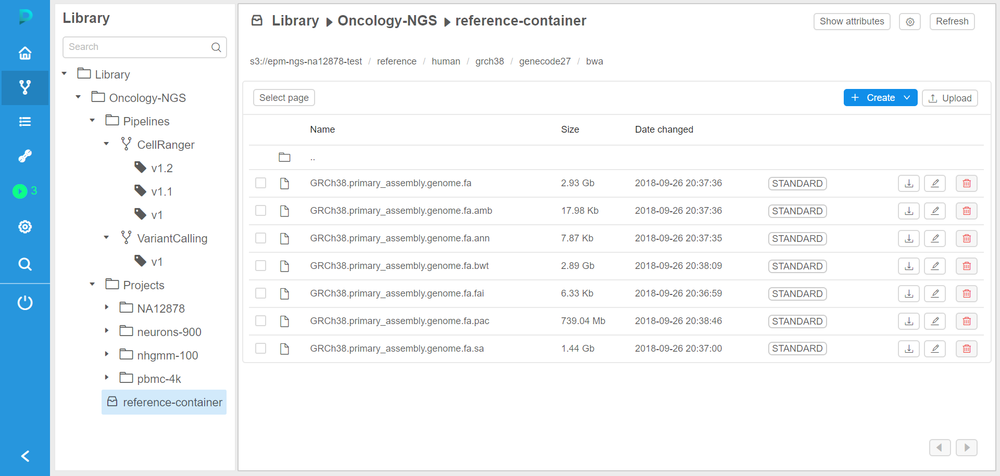
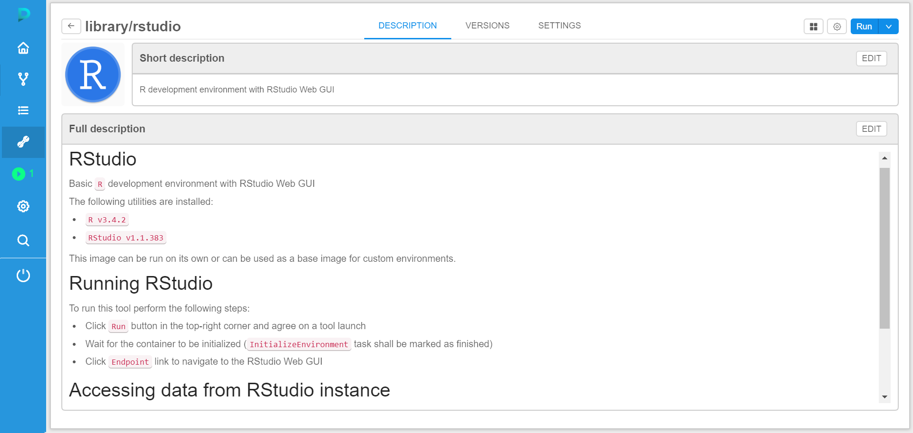

# Cloud Pipeline

**Cloud Pipeline** solution from is a cloud-based web application which provides to users an easy and scalable approach to perform a wide range of analytical tasks, including:

- **Data processing**: create data processing pipelines and run them in the Cloud in the automated way. Each pipline represents a workflow script with versioned source code, documentation, and configuration. You can create such scripts in the **Cloud Pipeline** environment or upload them from the local machine.
- **Data storage management**: create your data storage, download or upload data or edit files right in the **Cloud Pipeline** user interface. File version control is supported.
- **Tool management**: create and deploy your own calculation environment using Docker's container concept. Almost every pipeline requires a specific package of software to run it, which is defined in a docker image. So when you start a pipeline, **Cloud Pipeline** starts a new cloud instance (nodes) and runs a docker image at it.

**Cloud Pipeline** provides a web-based GUI and also supports CLI, which exposes most of GUI features.

Cloud Pipeline Dashboard:  

Data Storages:  

Tool registry:  

**Cloud Pipeline** supports `AWS` and `Azure` Cloud providers to run computing and store data.

## Documentation

Detailed documentation on the **Cloud Pipeline** platform is available in [Documentation directory](docs/README.md)

## Prebuilt binaries

**Cloud Pipeline** prebuilt binaries are available from the [GitHub Releases page](https://github.com/epam/cloud-pipeline/releases)
