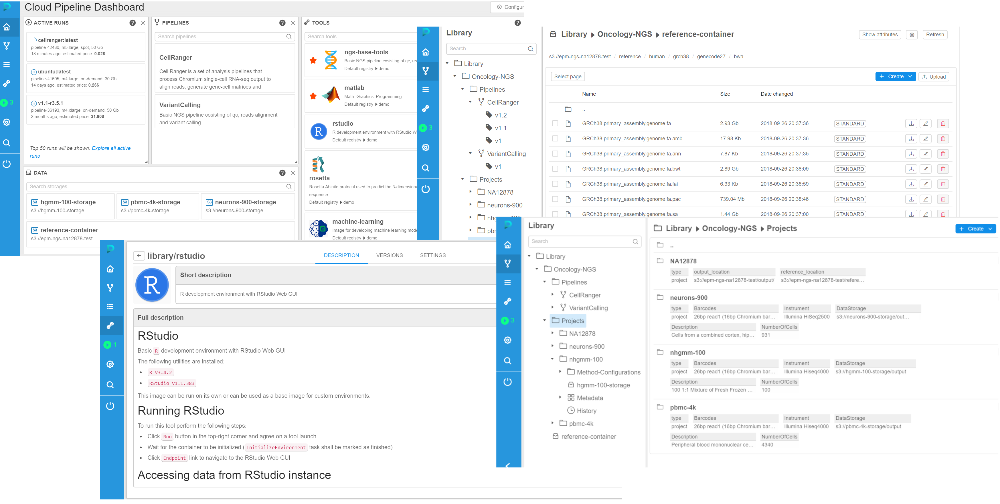

# Cloud Pipeline

`Cloud Pipeline` solution wraps `AWS` and `Azure` compute and storage resources into a single service. Providing an easy and scalable approach to accomplish a wide range of scientific tasks.

- **Data processing**: create data processing pipelines and run them in the Cloud in the automated way. Each pipeline represents a workflow script with versioned source code, documentation, and configuration. You can create such scripts in the `Cloud Pipeline` environment or upload them from the local machine.
- **Data storage management**: create your data storage, download or upload data or edit files right in the `Cloud Pipeline` user interface. File version control is supported.
- **Tools management**: create and deploy your own calculation environment using Docker's container concept. Almost every pipeline requires a specific package of software to run it, which is defined in a docker image. So when you start a pipeline, `Cloud Pipeline` starts a new cloud instance (nodes) and runs a docker image at it.
- **Scientific computing GUI applications**: launch and run GUI-based applications using self-service Web interface. It is possible to choose cloud instance configuration, or even use a cluster. Applications are launched as Docker containers exposing Web endpoints or a remote desktop connection (noVNC, NoMachine).

`Cloud Pipeline` provides a Web-based GUI and also supports CLI, which exposes most of the GUI features.

`Cloud Pipeline` supports `AWS` and `Azure` Cloud providers to run computing and store data.

## Documentation

Detailed documentation on the `Cloud Pipeline` platform is available in [Documentation directory](docs/README.md)

## Prebuilt binaries

`Cloud Pipeline` prebuilt binaries are available from the [GitHub Releases page](https://github.com/epam/cloud-pipeline/releases)
