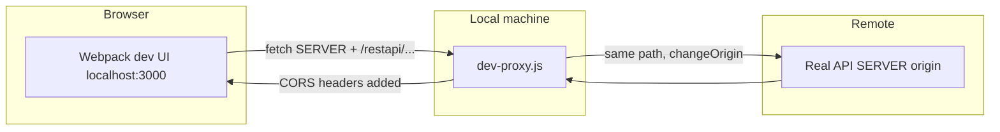

# Development API proxy (`dev-proxy.js`)

This document describes the standalone Node reverse proxy used during local client development. It is **not** the webpack dev server proxy; it is a separate HTTP server that forwards API traffic to the real backend and adjusts responses so the browser accepts cross-origin requests from the webpack dev origin.

## Why it exists

- The UI is served from the webpack dev server (for example `http://localhost:3000`).
- API calls are built as `SERVER + API_PATH` (for example `SERVER` + `/restapi/...`) in application code.
- If `SERVER` pointed directly at a remote host, the browser would enforce that host’s CORS policy for requests **from** `localhost:3000`.
- The dev proxy listens on a **local** URL (by default `http://127.0.0.1:9999`). You configure the app (via webpack) to use that URL as `SERVER`. The browser then talks only to localhost; the proxy forwards the same path and query to the **real** backend origin and adds permissive CORS headers on the response so the dev origin is allowed.



## How it is started

By default, `npm start` runs the dev proxy and the webpack dev server together. To **skip the proxy** entirely (no local listener, bundle uses your real `SERVER` URL), set `PROXY_DISABLED` or `SKIP_DEV_PROXY` before starting — the table row below summarizes this; see **Disabling the proxy** for the exact values and implications.

| Command / setup | Behavior |
|--------|----------|
| `npm start` | Loads `.env` via `config/env.js`, then **starts the dev proxy first**, then starts webpack dev server. Both run in one Node process; Ctrl+C closes both. |
| `npm start` with proxy **disabled** | Set `PROXY_DISABLED=1` or `true`, or `SKIP_DEV_PROXY=1` or `true` (in `.env` or the shell). The dev proxy **is not** started; webpack injects `SERVER` from the environment as-is (no automatic `http://localhost:9999/...`). You must handle CORS / same-origin yourself. |

### Disabling the proxy

| Variable | Effect |
|----------|--------|
| `PROXY_DISABLED=true` or `1` | Do **not** start the proxy with `npm start`. Webpack injects `process.env.SERVER` from your plain `SERVER` env (no automatic `http://localhost:9999/...`). |
| `SKIP_DEV_PROXY=true` or `1` | Same as not starting the proxy (legacy alias). |

If the proxy is disabled, you are responsible for CORS / same-origin behavior yourself (for example by pointing `SERVER` at a host that already allows your dev origin).

## Environment loading

Both `scripts/start.js` and `scripts/dev-proxy.js` call `require('../config/env')` after setting `NODE_ENV=development`. That loads the same `.env` / `.env.development.local` chain as the rest of the client toolchain. Proxy-only variables are normal `process.env` keys in Node; they are **not** exposed to browser bundles unless you add separate `REACT_APP_*` wiring (this project does not).

## Two different URLs: “app base” vs “upstream origin”

It helps to keep these separate:

1. **What the browser / bundle uses as `SERVER`**  
   Injected at build time by webpack’s `DefinePlugin` in **development** (see `config/webpack.config.js`, `resolveDevelopmentInjectedServer()`):
   - If `PROXY_DISABLED` is set → use raw `SERVER` from the environment.
   - Else if `PROXY_SERVER` is set (non-empty) → use `PROXY_SERVER` (trimmed).
   - Else → **`http://localhost:9999`** + a **path prefix** derived from your real `SERVER` URL’s pathname (default `/pipeline/` if parsing fails).

2. **Where the proxy forwards traffic** (`resolveTarget()` in `dev-proxy.js`)  
   - If `PROXY_TARGET` is set → upstream origin is parsed from it (scheme + host + port only).
   - Else → upstream origin is parsed from **`SERVER`** (again, origin only).

So **`SERVER` in `.env` should remain the real deployment URL** (for example `https://example.com/pipeline/`) so the proxy knows the true API host. Webpack, when the proxy is enabled, replaces the **in-bundle** `process.env.SERVER` with the local proxy base URL unless you override with `PROXY_SERVER` or disable with `PROXY_DISABLED`.

**Path alignment:** The pathname under the proxy (for example `/pipeline/`) must match what the backend expects. The default webpack URL uses the pathname from your `SERVER` value combined with `http://localhost:9999`.

## Listen address and port (where the proxy binds)

Resolution order:

1. If **`PROXY_SERVER`** is set → hostname and port are taken from that URL (scheme defaults to `http` if omitted). Example: `PROXY_SERVER=http://127.0.0.1:8080/pipeline/` → listen on `127.0.0.1:8080`.
2. Else → host **`127.0.0.1`**, port **`9999`** (matches the webpack default `http://localhost:9999`).
3. **`PROXY_HOST`** and **`PROXY_PORT`** always override the host and port from the steps above when set (non-empty / valid integer for port).

The proxy process logs the final listen URL and upstream target on startup.

## Upstream TLS

| Variable | Effect |
|----------|--------|
| (default) | `secure: true` when proxying to HTTPS upstreams (normal certificate validation). |
| `PROXY_INSECURE=1` | Disables strict TLS verification for the upstream (use only for dev with self-signed certs). |

## CORS behavior

- **`OPTIONS`** requests are answered locally with **204** and CORS headers; they are not forwarded to the backend.
- For successful proxied responses, the proxy **sets/overwrites** CORS-related headers on the outgoing response so the webpack dev origin can read the body when using credentialed requests where applicable.

| Variable | Effect |
|----------|--------|
| `PROXY_CORS_ORIGIN` | If set, used as `Access-Control-Allow-Origin`. If unset, the request’s `Origin` header is echoed when present, otherwise `*`. |
| (implicit) | When the allowed origin is not `*`, `Access-Control-Allow-Credentials: true` is set. |

## Request augmentation (cookies and bearer token)

### `PROXY_COOKIE_<CookieName>=<value>`

Any environment variable whose name starts with **`PROXY_COOKIE_`** contributes one cookie pair to the **upstream** `Cookie` header:

- Env key **`PROXY_COOKIE_SESSION=abcd`** → cookie **`SESSION=abcd`**
- Env key **`PROXY_COOKIE_MY_COOKIE=1111`** → cookie **`MY_COOKIE=1111`**

All such pairs are joined with `"; "` and **merged after** any `Cookie` header already present from the browser (useful when you paste session material from production DevTools because the browser will not send host-only cookies to localhost).

### `PROXY_BEARER_TOKEN`

If set and non-empty (after trim), every forwarded request gets:

`Authorization: Bearer <token>`

This **overwrites** any `Authorization` the browser sent. Startup logs mention that bearer injection is enabled but **never** print the token.

## Verbose logging

| Variable | Effect |
|----------|--------|
| `PROXY_SERVER_VERBOSE=true` or `1` | For each request (including `OPTIONS`), logs one line: `METHOD <proxy URL> -> <upstream URL>` (path and query preserved). |

## Reference: environment variables

| Variable | Role |
|----------|------|
| `SERVER` | Real app/API base URL in `.env`; used to derive upstream origin (unless `PROXY_TARGET` is set) and, with webpack, the path prefix for the default local `SERVER` injection. |
| `PROXY_TARGET` | Optional explicit upstream origin for forwarding (overrides parsing `SERVER`). |
| `PROXY_SERVER` | Optional full URL the **bundle** should use as `SERVER` in dev; also used to parse default listen host/port if set. |
| `PROXY_DISABLED` | `true` / `1` → no proxy subprocess; webpack uses raw `SERVER`. |
| `SKIP_DEV_PROXY` | Same as skipping proxy start (alias). |
| `PROXY_HOST` | Override bind host. |
| `PROXY_PORT` | Override bind port. |
| `PROXY_CORS_ORIGIN` | Fixed `Access-Control-Allow-Origin`. |
| `PROXY_INSECURE` | `1` → relax upstream TLS. |
| `PROXY_COOKIE_*` | Extra cookies on upstream requests. |
| `PROXY_BEARER_TOKEN` | `Authorization: Bearer …` on upstream requests. |
| `PROXY_SERVER_VERBOSE` | Per-request log lines (HTTP and WebSocket upgrade). |

## WebSocket forwarding

- The same HTTP server handles **`Upgrade: websocket`** requests via `http-proxy`’s **`proxy.ws()`**. They are forwarded to the **same upstream origin** as ordinary HTTP (`PROXY_TARGET` / `SERVER`), with **`changeOrigin`** so the upstream sees the correct `Host`.
- **`PROXY_COOKIE_*`** and **`PROXY_BEARER_TOKEN`** are applied on the **upgrade** request as well (`proxyReqWs`), so authenticated WebSocket handshakes match your HTTP behavior.
- Non-WebSocket upgrade requests are rejected by the proxy library (the client socket is closed).
- **Socket.IO:** Long-polling uses normal HTTP and was already proxied; the WebSocket transport uses this upgrade path when the client connects through the dev proxy base URL.
- **Verbose:** With `PROXY_SERVER_VERBOSE`, upgrade lines are logged like HTTP, with a `[ws]` suffix on the log line.

## Example `.env` fragment

```bash
# Real deployment URL — proxy forwards here (origin only); path used for default local SERVER path
SERVER=https://cloud-pipeline.example.com/pipeline/

# Optional: explicit upstream if SERVER should mean something else for the app only
# PROXY_TARGET=https://cloud-pipeline.example.com

# Optional: custom local URL for the bundle (otherwise webpack uses http://localhost:9999/pipeline/)
# PROXY_SERVER=http://127.0.0.1:9999/pipeline/

# Dev auth helpers (proxy only)
PROXY_COOKIE_SESSION=pasted-session-value
PROXY_BEARER_TOKEN=eyJhbGciOi...

# Turn off proxy entirely
# PROXY_DISABLED=true
```

## Limitations and notes

- **Domain cookies:** Cookies scoped to the real site’s domain are not automatically available on `localhost`. `PROXY_COOKIE_*` / `PROXY_BEARER_TOKEN` exist to supply credentials manually for local dev.
- **WebSocket policy:** The real backend must accept the browser’s `Origin` (e.g. the webpack dev server) on the upgrade handshake; the proxy does not rewrite `Origin`.
- **Production builds:** The dev proxy and `resolveDevelopmentInjectedServer()` apply to **development** webpack mode only. Production uses `PUBLIC_URL` for `process.env.SERVER` as before.

## Related files

- [`scripts/dev-proxy.js`](dev-proxy.js) — proxy implementation and `startDevProxy()` export.
- [`scripts/start.js`](start.js) — starts proxy then webpack when not disabled.
- [`config/webpack.config.js`](../config/webpack.config.js) — `resolveDevelopmentInjectedServer()` and `DefinePlugin` for `process.env.SERVER`.
- [`config/env.js`](../config/env.js) — dotenv loading order for Node scripts.
