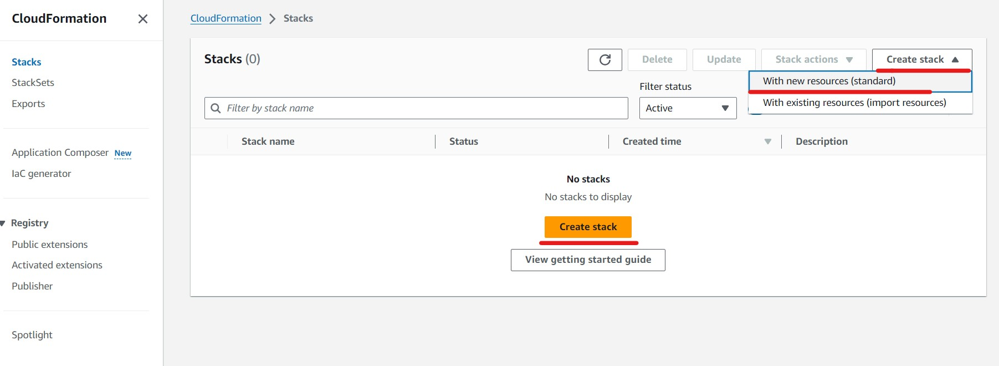
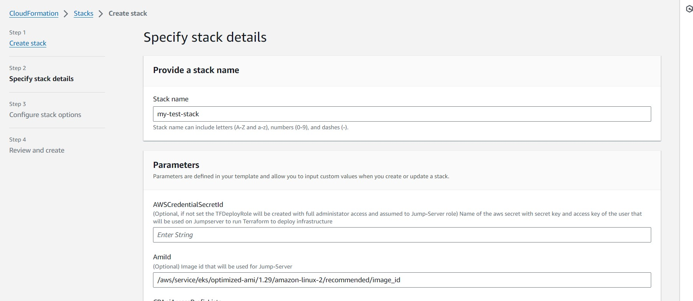

# Cloud-pipeline Deployment using AWS Cloudformation step-by-step guide

## Overview

This step-by-step guide illustrates how to deploy Cloud Pipeline using AWS CloudFormation. The solution relies on
creating a CloudFormation stack that deploys the necessary infrastructure using a Terraform module and install the Cloud
Pipeline on top of it.

Follow the outlined steps below to execute the deployment process: <br>

- [Cloud-pipeline Deployment using AWS Cloudformation step-by-step guide](#cloud-pipeline-deployment-using-aws-cloudformation-step-by-step-guide)
    - [Overview](#overview)
        - [Prerequisites](#prerequisites)
            - [Create VPC](#create-vpc)
            - [Create AWS Elastic IP](#create-aws-elastic-ip)
            - [Grant Permission to Create Infrastructure Resources](#grant-permission-to-create-infrastructure-resources)
            - [Create DNS records](#create-dns-records)
            - [(Optional) Add authority signed certificates for services](#optional-add-authority-signed-certificates-for-services)
            - [Optional: Integrate with an Identity Provider (IdP)](#optional-integrate-with-an-identity-provider-idp)
            - [(Optional) Create a Zip File with Additional Assets](#optional-create-a-zip-file-with-additional-assets)
        - [Create Cloudformation Stack using template file](#create-cloudformation-stack-using-template-file)
            - [Stack Parameters Description](#stack-parameters-description)
            - [Deploy Cloud Pipeline using AWS Console](#deploy-cloud-pipeline-using-aws-console)
            - [Deploy Cloud Pipeline using AWS CLI](#deploy-cloud-pipeline-using-aws-cli)
        - [Review Deployment Logs](#review-deployment-logs)

### Prerequisites

Before creating the CloudFormation stack, you need to prepare several requirements:

#### AWS VPC

Virtual Private Cloud (VPC) with desired network configuration should be created in advance.
The deployment will create all necessary resources for Cloud Pipeline deployment during the next phases:

- CloudFormation stack deployment
- Terraform deployment

#### AWS Elastic IP

Generate an AWS Elastic IP, which will be used later to deploy an AWS Elastic Load Balancer (ELB) routing users' traffic
to Cloud-Pipeline services. This EIP should also be used when requesting the creation of DNS records from your DNS
provider.

#### Credentials to Create Infrastructure Resources

Credentials should be given for this deployment stack to initiate the creation of infrastructure resources.
There are two ways to provide such credentials:

1. If you have Administrator role in AWS account or role that Allowed to created resources: EC2 instance, IAM
   Roles/Policies, EKS cluster, security groups, cloudwatch logs, s3 buckets, efs/fsx luste file systems, kms keys, rds
   etc. you can use this credentials:

- Put your credentials of temporary credentials into the AWS secret:
    - Create aws secretsmanager secret using AWS console or this aws cli command(make sure you have installed aws cli):
   ```
   aws secretsmanager create-secret --name <secrets-name>  --secret-string 'export AWS_ACCESS_KEY_ID="<key-id>" export AWS_SECRET_ACCESS_KEY="<secret acess key>" export AWS_SESSION_TOKEN="<session token>"' --region <region-id>
   ```
    - Remember the secret name, you will need this value during further deployment.
      (To set this secret name as stack parameter `AWSCredentialSecretId`. For more information you can
      look [deploy parameters](#stack-parameters-description))

2. If you don't provide secret name with the credentials to the deployment script, an additional IAM Role will be
   created with full administrator access and assumed by Jump-Server during deploy process.

#### Create DNS records

Since Cloud Pipeline services communicate through domain names, you need to create DNS records. The proposed records
scheme:

| DNS record                                   | Record type | Value                                   | Comment                                |
|----------------------------------------------|-------------|-----------------------------------------|----------------------------------------|
| \<cloud-pipeline-name\>.\<your-domain\>      | A           | < EIP value >                           | Required                               |
| edge.<cloud-pipeline-name\>.\<your-domain\>  | CNAME       | \<cloud-pipeline-name\>.\<your-domain\> | Required                               |
| docker.<cloud-pipeline-name>.\<your-domain\> | CNAME       | \<cloud-pipeline-name\>.\<your-domain\> | Required                               |
| git.<cloud-pipeline-name\>.\<your-domain\>   | CNAME       | \<cloud-pipeline-name\>.\<your-domain\> | Required                               |
| auth.<cloud-pipeline-name\>.\<your-domain\>  | CNAME       | \<cloud-pipeline-name\>.\<your-domain\> | Skip, if you use your organisation IdP |

#### Add authority signed certificates for services

> NOTE: This step can be skipped. <br>
> By default, if no authority-signed certificates are set, Cloud Pipeline will create self-signed certificates during
> the
> deployment

| Field                        | Value                                                                                                                                                                                                               |
|------------------------------|---------------------------------------------------------------------------------------------------------------------------------------------------------------------------------------------------------------------|
| Subject                      | \<cloud-pipeline-name\>.\<your-domain\>                                                                                                                                                                             |
| Alternative names            | DNS: *.\<cloud-pipeline-name\>.\<your-domain\> <br>or<br> DNS:<br> edge.\<cloud-pipeline-name\>.\<your-domain\> <br> docker.\<cloud-pipeline-name>.\<your-domain\> <br> git.\<cloud-pipeline-name\>.\<your-domain\> |
| Alternative names (optional) | DNS: auth.\<cloud-pipeline-name>.\<your-domain\>                                                                                                                                                                    |
| Duration (days)              | 365                                                                                                                                                                                                                 |

> Alternative names (optional) - DNS: auth.<cloud-pipeline-name>.<your-domain> - This must be set if there is no
> integration with organization Identity Provider.

#### Integrate with an Identity Provider (IdP)

> If you deploy Cloud-Pipeline with self-hosted IdP, you can skip this step: <br>
> Cloud-pipeline creates a dummy IdP service suitable for testing, it is not recommended for production due to
> security concerns. For secure access, you should integrate your Cloud Pipeline with your organization's IdP Service

Integration is implemented with SAML2 protocol. The following IdP connections shall be requested from the IdP team:

| Purpose               | SP URL                                                   | ACS URL                                                                      | AML Binding   | Assertion information                                     |
|-----------------------|----------------------------------------------------------|------------------------------------------------------------------------------|---------------|-----------------------------------------------------------|
| cloud-pipeline GUI    | https://\<cloud-pipeline-name\>.\<your-domain\>/pipeline | https://\<cloud-pipeline-name\>.\<your-domain\>/pipeline/saml/SSO            | HTTP Redirect | * NameID<br> * email<br> * first name<br> * last name<br> |
| cloud-pipeline GitLab | https://git.\<cloud-pipeline-name\>.\<your-domain\>      | https://git.<cloud-pipeline-name\>.\<your-domain\>//users/auth/saml/callback | HTTP Post     | * NameID<br> * email<br> * first name<br> * last name<br> |

As a result of the requests, the following information shall be provided:

* Federation metadata XML file
* IdP signing certificate

#### Create a Zip File with Additional Assets

> This step is required if you've prepared SSL certificated and IdP integration on previous steps. <br>
> It allows to provide these assets for the deployment.

Once all additional certificates (and optional metadata) are ready, you should create a zip archive with a specific
structure. <br>
To do this you can create bash script by creating new file create_zip.sh with content:

```
#!/bin/bash
 
_SSL_CERT=$1
_SSL_KEY=$2
_SSO_METADATA=$3
_SSO_CERT=$4
 
_TMP_ASSETS_LOCATION="/tmp/cp-assets-$RANDOM"

# Create folder structure for certificates using commands
mkdir -p $_TMP_ASSETS_LOCATION/common/pki $_TMP_ASSETS_LOCATION/api/pki $_TMP_ASSETS_LOCATION/api/sso
 
# Move your certificates to common/pki directory, for example using command:
if [ -f $_SSL_CERT ] && [ -f $_SSL_KEY ]; then
   cp $_SSL_CERT $_TMP_ASSETS_LOCATION/common/pki/ca-public-cert.pem
   cp $_SSL_KEY $_TMP_ASSETS_LOCATION/common/pki/ca-private-key.pem
   else
   echo "Certificate and key not provided nothing will be copied to common/pki"
fi

if [ -z $_SSO_METADATA ] && [ -z $_SSO_CERT ]; then
   echo "Metadata and sso certificate for Identity provider settings not set, nothing will be copied to api directory"
   else
   cp $_SSO_METADATA $_TMP_ASSETS_LOCATION/api/sso/cp-api-srv-fed-meta.xml
   cp $_SSO_CERT $_TMP_ASSETS_LOCATION/api/pki/idp-public-cert.pem
   
fi 
 
zip -r $_TMP_ASSETS_LOCATION/cp-assets.zip $_TMP_ASSETS_LOCATION/common $_TMP_ASSETS_LOCATION/api
echo $(realpath $_TMP_ASSETS_LOCATION/cp-assets.zip)
```

Run script with your parameters, for example:

```
bash create_zip.sh ca-public-cert.pem ca-private-key.pem cp-api-srv-fed-meta.xml idp-public-cert.pem
```

> Optional: <br>
> If you don't have s3 bucket you can create it in AWS Console or using AWS CLI command:<br> aws s3api create-bucket
> --bucket <*s3-bucket-name*>

Upload zip file to the s3 bucket using AWS console or aws cli command:

```
 aws s3 cp <pathtofile>/cp-assets.zip s3://<s3-bucket-name>
```

Save this link, you will need it for further step t set it as parameter in AWS Console stack parameters(for more information you can look
at [parameters description](#stack-parameters-description)) or as additional parameter in .json file(if create stack using awc cli) :

> Link format should be as follows: s3://*s3-bucket-name*/cp-assets.zip

### Create Cloudformation Stack using template file

There are two methods to create a CloudFormation stack that deploys the infrastructure and Cloud-Pipeline services: via
the AWS console, or the AWS Command Line Interface (CLI).

#### Stack Parameters Description

| Name                             | Description                                                                                                                                                                                                                                                                         |
|----------------------------------|-------------------------------------------------------------------------------------------------------------------------------------------------------------------------------------------------------------------------------------------------------------------------------------|
| `ProjectName`                    | (Required) Name of the deployment. Will be used as resources name prefix                                                                                                                                                                                                            |
| `Env`                            | (Required) Environment name. Will be used as resources name prefix                                                                                                                                                                                                                  |  | `JumpServerInstanceType` | (Optional) Jump-server EC2 instance type |
| `AmiId`                          | (Optional) Image id that will be used for Jump-Server                                                                                                                                                                                                                               |
| `VpcId`                          | (Required) Id of the VPC where all resources will be created. See [Create VPC](#create-vpc)                                                                                                                                                                                         |
| `CPInfraSubnetId`                | (Required) Subnet where JumpServer instance and EKS node group will be created. See [Create VPC](#create-vpc)                                                                                                                                                                       |
| `EKSSubnetIds`                   | (Required) Ids of the VCP subnets to be used for Cloud Pipeline EKS cluster, FS mount points, etc. At least one subnet id in list must be specified. See [Create VPC](#create-vpc)                                                                                                  |
| `IAMrolePermissionsBoundaryArn`  | (Optional) Account specific role boundaries, that can be used during creating AMI Roles with organization specific restrictions.                                                                                                                                                    |
| `FileSystemType`                 | (Optional) FileSystem type that will be created. Can be efs or fsx. Default efs.                                                                                                                                                                                                    |
| `TFstateBucketName`              | (Required) S3 Bucket name, that will be created where terraform state file for Cloud-Pipeline Infrastructure module will be stored                                                                                                                                                  |
| `TFStateLockTableName`           | (Required) Name of the DynamoDB table, that will be created, for terraform state lock                                                                                                                                                                                               |
| `CPApiAccessPrefixLists`         | (Optional) Prefix Lists to which access to Cloud Pipeline API will be granted                                                                                                                                                                                                       |
| `CPDeploymentId`                 | (Optional) Specify unique ID of the deployment. It will be used to name cloud entities (e.g. path within a docker registry object container). Must contain only letters, digits, underscore or horizontal bar.                                                                      |
| `CPEdgeAwsElbSubnets`            | (Required) The ID of the public subnet for the Load Balancer. Must be in the same Availability Zone (AZ) as the `CPInfraSubnetIdNode`.                                                                                                                                              |
| `CPEdgeAwsElbEipallocs`          | (Required) Allocation ID of the created Elastic IP. See [Create AWS Elastic IP](#create-aws-elastic-ip)                                                                                                                                                                             |
| `CPPrefUiPipelineDeploymentName` | (Optional) Deployment Name that will be shown as the browser tab name                                                                                                                                                                                                               |
| `CPApiSrvHost`                   | (Required) API service domain name address. See [Create DNS](#create-dns-records)                                                                                                                                                                                                   |
| `CPIdpHost`                      | (Optional) IDP service domain name address. If External Identity Provider is used this parameter is optional.                                                                                                                                                                       |
| `CPDockerHost`                   | (Required) Docker service domain name address. See [Create DNS](#create-dns-records)                                                                                                                                                                                                |
| `CPEdgeHost`                     | (Required) EDGE service domain name address. See [Create DNS](#create-dns-records)                                                                                                                                                                                                  |
| `CPGitlabHost`                   | (Required) GITLAB service domain name address. See [Create DNS](#create-dns-records)                                                                                                                                                                                                |
| `EKSAdminRoleArns`               | (Optional) Set additional role ARNs that will be added as administartors in EKS cluster. For example in case when additional deploy role created for Jump Server and need to add additional role as EKS Administrator(By default admin role is that role which deploys EKS cluster) |
| `AWSCredentialSecretId`          | (Optional) Name of the aws secret with secret key and access key of the user that will be used on Jumpserver to run Terraform to deploy infrastructure. See [Set access to create infrastructure](#set-access-to-create-infrastructure-resources)                                   |
| `CPAssetsS3Url`                  | (Optional) Link to zip archive with additional assets(certificates) on AWS S3 bucket. For example s3://< bucket-name >/< filename.zip > See [Creating zip with additional assets](#optional-creating-zip-with-additional-assets)                                                    |

#### Deploy Cloud Pipeline using AWS Console

1. Go to the CloudFormation service in the AWS Console and select the "create stack" option.
   
2. In the "Prerequisite - Prepare template" section, choose "Use an existing template".
   
3. Choose your 'jump-server.yaml' file under "Specify a template" and click "Next".
4. On "Specify stack details" step provide the Stack Name and all required parameters, click "Next" and leave next
   page "Configure stack options" without changes, then click "Next" to check parameters at "Review and create" page.
   
5. Click "Submit" to start stack creation.
   

Follow the [Stack Parameters Description](#stack-parameters-description) section for a detailed explanation of each
parameter.

#### Deploy Cloud Pipeline using AWS CLI

1. Use the AWS CLI to deploy the Cloud Pipeline. Create Cloudformation stack using AWS Console and file jump-server.yaml
   and set parameters (see [deployment parameters](#stack-parameters-description)) or create file jump-server.json like:

```
 [
    {
        "ParameterKey": "ProjectName",  
        "ParameterValue": "<Name of the deployment. Will be used as resources name prefix>" 
    },
    {
        "ParameterKey": "Env",  
        "ParameterValue": "<Environment name. Will be used as resources name prefix>" 
    },
    {
        "ParameterKey": "VpcId",  
        "ParameterValue": "<VPC Id where all resources will be created>" 
    },
    {
        "ParameterKey": "CPInfraSubnetId",  
        "ParameterValue": "<Subnet where JumpServer instance and EKS node group will be created>" 
    },
    {
        "ParameterKey": "EKSSubnetIds",  
        "ParameterValue": "<Ids of the VCP subnets to be used for Cloud Pipeline EKS cluster, FS mount points, etc. At least one subnet id in list must be specified>"
    },
    {
        "ParameterKey": "IAMrolePermissionsBoundaryArn",  
        "ParameterValue": "<Optional, ARN of the account specific role boundary>" 
    },
    {
        "ParameterKey": "TFstateBucketName",  
        "ParameterValue": "<S3 Bucket name, that will be created where terraform state file for Cloud-Pipeline Infrastructure module will be stored>" 
    },
    {
        "ParameterKey": "TFStateLockTableName",  
        "ParameterValue": "<Name of the DynamoDB table, that will be created, for terraform state lock>" 
    },
    {
        "ParameterKey": "CPApiAccessPrefixLists",  
        "ParameterValue": "<Optional, prefix Lists to which access to Cloud Pipeline API will be granted>" 
    },
    {
        "ParameterKey": "CPDeploymentId",  
        "ParameterValue": "<Specify unique ID of the deployment.It will be used to name cloud entities (e.g. path within a docker registry object container)>" 
    },
    {
        "ParameterKey": "CPEdgeAwsElbSubnets",  
        "ParameterValue": "<The ID of the public subnet for the Load Balancer. Must be in the same Availability Zone (AZ) as the JumpServer and EKS Cluster Node>" 
    },
    {
        "ParameterKey": "CPEdgeAwsElbEipallocs",  
        "ParameterValue": "<Allocation ID of the created Elastic IP>" 
    },
    {
        "ParameterKey": "CPApiSrvHost",  
        "ParameterValue": "<user-domain-name>" 
    },
    {
        "ParameterKey": "CPIdpHost",  
        "ParameterValue": "auth.<user-domain-name>" 
    },
    {
        "ParameterKey": "CPDockerHost",  
        "ParameterValue": "docker.<user-domain-name>" 
    },
    {
        "ParameterKey": "CPEdgeHost",  
        "ParameterValue": "edge.<user-domain-name>" 
    },
    {
        "ParameterKey": "CPGitlabHost",  
        "ParameterValue": "git.<user-domain-name>" 
    },
    {
        "ParameterKey": "AWSCredentialSecretId",  
        "ParameterValue": "<secret name with aws credentials>" 
    }
]
```

From aws cli run command:

```
 aws cloudformation create-stack  --stack-name <stack-name>  --template-body file://jump-server.yaml  --parameters file://jump-server.json --capabilities CAPABILITY_NAMED_IAM  --region <region-id>
```

Monitor the Stack creation in the AWS Console or by running the provided AWS CLI command:

```
aws cloudformation describe-stacks --stack-name <stack-name> --query "Stacks[].{\"1.Name\":StackName,\"2.Status\":StackStatus,\"3.Output\":Outputs}" --region <region-d>
```

### Review Deployment Logs

To review the deployment process logs, follow these steps:

1. Log in to the Jump Server using the AWS Console or by running the ssm start-session command from the stack creation
   Output.
2. Execute the following commands to log in as the root user and navigate to the root/deployment-eks directory:

```
  sudo su 
  cd ~/deployment-eks
```

3. To monitor the Terraform deployment process, open the `terraform_apply.log` file in this directory. You can do this
   with the following command:

```
 tail -f terraform_apply.log
```  

4. Wait for the log to display "Apply complete!" and additional outputs. Once these appear, wait a few more minutes to
   allow Cloud Pipeline to start its installation and create the pipectl.log file.
5. Monitor the Cloud-Pipeline deployment process using the following command:

```
 tail -f pipectl.log
```  

6. Once the installation is finished, the log will display "Installation done" along with some links.

Wait approximately 40-50 minutes until all resources and services are deployed. Then, verify the deployment by visiting
https://<service\>.<user-domain-name\>/
