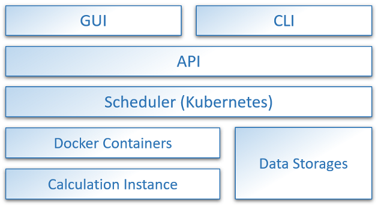

# Cloud Pipeline Introduction

- [Cloud Pipeline Introduction](#cloud-pipeline-introduction)
  - [Why Cloud Pipeline](#why-cloud-pipeline)
  - [Components](#components)

## Why Cloud Pipeline

Cloud Pipeline solution from EPAM provides an easy and scalable approach to perform a wide range of analysis tasks in the cloud environment.  
This solution takes the best of two approaches: classic HPC solutions (based on GridEngine schedulers family) and SaaS cloud solutions.

| Feature | Classic "HPC" | "Cloud Pipeline" | SaaS |
|---|---|---|---|
| **Pipelines customization** | **_High_**. Direct scripting - any level of customization | **_High_**. Direct scripting - any level of customization | **_Low_**. Provide specific pipeline definition languages or even only a graphical editor |
| **Backward compatibility** | **_N/A_** | **_High_**. "Classic" HPC scripts and NGS tools can be run without any changes | **_Low_**. Scripts have to be rewritten according to the supported languages and storage structures |
| **User Interface** | Command Line | Graphical Interface for User interaction and a Command Line Interface for automation scripts | Graphical Interface |
| **Calculation power scalability** | **_Low_**. New nodes shall be deployed and supported on-premises. Idle nodes are still consuming resources | **_High_**. New nodes are started according to the job request and terminated as soon as they are not needed anymore. Each job can precisely define required CPU/RAM/Disk resources or even select optimal node up to speed up execution (e.g. memory optimized nodes for cellranger pipelines) | **_High_**. Scalable as "Cloud Pipeline" but sometimes limits user to predefined nodes setup |
| **Deployment and vendor-lock** | Deployed on-premises and introduces no vendor-lock | Can be deployed in AWS/GCP/Azure or on-premises, thus introduces no vendor-lock | Consumed as an Internet service (no on-premises deployment available), all processes are tied to this specific vendor |
| **Security** | **_High_**. All data and analysis processes are located in a controlled network. | **_High_**. All data and analysis processes are located in a controlled cloud VPC. All security configurations are performed by user's security officers | **_Low_**. No direct control over security configuration. SaaS vendor has full access to the data storages. |

## Components

The main components of the Cloud Pipeline are shown below:  
