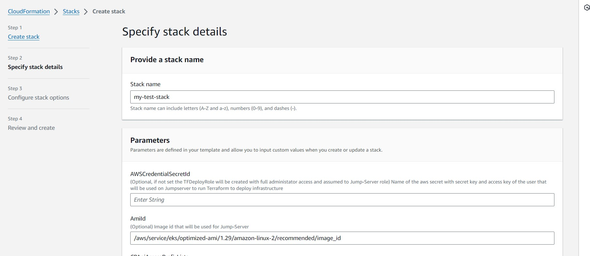
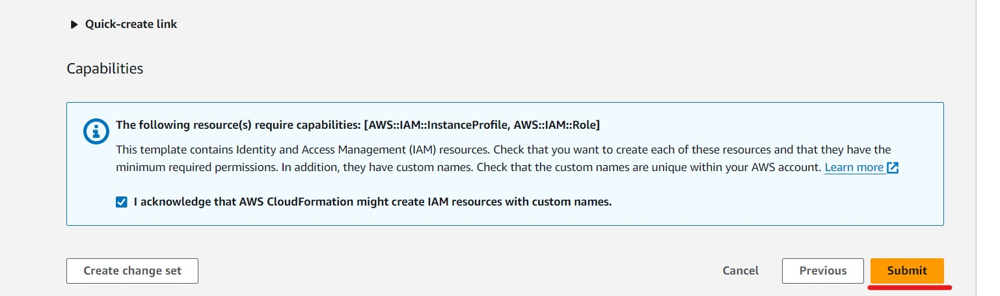

# Cloud-pipeline Deployment using AWS Cloudformation step-by-step guide

## Overview

This step-by-step guide illustrates how to deploy Cloud Pipeline using AWS CloudFormation. The solution relies on
creating a CloudFormation stack that deploys the necessary infrastructure using a Terraform module and install the Cloud
Pipeline on top of it.

Follow the outlined steps below to execute the deployment process: <br>

- [Cloud-pipeline Deployment using AWS Cloudformation step-by-step guide](#cloud-pipeline-deployment-using-aws-cloudformation-step-by-step-guide)
    - [Overview](#overview)
        - [Prerequisites](#prerequisites)
            - [AWS VPC](#aws-vpc)
            - [AWS Elastic Load Balancer](#aws-elastic-load-balancer)
            - [(Optional) Managing access to the platform](#optional-managing-access-to-the-platform)
            - [Credentials to Create Infrastructure Resources](#credentials-to-create-infrastructure-resources)
            - [Create DNS records](#create-dns-records)
            - [Add authority signed certificates for services](#add-authority-signed-certificates-for-services)
            - [Integrate with an Identity Provider (IdP)](#integrate-with-an-identity-provider-idp)
            - [Create a Zip File with Additional Assets](#create-a-zip-file-with-additional-assets)
        - [Create Cloudformation Stack using template file](#create-cloudformation-stack-using-template-file)
            - [Stack Parameters Description](#stack-parameters-description)
                - [General configuration](#general-configuration)
                - [Network Configuration](#network-configuration)
                - [Infrastructure configuration](#infrastructure-configuration)
                - [Application configuration](#application-configuration)
            - [Deploy Cloud Pipeline using AWS Console](#deploy-cloud-pipeline-using-aws-console)
            - [Deploy Cloud Pipeline using AWS CLI](#deploy-cloud-pipeline-using-aws-cli)
        - [Review Deployment Logs](#review-deployment-logs)
        - [Destroy Cloud-Pipeline resources](#destroy-cloud-pipeline-resources)

### Prerequisites

Before creating the CloudFormation stack, you need to prepare several requirements:

#### AWS VPC

Virtual Private Cloud (VPC) with desired network configuration should be created in advance.

To create VPC navigate to the VPC service:

1. Click Create VPC.
2. Choose the "VPC and more". This gives you more customization options.
3. Configure your VPC:
    - Name tag auto-generation: Provide a suitable name for your VPC.
    - IPv4 CIDR block: Determine the starting IP and the size of your VPC using CIDR notation, for example,
      10.0.0.0/16 ,
      172.32.0.0/16 , etc.
    - Number of Availability Zones: Select number based on your requirements.
    - Number of Public Subnets: Select number based on your requirements.
    - Number of Private Subnets: Select number based on your requirements.
    - NAT Gateway: For this guide, select "in 1 AZ" or "1 per AZ". A NAT gateway allows instances in a private subnet to
      access the internet but prevents the internet from initiating a connection with those instances.
    - VPC Endpoints: Choose variant based on your requirements. The Amazon VPC endpoint for Amazon S3 provides a private
      connection between your VPC and S3, without involving internet access.

> If you follow these instructions, it will provide you with VPC for the `internet-facing` model of the deployment (see
> section Elastic Load Balancer for more details). It doesn't cover any organization-specific custom requirements (f.e.
> access the platform through the VPN, etc.).

#### AWS Elastic Load Balancer

During the deployment process, an Elastic Load Balancer (ELB) will be created. Before starting the deployment process,
you have two main options to select from for your ELB:

Internet-facing: This option requires the creation of an Elastic IP to redirect internet traffic to Cloud Pipeline
applications.

> This EIP should also be used when requesting the creation of DNS records from your DNS provider.

Internal: If you require more restricted way to access the platform (VPN access or other organization-internal network
capabilities) you can use Private IP from a reserved private CIDR block.

> This Private IP should also be used when requesting the creation of DNS records from your DNS provider.

#### (Optional) Managing access to the platform

To manage access to the Cloud Pipeline provide Security group ID(s) that you can create beforehand and with regard to
organisation network policies and best practices. These groups will be attached to created ELB to allow to route traffic
from end users to the platform and backwards.
Examples of the security groups:

1. Security group with inbound access with IP addresses or prefix list which will get access to https port 443 to the
   Platform.
2. Security group with inbound access from 0.0.0.0/0 on https port 443 to open access from anywhere to the Platform.

#### Credentials to Create Infrastructure Resources

Credentials should be given for this deployment stack to initiate the creation of infrastructure resources.
There are two ways to provide such credentials:

1. If you have Administrator role in AWS account or role that Allowed to created resources: EC2 instance, IAM
   Roles/Policies, EKS cluster, security groups, cloudwatch logs, S3 buckets, EFS/FSX for Lustre file systems, KMS keys,
   RDS
   etc. you can use these credentials:

- Put your credentials of temporary credentials into the AWS secret:
    - Create aws secretsmanager secret using AWS console or this aws cli command(make sure you have installed aws
      cli):<br>

    ```
    aws secretsmanager create-secret --name <secrets-name> \
      --secret-string 'export AWS_ACCESS_KEY_ID="<key-id>" export AWS_SECRET_ACCESS_KEY="<secret acess key>" export AWS_SESSION_TOKEN="<session token>"' \
      --region <region-id>
    ```

    - If you need to update the secret value with a new credentials (f.i. when you are using temporary credentials and
      decide to destroy the infrastructure. See [destroy infrastructure](#destroy-cloud-pipeline-resources)):<br>

    ```
    aws secretsmanager put-secret-value \
      --secret-id <secrets-name> \
      --secret-string 'export AWS_ACCESS_KEY_ID="<key-id>" export AWS_SECRET_ACCESS_KEY="<secret acess key>" export AWS_SESSION_TOKEN="<session token>"' \
      --region <region-id>
    ```

    - Remember the secret name, you will need this value during further deployment.
      (To set this secret name as stack parameter `AWSCredentialSecretId`. For more information you can
      look [deploy parameters](#stack-parameters-description))

2. If you don't provide secret name with the credentials to the deployment script, an additional IAM Role will be
   created with full administrator access and assumed by Jump-Server during deploy process.

#### Create DNS records

Since Cloud Pipeline services communicate through domain names, you need to create DNS records. The proposed records
scheme:

| DNS record                                     | Record type | Value                                   | Comment                                |
|------------------------------------------------|-------------|-----------------------------------------|----------------------------------------|
| < cloud-pipeline-name >.< your-domain >        | A           | < EIP value >                           | Required                               |
| edge.< cloud-pipeline-name >.< your-domain >   | CNAME       | < cloud-pipeline-name >.< your-domain > | Required                               |
| docker.< cloud-pipeline-name >.< your-domain > | CNAME       | < cloud-pipeline-name >.< your-domain > | Required                               |
| git.< cloud-pipeline-name >.< your-domain >    | CNAME       | < cloud-pipeline-name >.< your-domain > | Required                               |
| auth.< cloud-pipeline-name >.< your-domain >   | CNAME       | < cloud-pipeline-name >.< your-domain > | Skip, if you use your organisation IdP |

#### Add authority signed certificates for services

> NOTE: This step can be skipped. <br>
> By default, if no authority-signed certificates are set, Cloud Pipeline will create self-signed certificates during
> the deployment

| Field                        | Value                                                                                                                                                                                                                |
|------------------------------|----------------------------------------------------------------------------------------------------------------------------------------------------------------------------------------------------------------------|
| Subject                      | < cloud-pipeline-name >.< your-domain >                                                                                                                                                                              |
| Alternative names            | DNS: *.< cloud-pipeline-name >.< your-domain > <br>or<br> DNS:<br> edge.< cloud-pipeline-name >.< your-domain > <br> docker.< cloud-pipeline-name >.< your-domain > <br> git.< cloud-pipeline-name >.< your-domain > |
| Alternative names (optional) | DNS: auth.< cloud-pipeline-name >.< your-domain >                                                                                                                                                                    |
| Duration (days)              | 365                                                                                                                                                                                                                  |

> Alternative names (optional) - DNS: auth.<cloud-pipeline-name>.<your-domain> - This must be set if there is no
> integration with organization Identity Provider.

#### Integrate with an Identity Provider (IdP)

> If you deploy Cloud-Pipeline with self-hosted IdP, you can skip this step: <br>
> Cloud-pipeline creates a dummy IdP service suitable for testing, it is not recommended for production due to
> security concerns. For secure access, you should integrate your Cloud Pipeline with your organization's IdP Service

Integration is implemented with SAML2 protocol. The following IdP connections shall be requested from the IdP team:

| Purpose               | SP URL                                                   | ACS URL                                                                      | AML Binding   | Assertion information                                     |
|-----------------------|----------------------------------------------------------|------------------------------------------------------------------------------|---------------|-----------------------------------------------------------|
| cloud-pipeline GUI    | https://< cloud-pipeline-name >.< your-domain >/pipeline | https://< cloud-pipeline-name >.< your-domain >/pipeline/saml/SSO            | HTTP Redirect | * NameID<br> * email<br> * first name<br> * last name<br> |
| cloud-pipeline GitLab | https://git.< cloud-pipeline-name >.< your-domain >      | https://git.< cloud-pipeline-name >.< your-domain >/users/auth/saml/callback | HTTP Post     | * NameID<br> * email<br> * first name<br> * last name<br> |

As a result of the requests, the following information shall be provided:

- Federation metadata XML file
- IdP signing certificate

#### Create a Zip File with Additional Assets

> This step is required if you've prepared SSL certificated and IdP integration on previous steps. <br>
> It allows to provide these assets for the deployment.

Once all additional certificates (and optional metadata) are ready, you should create a zip archive with a specific
structure. <br>

To do this you can run script `create_assets_zip.sh` with your parameters, for example:

```
bash create_assets_zip.sh ca-public-cert.pem ca-private-key.pem cp-api-srv-fed-meta.xml idp-public-cert.pem
```

> Optional: <br>
> If you don't have s3 bucket you can create it in AWS Console or using AWS CLI command:<br> aws s3api create-bucket
> --bucket <s3-bucket-name>

Upload zip file to the s3 bucket using AWS console or aws cli command:

```
 aws s3 cp <pathtofile>/cp-assets.zip s3://<s3-bucket-name>
```

Save this link, you will need it for further step t set it as parameter in AWS Console stack parameters(for more
information you can look
at [parameters description](#stack-parameters-description)) or as additional parameter in .json file(if create stack
using awc cli) :

> Link format should be as follows: s3://<s3-bucket-name>/cp-assets.zip

### Create Cloudformation Stack using template file

There are two methods to create a CloudFormation stack that deploys the infrastructure and Cloud-Pipeline services: via
the AWS console, or the AWS Command Line Interface (CLI).

#### Stack Parameters Description

##### General configuration

| Name                                          | Description                                                                                                                                                                                                                                                                                                                                                                                                                                                                                                                                                                                                               |
|-----------------------------------------------|---------------------------------------------------------------------------------------------------------------------------------------------------------------------------------------------------------------------------------------------------------------------------------------------------------------------------------------------------------------------------------------------------------------------------------------------------------------------------------------------------------------------------------------------------------------------------------------------------------------------------|
| `Application name`                            | (Required) Name of the deployment. Will be used as resources name prefix                                                                                                                                                                                                                                                                                                                                                                                                                                                                                                                                                  |
| `Environment name`                            | (Required) Environment name. Will be used as resources name prefix                                                                                                                                                                                                                                                                                                                                                                                                                                                                                                                                                        | 
| `Name of the AWS Secret with AWS credentials` | (Optional) Name of the aws secret with secret key and access key of the user that will be used on JumpServer to run Terraform to deploy infrastructure.<br> If not set the TFDeployRole will be created with full administrator access and assumed to Jump-Server role.                                                                                                                                                                                                                                                                                                                                                   |   
| `Jump Server EC2 instance type`               | (Optional) Jump-server EC2 instance type. By default, instance type of the Jump server is t3.large                                                                                                                                                                                                                                                                                                                                                                                                                                                                                                                        |  
| `Jump Server EC2 instance image`              | (Optional) EKS based Image id that will be used for Jump-Server, by default will be the latest version for EKS 1.29. <br> If version of the EKS version other than 1.29 it is important to use AMI same version as EKS cluster.<br>  Use the following command to view the name of the latest Amazon EKS optimized AMI for Amazon Linux 2: `aws ssm get-parameters --names /aws/service/eks/optimized-ami/<eks version number>/amazon-linux-2/recommended`.<br>  For more information read official documentation https://docs.aws.amazon.com/systems-manager/latest/userguide/parameter-store-public-parameters-eks.html |

##### Network Configuration

| Name                               | Description                                                                                                                                                                                                               |
|------------------------------------|---------------------------------------------------------------------------------------------------------------------------------------------------------------------------------------------------------------------------|
| `ID of the deployment VPC`         | (Required) Id of the VPC where all resources will be created                                                                                                                                                              |
| `Application network schema`       | (Required) Type of the AWS ELB to provide access to the users to the system. Possible values 'internal', 'internet-facing'. Default 'internet-facing'.                                                                    | 
| `Elastic IP/Private IP or the ELB` | (Required) Allocation ID of the Elastic IP from prerequisites in case of internet-facing ELB, or private IP from reserved CIDR block in case of internal ELB. See [AWS Elastic Load Balancer](#aws-elastic-load-balancer) |   
| `ID of the ELB subnet`             | (Optional) (Required) The ID of the public subnet for the Load Balancer to be created. Must be in the same Availability Zone (AZ) as the CPSystemSubnetId                                                                 |  
| `Application subnet ID`            | (Required) Subnet where JumpServer instance and Cloud-Pipeline system EKS node group (where Cloud-Pipeline internal components will be deployed) will be created                                                          |
| `Private application subnet IDs`   | (Required) Ids of the VCP subnets to be used for Cloud Pipeline EKS cluster, FS mount points, etc. At least two subnet IDs must be specified. Comma separated list.                                                       |
| `List of AWS Security Groups IDs`  | (Optional) List of one or more AWS Security Groups that will be used for access to Cloud Pipeline services.                                                                                                               | 

##### Infrastructure configuration

| Name                                | Description                                                                                                                                                                                                                                                                                                                                                          |
|-------------------------------------|----------------------------------------------------------------------------------------------------------------------------------------------------------------------------------------------------------------------------------------------------------------------------------------------------------------------------------------------------------------------|
| `Version of the EKS cluster`        | (Optional) This refers to the version of the installed AWS EKS Cluster.Please note that the current version (1.29) has been tested and verified to work properly with Cloud-Pipeline.<br>  Cloud-Pipeline has not been tested with other versions of the EKS cluster and may potentially encounter issues. Users attempting to install them do so at their own risk. |
| `List of EKS admin IAM roles`       | (Optional) Set of roles ARNs which will get admin access in EKS cluster.Could be useful if DeploymentAWSCredentialsSecretId is not provided. <br>  Then here user can provide ARN of his role to get access to the cluster.                                                                                                                                          | 
| `List of EKS admin IAM users`       | (Optional) Set of IAM user ARNs which will get admin access in EKS cluster.                                                                                                                                                                                                                                                                                          |   
| `IAM Role permissions boundary ARN` | (Optional) Account specific role boundaries, this value will be used for all created IAM Roles.                                                                                                                                                                                                                                                                      |  

##### Application configuration

| Name                                          | Description                                                                                                                                                                                                                                                                                                                                     |
|-----------------------------------------------|-------------------------------------------------------------------------------------------------------------------------------------------------------------------------------------------------------------------------------------------------------------------------------------------------------------------------------------------------|
| `Application host domain name`                | (Required) API service domain name address. See [Create DNS](#create-dns-records)                                                                                                                                                                                                                                                               |
| `Edge service domain name`                    | (Required) EDGE service domain name address. See [Create DNS](#create-dns-records)                                                                                                                                                                                                                                                              |
| `Internal Docker registry domain name`        | (Required) Internal Docker registry domain name address. See [Create DNS](#create-dns-records)                                                                                                                                                                                                                                                  |
| `Internal GitLab platform domain name`        | (Required) Internal GITLAB service domain name address. See [Create DNS](#create-dns-records)                                                                                                                                                                                                                                                   |
| `Internal IdP service domain name`            | (Optional) Self hosted IDP service domain name address. <br> WARNING: Using self hosted IDP service in production environment strongly not recommended! <br> If not provided CPAssetsS3Url parameter should be provided with all necessary artifacts to configure SSO authentication for Cloud-Pipeline.  See [Create DNS](#create-dns-records) |
| `Link to S3 bucket with certificates for IdP` | (Optional) Link to zip archive with additional assets(certificates) on AWS S3 bucket. <br> For example s3://< bucket-name >/< filename.zip > See [Creating zip with additional assets](#optional-creating-zip-with-additional-assets)                                                                                                           |
| `Link to pipectl binnary`                     | (Required) URL for the binary file located in a remote S3 bucket. <br> This file will be downloaded during deployment to install the Cloud Pipeline on the target environment.                                                                                                                                                                  |
| `Cloud Pipeline Default Admin name`           | (Optional) Default administrator of the Cloud-Pipeline                                                                                                                                                                                                                                                                                          |
| `NFS type`                                    | (Optional) Network FileSystem type that will be created. Can be efs or fsx. Default efs                                                                                                                                                                                                                                                         |

#### Deploy Cloud Pipeline using AWS Console

1. Go to the CloudFormation service in the AWS Console and select the "create stack" option.
   
2. In the "Prerequisite - Prepare template" section, choose "Use an existing template".
   
3. Choose your 'jump-server.yaml' file under "Specify a template" and click "Next".
4. On "Specify stack details" step provide the Stack Name and all required parameters, click "Next" and leave next
   page "Configure stack options" without changes, then click "Next" to check parameters at "Review and create" page.
   
5. Click "Submit" to start stack creation.
   

Follow the [Stack Parameters Description](#stack-parameters-description) section for a detailed explanation of each
parameter.

#### Deploy Cloud Pipeline using AWS CLI

1. Use the AWS CLI to deploy the Cloud Pipeline. Create Cloudformation stack using AWS Console and file jump-server.yaml
   and set parameters (see [deployment parameters](#stack-parameters-description)) or create file jump-server.json like
   in example (Not all needed parameters could be in this example):

```
[
    {
        "ParameterKey": "DeploymentName",  
        "ParameterValue": "xxxxxxxxxxxxxxx" 
    },
    {
        "ParameterKey": "DeploymentEnv",  
        "ParameterValue": "xxxxxxxxxxxxxxx" 
    },
    {
        "ParameterKey": "VpcId",  
        "ParameterValue": "vpc-xxxxxxxxxxxxxxx" 
    },
    {
        "ParameterKey": "CPSystemSubnetId",  
        "ParameterValue": "subnet-xxxxxxxxxxxxxxx" 
    },
    {
        "ParameterKey": "SubnetIds",  
        "ParameterValue": "subnet-xxxxxxxxxxxxxxx, subnet-xxxxxxxxxxxxxxx, subnet-xxxxxxxxxxxxxxx"
    },
    {
        "ParameterKey": "IAMRolePermissionsBoundaryArn",  
        "ParameterValue": "arn:aws:iam::xxxxxxxxxxxxxxx:policy/xxxxxxxxxxxxxxx" 
    },
    {
        "ParameterKey": "TFstateBucketName",  
        "ParameterValue": "xxxxxxxxxxxxxxx" 
    },
    {
        "ParameterKey": "TFStateLockTableName",  
        "ParameterValue": "xxxxxxxxxxxxxxx" 
    },
    {
        "ParameterKey": "CPDeploymentId",  
        "ParameterValue": "xxxxxxxxxxxxxxx" 
    },
    {
        "ParameterKey": "CPEdgeAwsELBSubnet",  
        "ParameterValue": "subnet-xxxxxxxxxxxxxxx" 
    },
    {
        "ParameterKey": "CPEdgeAwsELBIP",  
        "ParameterValue": "eipalloc-xxxxxxxxxxxxxxx" 
    },
    {
        "ParameterKey": "CPApiSrvHost",  
        "ParameterValue": "xxxxxxxxxxxxxxx" 
    },
    {
        "ParameterKey": "CPDeploymentId",  
        "ParameterValue": "xxxxxxxxxxxxxxx" 
    },
    {
        "ParameterKey": "CPIdpHost",  
        "ParameterValue": "auth.xxxxxxxxxxxxxxx" 
    },
    {
        "ParameterKey": "CPDockerHost",  
        "ParameterValue": "docker.xxxxxxxxxxxxxxx" 
    },
    {
        "ParameterKey": "CPEdgeHost",  
        "ParameterValue": "edge.xxxxxxxxxxxxxxx" 
    },
    {
        "ParameterKey": "CPGitlabHost",  
        "ParameterValue": "git.xxxxxxxxxxxxxxx" 
    },
    {
        "ParameterKey": "DeploymentAWSCredentialsSecretId",  
        "ParameterValue": "xxxxxxxxxxxxxxx" 
    },
    {
        "ParameterKey": "CPNetworkFileSystemType",  
        "ParameterValue": "xxxxxxxxxxxxxxx" 
    },
    {
        "ParameterKey": "CPPipectlUrl",  
        "ParameterValue": "https://cloud-pipeline-oss-builds.s3.amazonaws.com/builds/xxxxxxxxxxxxxxx/xxxxxxxxxxxxxxx" 
    }
]


```

From aws cli run command:

```
 aws cloudformation create-stack  --stack-name <stack-name>  --template-body file://cloud-pipeline-deployer.yaml  --parameters file://<user parameter filename>.json --capabilities CAPABILITY_NAMED_IAM  --region <region-id>
```

Monitor the Stack creation in the AWS Console or by running the provided AWS CLI command:

```
aws cloudformation describe-stacks --stack-name <stack-name> --query "Stacks[].{\"1.Name\":StackName,\"2.Status\":StackStatus,\"3.Output\":Outputs}" --region <region-d>
```

| Name                               | Description                                                                                                                                                                                                                                                                                                                                                                                                                                                                                                                                                                                                               |
|------------------------------------|---------------------------------------------------------------------------------------------------------------------------------------------------------------------------------------------------------------------------------------------------------------------------------------------------------------------------------------------------------------------------------------------------------------------------------------------------------------------------------------------------------------------------------------------------------------------------------------------------------------------------|
| `DeploymentName`                   | (Required) Name of the deployment. Will be used as resources name prefix                                                                                                                                                                                                                                                                                                                                                                                                                                                                                                                                                  |
| `DeploymentEnv`                    | (Required) Environment name. Will be used as resources name prefix                                                                                                                                                                                                                                                                                                                                                                                                                                                                                                                                                        | 
| `DeploymentAWSCredentialsSecretId` | (Optional) Name of the aws secret with secret key and access key of the user that will be used on Jump server to run Terraform to deploy infrastructure. See [Set access to create infrastructure](#set-access-to-create-infrastructure-resources)                                                                                                                                                                                                                                                                                                                                                                        | 
| `JumpServerInstanceType`           | (Optional) Jump-server EC2 instance type                                                                                                                                                                                                                                                                                                                                                                                                                                                                                                                                                                                  |
| `JumpServerAmiId`                  | (Optional) EKS based Image id that will be used for Jump-Server, by default will be the latest version for EKS 1.29. <br> If version of the EKS version other then 1.29 it is important to use AMI same version as EKS cluster. <br> Use the following command to view the name of the latest Amazon EKS optimized AMI for Amazon Linux 2: `aws ssm get-parameters --names /aws/service/eks/optimized-ami/<eks version number>/amazon-linux-2/recommended`. <br> For more information read official documentation https://docs.aws.amazon.com/systems-manager/latest/userguide/parameter-store-public-parameters-eks.html |
| `VpcId`                            | (Required) Id of the VPC where all resources will be created. See [Create VPC](#create-vpc)                                                                                                                                                                                                                                                                                                                                                                                                                                                                                                                               |
| `SubnetIds`                        | (Required) Ids of the VCP subnets to be used for Cloud Pipeline EKS cluster, FS mount points, etc. <br> At least two subnet IDs must be specified. Comma separated list. See [Create VPC](#create-vpc)                                                                                                                                                                                                                                                                                                                                                                                                                    |
| `EKSVersion`                       | (Optional) This refers to the version of the installed AWS EKS Cluster. <br> Please note that the current version (1.29) has been tested and verified to work properly with Cloud-Pipeline.<br> Cloud-Pipeline has not been tested with other versions of the EKS cluster and may potentially encounter issues. <br> Users attempting to install them do so at their own risk.                                                                                                                                                                                                                                            |
| `CPSystemSubnetId`                 | (Required) Subnet where JumpServer instance and EKS node group will be created. See [Create VPC](#create-vpc)                                                                                                                                                                                                                                                                                                                                                                                                                                                                                                             |
| `EKSAdminRoleArns`                 | (Optional) Set additional role ARNs that will be added as administartors in EKS cluster. <br> For example in case when additional deploy role created for Jump Server and need to add additional role as EKS Administrator(By default admin role is that role which deploys EKS cluster)                                                                                                                                                                                                                                                                                                                                  |
| `IAMrolePermissionsBoundaryArn`    | (Optional) Account specific role boundaries, that can be used during creating AMI Roles with organization specific restrictions.                                                                                                                                                                                                                                                                                                                                                                                                                                                                                          |
| `CPNetworkFileSystemType`          | (Optional) FileSystem type that will be created. Can be efs or fsx. Default efs.                                                                                                                                                                                                                                                                                                                                                                                                                                                                                                                                          |
| `CPExternalAccessSecurityGroupIds` | (Optional) List of one or more AWS Security Groups that will be used for access to Cloud Pipeline services.                                                                                                                                                                                                                                                                                                                                                                                                                                                                                                               |
| `CPDeploymentId`                   | (Optional) Specify unique ID of the deployment. It will be used to name cloud entities (e.g. path within a docker registry object container). <br> Must contain only letters, digits, underscore or horizontal bar.                                                                                                                                                                                                                                                                                                                                                                                                       |
| `CPEdgeAwsELBSubnet`               | (Required) The ID of the public subnet for the Load Balancer. Must be in the same Availability Zone (AZ) as the `CPInfraSubnetIdNode`.                                                                                                                                                                                                                                                                                                                                                                                                                                                                                    |
| `CPEdgeAwsELBIP`                   | (Required) Allocation ID of the Elastic IP from prerequisites in case of internet-facing ELB, or private IP from reserved CIDR block in case of internal ELB.<br>  See [AWS Elastic Load Balancer](#aws-elastic-load-balancer)                                                                                                                                                                                                                                                                                                                                                                                            |
| `CPEdgeAwsELBSchema`               | (Required) Type of the AWS ELB to provide access to the users to the system. Possible values 'internal', 'internet-facing'. Default 'internet-facing'.                                                                                                                                                                                                                                                                                                                                                                                                                                                                    |
| `CPApiSrvHost`                     | (Required) API service domain name address. See [Create DNS](#create-dns-records)                                                                                                                                                                                                                                                                                                                                                                                                                                                                                                                                         |
| `CPIdpHost`                        | (Optional) Self hosted IDP service domain name address. WARNING: Using self hosted IDP service in production environment strongly not recommended! <br> If not provided CPAssetsS3Url parameter should be provided with all necessary artifacts to configure SSO authentication for Cloud-Pipeline.                                                                                                                                                                                                                                                                                                                       |
| `CPDockerHost`                     | (Required) Internal Docker service domain name address. See [Create DNS](#create-dns-records)                                                                                                                                                                                                                                                                                                                                                                                                                                                                                                                             |
| `CPEdgeHost`                       | (Required) EDGE service domain name address. See [Create DNS](#create-dns-records)                                                                                                                                                                                                                                                                                                                                                                                                                                                                                                                                        |
| `CPGitlabHost`                     | (Required) Internal GITLAB service domain name address. See [Create DNS](#create-dns-records)                                                                                                                                                                                                                                                                                                                                                                                                                                                                                                                             |
| `CPAssetsS3Url`                    | (Optional) Link to zip archive with additional assets(certificates) on AWS S3 bucket. <br> For example s3://< bucket-name >/< filename.zip > See [Creating zip with additional assets](#optional-creating-zip-with-additional-assets)                                                                                                                                                                                                                                                                                                                                                                                     |
| `CPPipectlUrl`                     | (Required) URL for the binary file located in a remote S3 bucket. <br> This file will be downloaded during deployment to install the Cloud Pipeline on the target environment.                                                                                                                                                                                                                                                                                                                                                                                                                                            |
| `CPDefaultAdmin`                   | (Optional) Default administrator of the Cloud-Pipeline                                                                                                                                                                                                                                                                                                                                                                                                                                                                                                                                                                    |

### Review Deployment Logs

To review the deployment process logs, follow these steps:

1. Log in to the Jump Server using the AWS Console or by running the ssm start-session command from the stack creation
   Output.
2. Execute the following commands to log in as the root user and navigate to the root/cloud-pipeline/infra/ directory:

```
  sudo su 
  cd ~/cloud-pipeline/infra/
```

3. To monitor the Terraform deployment process, open the `terraform_apply.log` file in this directory. You can do this
   with the following command:

```
 tail -f terraform_apply.log
```  

4. Wait for the log to display "Apply complete!" and additional outputs. Once these appear, wait a few more minutes to
   allow Cloud Pipeline to start its installation and create the pipectl.log file.
5. From ~/cloud-pipeline/pipectl-deploy/ directory monitor the Cloud-Pipeline deployment process using the following
   command:

```
 tail -f pipectl.log
```  

6. Once the installation is finished, the log will display "Installation done" along with some links.

Wait approximately 40-90 minutes until all resources and services are deployed. Then, verify the deployment by visiting
https://< cloud-pipeline-name >.< your-domain >/pipeline/

### Destroy Cloud-Pipeline resources

To delete all resources of the Cloud Pipeline along with the infrastructure, follow these steps:

1. If you use AWS Secret to store **temporary** credentials as described
   in [Credentials to create Infrastructure Resources](#credentials-to-create-infrastructure-resources), you need to
   first update your credentials token in your AWS Secret before proceeding with the next steps.
2. Log in to the Jump Server instance using its Instance ID, which can be found in the CloudFormation stack output.
    ```
    aws ssm start-session --target <instance-id> --region <deployment-region>
    ```
3. After a login, switch the user to root by running the command `sudo su`.
4. Next, navigate to the home root directory by entering `cd /root/cloud-pipeline/`.
5. Execute the deletion script by running `./delete_all_cp_infra.sh`. <br>
   The script will ask for confirmation before proceeding since this action will remove all Cloud Pipeline
   resources. <br>
   Confirm if you are sure about the deletion.
6. Once the script finished and all resources are deleted, you can now manually delete s3 bucket for terraform state and
   the CloudFormation stack.

Please note that these actions will delete all your resources in the Cloud Pipeline infrastructure. Be sure to back up
any necessary data before starting the deletion process.
