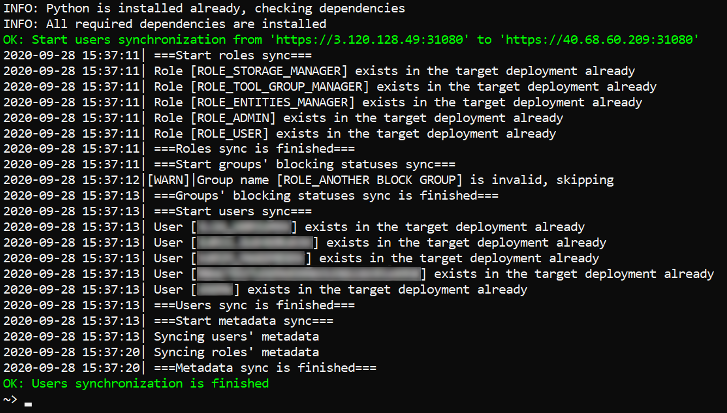
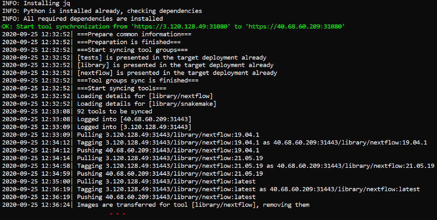

# Environments synchronization

In some cases, you may need to synchronize two different environments of the Cloud Pipeline.  
Special routine in the [`pipectl`](https://github.com/epam/cloud-pipeline/tree/develop/deploy/README.md) utility shall be used for that - `pipectl sync`.

It allows to synchronize from the source environment to the destination one the following objects:

- users / user groups / user roles
- docker registry / tool groups / tools

Synchronization can be performed with or without synchronization of attributes (metadata) for the specified Platform objects.

During the synchronization, changes are being performed only in the **_destination_** environment, the **_source_** environment remains the same.

## Prerequisites

For the correct work, launch `pipectl sync` utility only at Linux machine, in the separate terminal, not from the run.

If you are going to synchronize tools between environments, Docker shall be installed at the machine as well.

## Users synchronization process

The format of the command to synchronize users between environments:

`./pipectl sync --users --source-url <source_url> --source-token <source_token> --target-url <target_url> --target-token <target_token>`

**_Note_**: the command above shall be performed with admin rights in the the same directory where `pipectl` utility was downloaded.

Details:

- `<source_url>` is the _source_ environment address. Shall be specified in the following format: `<protocol>`://`<IP/hostname>`:`<port>` (e.g. `https://cloud-pipeline.epam.com:443`)
- `<source_token>` is the _source_ environment's access token. It can be obtained via the GUI (at the "Pipe CLI" settings [form](../../manual/12_Manage_Settings/12._Manage_Settings.md#cli-tab)) or via [`pipe token`](../../manual/14_CLI/14.1._Install_and_setup_CLI.md#using-pipe-token-command) CLI command
- `<target_url>` is the _destination_ environment address. Shall be specified in the following format: `<protocol>`://`<IP/hostname>`:`<port>` (e.g. `https://cloud-pipeline-dev.epam.com:443`)
- `<target_token>` is the _destination_ environment's access token. It can be obtained via the GUI (at the "Pipe CLI" settings [form](../../manual/12_Manage_Settings/12._Manage_Settings.md#cli-tab)) or via [`pipe token`](../../manual/14_CLI/14.1._Install_and_setup_CLI.md#using-pipe-token-command) CLI command

During the `--users` synchronization, the following processes are being performed:

- **Roles/groups synchronization**
    - roles/groups from the _source_ environment, that are missing in the _destination_ environment, are being created in the _destination_ environment ("blocked" statuses are being set according to the _source_ environment as well)
    - for roles/groups from the _destination_ environment matching roles/groups from the _source_ environment, their blocked status are being overridden:
        - if a group/role is blocked in the _source_ environment - that status will be set for the group/role in the _destination_ environment too
        - if a group/role is not blocked in the _source_ environment but blocked in the _destination_ environment - that status will be removed in the _destination_ environment
- **Users synchronization**
    - users from the _source_ environment, that are missing in the _destination_ environment, are being created in the _destination_ environment ("blocked" statuses, groups/roles lists are being set according to the _source_ environment)
    - for users from the _destination_ environment matching users from the _source_ environment, their blocked statuses are being overridden:
        - if a user is blocked in the _source_ environment - that status is being set for the user in the _destination_ environment too
        - if a user is not blocked in the _source_ environment but blocked in the _destination_ environment - that status will be removed in the _destination_ environment
    - for users from the _destination_ environment matching users from the _source_ environment, their groups/roles lists are being merged with the corresponding lists of the _source_ environment
- **Metadata synchronization**
    - by default, metadata (attributes) for users/groups/roles are being created/merged too. For users/groups/roles from the _destination_ environment matching users/groups/roles from the _source_ environment, if metadata keys for the _source_ and _destination_ are the same - the values of such metadata will be overridden by the _source_ environment values
    - to exclude overriding of the matching metadata, the specific environment variable shall be set **before** the running of the `pipectl` utility - **`CP_SYNC_USERS_METADATA_SKIP_KEYS`**:
        - for that variable, the comma-separated list of users' metadata keys to skip during the synchronization shall be specified
        - example of usage: `export CP_SYNC_USERS_METADATA_SKIP_KEYS="ssh_pub,ssh_prv"` - to exclude public and private keys merging during the synchronization

Command example:  
    

Example of the output (part):  
    

## Tools synchronization process

The format of the command to synchronize tools between environments:

`./pipectl sync --tools --source-url <source_url> --source-token <source_token> --target-url <target_url> --target-token <target_token>`

**_Note_**: the command above shall be performed with admin rights in the the same directory where `pipectl` utility was downloaded.

Details:

- `<source_url>` is the _source_ environment address. Shall be specified in the following format: `<protocol>`://`<IP/hostname>`:`<port>` (e.g. `https://cloud-pipeline.epam.com:443`)
- `<source_token>` is the _source_ environment's access token. It could be gotten via the GUI (at the "Pipe CLI" settings [form](../../manual/12_Manage_Settings/12._Manage_Settings.md#cli-tab)) or via [`pipe token`](../../manual/14_CLI/14.1._Install_and_setup_CLI.md#using-pipe-token-command) CLI command
- `<target_url>` is the _destination_ environment address. Shall be specified in the following format: `<protocol>`://`<IP/hostname>`:`<port>` (e.g. `https://cloud-pipeline-dev.epam.com:443`)
- `<target_token>` is the _destination_ environment's access token. It could be gotten via the GUI (at the "Pipe CLI" settings [form](../../manual/12_Manage_Settings/12._Manage_Settings.md#cli-tab)) or via [`pipe token`](../../manual/14_CLI/14.1._Install_and_setup_CLI.md#using-pipe-token-command) CLI command

During the `--tools` synchronization, the following processes are being performed:

- If the default registry is not attached to the _destination_ environment - this will be performed
- **Tools groups' synchronization**
    - if a group doesn't exist in the _destination_ environment registry - a new group will be created with all the properties of a _source_ one
    - for tool groups from the _destination_ environment matching tool groups from the _source_ environment, their permissions/OWNER property will be overridden according to corresponding _source_ tool groups' settings (in case, when these settings are different)
- **Tools'synchronization**
    - tools from the _source_ environment, that are missing in the _destination_ environment, will be transferred to the _destination_ environment registry (with their versions, settings, descriptions according to the _source_ environment)
    - for tools from the _destination_ environment matching tools from the _source_ environment:
        - the same identical versions (that exist in both environments) remain in the _destination_
        - versions from the _destination_ not matching the _source_ ones will be removed
        - versions from the _source_ not matching the _destination_ will be transferred to the _destination_ environment registry
        - settings and descriptions will be set according to the _source_ environment
- **"Symlinked" tools' synchronization**
- **Metadata synchronization**
    - by default, metadata (attributes) for tools/tool groups/registry are being created/merged too. For tools/tool groups/registry from the _destination_ environment matching tools/tool groups/registry from the _source_ environment, if metadata keys for the _source_ and _destination_ are the same - the values of such metadata will be overridden according to the _source_ environment values
    - to exclude overriding of the matching metadata, the specific environment variable shall be set **before** the running of the `pipectl` utility - **`CP_SYNC_TOOLS_METADATA_SKIP_KEYS`**:
        - for that variable, the comma-separated list of tools' metadata keys to skip during the synchronization shall be specified
        - example of usage: `export CP_SYNC_TOOLS_METADATA_SKIP_KEYS="ke1,key2"` - to exclude merging of "**_key1_**" and "**_key2_**" metadata keys during the synchronization

Command example:  
    

Example of the output (part):  
    
