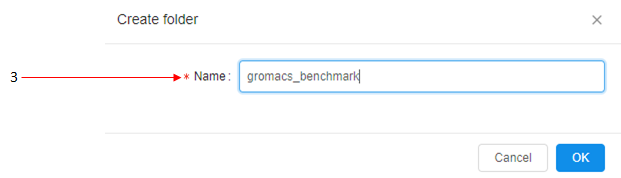
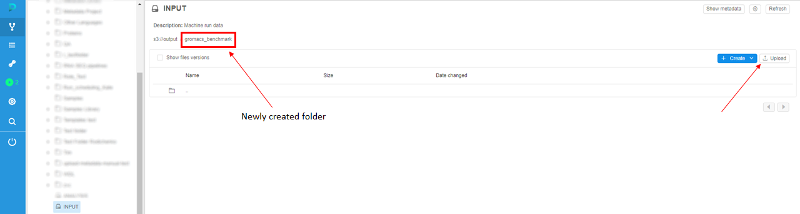
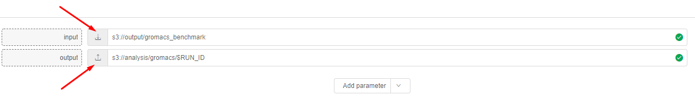
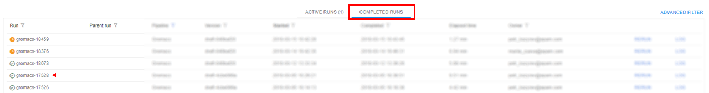
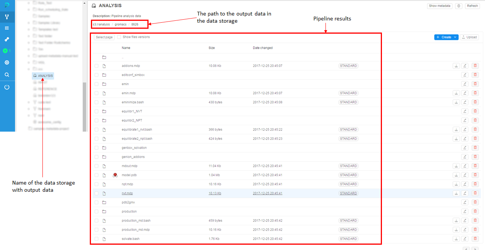

# 1. Quick start

> To launch a **Pipeline** you need to have **EXECUTE** permissions for that **Pipeline**. For more information see [13. Permissions](../13_Permissions/13._Permissions.md).

This quick start will help you to get a general idea of data processing via the **Cloud Pipeline** platform. **Pipelines** are set of data processing steps that are dependent on each other. Here we will describe an example of a pipeline launch.

**_Note_**: Pipeline launch steps remain the same for different pipelines.

## Pipeline running procedure for basic users

1. The first step you need to perform is to upload the data that you will work with. Generally, data in the **Cloud Pipeline** is kept in **data storages**.  
    So, the first thing you need to do is to find a data storage in the **Library** tab on the left side of the screen. Then upload data to it.  
    In this example, we will choose the data storage named "**INPUT**" (**1**) and then create a folder (**2**) named "**gromacs_benchmark**" (**3**).  
      
      
    Then we will navigate to this folder by clicking on its name and click "**Upload**" button to upload your input data to the storage.  
    **_Note_**: make sure that the size of data doesn't exceed 5 Gb. To upload more than 5 Gb you shall use CLI (see details [here](../08_Manage_Data_Storage/8.2._Upload_Download_data.md)).  
      
    
2. Then decide where to put **results** of pipeline processing. A good practice is to not mix input and output data in a one data storage, so we will use another data storage for output data. In this example, we will use data storage named "**ANALYSIS**" to store pipeline **output data**.  
    
3. In the "**Search**" field of the Library tab, find a pipeline that will process the **input data**. In this example, we will use the "**Gromacs**" pipeline that performs molecular modeling. Choose the pipeline version and click the **Run** button.  
    
4. On the "**Launch a pipeline**" page you'll see **pipeline execution parameters**. On the bottom, you'll see a "**Parameter**" section with the **input** parameter and **output** parameter.  
    Here you can specify the paths to your folders in storages, which you've created in step **1** and step **2**.  
    Click the controls to choose your folders.  
    
    Check your folder in the list and click **"OK"**.  
      
    **Tip:** If you want to create a new folder for the analysis, you can put **`/$RUN_ID`** at the end of the **output** string. The system will create a new folder with **Run ID** name.  
5. Click the **Launch** button to run the pipeline.  
    
6. You'll be redirected to the **Runs** tab of the **CP**. Here you can find launched **"Gromacs"** pipeline.  
    
7. Click a run with the pipeline name to see run **logs**.  
    
8. When all tasks of pipeline finish their execution, you'll be able to find the pipeline run in the **Completed Runs** section of the **Runs** tab.  
    
9. To see the output data, you shall navigate to the **data storage** with **output data** - **ANALYSIS** - and find the results of the pipeline run.  
    