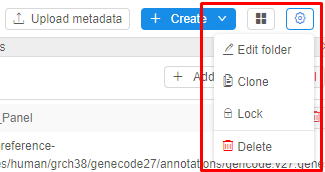

# 4. Manage Folder

- ["Details" view](#details-view)
- [Controls](#controls)
    - [Upload metadata](#upload-metadata)
    - [+ Create](#create)
    - ["Displays" icon](#displays-icon)
    - ["Gear" icon](#gear-icon)
    - [Child objects controls](#child-objects-controls)

One of the key objects represented in the "**Library**" space is **Folder**. It is an entity similar to the directories in the file system. Folders are used to structure other CP objects. Folders can be arranged into a tree like a file system, which helps to store information divided by departments, users, programs or other logical groups.  
**_Note_**: there is a special type of Folder - a **Project**. For details see [here](../Appendix_B/Appendix_B._Working_with_a_Project.md).

## "Details" view

"**Details**" panel shows contents of the selected folder: subfolders, files, pipelines etc.  

## Controls

The following buttons are available at the top of the "**Details**" view of the folder:

### Upload metadata

"**Upload metadata**" (**1**) control allows a user to upload new metadata entities (e.g. Samples, Participants) from the .csv/.tsv/.tdf files in a project or another folder selected by a user. It helps to organize and manage metadata in a user's workspace (project or some sandbox folder for collecting metadata). Learn more [5.2. Upload metadata](../05_Manage_Metadata/5.2._Upload_metadata.md).

### + Create

A user can add:

- a CP objects to the selected folder with the **Create** button (**2**). See [4.1. Create an object in Folder](4.1._Create_an_object_in_Folder.md);
- create a CP object from a template. See [Appendix B. Working with a Project](../Appendix_B/Appendix_B._Working_with_a_Project.md).  
    **_Note_**: The list of templates could be extended.

    

### "Displays" icon

The control **(3)** includes options to change view of the page:

| Feature | Description |
|---|---|
| **Descriptions** | This feature makes visible addition description for child objects: <ul><li>child objects' attributes</li><li>description in creating form if it exists.</li></ul> |
| **Attributes** | **Attributes** control opens/closes attributes pane. Folder's attributes - **keys (a)** and **values (b)** will be represented in the **metadata pane** on the right:    **_Note_**: If a selected folder has any defined attribute, **Attributes** pane is shown by default. See how to edit attributes [here](../17_Tagging_by_attributes/17._CP_objects_tagging_by_additional_attributes.md). |
| **Issues** | This feature shows/hides the issues of the current folder to discuss. To learn more see [here](../16_Issues/16._Issues.md) |

### "Gear" icon

There are the following features in **"Gear" (4)** icon:  

| Feature | Description |
|---|---|
| **Edit folder** | Rename a folder and set permissions for the folder. See [4.2. Rename folder](4.2._Rename_folder.md) and [13. Permissions](../13_Permissions/13._Permissions.md). |
| **Clone** | This feature helps to copy the current folder and its child objects. See more [4.4. Clone a folder](4.4._Clone_a_folder.md). |
| **Lock/Unlock** | You can save your folder and its content from changes by locking it. Learn more [4.5. Lock a folder](4.5._Lock_a_folder.md). |
| **Delete** | A user can delete a folder with the **Delete** icon. A folder will be deleted if metadata is stored only. See [4.3. Delete Folder](4.3._Delete_Folder.md). |

### Child objects controls

| Control | CP objects | Description |
|---|---|---|
| **Delete** | Folder | Delete (**1**) a current folder. Learn more [4.3. Delete Folder](4.3._Delete_Folder.md). |
| **Discussion** | Folder, Pipeline | This icon (**2**) allows to create discussion threads in child objects: you can create a topic, leave comments and address them to a specific user. To learn more see [here](../16_Issues/16._Issues.md). |
| **Run** | Pipeline | Allows running a pipeline from the parent folder. Click on the icon (**3**) and the **Launch form** page will be open. See [6.2. Launch a pipeline](../06_Manage_Pipeline/6.2._Launch_a_pipeline.md). |
| **Edit** | Pipeline, Data storage, Run configuration | Click this icon (**4**) to edit basic CP object's information: name, description, etc. |
