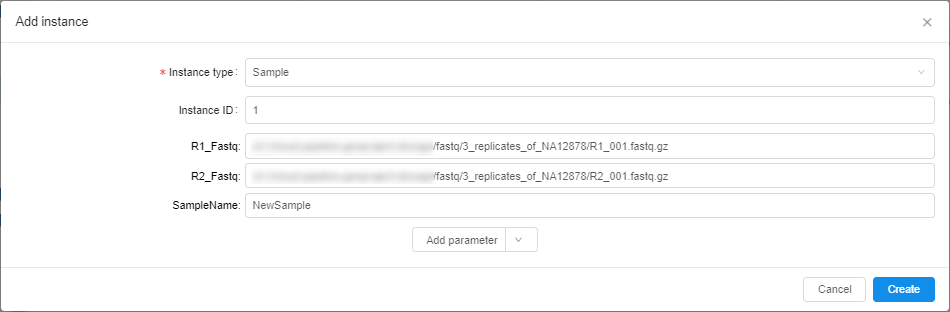
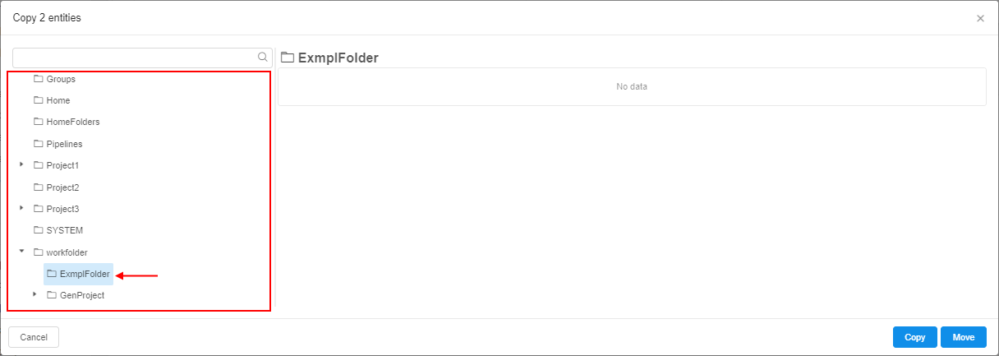

# 5.1. Add/Delete metadata items

> To manage metadata items, a user shall have **WRITE** permission for the parent folder and the **ROLE\_ENTITY\_MANAGER** role. For more information see [13. Permissions](../13_Permissions/13._Permissions.md).

- [Add metadata item](#add-metadata-item)
- [Copy/move metadata items](#copymove-metadata-items)
- [Delete metadata item](#delete-metadata-item)

A user is able to add metadata item manually.

## Add metadata item

To add metadata item the following steps shall be performed:

1. Navigate to **Metadata** of the desired folder or project.  
    **_Note_**: or navigate to specific metadata entity folder, e.g. `Participant`, `Sample`, etc.
2. Click  control - the pop-up window is open, e.g.:  
    
3. Fill up the fields:
    - **Instance type** (_required_). Choose the metadata item type, e.g. `Participant`, `Sample`, etc.  
        **_Note_**: if you create an instance from the specific metadata entity folder, the type would be set by default, but you would be able to change it.  
        **_Note_**: this dropdown list contains all available instance types (from all Platform metadata entities)
    - **Instance ID** (_non-required_). It should be a unique identification for a new metadata item. If it is not specified, it will be autogenerated during the item creation in the [`UUID4`](https://en.wikipedia.org/wiki/Universally_unique_identifier) format
    - values of the specific entity parameters (_non-required_) - at the picture above, there are: _R1\_Fastq_, _R2\_Fastq_, _SampleName_  
    Example of the filled pop-up:  
        
4. Click **Add parameter** to set a new attribute for the creating metadata instance. It could be:
    - **String** attribute. You can add an attribute with any name and value.
    - **Link** to a metadata entity. You can choose a link to what a metadata entity you want to add as an attribute, e.g. set a link to a participant existing in the Platform as a sample's attribute.  
    
5. Click the **Create** button - the new metadata item will be created and shown in the chosen metadata entity table:  
      
    **_Note_**: the created date for each entity is added automatically (see the column "**Created Date**")

## Copy/move metadata items

You can copy or move metadata items from one folder to other:

1. Navigate to **Metadata** of the desired folder or project.  
2. Open specific metadata entity folder (e.g. `Participant`, `Sample`, etc.):  
    
3. Select items you want to copy/move.
4. Click the **Copy** button:  
    
5. The pop-up appears:  
      
    Here the Folder/Project should be selected where selected **Metadata** items will be copied/moved.
6. Select the Folder/Project you want using the tree on the left panel, e.g.:  
    
7. Click the **Copy** button to create a copy of the **Metadata** items in the selected folder or the **Move** button if you wish to move items to selected folder from the original one.  
    The pop-up will be closed.
8. Open the folder selected at step 6, see that **Metadata** items were copied/moved to it:  
    

## Delete metadata item

To delete metadata item the following steps shall be performed:

1. Navigate to the metadata entity table that contains the metadata item you want to delete.
2. Tick one metadata item or more - the bulk operation group of buttons is enabled.  
3. Click the **Delete** button:  
    
4. Confirm your choice in the dialog window:  
    
5. The items are removed.
