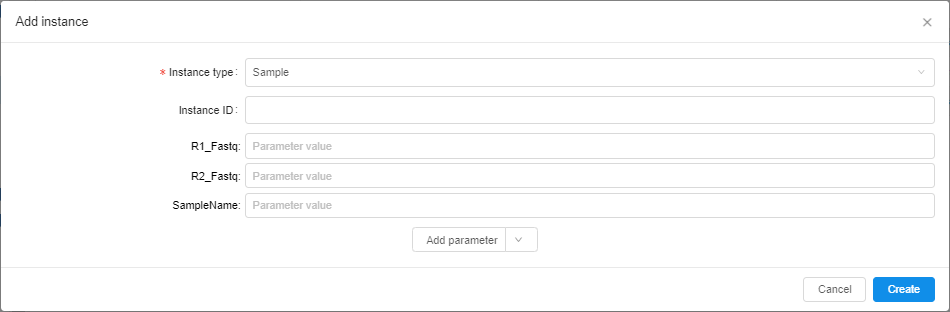

# 5.1. Add/Delete metadata items

> To manage metadata items, a user shall have **WRITE** permission for the parent folder and a role **ENTITY_MANAGER**. For more information see [13. Permissions](../13_Permissions/13._Permissions.md).

A user is able to add metadata item manually.

## Add metadata item

To add metadata item the following steps shall be performed:

1. Navigate to **Metadata** of the desired folder or project.  
    **_Note_**: or navigate to specific metadata entity folder, e.g. Participant, Sample, etc.
2. Click  control - the pop-up window is open.  
    
3. Fill up the required fields:
    - **ID**. It should be a unique identification for a new metadata item.
    - **Type**. Choose the metadata item type, e.g. Participant, Sample, etc  
        **_Note_**: if you clicked  control from the specific metadata entity folder, the type would be set by default, but you would be able to change it.
4. Click **Add parameter** to set attributes for the new metadata instance. It could be:
    - **String** attribute. You can add an attribute with any name and value.
    - **Link** to a metadata entity. You can choose a link to what a metadata entity you want to add as an attribute, e.g. set a link to a participant existing in the CP as a sample's attribute.  
    
5. Click **Create** - the new metadata item will be created and shown in the chosen metadata entity table.

## Delete metadata item

To delete metadata item the following steps shall be performed:

1. Navigate to the metadata entity table that contains the metadata item you want to delete.
2. Tick one metadata item or more - the bulk operation group of buttons is enabled.  
    
3. Click  button.
4. Confirm your choice in the dialog window.
5. The items are removed.