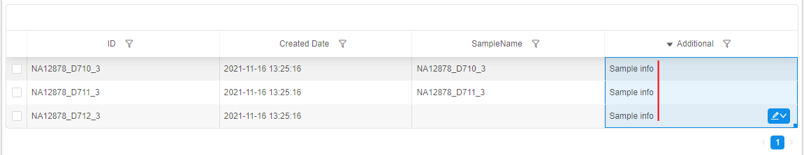
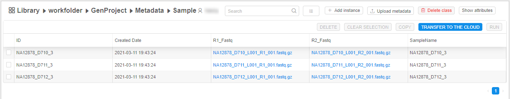
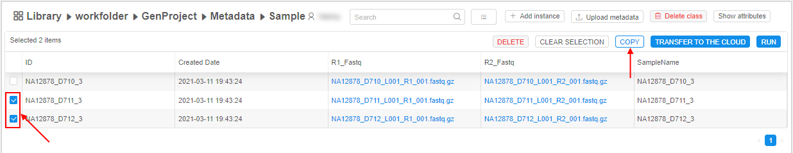
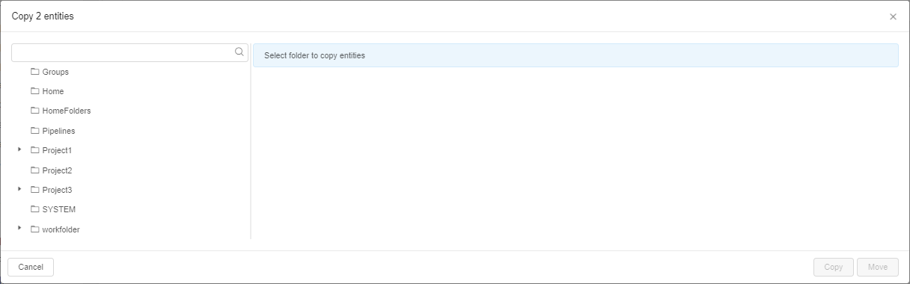
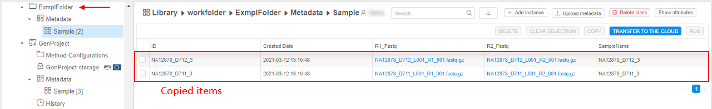
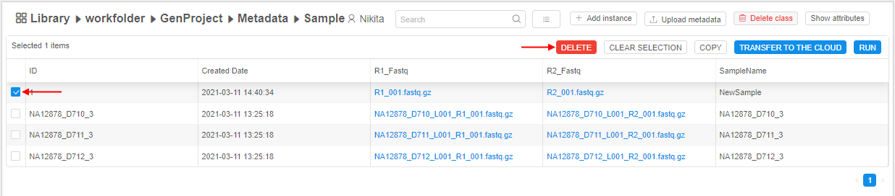

# 5.1. Add/Delete metadata items

> To manage metadata items, a user shall have **WRITE** permission for the parent folder and the **ROLE\_ENTITY\_MANAGER** role. For more information see [13. Permissions](../13_Permissions/13._Permissions.md).

- [Add metadata item](#add-metadata-item)
    - [Add SampleSet item](#add-sampleset-item)
- [Edit metadata items](#edit-metadata-items)
    - [Field values autofill](#field-values-autofill)
- [Copy/move metadata items](#copymove-metadata-items)
- [Delete metadata item](#delete-metadata-item)

A user is able to add metadata item manually.

## Add metadata item

To add metadata item the following steps shall be performed:

1. Navigate to **Metadata** of the desired folder or project.  
    **_Note_**: or navigate to specific metadata entity folder, e.g. `Participant`, `Sample`, etc.
2. Click the **Additional options** button and select **+ Add instance** item:  
    
3. The pop-up will be opened, e.g.:  
    
4. Fill up the fields:
    - **Instance type** (_required_). Choose the metadata item type, e.g. `Participant`, `Sample`, etc.  
        **_Note_**: if you create an instance from the specific metadata entity folder, the type would be set by default, but you would be able to change it.  
        **_Note_**: this dropdown list contains all available instance types (from all Platform metadata entities)
    - **Instance ID** (_optional_). It should be a unique identification for a new metadata item. If it is not specified, it will be autogenerated during the item creation in the [`UUID4`](https://en.wikipedia.org/wiki/Universally_unique_identifier) format
    - values of the specific entity parameters (_non-required_) - at the picture above, there are: _R1\_Fastq_, _R2\_Fastq_, _SampleName_  
    Example of the filled pop-up:  
        
5. Click **Add parameter** to set a new attribute for the creating metadata instance. It could be:
    - **String** attribute. You can add an attribute with any name and value.
    - **Link** to a metadata entity. You can choose a link to what a metadata entity you want to add as an attribute, e.g. set a link to a participant existing in the Platform as a sample's attribute.  
    
6. Click the **Create** button - the new metadata item will be created and shown in the chosen metadata entity table:  
      
    **_Note_**: the created date for each entity is added automatically (see the column "**Created Date**")

### Add SampleSet item

Additionally to described above, users may create _SampleSets_ (or other "Container-like") entities from the GUI.

To create a new SampleSet:

1. Click the **+ Add instance** button in the Metadata section:  
    
2. Choose the _SampleSet_ instance type:  
      
    Additional fields for the creating SampleSet will appear automatically.
3. Provide the information for the new SampleSet:
    - **InstanceID** (_optional_) - if it is not specified, it will be autogenerated during the item creation in the [`UUID4`](https://en.wikipedia.org/wiki/Universally_unique_identifier) format
    - **Name** - name of the SampleSet object
    - **Samples** - Click the **Browse** button to select a list of Samples, which will be associated with the creating SampleSet  
      
      
    
4. Click the **Create** button to add the new SampleSet:  
    
5. Open the SampleSet metadata class to view the new SampleSet:  
    

## Edit metadata items

To edit any metadata item - click its row in the table, e.g.:  
      
    Values of the clicked metadata instance will be displayed in the "Attributes" panel, where columns and metadata instance values represent corresponding keys and values.  
Here, you can edit any instance value except `ID` and `Created Date`.

To **edit** existing value:

1. Click the desired _value_ in the "Attributes" panel, e.g.:  
    
2. Specify a new _value_ to the field.
3. Click any space out of that field or press _Enter_ key. Specified _value_ will be saved automatically and will appear in the metadata table, e.g.:  
    

To **remove** existing value:

1. Click the remove button near the desired _key-value_ pair in the "Attributes" panel, e.g.:  
    
2. Confirm the deletion:  
    
3. This attribute will be removed for the selected instance:  
    

**_Note_**: if attributes of the same _key_ will be removed in the described way for all metadata instances - the corresponding column will disappear from the table.

To **create** a new instance field:

1. Click "**+ Add**" button in the "Attributes" panel:  
    
2. Specify _key_ (name of the field) and _value_ for a new attribute, e.g.:  
    
3. Click the **Add** button to confirm.
4. If the specified _key_ doesn't match any existing field name of the current metadata entity - a new field will be created and the corresponding column will automatically appear in the metadata table:  
    

For more information about working with the "Attributes" panel see [17. CP objects tagging by additional attributes](../17_Tagging_by_attributes/17._CP_objects_tagging_by_additional_attributes.md).

### Field values autofill

You can use an autofill feature to faster fill metadata instances with data that are based on data in other instances in the same column/row.

To use an autofill feature:

1. Hover over the cell in the metadata table, which value you wish to use in other cells, e.g.:  
    
2. Click the right-bottom corner of the cell (on the small blue rectangle) and move the mouse holding the left button - vertically (if you wish to autofill cells in the column) or horizontally (if you wish to autofill cells in the row), e.g.:  
    
3. Once you will release the mouse button - selected cells will be autofilled by the value of the cell that you've dragged (the cell value will be copied to all selected cells):  
    
4. In the right-bottom corner of the selected area, the additional control will appear. Click it:  
    
5. If you want to cancel autofilling - click the **Revert** item from the list.  
    If you want to perform autofilling again - click the **Copy cells** item from the list.
6. Click any cell out of the selected area or press _Esc_ key to confirm changes:  
    

> **_Note_**: if the cell that will be dragged has the format **_ending_** by the number - then during the autofilling, the number series will be atomatically continued for the whole selected area (to increasing), textual part of the value format will stay the same. I.e. if the cell has value `SN_001`, then via the autofilling the new appeared values will be `SN_002`, `SN_003`, etc.:  
>      
>    

## Copy/move metadata items

You can copy or move metadata items from one folder to other:

1. Navigate to **Metadata** of the desired folder or project.  
2. Open specific metadata entity folder (e.g. `Participant`, `Sample`, etc.):  
    
3. Select items you want to copy/move. The **Bulk operation panel** is enabled.  
4. Click the **V** button next the "**Show only selected items**" control and select the **Copy** item in the list:  
    
5. The pop-up appears:  
      
    Here the Folder/Project should be selected where selected **Metadata** items will be copied/moved.
6. Select the Folder/Project you want using the tree on the left panel, e.g.:  
    
7. Click the **Copy** button to create a copy of the **Metadata** items in the selected folder or the **Move** button if you wish to move items to selected folder from the original one.  
    The pop-up will be closed.
8. Open the folder selected at step 6, see that **Metadata** items were copied/moved to it:  
    

## Delete metadata item

To delete metadata item the following steps shall be performed:

1. Navigate to the metadata entity table that contains the metadata item you want to delete.
2. Tick one metadata item or more - the **Bulk operation panel** is enabled.  
3. Click the **V** button next the "**Show only selected items**" control and select the **Delete** item in the list:  
    
4. Confirm your choice in the dialog window:  
    
5. The items are removed.
