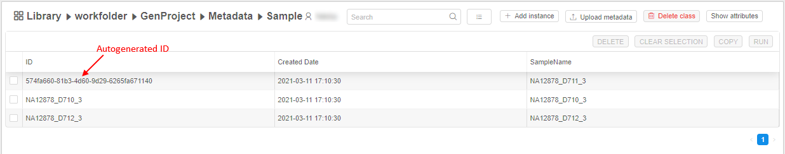

# 5.2. Upload metadata

> To upload a **Metadata** to a **Folder** you need to have **WRITE** permission for that folder and the **ROLE\_ENTITY\_MANAGER** role. For more information see [13. Permissions](../13_Permissions/13._Permissions.md).

Each folder allows uploading metadata to its space. But to get the full set of features it is advised to upload the metadata into the special types of folders called **Projects**. How to create a project described [here](../Appendix_B/Appendix_B._Working_with_a_Project.md).  
Uploading could be executed from the csv or tsv file. The structure of load file should be as in **Table 1**.

**Table 1** - Load file structure

| (referenced_entity_type):ID | membership:MembershipAttributeName:(referenced_entity_type):ID | AttributeName |
|---|---|---|
| referenced_uid_value | referenced_uid_value | attribute_value |
| referenced_uid_value | referenced_uid_value | attribute_value |
| referenced_uid_value | referenced_uid_value | attribute_value |

Examples: [wes-11-rep-samples.csv](attachments/UploadMetadata_example1.csv), [wes-11-rep-set.csv](attachments/UploadMetadata_example2.csv)

- **(referenced_entity_type):ID** - here you set up what type of entity you are uploading and what is an ID of it, e.g. _Sample:ID = FZ700059549_.
- **membership:MembershipAttributeName:(referenced_entity_type):ID** - this is a reference to an instance of another entity. If you have a sample owned by a participant, you can show this connection - _membership:Participants:Participant:ID = TY90000044343_.  
    **_Note_**: make sure, that the reference entity id already exists in the system.
- **AttributeName** - any attribute name of an instance, e.g. RNA or DNA type, Blood or Tissue, etc.

> **_Note_**: specified instance ID should be a unique identification for an each metadata item. If it is not specified in the file (the field is left empty), it will be autogenerated during the item creation in the [`UUID4`](https://en.wikipedia.org/wiki/Universally_unique_identifier) format.

## Upload instances of an entity

For the example, we will use the simple metadata file with the following content:  
    

1. Click the button  in the right upper corner.
2. The **Uploading metadata** window is open.
3. Select the appropriate file.
4. Confirm choice - click the **OK** button.  
    **_Note_**: if your file contains a link to the instance that doesn't exist, the whole metadata file won't be uploaded. For example, you set a link to a `participant` ID that doesn't exist in the file with `samples`.  
    **_Note_**: while uploading the progress bar will be shown, e.g.:  
    
5. The new metadata is uploaded in the folder of a specific entity in the project:  
      
    See that:  
    - for the ID field that has empty value in the uploaded file, instance ID was autogenerated
    - the "Created date" attribute is being added automatically  

**_Note_**: the instances will be uploaded to the entity with a name, related to the first column if exists (e.g. `Sample`). Otherwise, the new entity folder will be created.  
**_Note_**: if the file contains instances already exist in the system, the attributes of it will be updated.
