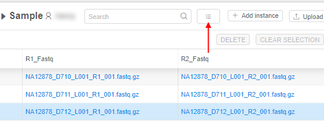
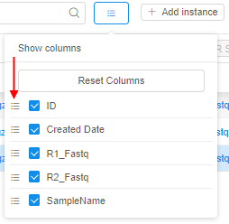

# 5.3. Customize view of the entity instance table

> To customize view of the table with instances of an entity you need to have **READ** permissions for the folder with that metadata. For more information see [13. Permissions](../13_Permissions/13._Permissions.md).

This page describes how a user can customize an entity instance table and make it more easy to read. Any user, who has permissions for reading, will be able to customize the view of the table: change set of viewed attributes, change the order of attributes and reset the default settings.

1. Press the **"Change view"** control.  
    
2. A list of accessible attributes shows up. The list contains all attributes of entities, uploaded in the current project. The attributes of current view are ticked.  
    
3. Choose desired attributes by ticking.  
    **_Note_**: The last tick will be disabled, so you can't clear all checkboxes.
4. To change the order, click a control in front of the desired attribute and pulling it up or down.
5. The changes are applied instantly. The table view has only selected attributes.  
    **_Note_**: This customization saved only for logged in user.
6. To leave the form a user shall click outside the form.

**_Note_**: you are able to restore the initial order of columns. To do that, click **Reset Columns** control.