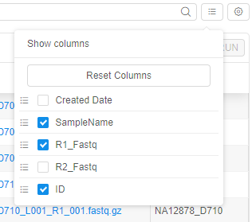
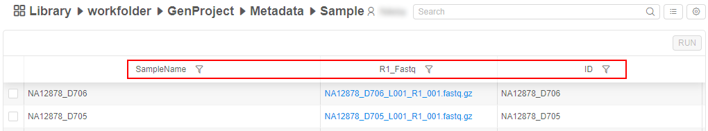
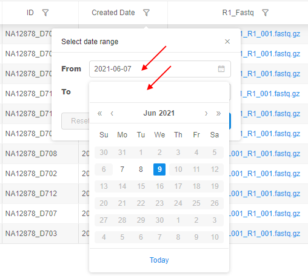
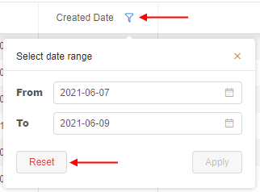
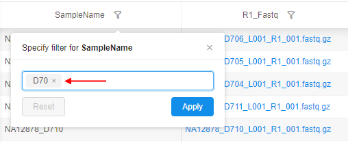
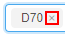
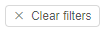

# 5.3. Customize view of the entity instance table

- [Change attributes view](#change-attributes-view)
- [Filter instances](#filter-instances)

> To customize view of the table with instances of an entity you need to have **READ** permissions for the folder with that metadata. For more information see [13. Permissions](../13_Permissions/13._Permissions.md).

This page describes how a user can customize an entity instance table and make it more easy to read. Any user, who has permissions for reading, will be able to customize the view of the table: change set of viewed attributes, change the order of attributes, filter instances and reset the default settings.

## Change attributes view

1. Press the **"Change view"** control.  
    
2. A list of accessible attributes shows up. The list contains all attributes of entities, uploaded in the current project. The attributes of current view are ticked.  
    
3. Choose desired attributes by ticking.  
    **_Note_**: The last tick will be disabled, so you can't clear all checkboxes.
4. To change the order, click a control in front of the desired attribute and pulling it up or down.
5. The changes are applied instantly. The table view has only selected attributes.  
    **_Note_**: This customization saved only for logged in user.
6. To leave the form a user shall click outside the form.

For example, attributes were customized as shown:  
      
And the table automatically changed its view to:  
    

**_Note_**: you are able to restore the initial order of columns. To do that, click the **Reset Columns** control in the **Change view** panel.

## Filter instances

### Date filter

User can restrict shown metadata instances by filtering them according to their created date.
For that:

1. Click the filter icon next to the "_Created Date_" column header
2. The date filter panel will appear:  
    
3. Specify dates "_From_" and "_To_", e.g.:  
    
4. Click the **Apply** button to confirm:  
    
5. Filter will be applied and in the table, only instances with the "_Created Date_" according to a specified date range will be shown
6. To reset applied date filter, specified for the "_Created date_" column, click the filter icon next to the column header and click the **Reset** button:  
    

**_Note_**: if only "_From_" date was specified - filter will be applied for all instances with the "_Created Date_" from specified date till today.  
**_Note_**: if only "_To_" date was specified - filter will be applied for all instances with the "_Created Date_" till specified date.

### Column filter

Also user can filter instances of an entity in a table by their attribute values.  
To filter a table by any column value(s):

1. Click the filter icon next to the column header (for the column "_Created Date_", see the section [above](#date-filter))
2. The column filter panel will appear:  
    
3. Specify filter text and press Enter key, e.g.:  
    
4. You can specify another one or several filters in way as described at step 3, e.g.:  
      
    Several filters will combine with logical `OR` operation.  
    If you want to cancel the certain specified filter - click the cross-button next to filter text - .
5. After all desired filters are specified, click the **Apply** button.
6. Filters will be applied and in the table, only instances matching the specified filters will be shown.
7. To reset applied filters, specified for the column, click the filter icon next to the column header and click the **Reset** button:  
    

Common notes for both filter types:

- user can apply filters for any count of columns
- when any filter is set for the column, the filter icon next to the column header is being highlighted in blue, e.g.:  
    
- to reset all filters, click the **Clear filters** button above the metadata table - 
