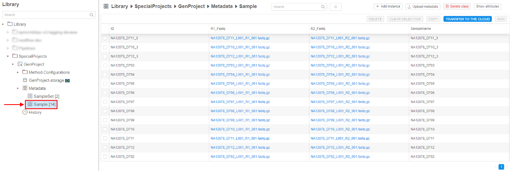
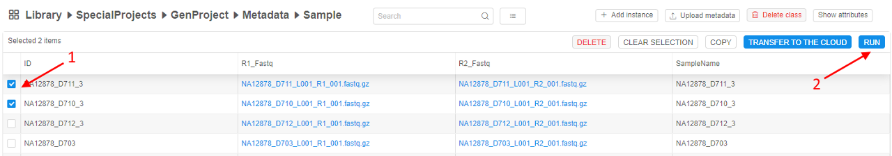
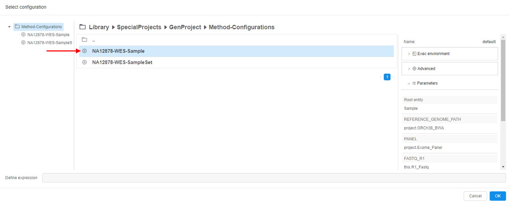
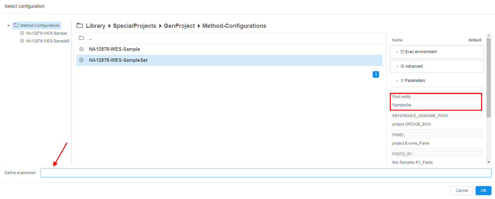

# 5.4. Launch a run configuration on metadata

> To launch a run configuration on metadata a user shall have the following permissions:
>
> - **READ** permissions a for folder contains metadata items;
> - **READ** and **EXECUTE** permissions for a run configuration.
>
> For more information see [13. Permissions](../13_Permissions/13._Permissions.md).

A user could launch a run configuration on selected metadata from the metadata space.  
To launch a run configuration, the following steps shall be performed:

1. Navigate to the desired folder with metadata items.  
    
2. Tick desired metadata items (see the picture below, **1**).  
    
3. Click **Run** button (see the picture above, **2**) - and the **"Select configuration"** pop-up window will be open.  
    **_Note_**: Clicking on a configuration item, you'll see configuration's parameters. The second click will hide the parameters.  
      
    **_Note_**: if you want to choose a run configuration with **Root entity** that differs from selected metadata items, please, specify it in **"Define expression"** field. To learn more about expressions, see [here](../07_Manage_Detached_configuration/7.3._Expansion_Expressions.md).  
    
4. Click **"OK"** button - and the runs will be scheduled. You'll be redirected into **Run** space automatically.
