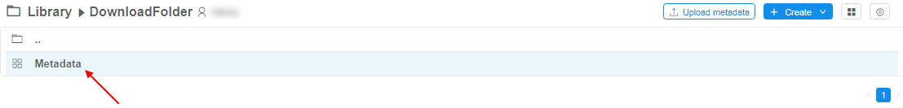
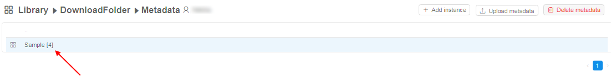
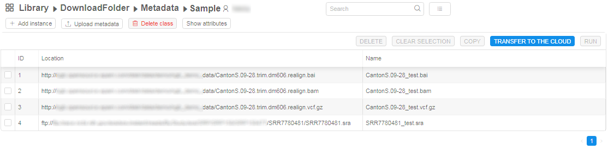
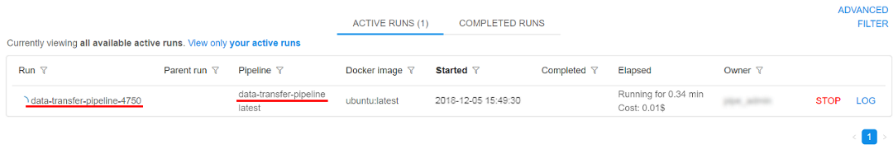

# 5.5. Download data from external resources to the cloud data storage

- [Overview](#overview)
- [Upload metadata with list of external resources from CSV/TSV file](#upload-metadata-with-list-of-external-resources-from-csvtsv-file)
- [Download data from external resources](#download-data-from-external-resources)

## Overview

Users often get the raw datasets from the external partners for processing. CP provides comfortable way to load a list of such files as external links to the CP GUI and launch a data load procedure to the cloud storage in background mode. Users can provide CSV/TSV files with the external links and submit a data transfer job, so that the files will be moved to the cloud storage in the background.

## Upload metadata with list of external resources from CSV/TSV file

**_Note_**: To upload a **Metadata** to a **Folder** you need to have **WRITE** permission for that folder and a role **ENTITY_MANAGER**. For more information see [13. Permissions](../13_Permissions/13._Permissions.md).  
**_Note_**: file with list of external resources should have **PATH** column and http/ftp links in this column (example: [sample.csv](attachments/DownloadDataFromExternalResources_sample.csv))

1. Navigate on folder.
2. Click on  button.
3. Navigate to CSV/TSV file with list of external resources in appeared dialog and select file. Click "**Open**" button.
4. Click on "Metadata" object:  
    
5. Click on "Sample" class:  
    
6. List of samples with the external links will be appeared:  
    

## Download data from external resources

1. Above the list of external links, uploaded on previous step, click "**Transfer to the cloud**" button:  
    
2. The pop-up window for preparing for transferring will appear:  
      
    In this window fill fields:  
    **a**. Input data storage which will be use as a destination for downloading data. Click on  button. In opened pop-up window select required storage (on the left panel with folder-tree) (**1**). In selected storage set the checkbox opposite the folder name, where external data will be downloaded (**2**). Click "**Ok**" button (**3**):  
      
    **_Note_**: you need to have **READ** and **WRITE** permissions for folder and S3 storage, that contain folder for downloading.  
    **b**. Select CSV/TSV columns (only from **PATH** columns), which shall be used to get external URLs (if several columns contain URLs - all can be used).  
    **c**. (_optionally_) Select whether to rename resulting path to some other value (can be specified as another column cell, e.g. sample name). For do that click on  button and select from dropdown list.  
    **d**. (_optionally_) Input max threads count, if needs to limit.  
    **e**. (_optionally_) Set if needs to create new folders within destination in case when several columns are selected for "**Path fields**" option (**b**). E.g. if two columns contain URLs and both are selected - then folders will be created for the corresponding column name and used for appropriate files storage.  
    **f**. (_optionally_) Set if needs to update external URL within a table to the new location of the files. If set - http/ftp URLs will be changed to data storage path. Such data structure can be then used for a processing by a pipeline:
    - URLs are changed to the S3-clickable hyperlinks (checkbox is set):    
    - URLs aren't changed and not-clickable hyperlinks (checkbox isn't set):  
3. Once you filled the form, click "**Start download**" button:  
    
4. System pipeline (transfer job) will be started automatically:  
    
5. Once the transfer job will be finished successfully, files will be located in the selected S3 storage:  
    