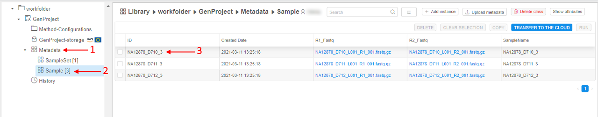
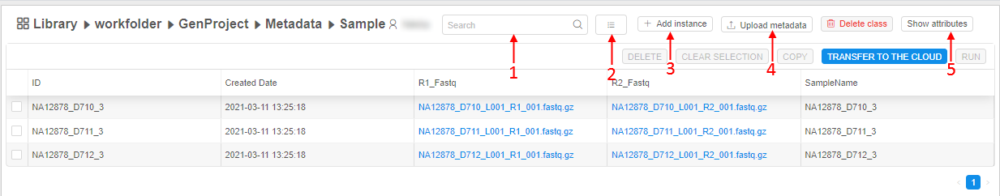

# 5. Manage Metadata

- [Overview](#overview)
- ["Details" view](#details-view)
- [Controls](#controls)
    - [Search field](#search-field)
    - ["Customize view"](#customize-view)
    - [Additional options](#additional-options)
    - [Sorting control](#sorting-control)
    - [Filter control](#filter-control)
    - [Bulk operation panel](#bulk-operation-panel)

## Overview

**Metadata** is a CP object that defines custom data entities (see the definition below) associated with raw data files (fastq, bcl, etc.) or data parameters (see the picture below, arrow **1**). By using this object a user can create a complex analysis environment. For example, you can customize your analysis to work with a subset of your data.  
Two important concepts of the metadata object is an **Entity** and an **Instance of an entity**.

- **Entity** - abstract category of comparable objects. For example, entity "Sample" can contain sequencing data from different people (see the picture below, arrow **2**).
- An **Instance of an entity** - a specific representation of an entity. For example, sequencing data from a particular patient in the **"Sample"** entity is an instance of that entity (see the picture below, arrow **3**).

## "Details" view

**"Details"** panel displays content as a table of entity instances. Each column is an attribute of an instance, which is duplicated in the **"Attribute"** panel.  
**_Note_**: more about managing instance's attribute you can learn [here](5.1._Add_Delete_metadata_items.md).

## Controls

The following controls (buttons and fields) are available in the metadata entity space:

### Search field

To find a particular instance of an entity a user shall use the **Search** field (see the picture [above](#controls), **1**), which is searching for the occurrence of entered text in any column of the table (except "_Created Date_"), e.g.:  
    

The search field supports multiple terms search - in this case, multiple terms for the search should be specified space separated.  
E.g. `sample1 sample2` - will be found all instances containing `sample1` or `sample2` in any attribute value.

The search field supports a `key:value` search, where `key` is an attribute name (column header) and `value` is a term that shall be searched in that attribute values.  
E.g. `ID:D703` - will be found all instances which ID contain `D703` string.

### "Customize view"

This control (see the picture [above](#controls), **2**) allows customizing the view of the table with instances of an entity. For more information see [5.3. Customize view of the entity instance table](5.3._Customize_view_of_the_entity_instance_table.md#change-attributes-view).

### Additional options

This button (see the picture [above](#controls), **3**) expand the menu with additional options:  
    

Here:

- **+ Add instance** item - to add a new instance in the current metadata container. For more information see [5.1. Add/Delete metadata items](5.1._Add_Delete_metadata_items.md#add-metadata-item).
- **Upload metadata** item - use this item to create the metadata object/to add entities to the existing metadata object/to add instances of the existing metadata entity. See here for more information - [5.2. Upload metadata](5.2._Upload_metadata.md).
- **Transfer to the cloud** item - to download files from the external `ftp`/`http` resources. See here for more information - [5.5. Transfer data to the cloud](5.5._Download_data_from_external_resources_to_the_cloud_data_storage.md).
- **Delete class** item - to delete entity class (with all its instances) from the current metadata object.
- **Show attributes**/**Hide attributes** item - this button allows to view or edit attributes of a particular instance of an entity. For more information see [17. CP objects tagging by additional attributes](../17_Tagging_by_attributes/17._CP_objects_tagging_by_additional_attributes.md).  
When this item is enabled - values of the clicked metadata instance are displaying in the "Attributes" panel, where columns and metadata instance values represent corresponding keys and values, e.g.:  
      
    User can edit any instance value here except `ID` and `Created Date`.

### Sorting control

To sort instances of an entity in a table, user shall click a header of the desired column (e.g., see the picture [above](#controls), **4**): first click sorts a list in an descending order, the next click sorts a list in a ascending order, the next click reset sorting.

### Filter control

To filter instances of an entity in a table, user shall click a special control near a header of the desired column (see the picture [above](#controls), **5**). The panel will appear, where one or several filter conditions for that column can be specified and then applied, e.g.:  
    

For more information see [5.3. Customize view of the entity instance table](5.3._Customize_view_of_the_entity_instance_table.md#filter-instances).

### Bulk operation panel

At this panel, there are controls that allow to execute operations for one and more instances.  
User can tick desired items and the panel switches to active mode, e.g.:  
    

Here:

- "**Show only selected items**"/"**Show all metadata items**" control - to show separately only selected items. All unselected items will be hidden, e.g.:  
      
    This feature can be useful if the metadata object has lots of instances, these instances span multiple pages, but user has interest to view/work only with several instances from different pages.  
    For shown selected items, all functionality as for the general table is available except filtering.  
    To return to the previous view (all metadata items), user shall click this control again.
- "**Manage selection**" menu - this menu appears by **V** button next the "**Show only selected items**" control:  
      
    From this menu, user can:  
    - **Clear selection** - clears all selected items. The "_Bulk operation panel_" is deactivated.
    - **Copy** - allows to copy/move selected items to another metadata object (in other Project/Folder). See more details [here](5.1._Add_Delete_metadata_items.md#copymove-metadata-items).
    - **Delete** - removes selected items. See more details [here](5.1._Add_Delete_metadata_items.md#delete-metadata-item).
- **RUN** button - allows to execute run configurations for the selected items. For more details see [5.4. Launch a run configuration on metadata](5.4._Launch_a_run_configuration_on_metadata.md).
