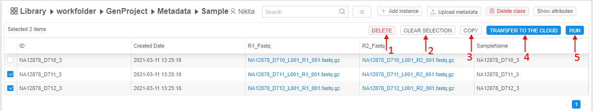

# 5. Manage Metadata

- [Overview](#overview)
- ["Details" view](#details-view)
- [Controls](#controls)
    - [Search field](#search-field)
    - [Sorting control](#sorting-control)
    - ["Change view"](#change-view)
    - [+ Add instance](#add-instance)
    - [Upload metadata](#upload-metadata)
    - [Show attributes/Hide attributes](#show-attributeshide-attributes)
    - [Bulk operation panel](#bulk-operation-panel)

## Overview

**Metadata** is a CP object that defines custom data entities (see the definition below) associated with raw data files (fastq, bcl, etc.) or data parameters (see the picture below, arrow **1**). By using this object a user can create a complex analysis environment. For example, you can customize your analysis to work with a subset of your data.  
Two important concepts of the metadata object is an **Entity** and an **Instance of an entity**.

- **Entity** - abstract category of comparable objects. For example, entity "Sample" can contain sequencing data from different people (see the picture below, arrow **2**).
- An **Instance of an entity** - a specific representation of an entity. For example, sequencing data from a particular patient in the **"Sample"** entity is an instance of that entity (see the picture below, arrow **3**).

## "Details" view

**"Details"** panel displays content as a table of entity instances. Each column is an attribute of an instance, which is duplicated in the **"Attribute"** panel.  
**_Note_**: more about managing instance's attribute you can learn [here](5.1._Add_Delete_metadata_items.md).

## Controls

The following buttons are available in the metadata entity space:

### Search field

To find a particular instance of an entity a user shall use the **Search** field (see the picture above, **1**), which is searching for the occurrence of entered text in the **ID** column of the table.

### Sorting control

To sort instances of an entity in a table, a user shall click a header of the desired column: 1 click sorts a list in an ascending order, the next click sorts a list in a descending order, the next click reset sorting.

### "Change view"

This control (see the picture above, **2**) allows customizing the view of the table with instances of an entity. For more information see [5.3. Customize view of the entity instance table](5.3._Customize_view_of_the_entity_instance_table.md).

### + Add instance

To add a new instance in the current metadata container, click **+ Add instance** control (see the picture above, **3**). For more information see [5.1. Add/Delete metadata items](5.1._Add_Delete_metadata_items.md).

### Upload metadata

Use this control (see the picture above, **4**) to create the metadata object or to add entities to the metadata object/to add instances of an entity to the existing entity. See here for more information - [5.2. Upload metadata](5.2._Upload_metadata.md).

### Show attributes/Hide attributes

This button (see the picture above, **5**) allows to view or edit attributes of a particular instance of an entity. For more information see [17. CP objects tagging by additional attributes](../17_Tagging_by_attributes/17._CP_objects_tagging_by_additional_attributes.md).

### Bulk operation panel

This panel allows to execute operations for more than one item. You can tick desired items and the panel switch to active mode.

| Control | Description |
|---|---|
| **DELETE** | To delete one or more metadata item (**1**). See more details [here](5.1._Add_Delete_metadata_items.md). |
| **CLEAR SELECTION** | Clears all selected items (**2**). The panel is deactivated. |
| **COPY** | To copy metadata item to another metadata object (from other Project/Folder) (**3**). |
| **TRANSFER TO THE CLOUD** | To download files from the external ftp/http resources (**4**). See more details [here](5.5._Download_data_from_external_resources_to_the_cloud_data_storage.md). |
| **RUN** | Allows to execute run configurations for the selected items (**5**). See details [here](5.4._Launch_a_run_configuration_on_metadata.md). |
