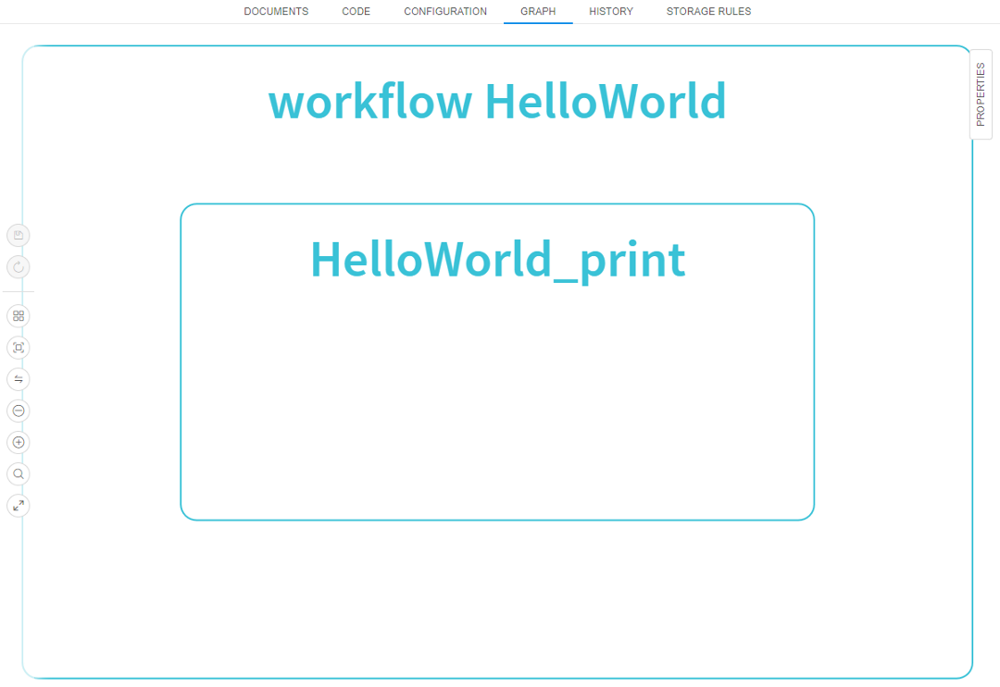
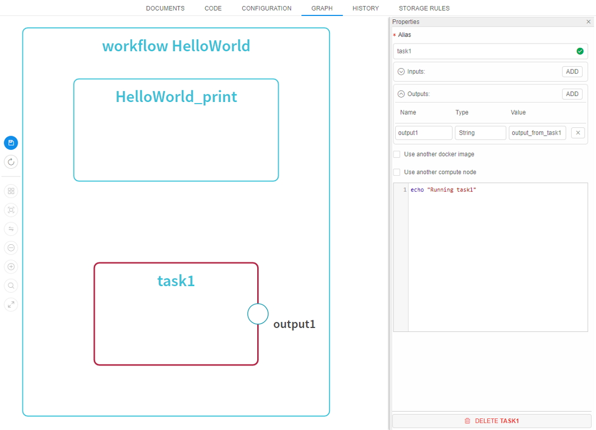
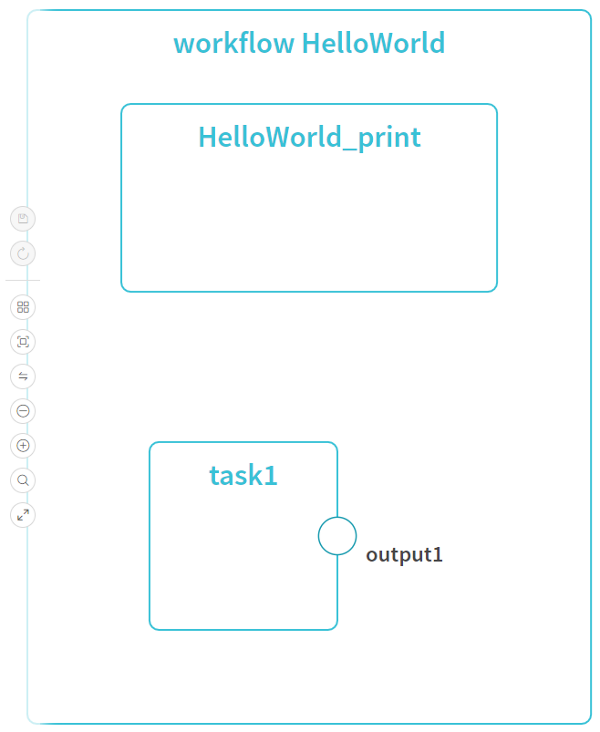
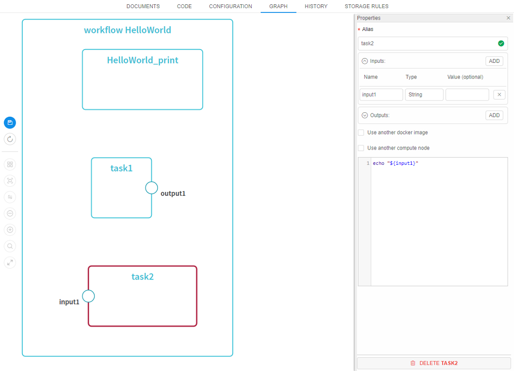
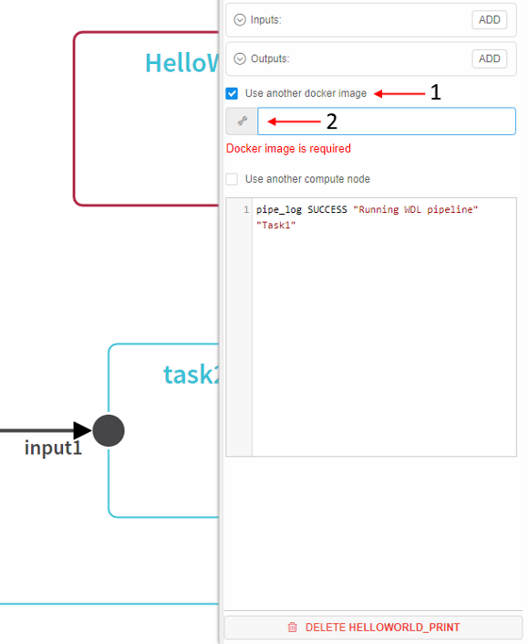
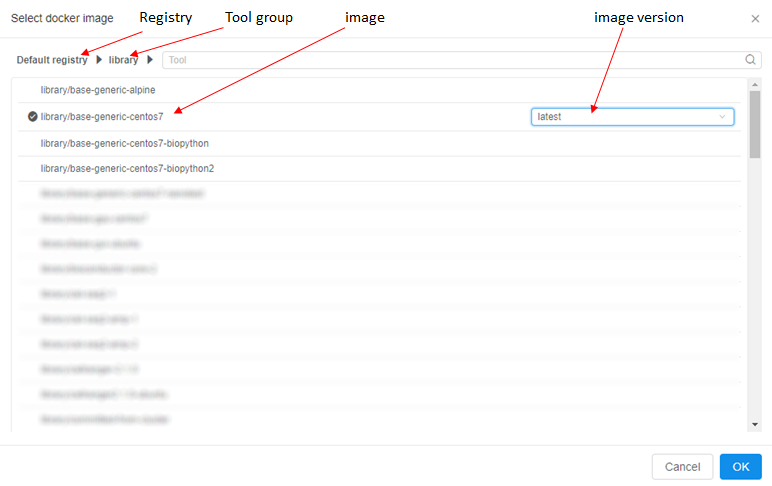

# 6.1.1 Building WDL pipeline with graphical PipelineBuilder

- [Overview](#overview)
- [Creating a new pipeline with a Pipeline Builder](#creating-a-new-pipeline-with-a-pipeline-builder)
- [Overriding docker image for a specific task](#overriding-docker-image-for-a-specific-task)
- [Example Pipeline](#example-pipeline)

> To create a new **WDL pipeline** in a **Folder** you need to have **WRITE** permissions for that folder and the **PIPELINE_MANAGER** role. For more information see [13. Permissions](../13_Permissions/13._Permissions.md).

## Overview

Cloud Pipeline allows creating pipelines using graphical IDE called "**PipelineBuilder**". "**PipelineBuilder**" provides GUI approach to construct WDL pipeline workflow supported dependencies, loops, etc without programming.

"**PipelineBuilder**" is based on WDL language (by Broad Institute, <https://github.com/openwdl/wdl>) that is executed by "Cromwell" service.

## Creating a new pipeline with a Pipeline Builder

1. To start using **Pipeline Builder** - create a new pipeline from "**WDL**" template: **+ Create → Pipeline → WDL**.  
    
2. Name it (e.g. "pipeline-builder-test").  
    
3. This will create a new pipeline with a draft version.
4. Click on the created pipeline and open the pipeline draft version.  
    
5. Navigate to the **GRAPH** tab.  
    Default pipeline will be generated with a single task "**HelloWorld_print**".  
    
6. To add more tasks - click the **ADD TASK** button in the top right corner. The **ADD SCATTER** button allows adding [scatters](https://github.com/openwdl/wdl/blob/master/versions/draft-2/SPEC.md#scatter).  
    
7. This will bring a task editor with the following fields:  
    - **Name** - a name of a task (it will be used for visualizing in a workflow and logging).
    - **Input** - a list of parameters that a task can accept from upstream tasks.
    - **Output** - a list of parameters that a task will pass to the downstream tasks.
    - **Command** - a shell script that will be executed within a task.
    - **Use another docker image** - if ticked - docker image, that is used within a task, can be overridden (i.e. different tools/images can be used for each task of the workflow) See more info [below](#overriding-docker-image-for-a-specific-task).  
    The following picture presents an example of a basic task creating:  
    
8. Click **Add** and then **Save** and **Commit**. The following visualization will be generated  - new "task1" with one output will appear.  
      
9. To create a "real" workflow - create a second task with one input. Then **Save** and **Commit**.  
    
10. Link _task1 output_ with _task2 input_ with a mouse cursor (click "output1" and slide to "input1"). Then click **Save** and **Commit**.  
    

    **_Note_**: "**HelloWorld_print**" task isn't linked to other tasks. When code generates from a graph, tasks without links to other tasks can be executed in any order (e.g. *task1 → HelloWorld_print → task2* or *HelloWorld_print → task1 → task2*, etc).

    If you want to delete task - click its name and then the **Delete** button.  
    
  
## Overriding docker image for a specific task

By default, all tasks (and their commands) will run within a docker image that is specified for the initial run. This is useful when all tools/libraries are packed into a single docker image.  
But if a specific step requires tools that are not packed into the same docker image - "**PipelineBuilder**" allows to specify another docker image:

1. Open any task details and check the **Use another docker** image option.
2. This will bring a docker image selector.  
    
3. Choose **registry**, **Tool group**. Select an image and its version. Then click the **OK** button.  
    
4. Specified docker image will be used instead of the initial one. This means that a command specified for a task will be executed in another docker container.

## Example Pipeline

As an example - R-based scRNA secondary analysis script. This script uses 10xGenomics matrix as input.

Workflow diagram:  
  
**_Note_**: this workflow uses "overridden" docker image for the last task to show how it behaves (as described in [Overriding docker image for a specific task](#overriding-docker-image-for-a-specific-task) section).