# 6.1.1. Building WDL pipeline with graphical PipelineBuilder

- [Overview](#overview)
- [Creating a new pipeline with a Pipeline Builder](#creating-a-new-pipeline-with-a-pipeline-builder)
- [Overriding docker image for a specific task](#overriding-docker-image-for-a-specific-task)
- [Example Pipeline](#example-pipeline)
- [Search over the Graph](#search-over-the-graph)

> To create a new **WDL pipeline** in a **Folder** you need to have **WRITE** permissions for that folder and the **ROLE\_PIPELINE\_MANAGER** role. For more information see [13. Permissions](../13_Permissions/13._Permissions.md).

## Overview

Cloud Pipeline allows creating pipelines using graphical IDE called "**PipelineBuilder**". "**PipelineBuilder**" provides GUI approach to construct WDL pipeline workflow supported dependencies, loops, etc without programming.

"**PipelineBuilder**" is based on WDL language (by Broad Institute, <https://github.com/openwdl/wdl>) that is executed by "Cromwell" service.

## Creating a new pipeline with a Pipeline Builder

1. To start using **Pipeline Builder** - create a new pipeline from "**WDL**" template: **+ Create → Pipeline → WDL**.  
    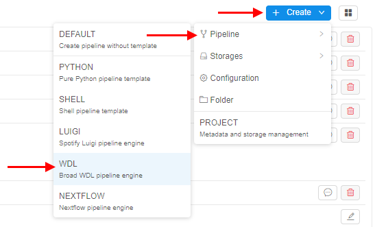
2. Name it (e.g. "pipeline-builder-test").  
    
3. This will create a new pipeline with a draft version.
4. Click on the created pipeline and open the pipeline draft version.  
    
5. Navigate to the **GRAPH** tab.  
    Default pipeline will be generated with a single task "**HelloWorld_print**".  
    
6. Auxiliary controls ("Save", "Revert changes", "Layout", "Fit to screen", "Show links", "Zoom out", "Zoom in", "Search", "Fullscreen") are in the left side of the WDL GRAPH:  
    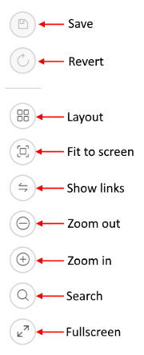
7. To add more tasks:  
    - click **PROPERTIES** in the top right corner to open "**Properties**" panel  
    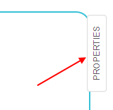
    - then click **ADD TASK** button  
    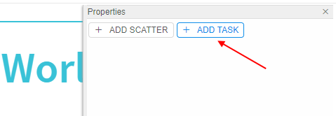  
    **_Note_**: The **ADD SCATTER** button allows adding [scatters](https://github.com/openwdl/wdl/blob/master/versions/draft-2/SPEC.md#scatter).
8. This will create a new task in the main workflow:  
    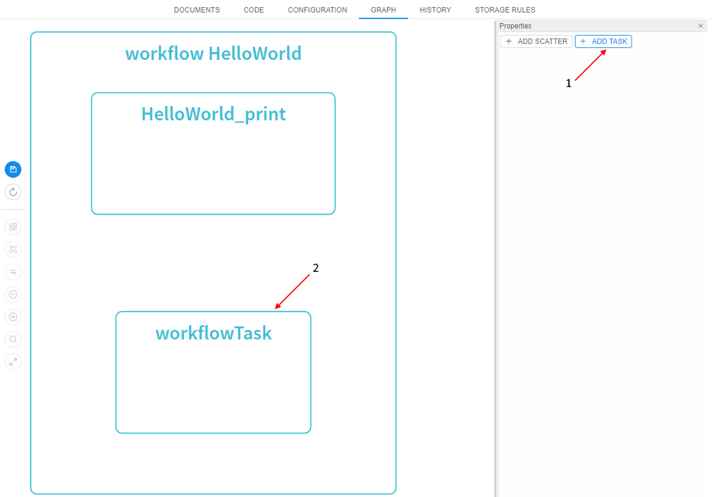
9. Click on the just-created task. It will become highlighted and the task editor will appear at "**Properties**" panel:  
    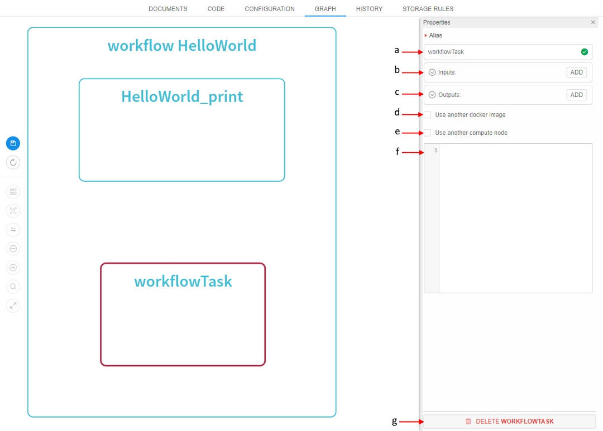  
    That panel contains the following controls:  
    - **Name** (**a**) - a name of a task (it will be used for visualizing in a workflow and logging). If you want to change it - click on that field and input a new task name. Valid names are marked with green "OK" icon:  
    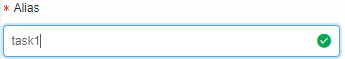  
    invalid - with red "cross" icon:  
    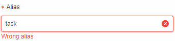
    - **Inputs** (collapsed header) (**b**) - a list of parameters that a task can accept from upstream tasks. To add parameter - click on **ADD** button. The header will be expanded automatically:  
    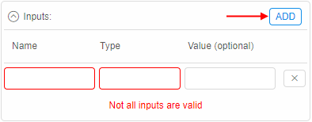  
    In appeared fields input attributes of a new input parameter.
    - **Outputs** (collapsed header) (**c**) - a list of parameters that a task will pass to the downstream tasks. To add parameter - click on **ADD** button. The header will be expanded automatically:  
      
    In appeared fields input attributes of a new output parameter.
    - **Use another docker image** (**d**) - if ticked - docker image, that is used within a task, can be overridden (i.e. different tools/images can be used for each task of the workflow). If you want to use another docker image - set that checkbox and then click upon an appeared field to select docker image:  
    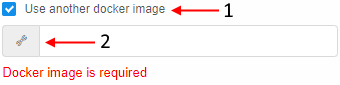  
    See more info [below](#overriding-docker-image-for-a-specific-task).
    - **Use another compute node** (**e**) - if ticked - instance type, that is used within a task, can be changed (e.g. more productive node can be used for the specific task). If you want to use another instance type - set that checkbox and then select instance from an appeared dropdown list:  
    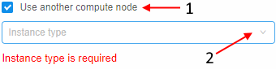
    - **Command** (**f**) - a shell script that will be executed within a task.
    - **DELETE task** button (**g**) - to delete a task.  
    Inputted changes are automatically being represented at the graph. The following picture presents an example of a basic task creating:  
    
10. After input values of a new task, click **Save** and **Commit**. The visualization with a new "task1" with one output will be displayed.  
      
11. To create a "real" workflow - create a second task with one input:  
      
    Then click **Save** and **Commit**.
12. Link _task1 output_ with _task2 input_ with a mouse cursor (click "output1" and slide to "input1"). Then click **Save** and **Commit**.  
    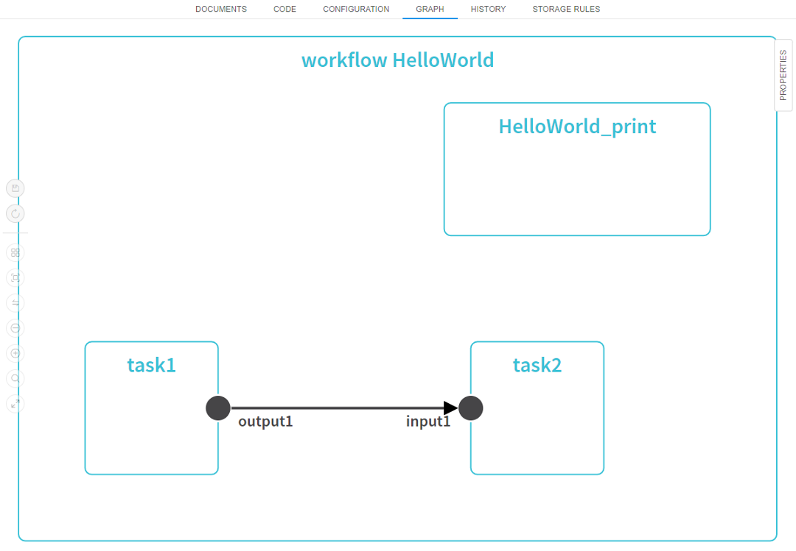  
    **_Note_**: to remove link hover mouse pointer over it and then click on "cross" button:  
    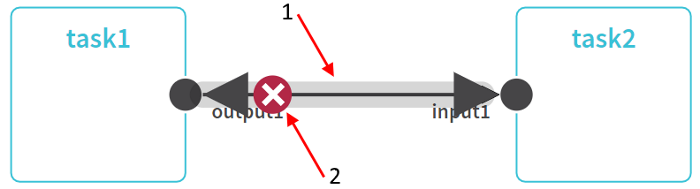  
    **_Note_**: "**HelloWorld_print**" task isn't linked to other tasks. When code generates from a graph, tasks without links to other tasks can be executed in any order (e.g. *task1 → HelloWorld_print → task2* or *HelloWorld_print → task1 → task2*, etc).  
    If you want to delete a task - click upon it, open "Properties" panel and click **DELETE task** button in the bottom of the panel:  
    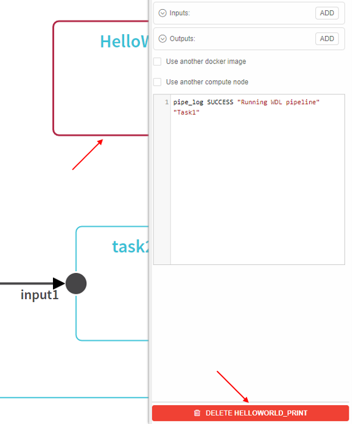
13. To add skatter:  
    - click **PROPERTIES** in the top right corner to open "**Properties**" panel  
    
    - then click **ADD SCATTER** button  
    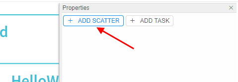
14. This will create a new scatter in the main workflow:  
    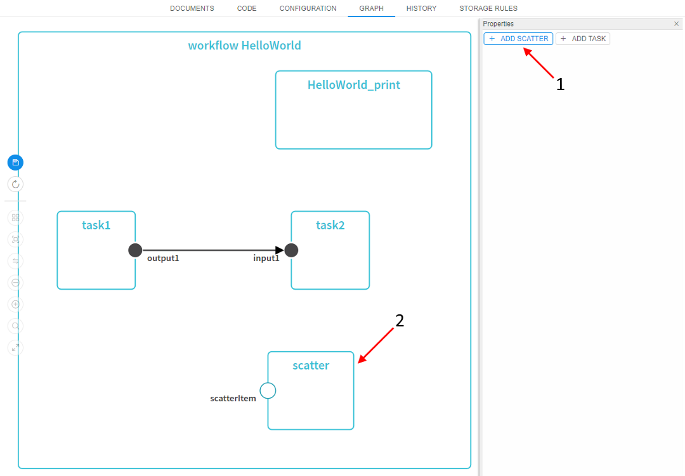
15. Click on the just-created scatter. It will become highlighted and the scatter editor will appear at "**Properties**" panel:  
    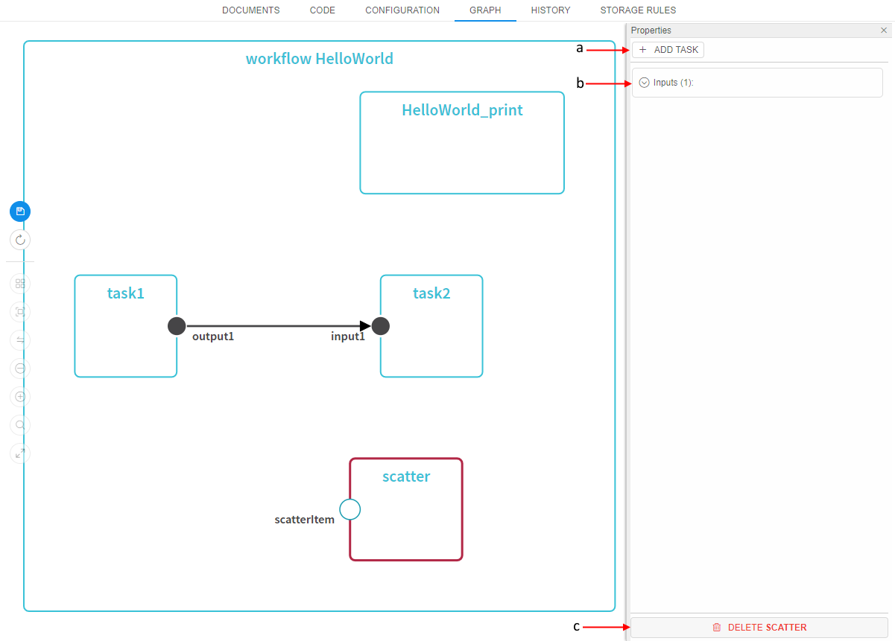  
    That panel contains the following controls:  
    - **ADD TASK** button (**a**) - to add a task into the scatter item. Creation of a task in the scatter is the same as described above. You can add inputs/outputs for that scatter task, links them with outputs/inputs of other tasks.
    - **Inputs** (collapsed header) (**b**) - a mandatory parameter of a _ScatterItem_ type that a scatter can accept from upstream task. User couldn't remove it or change its type, only change its name. For that - click upon the header and specify a new name:  
    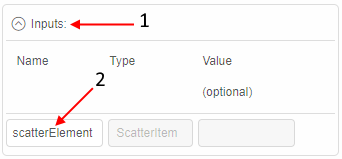  
    - **DELETE scatter** button (**c**) - to delete a scatter.  
    Inputted changes are automatically being represented at the graph.
    The following picture presents an example with a scatter, that has a task, which output is linked to "HelloWorld_print" task's input:  
    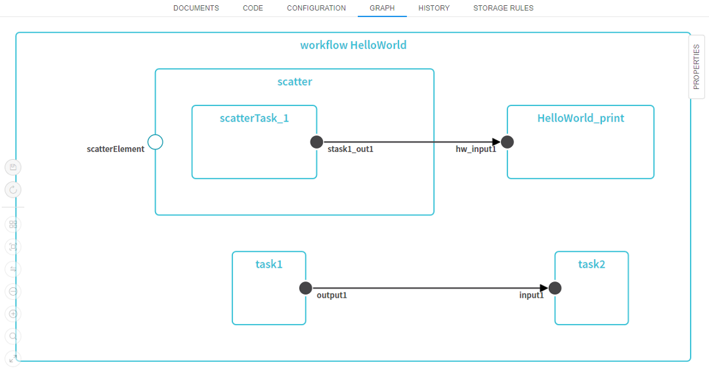

## Overriding docker image for a specific task

By default, all tasks (and their commands) will run within a docker image that is specified for the initial run. This is useful when all tools/libraries are packed into a single docker image.  
But if a specific step requires tools that are not packed into the same docker image - "**PipelineBuilder**" allows to specify another docker image:

1. Open any task details and check the **Use another docker** image option.
2. This will bring a docker image selector.  
    
3. In an appeared pop-up choose **Registry**, **Tool group**. Select an image and its version. Then click **OK** button.  
    
4. Specified docker image will be used instead of the initial one. This means that a command specified for a task will be executed in another docker container.

## Example Pipeline

As an example - R-based scRNA secondary analysis script. This script uses 10xGenomics matrix as input.

Workflow diagram:  
  
**_Note_**: this workflow uses "overridden" docker image for the last task to show how it behaves (as described in [Overriding docker image for a specific task](#overriding-docker-image-for-a-specific-task) section).

## Search over the Graph

To search some element over the Graph:

1. Click the **Search** button in the auxiliary controls menu:  
    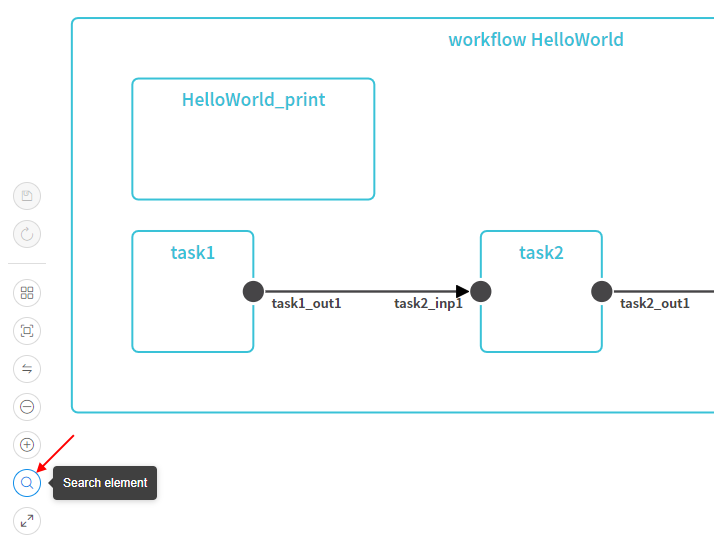
2. In the appeared field input the name or type of the element you want to find. Search results will appear immediately while typing:  
    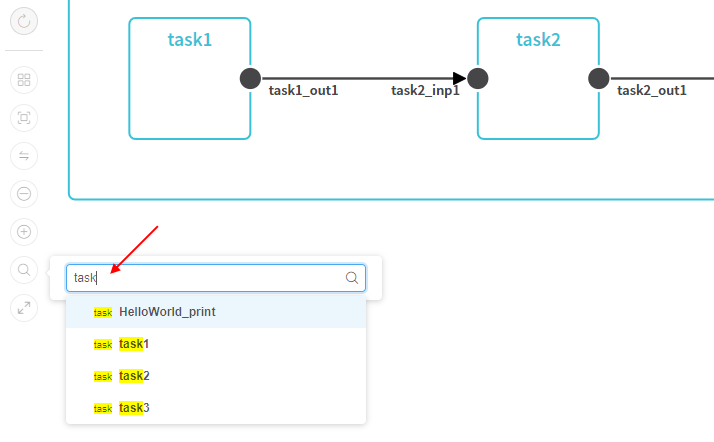
3. In the list, click the element you want to find (e.g. **_task3_**)
4. Found element will be highlighted and placed into the focus:  
    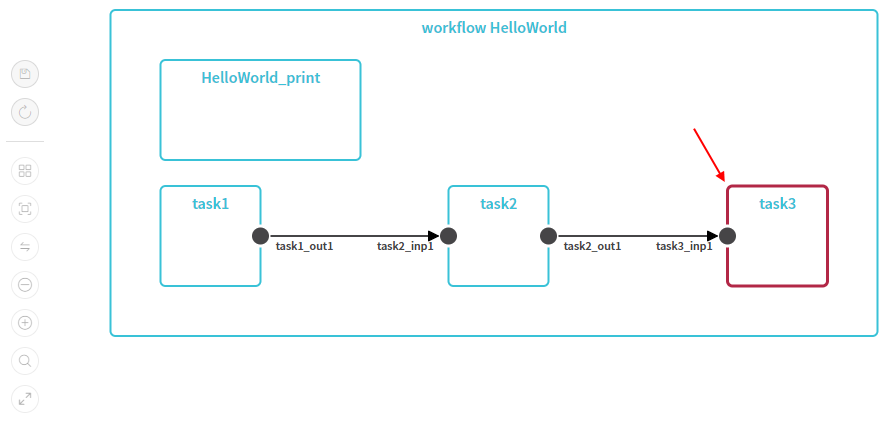
