# 6.1. Create and configure pipeline

- [Create a pipeline in a Library space](#create-a-pipeline-in-a-library-space)
- [Customize a pipeline version](#customize-a-pipeline-version)
    - [Edit documentation (optional)](#edit-documentation-optional)
    - [Edit code section](#edit-code-section)
    - [Edit pipeline configuration (optional)](#edit-pipeline-configuration-optional)
    - [Add/delete storage rules (optional)](#adddelete-storage-rules-optional)
- [Edit a pipeline info](#edit-a-pipeline-info)
- [Example: Create Pipeline](#example-create-pipeline)
    - [Pipeline input data](#pipeline-input-data)
    - [Pipeline output folder](#pipeline-output-folder)
    - [Configure the main_file](#configure-the-main_file)
    - [Configure pipeline input/output parameters via GUI](#configure-pipeline-inputoutput-parameters-via-gui)
    - [Check the results of pipeline execution](#check-the-results-of-pipeline-execution)
- [Example: Add pipeline configuration](#example-add-pipeline-configuration)
- [Example: Create a configuration that uses system parameter](#example-create-a-configuration-that-uses-system-parameter)
- [Example: Limit mounted storages](#example-limit-mounted-storages)

> To create a **Pipeline** in a **Folder** you need to have **WRITE** permission for that folder and the **ROLE\_PIPELINE\_MANAGER** role. To edit pipeline you need just **WRITE** permissions for a pipeline. For more information see [13. Permissions](../13_Permissions/13._Permissions.md).

To create a working pipeline version you need:

1. Create a pipeline in a Library space
2. Customize a pipeline version:
    - Edit documentation _(optional)_
    - Edit Code file
    - Edit Configuration, Add new configuration _(optional)_
    - Add storage rules _(optional)_.

## Create a pipeline in a Library space

1. Go to the **"Library"** tab and select a folder.
2. Click **+ Create → Pipeline** and choose one of the built-in pipeline templates (`Python`, `Shell`, `Snakemake`, `Luigi`, `WDL`, `Nextflow`) or choose `DEFAULT` item to create a pipeline without a template. Pipeline template defines the programming language for a pipeline. As templates are empty user shall write pipeline logic on his own.
3. Enter pipeline's name (pipeline description is optional) in the popped-up form.
4. Click the **Create** button.
5. A new pipeline will appear in the folder.  
    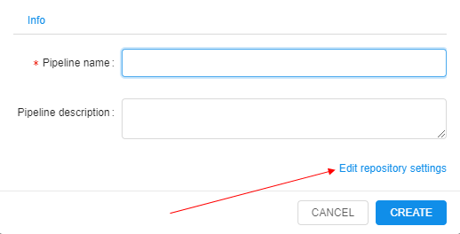  
    **_Note_**: To configure repository where to store pipeline versions click the **Edit repository settings** button.  
    Click on the button and two additional fields will appear: Repository (repository address) and Token (password to access a repository).  
    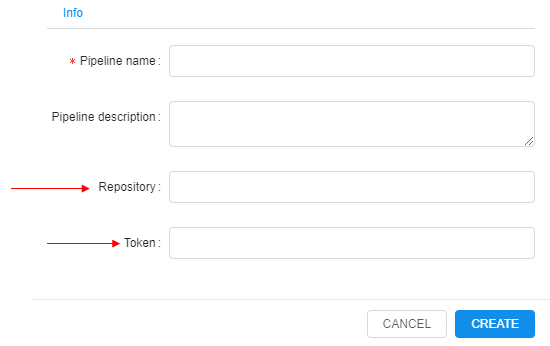
6. The new pipeline will appear in a **Library** space.

## Customize a pipeline version

Click a pipeline version to start its configuration process.  
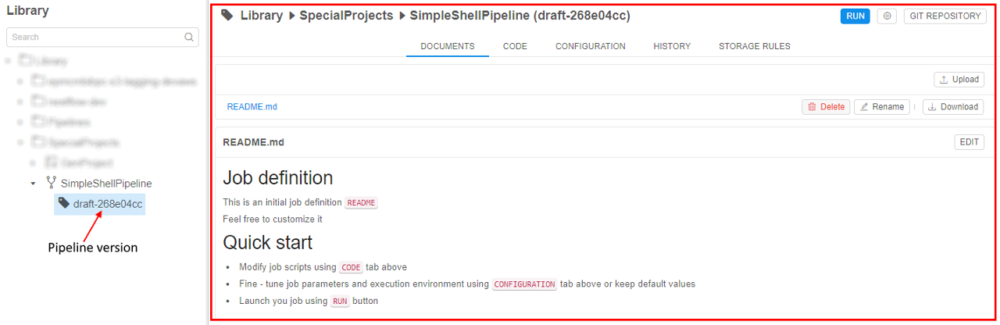

### Edit documentation (optional)

This option allows you to make a detailed description of your pipelines.  
Navigate to the **Documents** tab and:

1. Click **Edit**.  
    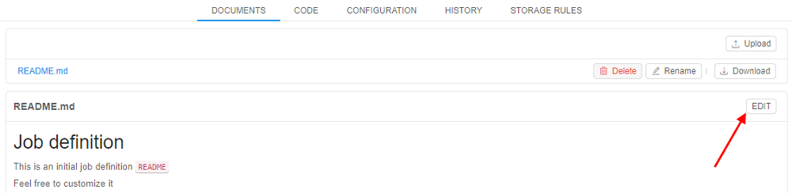
2. Change the document using a [markdown language](https://en.wikipedia.org/wiki/Markdown).
3. Click the **Save** button.  
    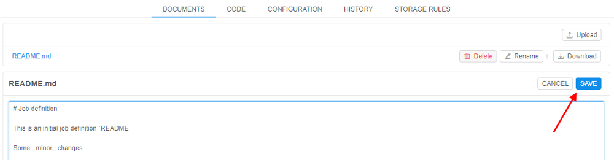
4. Enter a description of the change and click **Commit**.  
    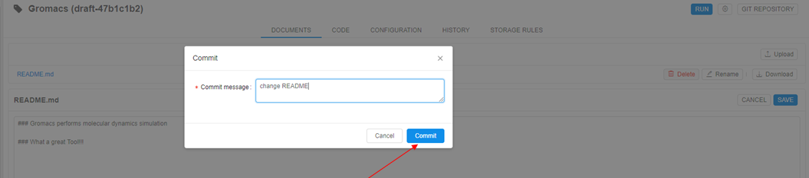
5. Changes are saved.  
    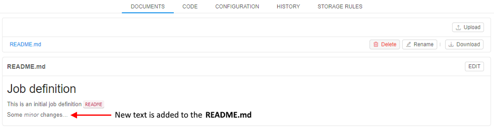

### Edit code section

It is not optional because you need to create a pipeline that will be tailored to your specific needs. For that purpose, you need to extend basic pipeline templates/add new files.

1. Navigate to the **Code** tab. Click on any file you want to edit.  
    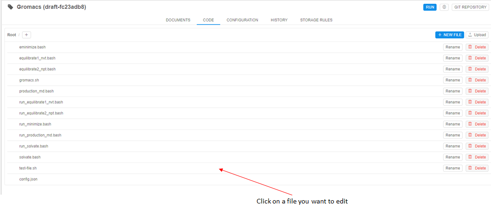  
    **_Note_**: each pipeline version has a default code file: it named after a pipeline and has a respective extension.
2. A new window with file contents will open. Click the **Edit** button and change the code file in the desired way.  
    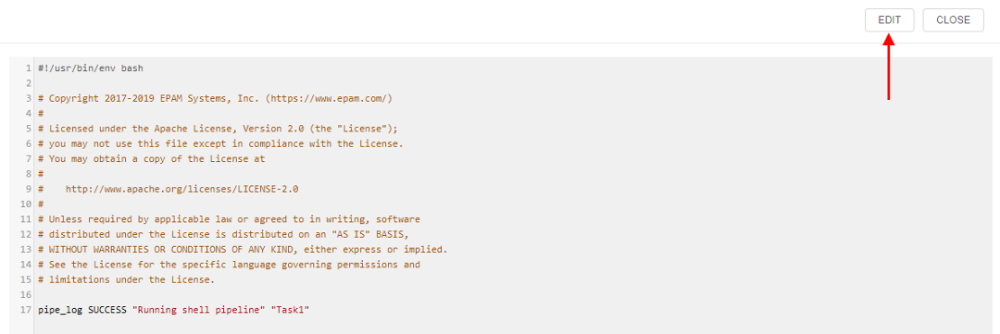
3. When you are done, click the **Save** button.  
    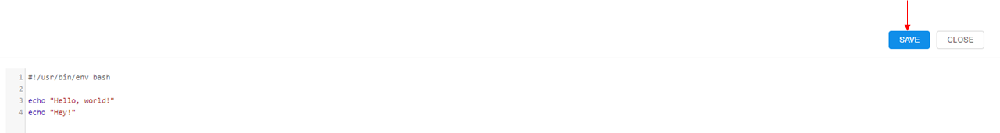
4. You'll be asked to write a **Commit message** (e.g. 'added second "echo" command'). Then click the **Commit** button.  
    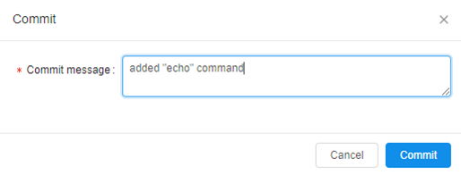
5. After that changes will be applied to your file.

**_Note_**: all code files are downloaded to the node to run the pipeline. Just adding a new file to the **Code** section doesn't change anything. You need to specify the order of scripts execution by yourself.
E.g. you have three files in your pipeline: **`first.sh`** (**main\_file**), **`second.sh`** and **`config.json`**. **cmd\_template** parameter is `chmod +x $SCRIPTS_DIR/src/* && $SCRIPTS_DIR/src/[main_file]`. So in the **`first.sh`** file you need to explicitly specify execution of **`second.sh`** script for them both to run inside your pipeline, otherwise this file will be ignored.

### Edit pipeline configuration (optional)

See details about pipeline configuration parameters [here](6._Manage_Pipeline.md#configuration).

Every pipeline has default pipeline configuration from the moment it was created.  
To change default pipeline configuration:

1. Navigate to the **Configuration** tab.
2. Expand **"Exec environment"** and **"Advanced"** tabs to see a full list of pipeline parameters. **"Parameters"** tab is opened by default.  
    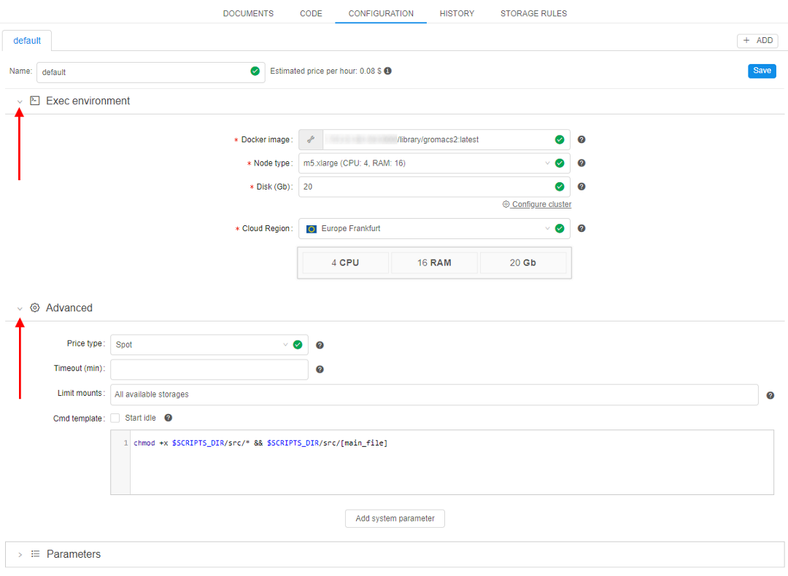
3. Change any parameter you need. In this example, we will set **Cloud Region** to Europe Ireland, **Disk** to 40 Gb and set the **Timeout** to 400 mins.  
    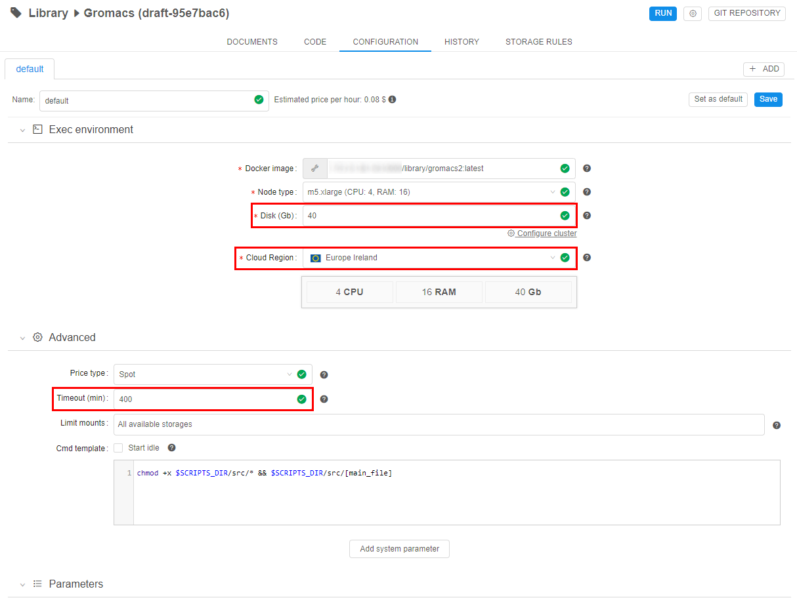
4. Click the **Save** button.  
    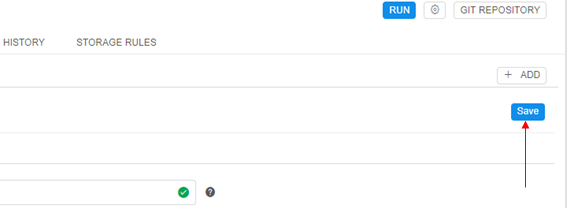
5. Now this will be the default pipeline configuration for the pipeline execution.

### Add/delete storage rules (optional)

This section allows configuring what data will be transferred to an STS after pipeline execution.  
To add a new rule:

1. Click the **Add new rule** button. A pop-up will appear.  
    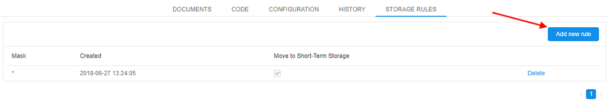
2. Enter File mask and then tick the box "Move to STS" to move pipeline output data to STS after pipeline execution.  
      
    **_Note_**: If many rules with different Masks are present all of them are checked one by one. If a file corresponds to any of rules - it will be uploaded to the bucket.
3. To delete storage rule click the **Delete** button in the right part of the storage rule's row.

## Edit a pipeline info

To edit a pipeline info:

1. Click the **Gear** icon in the right upper corner of the pipeline page
2. The popup with the pipeline info will be opened:  
      
    Here you can edit pipeline name (**a**) and description (**b**)
3. To edit repository settings click the corresponding button (**c**):  
      
    Here you can edit access token to a repository (**d**)  
    **_Note_**: the "Repository" field is disabled for the existing pipelines
4. Click the **SAVE** button to save changes

> **_Note_**: if you rename a pipeline the corresponding GitLab repo will be automatically renamed too. So, the clone/pull/push URL will change. Make sure to change the remote address, if this pipeline is used somewhere. How it works:
>
> 1. Open the pipeline:  
>    
> 2. Click the **GIT REPOSITORY** button in the right upper corner of the page:  
>    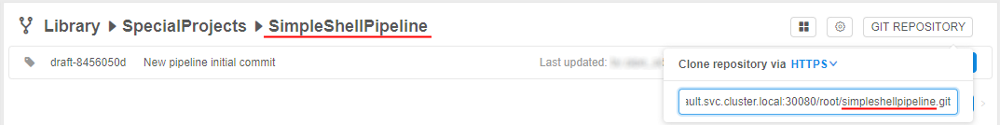  
>    Pipeline name and repository name are identical
> 3. Click the **Gear** icon in the right upper corner.  
>    In the popup change pipeline name and click the **SAVE** button:  
>    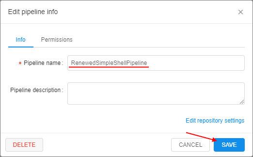
> 4. Click the **GIT REPOSITORY** button again:  
>      
>    Pipeline name and repository name are identical

Also, if you want just rename a pipeline without changing its other info fields:

1. Hover over the pipeline name at the "breadcrumbs" control in the top of the pipeline page - the "edit" symbol will appear:  
    
2. Click the pipeline name - the field will become available to edit. Rename the pipeline:  
    
3. Press the _Enter_ key or click any empty space - a new pipeline name will be saved:  
    

## Example: Create Pipeline

We will create a simple Shell pipeline (Shell template used). For that purpose, we will click **+ Create → Pipeline → SHELL**.  
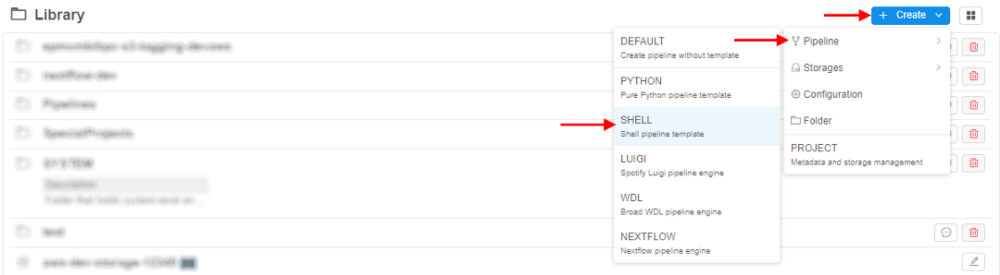

Then we will write **Pipeline name** (**1**), **Pipeline description** (**2**) and click **Create** (**3**).  
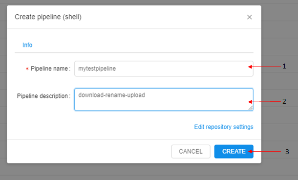

This pipeline will:

1. Download a file.
2. Rename it.
3. Upload renamed the file to the bucket.

### Pipeline input data

This is where pipeline input data is stored. About storages see [here](../08_Manage_Data_Storage/8._Manage_Data_Storage.md). This path will be used in pipeline parameters later on.  
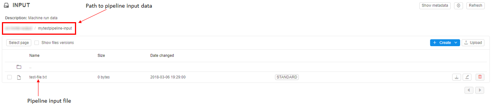

### Pipeline output folder

This is where pipeline output data will be stored after pipeline execution. About storages see [here](../08_Manage_Data_Storage/8._Manage_Data_Storage.md). This path will be used in pipeline parameters later on.  
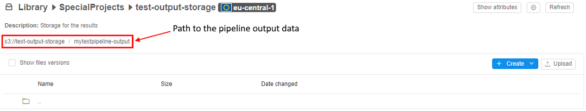

### Configure the main_file

The pipeline will consist of 2 files: **main_file** and **`config.json`**.  
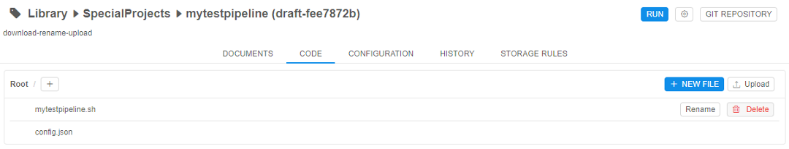

Let's extend the **main_file** so that it renames the input file and puts it into the **$ANALYSIS\_DIR** folder on the node from which data will be uploaded to the bucket. To do that click the **main_file** name and click the **Edit** button. Then type all the pipeline instructions.  
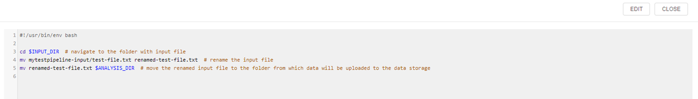  
Click the **Save** button, input a commit message and click the **Commit** button.

### Configure pipeline input/output parameters via GUI

1. Click the **Run** button.  
    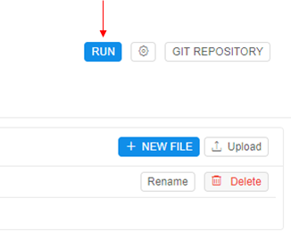
2. In the pipeline run configuration select the arrow near the **Add parameter** button and select the **"Input path parameter"** option from the drop-down list.  
    
3. Name the parameter (e.g. "input") and click on the grey **"download"** icon to select the path to the pipeline **input data** (we described pipeline input data [above](#pipeline-input-data)).
4. For pipeline output folder parameter choose the **"Output path parameter"** option from the drop-down list, name it and click on the grey **"upload"** icon to select the path to the pipeline output folder (we described pipeline output data [above](#pipeline-output-folder)).  
    This is how everything looks after these parameters are set:  
    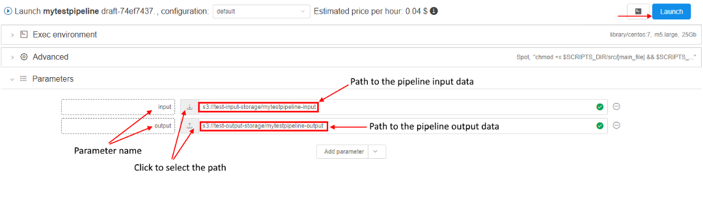
5. Leave all other parameters default and click the **Launch** button.

### Check the results of pipeline execution

After pipeline finished its execution, you can find the renamed file in the output folder:  
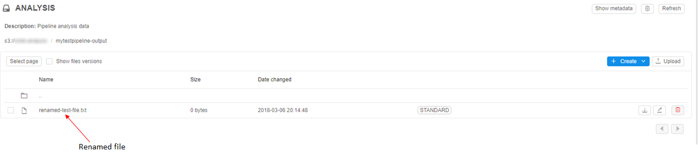

## Example: Add pipeline configuration

In this example, we will create a new pipeline configuration for the example pipeline and set it as default one. To add new pipeline configuration perform the following steps:

1. Select a pipeline
2. Select a pipeline version
3. Navigate to the **CONFIGURATION** tab
4. Click the **+ ADD** button in the upper-right corner of the screen
5. Specify **Configuration name**, **Description** (optionally) and the **Template** - this is a pipeline configuration, from which the new pipeline configuration will inherit its parameters (right now only the **"default"** template is available).
6. Click the **Create** button.  
    
7. As you can see, the new configuration has the same parameters as the default configuration.  
    **Use Delete** (**1**), **Set as default** (**2**) or **Save** (**3**) buttons to delete, set as default or save this configuration respectively.  
    
8. Expand the **Exec environment** section (**1**) and then Specify **30 GB** Disk size (**2**), click the control to choose another **Docker image** (**3**). Click the **Save** button (**4**).  
    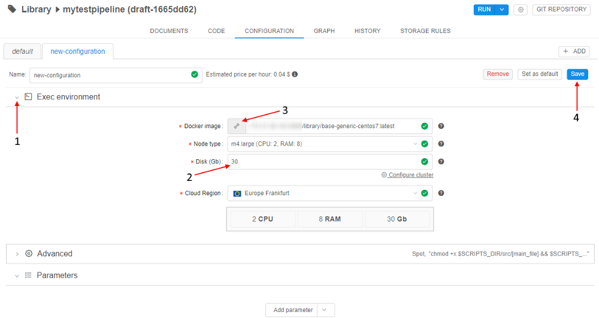
9. Set "new-configuration" as default with the **Set as default** button.
10. Navigate to the **CODE** tab. As you can see, **`config.json`** file now contains information about two configurations: "default" and "new-configuration". "new-configuration" is default one for pipeline execution.  
    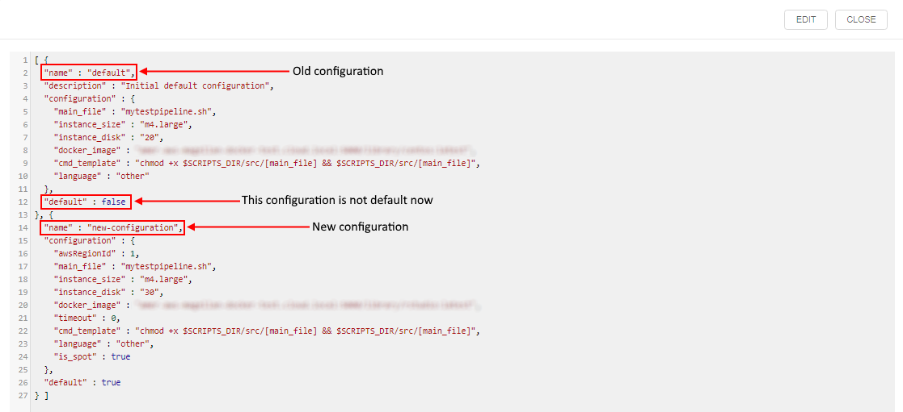

## Example: Create a configuration that uses system parameter

Users can specify system parameters (per run), that change/configure special behavior for the current run.

In the example below we will use the system parameter, that installs and allows using of the `DIND` (Docker in Docker) in the launched container:

1. Select a pipeline
2. Select a pipeline version
3. Navigate to the **CONFIGURATION** tab
4. In the **CONFIGURATION** tab expand the **Advanced** section, set "Start idle" checkbox and click the **Add system parameter** button:  
    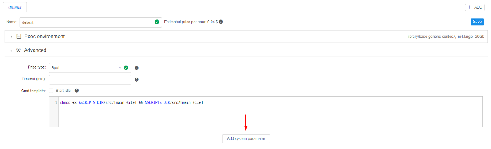
5. Click the **CP\_CAP\_DIND\_CONTAINER** option and then click the **OK** button:  
    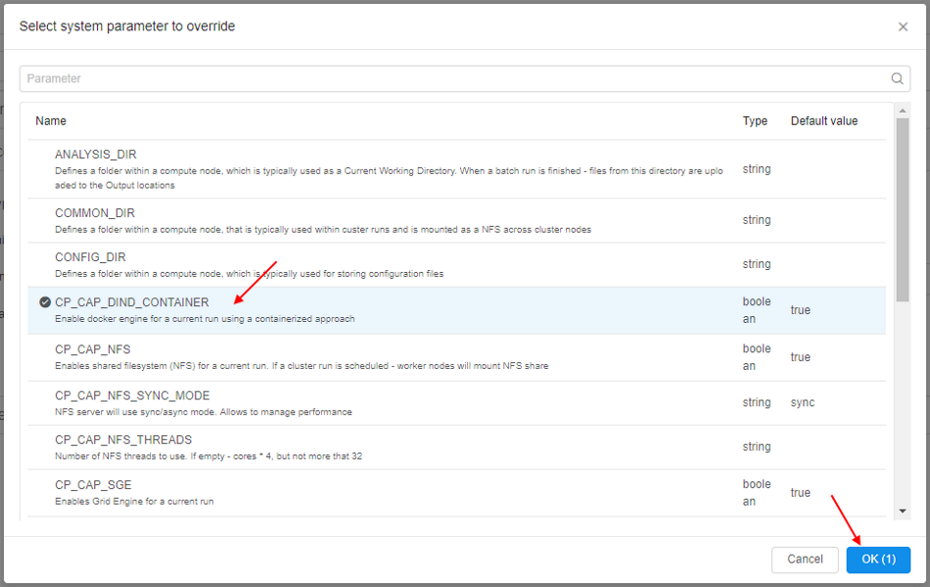  
    This option will enable docker engine for a run using a containerized approach.
6. Added system parameter appears on the configuration page. Save the configuration - now it will use "Docker inside Docker" technology while running:  
    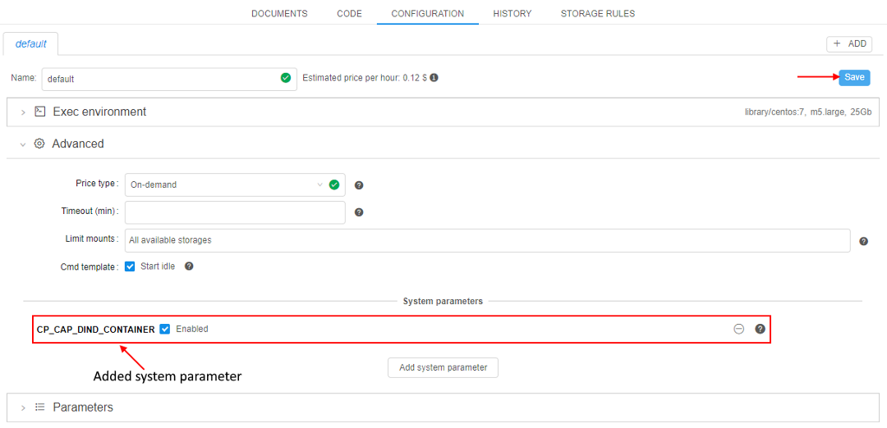  
    To see it, click the **Run** button in the upper-right corner to launch the configuration.  
    Edit or add any parameters you want on the Launch page and click the **Launch** button in the upper-right corner:  
    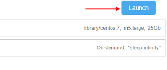  
    Confirm the launch in the appeared pop-up.
7. In the **ACTIVE RUNS** tab press the just-launched pipeline name.  
    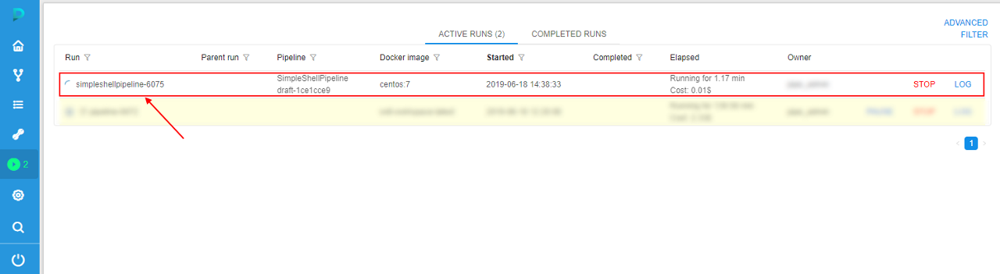
8. Wait until the **SSH** hyperlink will appear in the upper-right corner, click it:  
    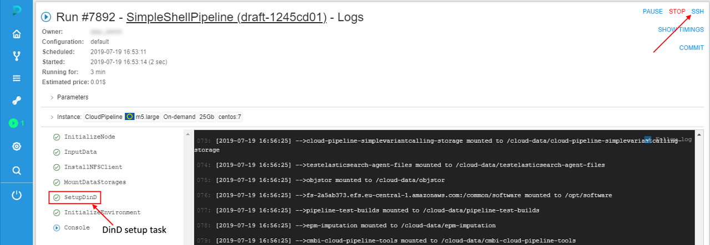
9. On the opened tab specify the command `docker version` and then press "Enter" key:  
    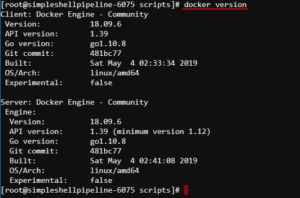  
    As you can see, DinD works correctly.

## Example: Limit mounted storages

By default, all available to a user storages are mounted to the launched container during the run initialization. User could have access to them via `/cloud-data` or `~/cloud-data` folder using the interactive sessions (SSH/Web endpoints/Desktop) or pipeline runs.

> **_Note_**: to a user only storages are available for which he has **READ** permission. For more information see [13. Permissions](../13_Permissions/13._Permissions.md).

To limit the number of data storages being mounted to a specific pipeline run:

1. Select a pipeline
2. Select a pipeline version
3. Navigate to the **CONFIGURATION** tab
4. In the **CONFIGURATION** tab expand the **Advanced** section, click the field next to the "Limit mounts" label:  
    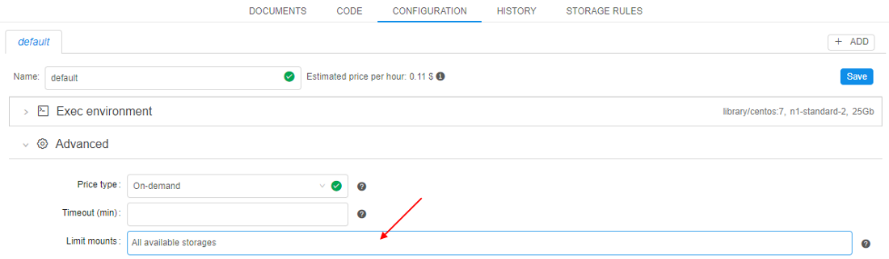
5. In the pop-up select storages you want to mount during the run, e.g.:  
    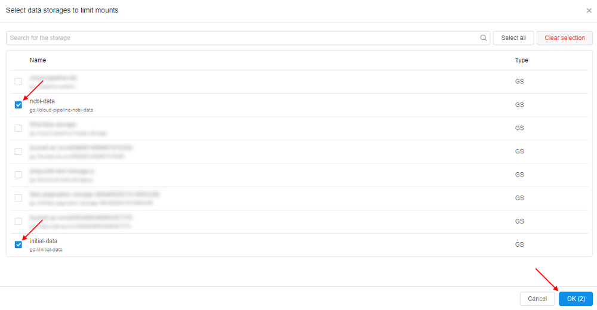  
    Confirm your choise by click the **OK** button
6. Selected storages will appear in the field next to the "Limit mounts" label:  
    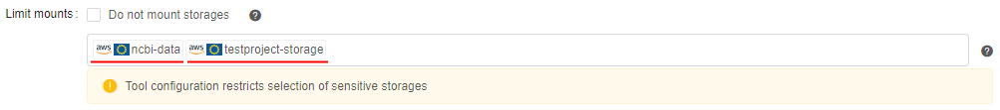
7. Set "Start idle" checkbox and click the **Save** button:  
    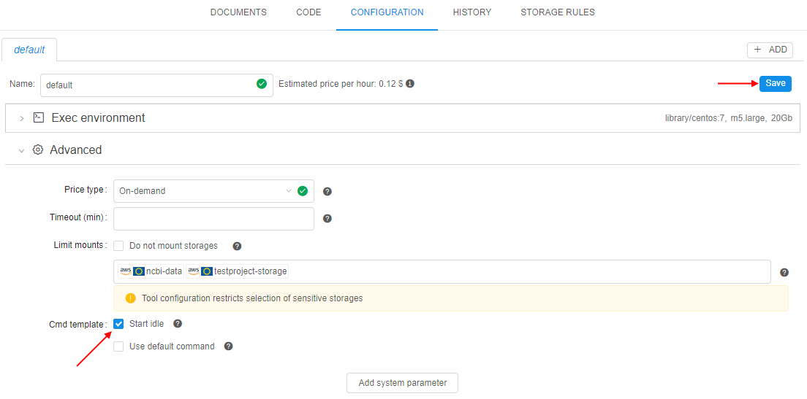
8. Click the **Run** button in the upper-right corner to launch the configuration.  Edit or add any parameters you want on the Launch page and click the **Launch** button in the upper-right corner:  
    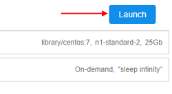  
    Confirm the launch in the appeared pop-up.
9. In the **ACTIVE RUNS** tab press the just-launched pipeline name.  
    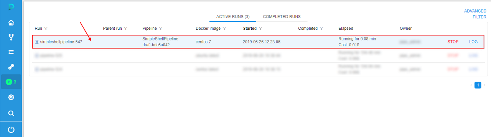
10. At the **Run logs** page expand the "Parameters" section:  
    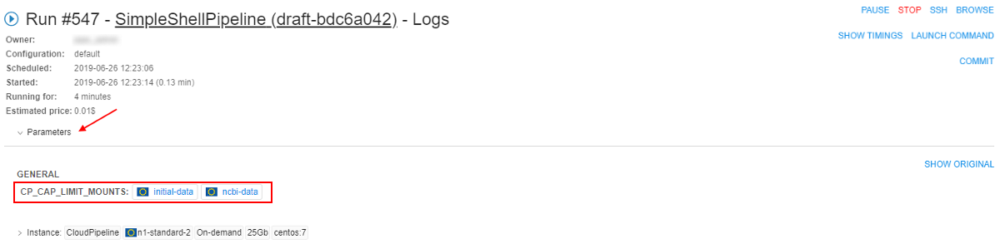  
    Here you can see IDs of the storages selected at step 5
11. Wait until the **SSH** hyperlink will appear in the upper-right corner, click it.  
    On the opened tab specify the command `ls cloud-data/` and then press "Enter" key:  
    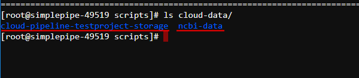  
    Here you can see the list of the mounted storages that is equal to the list of the selected storages at step 5. Other storages were not mounted.  
    Each mounted storage is available for the interactive/batch jobs using the path `/cloud-data/{storage_name}`.
