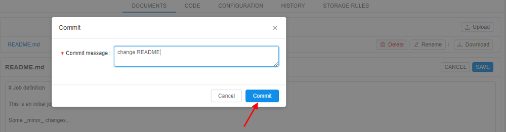
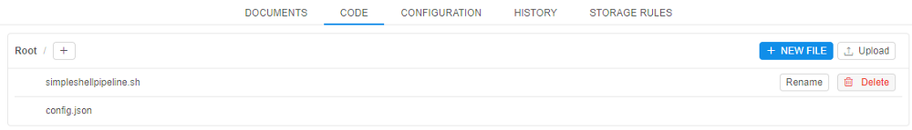
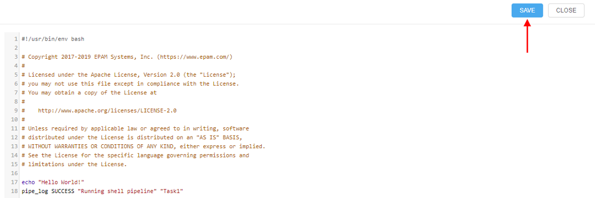
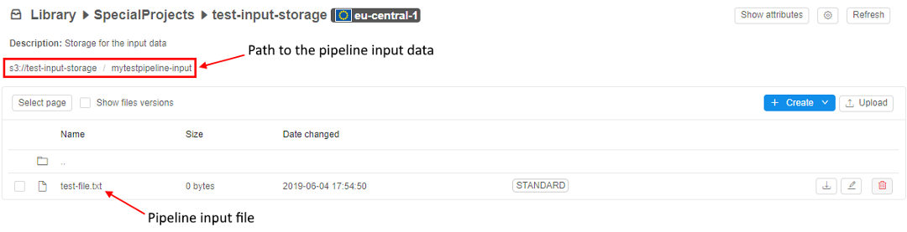
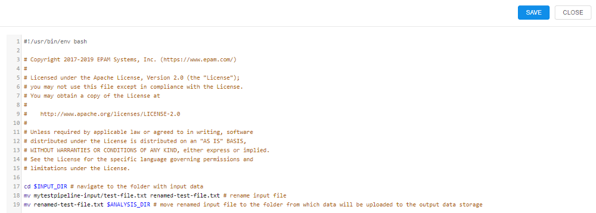
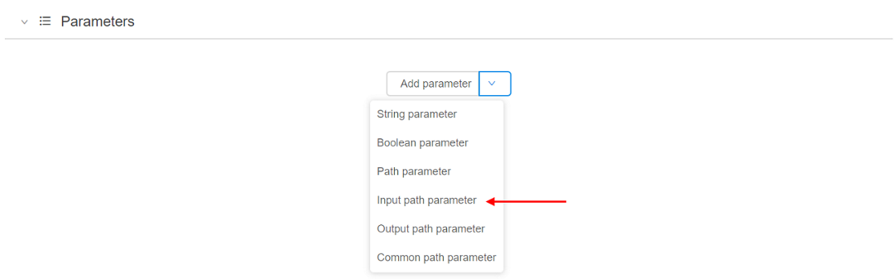
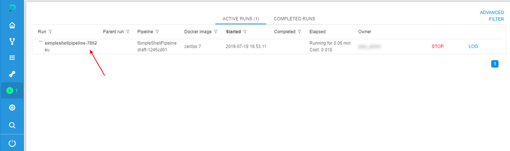
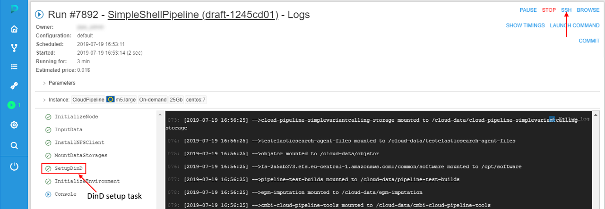

# 6.1. Create and configure pipeline

- [Create a pipeline in a Library space](#create-a-pipeline-in-a-library-space)
- [Customize a pipeline version](#customize-a-pipeline-version)
    - [Edit documentation (optional)](#edit-documentation-optional)
    - [Edit code section](#edit-code-section)
    - [Edit pipeline configuration (optional)](#edit-pipeline-configuration-optional)
    - [Add/delete storage rules (optional)](#adddelete-storage-rules-optional)
- [Example: Create Pipeline](#example-create-pipeline)
    - [Pipeline input data](#pipeline-input-data)
    - [Pipeline output folder](#pipeline-output-folder)
    - [Configure the main_file](#configure-the-main_file)
    - [Configure pipeline input/output parameters via GUI](#configure-pipeline-inputoutput-parameters-via-gui)
    - [Check the results of pipeline execution](#check-the-results-of-pipeline-execution)
- [Example: Add pipeline configuration](#example-add-pipeline-configuration)
    - [Example: Create a configuration that uses Pipeline CLI for data uploading](#example-create-a-configuration-that-uses-pipeline-cli-for-data-uploading)

> To create a **Pipeline** in a **Folder** you need to have **WRITE** permission for that folder and a role **PIPELINE\_MANAGER**. To edit pipeline you need just **WRITE** permissions for a pipeline. For more information see [13. Permissions](../13_Permissions/13._Permissions.md).

To create a working pipeline version you need:

1. Create a pipeline in a Library space
2. Customize a pipeline version:
    - Edit documentation _(optional)_
    - Edit Code file
    - Edit Configuration, Add new configuration _(optional)_
    - Add storage rules _(optional)_.

## Create a pipeline in a Library space

1. Go to the **"Library"** tab and select a folder.
2. Click **+ Create → Pipeline** and choose one of the built-in pipeline templates (Pure Python, Shell, Luigi, SAMPLE\_SHEET\_BATCH, FOLDER\_BATCH, WDL). By default, Luigi template will be chosen. Default pipeline templates define the programming language for a pipeline. As templates are empty user shall write pipeline logic on his own. "SAMPLE\_SHEET\_BATCH" and "FOLDER\_BATCH" templates include batch scripts and are devoted to batch processing of NGS files.
3. Enter pipeline's name (pipeline description is optional) in the popped-up form.
4. Click the **Create** button.
5. A new pipeline will appear in the folder.  
      
    **_Note_**: To configure repository where to store pipeline versions click the **Edit repository settings** button.  
    Click on the button and two additional fields will appear: Repository (repository address) and Token (password to access a repository).  
    
6. The new pipeline will appear in a **Library** space.

## Customize a pipeline version

Click a pipeline version to start its configuration process.  

### Edit documentation (optional)

This option allows you to make a detailed description of your pipelines.  
Navigate to the **Documents** tab and:

1. Click **Edit**.  
    
2. Change the document using a [markdown language](https://en.wikipedia.org/wiki/Markdown).
3. Click the **Save** button.  
    
4. Enter a description of the change and click **Commit**.  
    
5. Changes are saved.  
    

### Edit code section

It is not optional because you need to create a pipeline that will be tailored to your specific needs. For that purpose, you need to extend basic pipeline templates/add new files.

1. Navigate to the **Code** tab. Click on any file you want to edit.  
    **_Note_**: each pipeline version has a default code file: it named after a pipeline and has a respective extension.  
    
2. A new window with file contents will open. Click the **Edit** button and change the code file in the desired way.  
    
3. When you are done, click the **Save** button.  
    
4. You'll be asked to write a **Commit message** (e.g. 'added second "echo" command'). Then click the **Commit** button.  
    
5. After that changes will be applied to your file.

**_Note_**: all code files are downloaded to the node to run the pipeline. Just adding a new file to the **Code** section doesn't change anything. You need to specify the order of scripts execution by yourself.
E.g. you have three files in your pipeline: **`first.sh`** (**main\_file**), **`second.sh`** and **`config.json`**. **cmd\_template** parameter is `chmod +x $SCRIPTS_DIR/src/* && $SCRIPTS_DIR/src/[main_file]`. So in the **`first.sh`** file you need to explicitly specify execution of **`second.sh`** script for them both to run inside your pipeline, otherwise this file will be ignored.

### Edit pipeline configuration (optional)

See details about pipeline configuration parameters [here](6._Manage_Pipeline.md#configuration).

Every pipeline has default pipeline configuration from the moment it was created.  
To change default pipeline configuration:

1. Navigate to the **Configuration** tab.
2. Expand **"Exec environment"** and **"Advanced"** tabs to see a full list of pipeline parameters. **"Parameters"** tab is opened by default.  
    
3. Change any parameter you need. In this example, we will set **Cloud Region** to Europe Ireland, **Disk** to 40 Gb and set the **Timeout** to 400 mins.  
    
4. Click the **Save** button.  
    
5. Now this will be the default pipeline configuration for the pipeline execution.

### Add/delete storage rules (optional)

This section allows configuring what data will be transferred to an STS after pipeline execution.  
To add a new rule:

1. Click the **Add new rule** button. A pop-up will appear.  
    
2. Enter File mask and then tick the box "Move to STS" to move pipeline output data to STS after pipeline execution.  
      
    **_Note_**: If many rules with different Masks are present all of them are checked one by one. If a file corresponds to any of rules - it will be uploaded to the bucket.
3. To delete storage rule click the **Delete** button in the right part of the storage rule's row.

## Example: Create Pipeline

We will create a simple Shell pipeline (Shell template used). For that purpose, we will click **+ Create → Pipeline → SHELL**.  

Then we will write **Pipeline name** (**1**), **Pipeline description** (**2**) and click **Create** (**3**).  

This pipeline will:

1. Download a file.
2. Rename it.
3. Upload renamed the file to the bucket.

### Pipeline input data

This is where pipeline input data is stored. This path will be used in pipeline parameters later on.  

### Pipeline output folder

This is where pipeline output data will be stored after pipeline execution. This path will be used in pipeline parameters later on.  

### Configure the main_file

The pipeline will consist of 2 files: **main_file** and **`config.json`**.  

Let's extend the **main_file** so that it renames the input file and puts it into the **$ANALYSIS\_DIR** folder on the node from which data will be uploaded to the bucket. To do that click the **main_file** name and click the **Edit** button. Then type all the pipeline instructions.  

### Configure pipeline input/output parameters via GUI

1. Click the **Run** button.  
    
2. In the pipeline run configuration select the arrow near the **Add parameter** button and select the **"Input path parameter"** option from the drop-down list.  
    
3. Name the parameter (e.g. "input") and click on the grey **"download"** icon to select the path to the pipeline **input data** (we described pipeline input data [above](#pipeline-input-data)).
4. For pipeline output folder parameter choose the **"Output path parameter"** option from the drop-down list, name it and click on the grey **"upload"** icon to select the path to the pipeline output folder (we described pipeline output data [above](#pipeline-output-folder)).  
    This is how everything looks after these parameters are set:  
    
5. Leave all other parameters default and click the **Launch** button.

### Check the results of pipeline execution

After pipeline finished its execution, you can find the renamed file in the output folder.  

## Example: Add pipeline configuration

In this example, we will create a new pipeline configuration for the example pipeline and set it as default one. To add new pipeline configuration perform the following steps:

1. Select a pipeline
2. Select a pipeline version
3. Navigate to the **CONFIGURATION** tab
4. Click the **+ ADD** button in the upper-right corner of the screen
5. Specify **Configuration name**, **Description** (optionally) and the **Template** - this is a pipeline configuration, from which the new pipeline configuration will inherit its parameters (right now only the **"default"** template is available).
6. Click the **Create** button.  
    
7. As you can see, the new configuration has the same parameters as the default configuration.  
    **Use Delete** (**1**), **Set as default** (**2**) or **Save** (**3**) buttons to delete, set as default or save this configuration respectively.  
    
8. Expand the **Exec environment** section (**1**) and then Specify **30 GB** Disk size (**2**), click the control to choose another **Docker image** (**3**). Click the **Save** button (**4**).  
    
9. Set "new-configuration" as default with the **Set as default** button.
10. Navigate to the **CODE** tab. As you can see, **`config.json`** file now contains information about two configurations: "default" and "new-configuration". "new-configuration" is default one for pipeline execution.  
    

## Example: Create a configuration that uses Pipeline CLI for data uploading

To use Pipeline CLI instead of AWS CLI, the system parameter shall be added.

1. In the **Configuration** page navigate to the **Advanced** tab and press **Add system parameter** button.  
    
2. Select the **CP\_USE\_PIPE\_FOR\_CP** option and click **OK**.  
    
3. Save the configuration - now the configuration will use CP CLI to upload running results.
4. To see the difference, click **"Run"** to launch it.
5. Edit or add any parameters you want and click **"Launch"**.  
    
6. In the **Active Runs** tab press the pipeline name.  
    
7. When pipeline finishes its execution, click the **output** link in the **Parameters** tab.  
    
8. On the opened page press the output file name and on the bottom-right you'll see a list of tags that was automatically set for the chosen file.  
      
    This is a feature of uploading uses the CP CLI - files are automatically tagged with the following attributes:  
    **_Note_**: The exception is that the storage is based on NFS share. Files in such data storage don't have attributes at all.

    | Name | Value |
    |---|---|
    | **CP\_OWNER** | User ID |
    | **CP\_SOURCE** | Local path used to upload |
    | **CP\_CALC\_CONFIG** | Instance type |
    | **CP\_DOCKER\_IMAGE** | Tool that was used |
    | **CP\_JOB\_CONFIGURATION** | Pipeline configuration |
    | **CP\_JOB\_ID** | Pipeline ID |
    | **CP\_JOB\_NAME** | Pipeline name |
    | **CP\_JOB\_VERSION** | Pipeline version |
    | **CP\_RUN\_ID** | Run ID |
