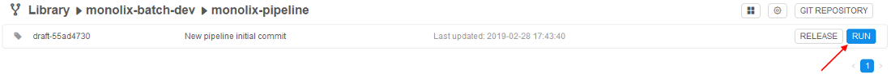
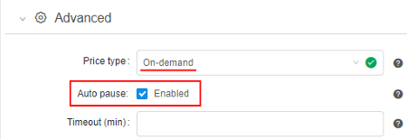
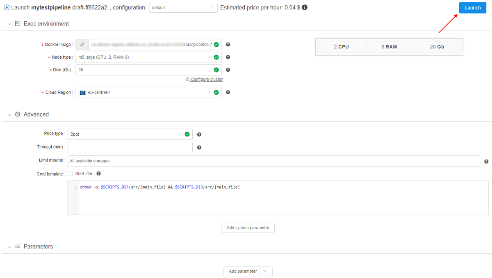
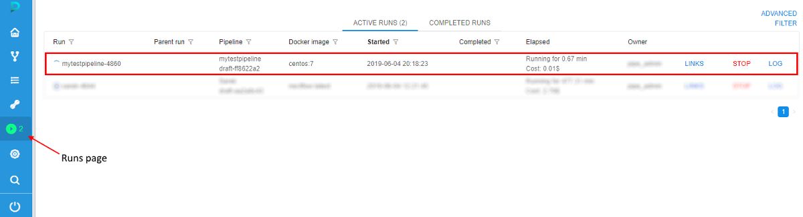

# 6.2. Launch a pipeline

> To launch a pipeline you need to have **EXECUTE** permissions for the pipeline. For more information see [13. Permissions](../13_Permissions/13._Permissions.md).

1. Select a pipeline in the "**Library**" menu ([3. Overview](../03_Overview/3._Overview.md#library)).
2. Select a pipeline version to run.
3. Click the **Run** button. Launch pipeline page will open.  
      
    Feel free to change settings of run configuration if you need to. See an example of editing configuration [here](6.1._Create_and_configure_pipeline.md#edit-pipeline-configuration-optional).  
    **_Note_**: if **Price type** is set as "_On-demand_" - at the **Launch page**, an additional checkbox **Auto pause** appears:  
      
    This checkbox allows to enable automatic pausing on-demand instance if it is not used. Such behavior could be controlled by Administrators using a set of parameters at System Preferences (see [here](../12_Manage_Settings/12.10._Manage_system-level_settings.md#system)).

    > Please note, this checkbox will not be displayed if any cluster is configured ("Static" or "Autoscaled").

4. Click **Launch**.  
      
    Please note, that the current user can launch a pipeline only if he/his group has corresponding permissions on that pipeline (for more information see [13. Permissions](../13_Permissions/13._Permissions.md)), but the **Launch** button may be disabled also for one of the following reasons:

    - `execution` isn't allowed for specified docker image;
    - `read` operations aren't allowed for specified **input** or **common** path parameters;
    - `write` operations aren't allowed for specified **output** path parameters.

    In such cases, hover over the **Launch** button to view warning notification with a reason of a run forbiddance, e.g.:  
    

5. Confirm launch in an appeared popup.
6. You'll be redirected to the **"Runs"** area. Here you'll find your pipeline running. You can monitor status of your run and see additional information (see [11. Manage Runs](../11_Manage_Runs/11._Manage_Runs.md)).  
      
    **_Note_**: after some initialization time, a new node will appear in the "**Cluster nodes**" tab. See [9. Manage Cluster nodes](../09_Manage_Cluster_nodes/9._Manage_Cluster_nodes.md).

**_Note_**: to learn about launching a pipeline as an Interactive service, refer to [15. Interactive services](../15_Interactive_services/15._Interactive_services.md).
