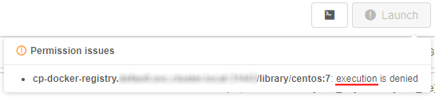

# 6.2. Launch a pipeline

> To launch a pipeline you need to have **EXECUTE** permissions for the pipeline. For more information see [13. Permissions](../13_Permissions/13._Permissions.md).
>
> Also you can launch a pipeline via CLI. See [14.5 Manage pipeline executions via CLI](../14_CLI/14.5._Manage_pipeline_executions_via_CLI.md#schedule-a-pipeline-execution).

1. Select a pipeline in the "**Library**" menu ([3. Overview](../03_Overview/3._Overview.md#library)).
2. Select a pipeline version to run.
3. Click the **Run** button.  
      
    Launch pipeline page will be opened:  
      
    Feel free to change settings of run configuration if you need to. See an example of editing configuration [here](6.1._Create_and_configure_pipeline.md#edit-pipeline-configuration-optional).  
4. If the **Price type** is set as "_On-demand_" - at the **Launch page**, an additional checkbox **Auto pause** appears:  
      
    This checkbox allows to enable automatic pausing on-demand instance if it is not used. Such behavior could be controlled by Administrators using a set of parameters at System Preferences (see [here](../12_Manage_Settings/12.10._Manage_system-level_settings.md#system)).

    > Please note, this checkbox will not be displayed if any cluster is configured ("Static" or "Autoscaled").

5. If the **Price type** is set as "_On-demand_" - at the **Launch page**, an additional control **Maintenance** appears. It allows to configure schedule for automatical pause/resume a pipeline run. It could be useful when the pipeline is launched for a long time (several days/weeks) but it shall not stand idle, just increasing costs, in weekends and holidays, for example.  
    Schedule is defined as a list of rules (user is able to specify any number of them).  
    For each rule in the list the user is able to set:
    - the action: `PAUSE` or `RESUME`
    - the recurrence:
        - _Daily_: every `N` days, time  
        or  
        - _Weekly_: every `weekday(s)`, time  

    Conflicting rules are not allowed (i.e. rules that are configured on the same execution time).  
    If any schedule rule is configured for the launched active run - that run will be paused/restarted accordingly in the scheduled day and time.

    To set a schedule for pause/restart a job:

    - Click the **Configure** button:  
          
    - The "Maintenance" popup will appear:  
        
    - Click the **Add rule** button. The first rule will appear:  
        
    - Using available controls configure the rule according to your wish, e.g. to automatically pause a job every 2 days at `15:00`:  
        
    - To add another rule click the **Add rule** button. Configure a new rule using available controls, e.g. to automatically restart (resume) a job every monday and friday at `18:30`:  
        
    - Click the **OK** button to save specified rules
    - Saved rules will be displayed at the **Launch** form:  
        

    > Please note, the **Maintenance** control will not be displayed if any cluster is configured ("Static" or "Autoscaled").

    Users (who have permissions to pause/resume a run) can create/view/modify/delete schedule rules anytime launched run is active via the **Run logs** page - for more details see [11. Manage runs](../11_Manage_Runs/11._Manage_Runs.md#maintenance).

6. Click **Launch**.  
      
    Please note, that the current user can launch a pipeline only if he/his group has corresponding permissions on that pipeline (for more information see [13. Permissions](../13_Permissions/13._Permissions.md)), but the **Launch** button may be disabled also for one of the following reasons:

    - `execution` isn't allowed for specified docker image;
    - `read` operations aren't allowed for specified **input** or **common** path parameters;
    - `write` operations aren't allowed for specified **output** path parameters.

    In such cases, hover over the **Launch** button to view warning notification with a reason of a run forbiddance, e.g.:  
    

    > **_Note_**: you can also launch a pipeline with the same settings via the `CLI` command or `API` request.  
    > To generate the corresponding command/request click the button  near the "Launch" button. For more details see [here](../14_CLI/14.5._Manage_pipeline_executions_via_CLI.md#generate-pipeline-launch-command-via-the-gui).

5. Confirm launch in the appeared popup.  
    
6. You'll be redirected to the **"Runs"** area. Here you'll find your pipeline running. You can monitor status of your run and see additional information (see [11. Manage Runs](../11_Manage_Runs/11._Manage_Runs.md)).  
      
    **_Note_**: after some initialization time, a new node will appear in the "**Cluster nodes**" tab. See [9. Manage Cluster nodes](../09_Manage_Cluster_nodes/9._Manage_Cluster_nodes.md).

**_Note_**: to learn about launching a pipeline as an Interactive service, refer to [15. Interactive services](../15_Interactive_services/15._Interactive_services.md).
