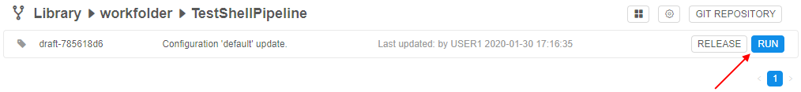
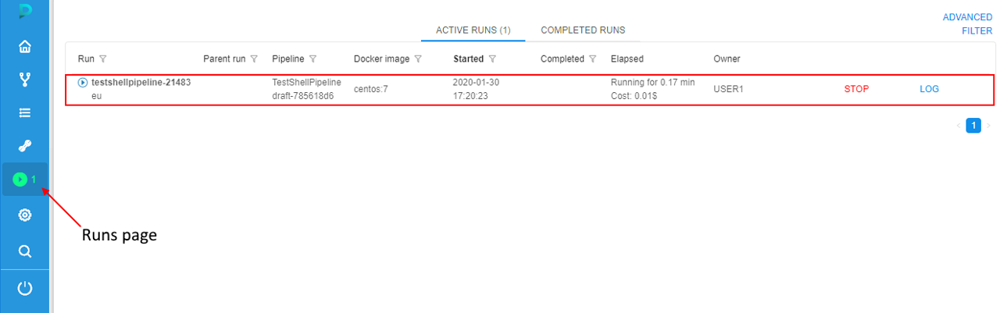

# 6.2. Launch a pipeline

> To launch a pipeline you need to have **EXECUTE** permissions for the pipeline. For more information see [13. Permissions](../13_Permissions/13._Permissions.md).

1. Select a pipeline in the "**Library**" menu ([3. Overview](../03_Overview/3._Overview.md#library)).
2. Select a pipeline version to run.
3. Click the **Run** button. Launch pipeline page will open.  
      
    Feel free to change settings of run configuration if you need to. See an example of editing configuration [here](6.1._Create_and_configure_pipeline.md#edit-pipeline-configuration-optional).  
4. Click **Launch**.  
    
5. You'll be redirected to the **"Runs"** area. Here you'll find your pipeline running. You can monitor status of your run and see additional information (see [11. Manage Runs](../11_Manage_Runs/11._Manage_Runs.md)).  
      
    **_Note_**: after some initialization time, a new node will appear in the "**Cluster nodes**" tab. See [9. Manage Cluster nodes](../09_Manage_Cluster_nodes/9._Manage_Cluster_nodes.md).

**_Note_**: to learn about launching a pipeline as an Interactive service, refer to [15. Interactive services](../15_Interactive_services/15._Interactive_services.md).
