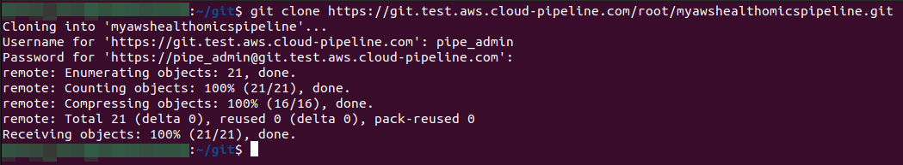
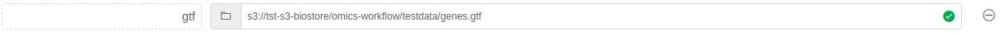

# AWS HealthOmics Workflow

Cloud-Pipeline has built-in pipeline template that can be used to run your Nextflow workflow with AWS HealthOmics Workflow (https://docs.aws.amazon.com/omics/latest/dev/workflows.html).

> NOTE:
>  - Works only for AWS based Cloud-Pipeline deployment
>  - Currently only Nextflow workflows are supported

This document provides you with necessary information on how to use existing workflows or write your own in Cloud-Pipeline, to be able to utilize AWS HealthOmics Workflow.

## 1. Create pipeline from AWS HealthOmics pipeline template

To start developing and Nextflow workflow or reuse existing one, first of all you will need to create Pipeline inside Cloud-Pipeline platform. For this reason:
1. Navigate to the Cloud-Pipeline UI: <br>


2. In the catalog tree choose a location (folder) where you would like to create you pipeline: <br>


3. Click on + Create button in the upper right corner and choose Pipeline -> AWS-HEALTHOMICS-WORKFLOW: <br>


4. Specify desired name and click CREATE: <br>


5. Wait while pipeline being created and after that click on its name in the folder content listing: <br>


6. Then click on the newly created revision of this pipeline and choose CODE tab at the top menu: <br>


7. Now, lets take a look on the structure of it: <br>
   ````
   - workflow/                  # Directory where all workflow related code should be placed
     - main.tf                  # Workflow file with dummy pipeline          
     - nextflow.config          # Worklow configuration file
   - run-omics-workflow.sh      # Entry of the Cloud-Pipeline pipeline, this script will be run on start up of the pipeline and will take care of creation and run of the AWS HealthOmics Workflow 
   - config.json                # Standard Cloud-Pipeline pipeline configuration file where all pipeline related settings are stored
   ````
   
8. Now you are ready to proceed develop your own / utilize existing workflow.

## 2. Integrate existing workflow with AWS HealthOmics on Cloud-Pipeline

Process of developing your own workflow hasn't actual difference from using existing one, in terms of integration this workflow with AWS HealthOmics on Cloud-Pipeline. <br> 
Here we describe the process of how to reuse existing workflow with AWS HealthOmics on Cloud-Pipeline, but you can also use this documentation wen developing it from scratch.

### Obtain gitlab token for the authentication

> Each pipeline object in Cloud-Pipeline Platform is a git repository hosted on gitlab, so it is possible and essential to use it as a git repository.

1. In the pipeline view page click GITLAB REPOSITORY: <br>
   

2. Copy the url and navigate to the URL, if it asks to do it, authenticate with you credentials in Cloud-Pipeline platform: <br>
   
   <br>
   

3. Navigate to the Settings -> Access Tokens and fill required fields as shown on the screenshot, adjust expiration date and click **Create project access token**: <br>
   

4. Copy new token and save it somewhere safe, you will need it: <br>
   

### Clone gitlab repository locally

1. Open terminal and perform the following command:

   ```commandline
   git clone < repo-name >.git
   ```
   > When it asks for the credentials - specify you Cloud-Pipeline username as a Username and for the password use newly generated access token from previous step:

   

### Modify git repository and ingest workflow code in it

> Here we will use [nf-core/rnaseq v3.11.1](https://github.com/nf-core/rnaseq/tree/3.11.1) 

1. Navigate to the `src/workflow` directory of your pipeline repository: <br>
   

2. remove dummy sample pipeline files:
   ```commandline
   rm -rf ./*
   ```
   

3. Clone rnaseq pipeline to the directory:
   ```commandline
   git clone https://github.com/nf-core/rnaseq.git .
   ```
   

4. Checkout to the needed version and clean up:
   ```commandline
   git checkout 3.11.1
   rm -rf ./git*
   ```
   
   
   > This workflow need one small improvements to be made to work correctly, otherwise it will fail during execution.
   ```commandline
   # Provide additional flag -p for the mkdir command to not fail if directory already exists
   sed -i 's|mkdir|mkdir -p|g' modules/nf-core/qualimap/rnaseq/main.nf
   ```
   

5. Commit changes:
   ```commandline
   git add .
   git commit -m "nf-core/rnaseq workflow code added"
   ```
   

6. Push changes to the remote repository:
   > When it asks for the credentials - specify you Cloud-Pipeline username as a Username and for the password use newly generated access token from previous step:
   ```commandline
   git push origin master
   ```
   

7. Navigate to the Cloud-Pipeline UI -> Pipeline view and check that `nf-core/rnaseq` workflow is in the `workflow` directory.
   

> During each new run of the pipeline, Cloud-Pipeline will check if there is an inclusion of omics.conf file in nextflow.config file, which means that this pipeline is preconfigured for omics workflow. <br>
>  - If configuration is there Cloud-Pipeline will simply pack the code and register as AWS HealthOmics Workflow, <br>
>  - Otherwise, it will try to configure it by inspecting the code with help of [inspect_nf.py](https://raw.githubusercontent.com/aws-samples/amazon-omics-tutorials/main/utils/scripts/inspect_nf.py) and prepare necessary configs files.

### Provide parameter values to the workflow during pipeline execution

> Most of the workflows will expect some input parameters to be provided on startup, so we need some mechanism to provide these parameters to the underlying workflow during Cloud-Pipeline pipeline execution. <br>
  For `nf-code/rnaseq` there is a page (https://nf-co.re/rnaseq/3.11.1/parameters) where you can inspect all available values that can be provided.

For this `nf-core/rnaseq` pipeline we specify the next parameters:
 - input
 - fasta
 - gtf

1. Go to CONFIGURATION tab of the pipeline: <br>


2. There is `OUTPUT_DIR` parameter that should be filled in. S3 bucket prefix is expected here. This is parameter with `path` type, so you are able to navigate through Cloud-Pipeline storages, to specify the value:
   - Click on folder icon  near the parameter name.
   - Choose the bucket prefix and click OK: <br>
      
   - You can also add some additional postfix for the selected path (for example if you would like to this postfix to be created during pipeline execution), and you also are able to use special keywords such as `${RUN_ID}`, this one will be resolved during pipeline execution to the read run id value, so it will guarantee unique output prefix for each run. <br>
      

3. Click  near to Add parameter button and choose `Path parameter`. New placeholder will appear: <br>
   

4. Specify name as `fasta`. 
5. Create another two parameters `gtf` and `input` with the same `path` type as follows and click Save button at the right corner of this view: <br>
   :

### Running the pipeline with a workflow

> Test data location: https://github.com/nf-core/test-datasets branch `rnaseq`
>  - fasta: https://raw.githubusercontent.com/nf-core/test-datasets/rnaseq/reference/genome.fasta
>  - samplesheet: https://raw.githubusercontent.com/nf-core/test-datasets/rnaseq/samplesheet/samplesheet.csv
>  - fastqs: https://github.com/nf-core/test-datasets/tree/rnaseq/testdata/GSE110004

1. From the pipeline view click RUN button:
    <br>
   You will see the next view:<br>
   

2. Choose desire path to the fasta file (it could be s3 or AWS HealthOmics store path).
   - Click on folder icon  near the parameter name.
   - Here we choose path from AWS HealthOmics Reference Store: <br>
      
   - Final value would be: <br>
      

3. For `gtf` parameter specify path to the desire gtf file on s3: <br>
   

4. The last parameter would be a `input` with a path to the samplesheet on s3 bucket: <br>
   

   > Samplesheet can refer files from the s3 or AWS HealthOmics Sequence Store. In our case it is an AWS HealthOmics Sequence Store.
   
   Format of the file as follows:
   ```
   sample,fastq_1,fastq_2,strandedness
   SRR6357070_2,omics://332551323846.storage.eu-west-1.amazonaws.com/7077728170/readSet/9082704952/source1.fastq.gz,omics://332551323846.storage.eu-west-1.amazonaws.com/7077728170/readSet/9082704952/source2.fastq.gz,reverse
   SRR6357071_2,omics://332551323846.storage.eu-west-1.amazonaws.com/7077728170/readSet/2230602162/source1.fastq.gz,omics://332551323846.storage.eu-west-1.amazonaws.com/7077728170/readSet/2230602162/source2.fastq.gz,reverse
   SRR6357072_2,omics://332551323846.storage.eu-west-1.amazonaws.com/7077728170/readSet/4337925538/source1.fastq.gz,omics://332551323846.storage.eu-west-1.amazonaws.com/7077728170/readSet/4337925538/source2.fastq.gz,reverse
   SRR6357073_1,omics://332551323846.storage.eu-west-1.amazonaws.com/7077728170/readSet/7316328213/source1.fastq.gz,,reverse
   SRR6357074_1,omics://332551323846.storage.eu-west-1.amazonaws.com/7077728170/readSet/9152942427/source1.fastq.gz,,reverse
   SRR6357075_1,omics://332551323846.storage.eu-west-1.amazonaws.com/7077728170/readSet/1700045600/source1.fastq.gz,,reverse
   SRR6357076_1,omics://332551323846.storage.eu-west-1.amazonaws.com/7077728170/readSet/2959595296/source1.fastq.gz,omics://332551323846.storage.eu-west-1.amazonaws.com/7077728170/readSet/2959595296/source2.fastq.gz,reverse
   ```
   
   > All these files were preregistered in AWS HealthOmics Sequence Store. You can find our the path to the specific file by navigating to the ReadSet file in your AWS HealthOmics Sequence Store in Cloud-Pipeline UI and copy the path:
   

   > Also Note that for each file there should be a .fastq.gz extension specified at the end of the path
   
5. Click `LAUNCH` button at the right upper corner: <br>
   

6. Approve launch: <br>
   

7. As result, you will see the next view: <br>
   

8. Click on the newly created run to see its logs: <br>
   

9. When pipeline will finish you will find its output under the path from `OUTPUT_DIR` parameter value: <br>
    <br>
   