# 6.5. Pipeline configuration details

- [`config.json`](#configjson)
    - [Parameters section](#parameters-section)
        - [`Enum` type features](#enum-type-features)
        - [`Metadata` type features](#metadata-type-features)

## `config.json`

This file contains description of all pipeline's configs. Each config defines pipeline's execution parameters and settings that shall be used for the pipeline run.

> **_Note_**: we advise to modify pipeline execution settings via [CONFIGURATION tab](6._Manage_Pipeline.md#configuration) for default pipeline configuration or via [Launch pipeline page](6.2._Launch_a_pipeline.md) for pipeline settings for a current run.  
> Manual **`config.json`** editing is more suitable for advanced users (primarily developers).

This file has `JSON` format and for an empty newly pipeline looks like the following:

``` json
[{
  "name" : "default",
  "default" : true,
  "description" : "Initial default configuration",
  "configuration" : {
    "main_file" : "pipelineexample.sh",
    "instance_size" : "m5.large",
    "instance_disk" : "20",
    "docker_image" : "library/centos:7",
    "cmd_template" : "chmod +x $SCRIPTS_DIR/src/[main_file] && $SCRIPTS_DIR/src/[main_file]",
    "parameters": {}
  }
}]
```

Possible pipeline settings and attributes that could be specified via that configuration file:

| Setting name | Setting name | Description | Value | Analog in GUI (**CONFIGURATION** tab) |
| - | - | - | - | - |
| **`name`** || Name of the pipeline config | _String_<br>Example: `default` | 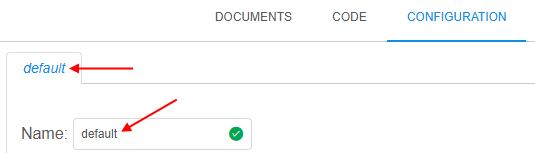 |
| **`default`** || Whether the config is default for the current pipeline | _Boolean_ | Default config is being opened and used for pipeline runs by default |
| **`description`** || Description the pipeline config | _String_ |  |
| **`configuration`** || Container for the current config settings |  |  |
|| **`main_file`** | Pipeline's main script file name | _String_<br>Example: `pipelineexample.sh` |  |
|| **`instance_size`** | Instance type in terms of the specific Cloud Provider | _String_<br>Example: `m5.large` |  |
|| **`instance_disk`** | Instance's disk size in Gb | _Float_<br>Example: `25` |  |
|| **`docker_image`** | Name of the Docker image that will be used for the pipeline run.<br>Name can be specified without Docker Registry path, in short format:<br>`<Tools_group>/<Tool_name>:<Version>` | _String_<br>Example: `library/centos:7` |  |
|| **`cmd_template`** | Command template that will be executed in the pipeline run after all initializations.<br><br>Template can use environment variables:<br />- to address the **main\_file**, use **`[main_file]`**<br>- to address other variables, use **`$<VARIABLE_NAME>`**, e.g. `$SCRIPTS_DIR` | _String_ | 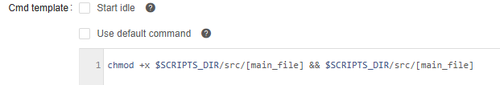 |
|| **`parameters`** | Container for the pipeline execution parameters.<br>See details [below](#parameters-section) |  |  |

### Parameters section

Parameters section - it is `parameters` container inside `configuration` container of the pipeline config in **`config.json`** file.  
This section defines execution parameters that will be used during a pipeline run.  
Via these parameters, path for input or output data, sample name or some custom flag, etc. can be specified that will be used during the pipeline execution.

Example of that section:

``` json
...
"parameters" : {
    "InputData" : {
        "value" : "s3://testexamplestorage/input",
        "type" : "input",
        "section" : "other",
        "required" : false,
        "no_override" : false
    },
    "FastqAvailabilityFlag" : {
        "pretty_name" : "FASTQ availability",
        "value" : "true",
        "type" : "boolean",
        "section" : "other",
        "required" : false
    }
}
...
```

Each parameter has a name and a set of attributes/settings that affect parameter view and behavior in GUI before the run and how parameter shall be resolved during the run.  
In **`config.json`** file, each parameter is described as container with the name corresponds to the parameter name, and all parameter attributes inside that container, i.e.:

``` json
"<PARAMETER_NAME>" : {
    "value" : "<PARAMETER_VALUE>",
    "type" : "<PARAMETER_TYPE>",
    ...
}
...
```

Possible parameter settings and attributes that could be specified via that configuration file:

| Attribute name | Description | Value | View in GUI (CONFIGURATION tab / Launch form) |
| --- | --- | --- | --- |
| **`value`** | Parameter value.<br><br>Attribute may be omitted, then the corresponding field in the GUI will be left empty for manual input | _String_ | For example, `"value" : "SR133451"` will be shown as:<br>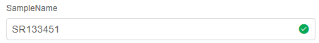<br><br>If `value` attribute was not specified in the **`config.json`**,<br>such parameter will be shown with empty field:<br>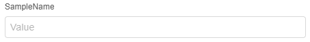 |
| **`type`** | Parameter type | _One of these_: | |
|| For parameters with generic scalar values | `string` | 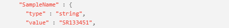<br><br>In the GUI:<br> |
|| For parameters with multiple predefined scalar values.<br>In GUI, such parameter field is displayed as dropdown list, where one value can be selected.<br><br>To specify all numeration values, additional attribute shall be used in format:<br>`"enum" : ["<ENUM_VALUE1>", "<ENUM_VALUE2>", ...]`, where `<ENUM_VALUE>` - enumeration value.<br><br>**_Note_**: for additional features of `enum` type see [below](#enum-type-features). | `enum` | 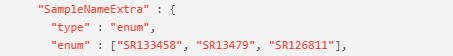<br><br>In the GUI:<br>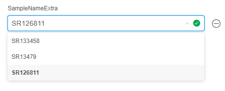 |
|| For parameters with boolean values | `boolean` | 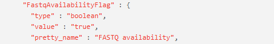<br><br>In the GUI:<br> |
|| For specifying a path in a data storage hierarchy | `path` | 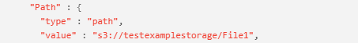<br><br>In the GUI:<br>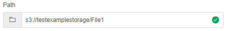 |
|| For specifying an input path in a data storage hierarchy.<br>During the pipeline initialization, this path will be used to download input data to the node for processing | `input` | 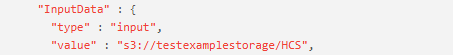<br><br>In the GUI:<br>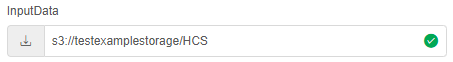 |
|| For specifying an output path in a data storage hierarchy.<br>During the pipeline finalization, this path will be used to upload resulting data to the storage | `output` | <br><br>In the GUI:<br>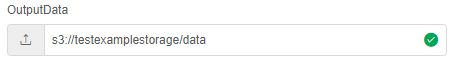 |
|| For specifying a common path in a data storage hierarchy.<br>Similar to `input` type, but this data will not be erased from a calculation node,<br>when a pipeline is finished. This is useful for data that can be reused by further pipeline runs | `common` | 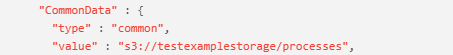<br><br>In the GUI:<br>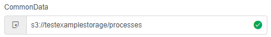 |
|| For loading parameter value from metadata entity.<br><br>**_Note_**: for additional details about value format of `metadata` type values see [below](#metadata-type-features). | `metadata` | <br><br>In the GUI:<br>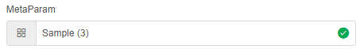 |
| **`description`** | Parameter description.<br>It is not processed anyhow, but just shown as parameter help | _String_ | 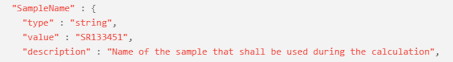<br><br>If parameter has a description, it is displayed under parameter field:<br>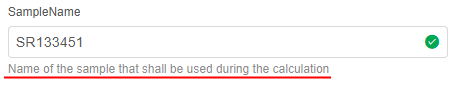 |
| **`required`** | Defines whether this parameter must be set or not.<br>If `true`, parameter value can't be left empty or removed, and must be specified before the launch.<br>If `false`, parameter value can be left empty or removed | _Boolean_ | 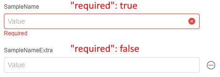 |
| **`visible`** | Defines whether this parameter is visible in the **CONFIGURATION** tab / **Launch** form or not.<br>If `true`, parameter will be visible as usual.<br>If `false`, parameter will not be visible in the **CONFIGURATION** tab / **Launch** form,<br> but parameter will be normally used during the run and visible on the [**Run logs**](../11_Manage_Runs/11._Manage_Runs.md#parameters) page.<br><br>Also, value of `visible` attribute can be an expression over some parameter value that results to `true` or `false`.<br>Expression format shall be:<br>- `<PARAMETER_NAME1> <OPERAND> <PARAMETER_NAME2>` or several such sequences linked by `<OPERAND>`<br>- or `<PARAMETER_NAME1> <OPERAND> <COMPARED_VALUE>` or several such sequences linked by `<OPERAND>`<br>Where:<br>- `<PARAMETER_NAME>` - parameter which value used for expression calculation<br>- `<COMPARED_VALUE>` - strings in quotas, numbers<br>- `<OPERAND>` - logical operands: `&&` (_AND_), <code>&#124;&#124;</code> (_OR_), `==` (_equals_), `!=` (_not equals_)<br>or condition operands: `>`, `<`, `>=`, `<=` | _String_ | Such parameter will not be visible in the **CONFIGURATION** tab / **Launch** form:<br>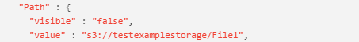<br><br>Such parameter will be visible only if other parameter (`SampleNameExtra`)<br>will have a specific value (`SR133458`):<br>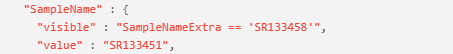 |
| **`no_override`** | Defines whether parameter's default value from config will be immutable<br>in the [detached configuration](../07_Manage_Detached_configuration/7._Manage_Detached_configuration.md) that uses this pipeline.<br>If `true` and parameter has a value - that value will be read-only.<br>If `false` and parameter has a value - that value will be rewritable.<br>If parameter has no default value, this option is ignored | _Boolean_ | In the detached configuration, that uses a pipeline:<br>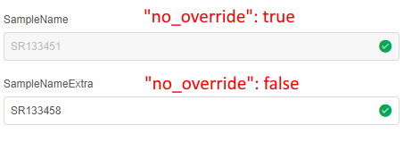 |
| **`pretty_name`** | Defines a pretty name (alias) for the parameter,<br>that will be shown near the parameter field in the **CONFIGURATION** tab / **Launch** form.<br><br>**_Note_**: during the pipeline script execution, original parameter name will be used | _String_ | 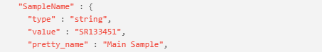<br><br>If attribute is set, pretty name is shown near the parameter:<br>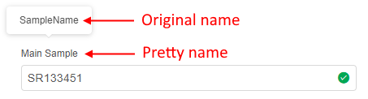<br>Original name can be viewed:<br>- in a tooltip on the **CONFIGURATION** tab / **Launch** form<br>- on the [**Run logs**](../11_Manage_Runs/11._Manage_Runs.md#parameters) page during the run:<br>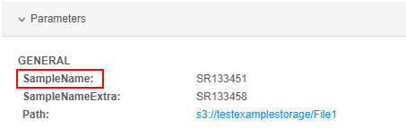 |
| **`section`** | Allows to group different parameters in sections in the **CONFIGURATION** tab / **Launch** form.<br>Parameters with the same `section` will be located in one area with the corresponding header.<br><br>**_Note_**: for parameters created via the GUI, this attribute is set as `"section" : "other"` | _String_ | For example:<br>- for first 2 parameters `"section" : "Samples"` is set<br>- for another 2 parameters `"section" : "Paths"` is set<br>- for others `"section" : "Other"` is set<br>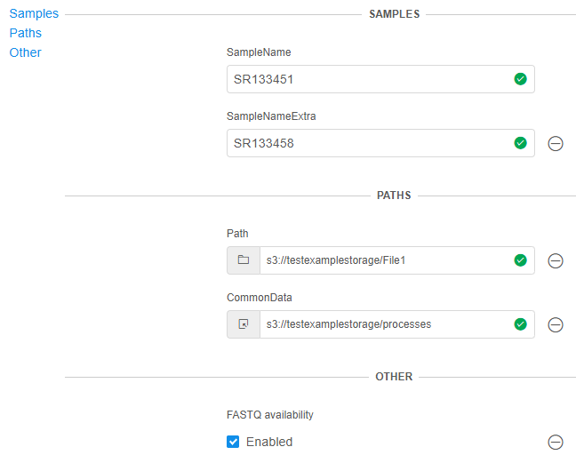<br><br>You can use corresponding controls (hyperlinks) in the left upper corner<br>of the parameters section to navigate/focus on the specific section. |
| **`validation`** | Allows to configure parameters validation according to values specified via the GUI.<br>Attribute presents an array of containers, each with structure `{"throw", "message"}`, where:<br>- `throw` - expression to test based on parameter(s) value(s)<br>- `message` - message that will be shown if `throw` expression is `true`<br><br>Format of `throw` expression shall be:<br>- `<PARAMETER_NAME1> <OPERAND> <PARAMETER_NAME2>` or several such sequences linked by `<OPERAND>`<br>- or `<PARAMETER_NAME1> <OPERAND> <COMPARED_VALUE>` or several such sequences linked by `<OPERAND>`<br>- or `/<REGEX>/.test(<PARAMETER_NAME>)`<br>Where:<br>- `<PARAMETER_NAME>` - parameter which value used for expression calculation<br>- `<REGEX>` - regular expression<br>- `<COMPARED_VALUE>` - strings in quotas, numbers<br>- `<OPERAND>` - logical operands: `&&` (_AND_), <code>&#124;&#124;</code> (_OR_), `==` (_equals_), `!=` (_not equals_)<br>or condition operands: `>`, `<`, `>=`, `<=` | _Array_ | Example:<br>If the value of the following parameter equals to the value of the other one,<br>message will be thrown:<br>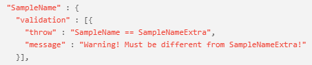<br>And in in the **CONFIGURATION** tab / **Launch** form:<br>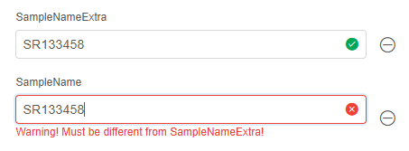 |

#### `Enum` type features

For enumeration values, visibility can be configured for each value separately.  
It is being configured via the attribute **`visible`** assigned to specific enumeration values.  
In such case, format of the enumeration shall be:

``` json
"enum" : [
    {
        "name" : "<ENUM_VALUE1>",
        "visible" : "<VISIBILITY_EXPRESSION1>"
    },
    {
        "name" : "<ENUM_VALUE2>",
        "visible" : "<VISIBILITY_EXPRESSION2>"
    },
    ...
]
```

Where:

- `<ENUM_VALUE>` - enumeration value
- `<VISIBILITY_EXPRESSION>` - expression that determines if the visibility of that enumeration value:
    - if equals `true`, enumeration value will be visible in the parameter's dropdown list (in the **CONFIGURATION** tab / **Launch** form)
    - if equals `false`, parameter will not be visible
    - also, value can be an expression over some parameter(s) value(s) that results to `true` or `false`.  
        In such case, expression format shall be:  
        - `<PARAMETER_NAME1> <OPERAND> <PARAMETER_NAME2>` or several such sequences linked by `<OPERAND>`
        - or `<PARAMETER_NAME1> <OPERAND> <COMPARED_VALUE>` or several such sequences linked by `<OPERAND>`  
        Where:  
        - `<PARAMETER_NAME>` - parameter which value used for expression calculation
        - `<COMPARED_VALUE>` - strings in quotas, numbers
        - `<OPERAND>` - logical operands: `&&` (_AND_), `||` (_OR_), `==` (_equals_), `!=` (_not equals_) or condition operands: `>`, `<`, `>=`, `<=`

Example of visibility usage for separate enumeration values:

``` json
...
parameters: {
    "p1": {
        "type" : "enum",
        "enum" : ["human", "mouse"],
        "required" : true
    },
    "p2": {
        "type" : "enum",
        "enum": [
            {
                "name" : "hg19",
                "visible" : "p1 == 'human'"
            },
            {
                "name" : "hg38",
                "visible" : "p1 == 'human'"
            }
            ...
        ],
    }
    ...
}
...
```

In the example above, values `hg19` and `hg38` will be visible for parameter `p2` only if parameter `p1` is set to `human`.

#### `Metadata` type features

If the parameter has `"type" : "metadata"`, then format of its value shall be: `<METADATA_OBJECT_ID>:<INSTANCE_TYPE_NAME>:<INSTANCE_ID1>,<INSTANCE_ID2>,...`  
Where:

- `<METADATA_OBJECT_ID>` - ID of the folder/project to which metadata belongs
- `<INSTANCE_TYPE_NAME>` - name of the metadata instance type
- `<INSTANCE_ID>` - ID of the metadata instance of the selected instance type

For example:  
    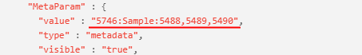
