# 6.6. Nextflow Pipeline Configuration and Management

---
- [Overview](#overview)
- [Prerequisites preparation](#prerequisites-preparation)
- [Platform configuration](#platform-configuration)
- [Pipeline creation](#pipeline-creation)
- [Launching pipeline](#launching-pipeline)


> - To perform platform configuration user shall have **ROLE\_ADMIN**.
> - To create and manage a new **Nextflow pipeline**, you need **WRITE** permission for the target folder and 
> the **ROLE\_PIPELINE\_MANAGER** role. For editing, only **WRITE** permission for the pipeline is required. 
> - To create a **Storage** in a **Folder** you need to have **WRITE** permission for that folder and the **ROLE\_STORAGE\_MANAGER** role.
> - For more details, see [13. Permissions](../13_Permissions/13._Permissions.md).


## Overview

---

This guide provides instructions for configuring, creating, and launching Nextflow pipelines within the Cloud Pipeline platform.
[Nextflow](https://www.nextflow.io/) is a powerful workflow management system widely used for scalable and reproducible scientific data analysis.

## Prerequisites preparation

---

Before configuring a Nextflow pipeline, prepare the following prerequisites in the platform:

### 1. **Nextflow tool image**

If the `library/nextflow` tool does not exist on the **Tools** page, you need to prepare a Nextflow Docker image in the Cloud Pipeline Docker registry.
This image will serve as the runtime environment for the Nextflow pipeline, meaning the pipeline will be launched inside a container instantiated from this image.

> **Note:** That custom Docker image includes the additional component `nf-weblog-handler`. This handler enables the use of Nextflow's `-with-weblog` feature to redirect events to Cloud Pipeline `run/{runId}/engine/tasks` API.

It is possible to prepare the Docker image locally and push it to the CP Docker registry, or build the image directly within the platform:

#### Steps to build and register the Nextflow tool image:
1. Launch a base existing Docker image in the environment:
   1. Go to the **Tools** page.
   2. Select a base image, e.g. `library/rockylinux`.
   3. Use the `DnD` option from the **Run Capabilities** dropdown menu (click **Run** → **Custom settings**):
      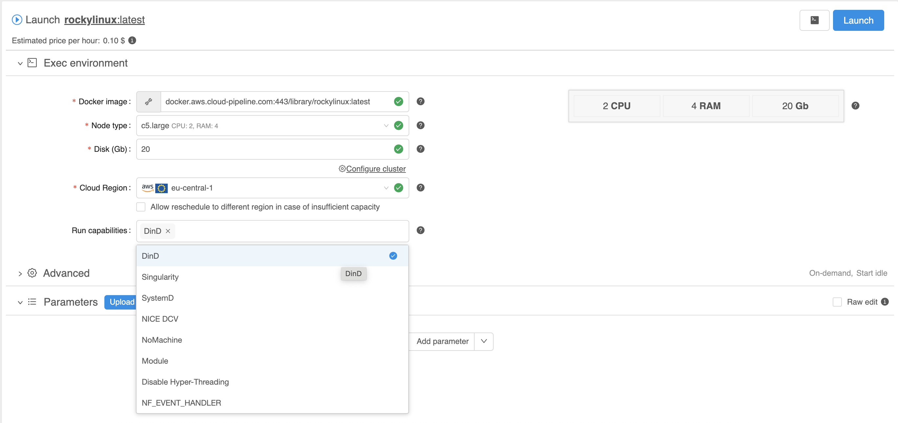
2. SSH into the launched run. Use the **SSH** control in the upper-right corner of the run logs page.
3. Build and push the Docker image. After connecting via SSH, run the following commands:
      ```bash
      cd /tmp
      git clone https://github.com/epam/cloud-pipeline.git
      cd /tmp/cloud-pipeline/deploy/docker/cp-tools/base/nextflow
      # <registry_url> is displayed after a successful SSH login in console
      docker build . -t "<registry_url>/library/nextflow:$(date "+%Y-%m-%d")" \
                     -t "<registry_url>/library/nextflow:latest"
      docker push "<registry_url>/library/nextflow:$(date "+%Y-%m-%d")"
      docker push "<registry_url>/library/nextflow:latest"
      ```
4. Configure the created tool for usage:
   1. Navigate to the **Tools** page.
   2. In the search panel, type `nextflow` and click the found tool.
   3. Open the **Settings** tab to define the following default tool settings:
      - **Instance type:** `m5.large`
      - **Price type:** `On-demand`
      - **Disk:** `50`
      - **Cmd template:** `sleep infinity`
   4. Click the `Save` button.

### 2. **System EFS and S3 bucket**
For synchronization of Nextflow runtime data, **S3 storage** should be prepared. Additionally, **NFS file system** is required to store working and cached runtime data.  
The NFS can be a single shared instance accessible by all users, or it can be configured per user, for example using the `${OWNER}` environment variable (e.g. `/home/${OWNER}`).

#### 1. Create a `Common` folder 
To create `Common` folder in the `Library` space to group all system storages in one place:
   1. Click **+ Create → Folder**.
   2. Define `Common` folder name.
   3. Click the **OK** button.

#### 2. Create a common single `FS mount`

1. Navigate to the newly created `Common` folder and click **+ Create → Storages → Create new FS mount**. 
2. Specify the following parameters:
   1. **Storage path:** `/nextflow`
   2. **Alias:** `nextflow`
   3. **Description:** `System FS storage for Nextflow pipelines`
   4. **Mount-point:** `/data/nextflow`
3. Click the **Create** button.

For more details, see [8.7._Create_shared_file_system](../08_Manage_Data_Storage/8.7._Create_shared_file_system.md).

> **Note:** After the storage has been created, select it. The storage ID can be found at the end of the browser URL (for example: `https://<cloud_pipeline_domain>/pipeline/#/storage/<storage_id>`).
> This ID can be used below in the system settings.

#### 3. Grant `ROLE_USER` permissions to the common `FS mount`
1. Open the created storage. 
2. Click the **Gear** button in upper right corner.
3. Click **Edit → Permissions**.
4. Click on  button, 
5. In the **Select group** pop-up, enter `ROLE_USER`.
6. Confirm by clicking the **Ok** button.
7. Click on the user role.
8. Set the **Allow** checkbox for all permissions (**Read**, **Write**, **Execute**).
9. Click the **APPLY** button.
10. Close the pop-up window.

##### 3. Create `S3` sync runtime data storage
1. In the `Common` folder, click **+ Create → Storage → Create new object storage**.
2. Fill in the **Info** form:
   1. **Storage path:** `nextflow-sync-data`
   2. **Description:** `Sync runtime data storage for Nextflow pipelines`
3. Click the **Create** button.

For more details, see [8.1._Create_and_edit_storage](../08_Manage_Data_Storage/8.1._Create_and_edit_storage.md).

> **Note:** After the storages have been created, select it. The storage ID can be found at the end of the browser URL (for example: `https://<cloud_pipeline_domain>/pipeline/#/storage/<storage_id>`).
> This ID can be used below in the system settings.

## Platform configuration

---

Nextflow pipelines can be displayed in a dedicated Nextflow-mode view, which separates them from other pipeline types.
This mode is not enabled by default for all runs. It is automatically activated only when:
1. Launching Nextflow runs using a Nextflow Docker image that includes the additional component `nf-weblog-handler`,
deployed on the platform.
2. The specific Nextflow capability is configured (as demonstrated in the Pipeline Creation documentation section below).

To enable and configure Nextflow pipelines in Nextflow mode on the platform:

#### 1. Create `nextflow` capability
1. Open [**System Preferences**](../12_Manage_Settings/12.10._Manage_system-level_settings.md).
2. Find the `launch.capabilities` system preference, that allows to create custom run capabilities.
3. Add a new capability in this system preference. Make it visible by clicking the **Eye** icon in the upper-left corner of the setting:
     ``` json
     {
       "nextflow": {
         "description": "Enables Nextflow WebLog event handler.",
         "commands": [
            "[ -f /opt/nf-weblog-handler/nf-weblog-handler.sh ] && /opt/nf-weblog-handler/nf-weblog-handler.sh --start --enable-runtime-data -p $CP_NF_WEBLOG_HANDLER_PORT || exit 1"
         ],
         "params": {
           "CP_SYNC_TO_STORAGE_BATCH_MODE": "1",
           "CP_RUN_ENGINE_TYPE": "NEXTFLOW",
           "CP_NF_WEBLOG_HANDLER_ENABLED": "1",
           "CP_NF_WEBLOG_HANDLER_PORT": "8080",
           "CP_NF_RUNTIME_DATA_SYNC_PERIOD": "30",
           "CP_NF_WEBLOG_HANDLER_LOG_FILE": "/var/log/nf_weblog_handler.log",
           "CP_NF_WORKDIR": "/data/nextflow/.nextflow/work",
           "CP_NF_CACHEDIR": "/data/nextflow/.nextflow/cache",
           "CP_NF_TRACE_FILE_DIR": "${ANALYSIS_DIR}",
           "CP_NF_TASK_LOOKUP_FILE": "nf_task_lookup.txt",
           "CP_NF_EXTRA_OPTION_cache": "process.cache = 'lenient'"
         }
       }
     }
   ```
4. Click the **Save** button.
   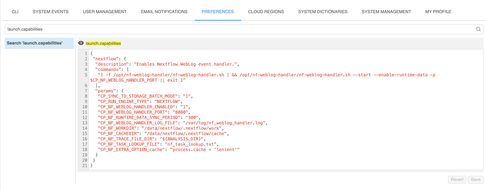

#### 2. Configure data runtime synchronization system preference
1. Find the `launch.run.sync.runtime.data` system preference that allows to configure data runtime synchronization for the run.
2. Add a new value to this system preference, specifying paths where to store the Nextflow trace (`NF_TRACE`) and task logs (`NF_TASK`). Make it visible by clicking the **Eye** icon in the upper-left corner of the setting:
     ``` json
     {
       "syncTimeout": 60,
       "data": {
         "NF_TRACE": {
           "runFolderPathPrefix": "s3://nextflow-sync-data/runs"
         },
         "NF_TASK": {
           "runFolderPathPrefix": "s3://nextflow-sync-data/runs",
           "dataPathPrefix": "workdir"
         }
       }
     }
    ```
3. Click the **Save** button.
   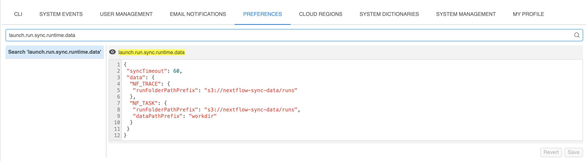

#### 3. (Optional) Hide system storages from users
1. Find the `ui.hidden.objects` system preference that allows to hide the objects from users.
2. Add the data storage IDs created above to the `"data_storage"` block in this system preference json. Example:
   ```json
   {
      "data_storage": [
         <s3_storage_id>,
         <efs_id>
      ]
   }
   ```   
3. Click the **Save** button.
   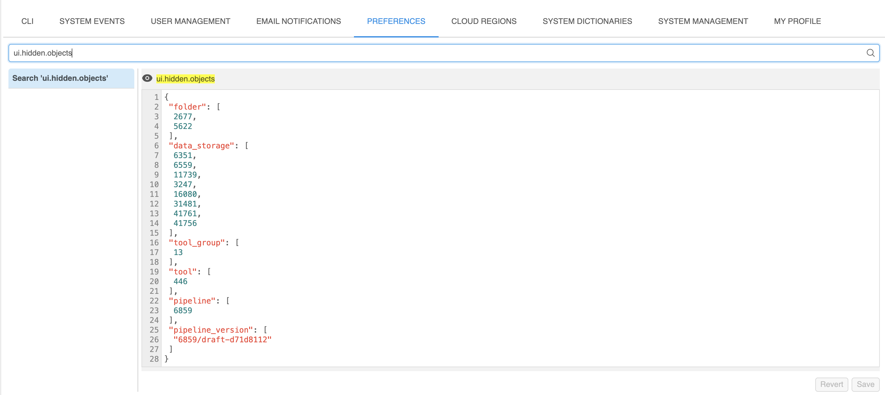

## Pipeline creation

---
Create a test Nextflow pipeline and configure it in the Nextflow-mode view:

1. Navigate to the **Library** tab.
2. Create a new pipeline:
   1. Click **+ Create → Pipeline**.
   2. Select the **NEXTFLOW** template from the list of built-in templates.
   3. Enter a pipeline name (e.g. `nf-test`) and optionally a description.
   4. Click the **Create** button.
3. Edit pipeline files:
   1. Click the newly created pipeline in the **Library** tree.
   2. Click on the draft pipeline version.
   3. Go to the **CODE** tab.
   4. Edit the main Nextflow script (e.g. `nftest.nf`) and add any additional files (e.g., `nextflow.config`, custom modules, etc).
      1. Example of the `nftest.nf` with one define parameter `dna_list`:
      ```bash
      params.label = 'Sample'

      workflow {
          if (!params.dna_list) {
              error "Please provide a comma-separated list of DNA sequences with --dna_list"
          }

          input_ch = Channel
              .from(params.dna_list.split(',').collect { it.trim() })

          results_ch = input_ch | calc_gc_content

          results_ch.map { dna_seq, gc_file -> tuple(dna_seq, gc_file, params.label) } | make_report
      }

      process calc_gc_content {
          input:
          val(dna_seq)

          output:
          tuple val(dna_seq), path('gc_content.txt')

          publishDir "results"

          script:
          """
          gc_count=\$(echo "$dna_seq" | grep -o '[GCgc]' | wc -l)
          total_count=\$(echo "$dna_seq" | wc -c)
          gc_content=\$(awk "BEGIN {printf \\"%.2f\\", 100 * \$gc_count / \$total_count}")
          echo "GC content: \$gc_content%" > gc_content.txt
          """
      }

      process make_report {
          input:
          tuple val(dna_seq), path(gc_content_file), val(label)

          output:
          path("report_${dna_seq}.html")

          publishDir "results"

          script:
          """
          gc_content=\$(cat $gc_content_file)
          echo "<html>
          <head><title>DNA Sequence Report</title></head>
          <body>
              <h1>DNA Sequence Analysis Report</h1>
              <p><strong>Label:</strong> $label</p>
              <p><strong>Input Sequence:</strong> $dna_seq</p>
              <p><strong>\$gc_content</strong></p>
          </body>
          </html>" > report_${dna_seq}.html
          sleep 30
          """
      }
      ```
   5. Use the **EDIT** button to modify the file, then select **SAVE -> Commit** to apply the changes.

4. Configure pipeline parameters:
   1. Click to the main pipeline config file `config.json`, located in the same directory as the main `nftest.nf` file.
   2. Use the **EDIT** button to modify the file and add the following parameters to the `configuration` json section:
      ```json
      "configuration" : {
          ...
          "main_file" : "testnf.nf",
          "docker_image" : "library/nextflow:latest",
          "cmd_template" : "nextflow run $SCRIPTS_DIR/src/[main_file]",
          ...
          "parameters" : {
            "CP_NXF_UUID" : {
              "visible" : "false",
              "value" : "$[UUID]",
              "type" : "string",
              "required" : false,
              "no_override" : false
            },
            "dna_list" : {
              "value" : "ATGCGCGTAACG,GGGTTTCCCAAAGG,TATATATATATA",
              "type" : "string",
              "required" : false,
              "no_override" : false
            },
            "CP_SUPPORT_CONTINUE" : {
              "visible" : "false",
              "value" : "true",
              "type" : "boolean",
              "required" : false,
              "no_override" : false
            },
            "CP_NF_AUTOGENERATE_PARAMETERS" : {
              "visible" : "false",
              "value" : "true",
              "type" : "boolean",
              "required" : false,
              "no_override" : false
            },
            "CP_CAP_AUTOSCALE" : {
              "value" : "true",
              "type" : "string",
              "required" : false
            },
            "CP_CAP_AUTOSCALE_WORKERS" : {
              "value" : "10",
              "type" : "int",
              "required" : false
            },
            "CP_CAP_AUTOSCALE_HYBRID" : {
              "value" : "true",
              "type" : "boolean",
              "required" : false
            },
            "CP_CAP_SGE" : {
              "value" : "true",
              "type" : "boolean",
              "required" : false
            },
            "CP_CAP_SHARE_FS_TYPE" : {
              "value" : "lfs",
              "type" : "string",
              "required" : false
            },
            "CP_CAP_CUSTOM_nextflow" : {
              "value" : "true",
              "type" : "boolean",
              "required" : false
            },
            "SCRIPTS_DIR" : {
              "visible" : "false",
              "value" : "/common/scripts",
              "type" : "string",
              "required" : false,
              "no_override" : false
            },
            "output_storage" : {
              "value" : "s3://nextflow-sync-data/test-outputs/${RUN_ID}",
              "type" : "output",
              "required" : false,
              "no_override" : false
            }
          },
        }
      ```
      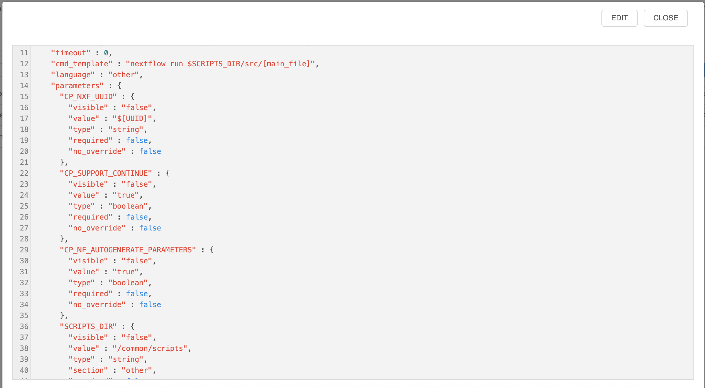
   
   3. Use the **EDIT** button to modify the file, then select **SAVE -> Commit** to apply the changes.
      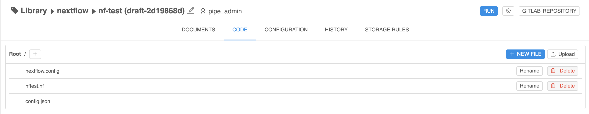
   
   ##### The updated configuration:
   - Adds two parameters to the **Parameters** section:
     - `dna_list` – used as a pipeline parameter for the processes.
     - `output_storage` – specifies the storage location where data will be saved after pipeline processing is complete.
     > **Note:** The non-visible `CP_NF_AUTOGENERATE_PARAMETERS` system parameter ensures that all defined non-system parameters are added to `cp_params.json`. This file is then passed to the Nextflow command using the `-params-file` option, making the parameters available within the Nextflow workflow.
   - Configures the `nextflow` capability to enable Nextflow mode.
   - Enables the **SGE cluster** that allows Nextflow to submit processes as jobs to the cluster.
     > **Note:** The Nextflow SGE executor is automatically enabled if the `CP_CAP_SGE` parameter is set in the `library/nextflow` Docker image.
   - Enables SGE-based **autoscaled hybrid cluster**, that allows to launch instances with a dynamic size using the SGE queue.
     For more details, see [Appendix C. Working with autoscaled cluster runs](../Appendix_C/Appendix_C._Working_with_autoscaled_cluster_runs.md).
   - Enables the pipeline resume feature via the `CP_SUPPORT_CONTINUE` system parameter that is non-visible in the configuration tab.
6. Configure pipeline storage rule.
   Configuring storage rules for the pipeline allows output data to be displayed in the **Reports** tab.
   To add a Pipeline Results storage rule:
   1. Go to the **STORAGE RULES** tab and click **Add new rule**.
   2. Provide the following details and enable the **Pipeline results** option by ticking the checkbox:
      - **Name:** `reports`
      - **File mask:** `results/report_*`

   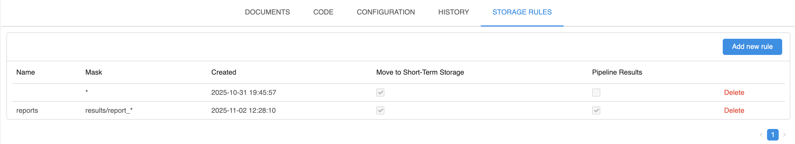

7. Configure additional pipeline parameters and configuration.
   
   1. Some processes may have different computing resource requirements and might fail when using the default settings.
      Cloud Pipeline supports all standard Nextflow configuration methods.
      Below are the basic approaches for customizing resource requirements using the `nextflow.config` file in the project directory, as well as additional custom configuration settings provided by CP.
      - You can customize resource requirements either globally for all processes or individually per process. This can be done in several ways:
        - Create a `nextflow.config` in the same directory as the main `nftest.nf` file to adjust the requested task resources:
          - Globally for all processes:
            ```json
            process {
              cpus = 2
              memory = '2 GB'
            }
            ```
          - Per process using the `withName` selector:
            ```json
            process {
              withName: sleep {
                  cpus = 2
                  memory = '2 GB'
              }
            }
            ```
        - Specify additional `CP_NF_EXTRA_OPTION_*` parameters in the `config.json` file to add extra options to the default Nextflow home config (`$NXF_HOME/config`). For example:
          ```json
          "CP_NF_EXTRA_OPTION_1": {
            "value": "process.cpus = 3",
            "type": "string"
          }
          ```
   2. In some cases, it is more efficient to manage SGE queues independently.
      For example, separating GPU and CPU jobs into different queues can prevent CPU jobs from occupying all slots on GPU-enabled workers. 
      - To define separate CPU or GPU queues, add the following parameters to the `config.json` file to specify queue names and instance types for the additional workers:
      ```json
      "CP_CAP_AUTOSCALE_1" : {
        "value" : "true",
        "type" : "string",
        "required" : false
      },
      "CP_CAP_SGE_QUEUE_NAME_1" : {
        "value" : "cpu.q",
        "type" : "string",
        "required" : false
      },
      "CP_CAP_AUTOSCALE_2" : {
        "value" : "true",
        "type" : "string",
        "required" : false
      },
      "CP_CAP_SGE_QUEUE_NAME_2" : {
        "value" : "gpu.q",
        "type" : "string",
        "required" : false
      },
      "CP_CAP_AUTOSCALE_INSTANCE_TYPE_2" : {
        "value" : "g5.2xlarge",
        "type" : "string",
        "required" : false
      },
      "CP_CAP_AUTOSCALE_INSTANCE_TYPE_1" : {
        "value" : "m5.2xlarge",
        "type" : "string",
        "required" : false
      }
      ```
      - In this case, update the queue names (`cpu.q/gpu.q`) for Nextflow configuration accordingly. For example:
      ```json
      process {
        withName: sleep {
            cpus = 2
            ...
            queue = 'cpu.q' # or 'gpu.q'
        }
      }         
      ```

## Launching pipeline

---

Once your Nextflow pipeline is configured, you can launch pipeline as follows:

1. Launch a run:
    - Click **Run** on the pipeline page.
    - Specify the input and output parameters.
    - Click **Launch** to start the run.
      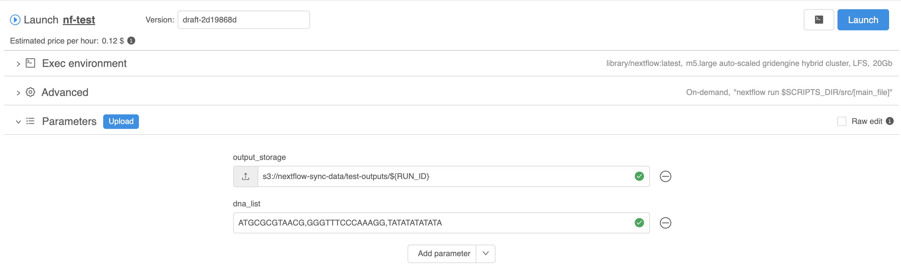
2. Monitor execution:
   - Click on the launched run in the **Runs** page.
   - View logs and real-time progress in the **Logs** tab.
     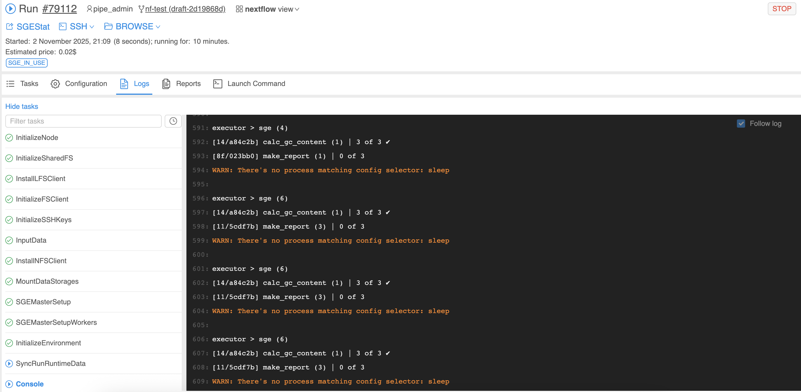
   - Track the process statuses in the **Tasks** tab.
     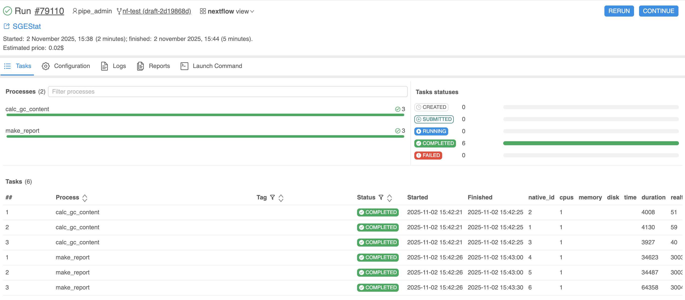
     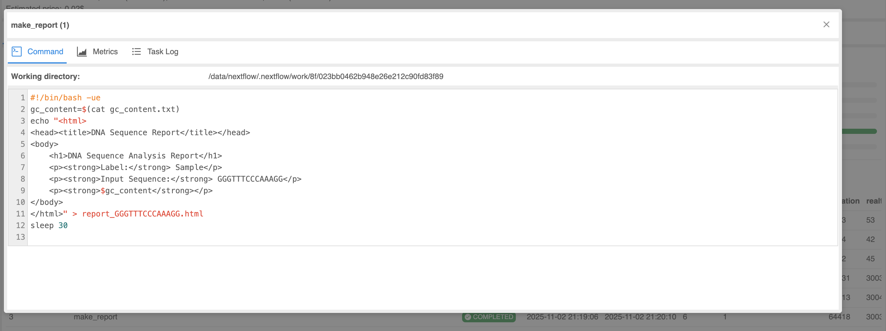
3. Validate results:
    - After completion, review output files in the specified storage location.
      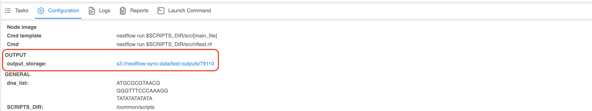
      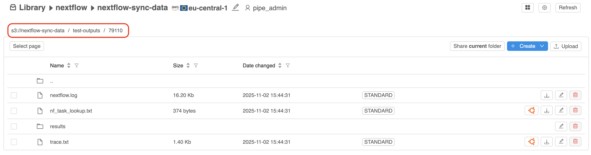
    - Check logs for errors or warnings.
    - Use the **Reports** tab to access summary reports or output artifacts.
      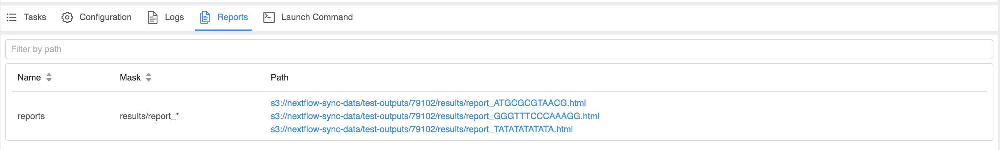
4. Manage run:

   Once the pipeline run is complete, you can:
    - Use the **CONTINUE** button to **resume** the run from the point of failure (using Nextflow resumability feature).
    - Use the **RERUN** button to **rerun** the pipeline with modified parameters or configurations.
   
   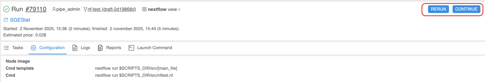

---