# 6.6. Pre-packaged pipelines

- [NextFlow pipelines](#nextflow-pipelines)
    - [Rnaseq](#rnaseq)
    - [Scrnaseq](#scrnaseq)
    - [Sarek](#sarek)
    - [Methylseq](#methylseq)
    - [Proteinfold](#proteinfold)
    - [Active Learning Pipeline](#active-learning-pipeline)

This page contains some examples of the pre-packaged pipelines that could be deployed simultaneously with the Cloud Pipeline platform.

General user journey for the usage of any prepared pipeline is the following:

1. Upload the data, that the pipeline will work with, to the input data storage.
2. Prepare a place for the output data in some storage - where results will be loaded once pipeline is completed.
3. Open the **Library** and find the pipeline.
4. Select a pipeline version that should be launched if there are several ones.
5. At the **Launch form**:
    - select a pipeline configuration if needed or leave the default
    - specify values of the pipeline parameters - here, paths to the input data and output results shall be specified, and other parameters if necessary
6. Launch a pipeline run.
7. If necessary, monitor the pipeline execution from the **Run logs** page of the launched pipeline.
8. Once the pipeline run is completed, navigate to the output path - to review pipeline results.

> For more details:
> 
> - a simple example of the preparation and pipeline launch - [Quick start](../01_Quick_start/1._Quick_start.md)
> - how to launch a pipeline - [Pipeline launch](6.2._Launch_a_pipeline.md)
> - additionally, about the pipeline launch and results review - [Appendix E. Pipeline objects concept](../Appendix_E/Appendix_E._Pipeline_objects_concept.md#testing-an-existing-pipeline-object)

## NextFlow pipelines

[Nextflow](https://www.nextflow.io/index.html) pipelines are workflows constructed from individual, parallel processes that perform computational tasks.  
Processes communicate via channels, which act as queues, enabling a reactive dataflow model.  
This allows for efficient parallelization and scaling, making Nextflow a powerful tool for data-intensive workflows.

> All NextFlow pipelines runs in the Cloud Pipeline platform support special NextFlow visualization - for details see [here](../11_Manage_Runs/11.6._Nextflow_runs_visualization.md).  
> Additionally, via the [GUI plugins](../11_Manage_Runs/11.7._Plugins_framework.md) custom NextFlow view for the **Launch form** can be configured.

### Rnaseq

[**Rnaseq**](https://nf-co.re/rnaseq/) is a bioinformatics pipeline that can be used to analyse RNA sequencing data obtained from organisms with a reference genome and annotation.  
It takes a samplesheet and FASTQ files as input, performs quality control (QC), trimming and (pseudo-)alignment, and produces a gene expression matrix and extensive QC report.

Features that need to be taken into account when preparing and running **Rnaseq** via the Cloud Pipeline platform:

Current deployed version - **`3.18.0`**:  
    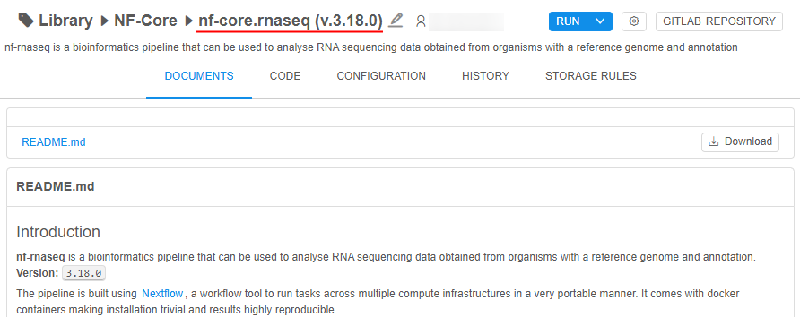

Pipeline parameters:  
    

- **`samplesheet_path`** - input path to the sheet (`CSV`) containing metadata about samples to process
- **`custom_config_path`** - path to the custom Nextflow config for the pipeline including paths to the reference genome `fasta` and reference annotation
- **`output_storage`** - output path where the results will be saved

Example and format of the `samplesheet` file - each row represents a fastq file (single-end) or a pair of fastq files (paired end) for a sample with the strandedness value:

```csv
sample,fastq_1,fastq_2,strandedness
SAMPLE1,<PATH_TO_SAMPLE1_1_FASTQ>,<PATH_TO_SAMPLE1_2_FASTQ>,auto
SAMPLE2,<PATH_TO_SAMPLE2_1_FASTQ>,<PATH_TO_SAMPLE2_2_FASTQ>,auto
SAMPLE3,<PATH_TO_SAMPLE3_1_FASTQ>,<PATH_TO_SAMPLE3_2_FASTQ>,reverse
...
```

Example and format of the `custom_config` file, more details about pipeline steps - you can find in the main **`README.md`** in pipeline documents.

Output results example:  
    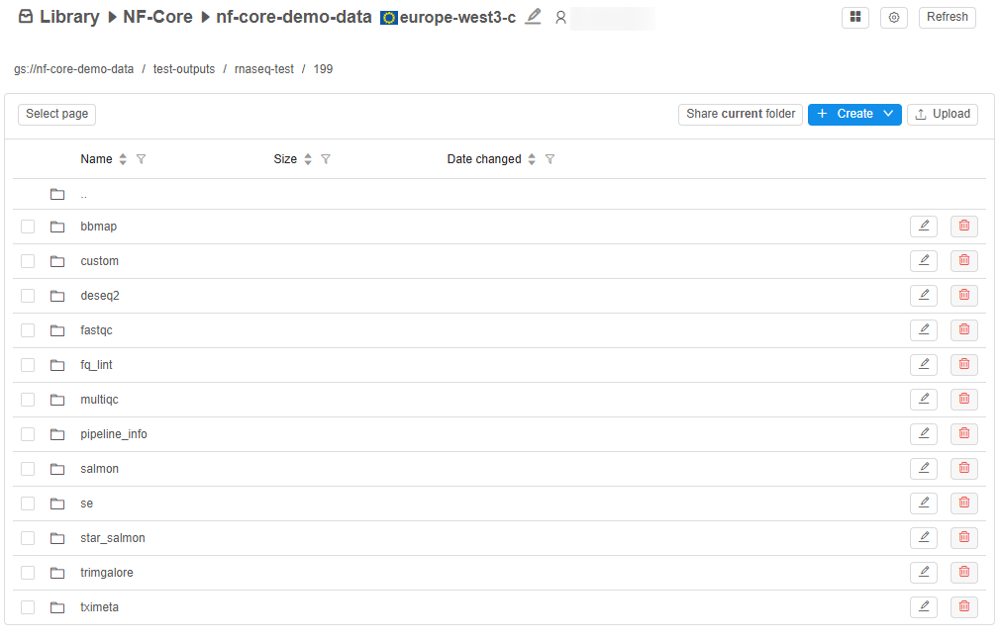

### Scrnaseq

[**Scrnaseq**](https://nf-co.re/scrnaseq/) is a bioinformatics analysis pipeline for processing 10x Genomics single-cell RNA-seq data, offering support for various alignment tools and downstream analyses.  
Pipeline supports:

- `SimpleAF` (`Alevin-Fry`) + `AlevinQC`
- `STARSolo`
- `Kallisto` + `BUStools`
- `Cellranger`
- `Universc`

Features that need to be taken into account when preparing and running **Scrnaseq** via the Cloud Pipeline platform:

Current deployed version - **`3.0.0`**:  
    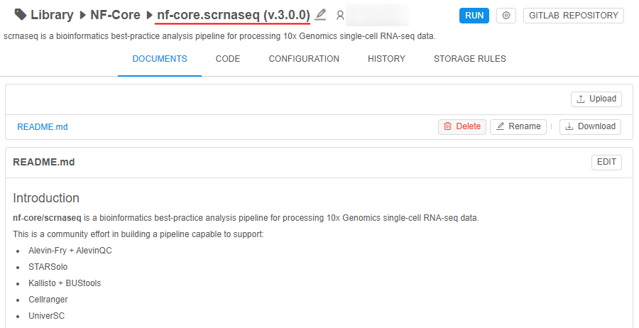

Pipeline parameters:  
    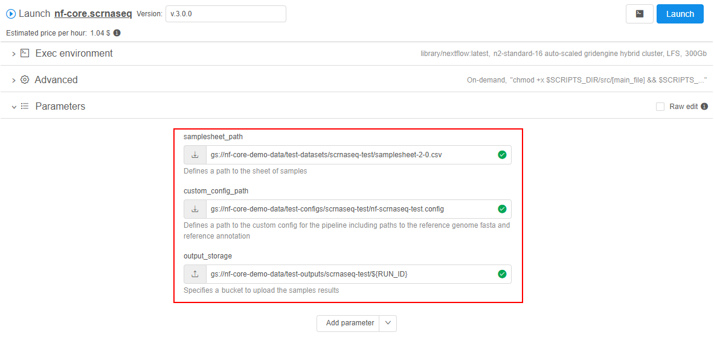

- **`samplesheet_path`** - input path to the sheet (`CSV`) containing metadata about samples to process
- **`custom_config_path`** - path to the custom Nextflow config for the pipeline including paths to the reference genome `fasta` and reference annotation
- **`output_storage`** - output path where the results will be saved

Example and format of the `samplesheet` file - each row represents a fastq file (single-end) or a pair of fastq files (paired end) for a sample with number of expected cells:

```csv
sample,fastq_1,fastq_2,expected_cells
SAMPLE1,<PATH_TO_SAMPLE1_1_FASTQ>,<PATH_TO_SAMPLE1_2_FASTQ>,10000
SAMPLE2,<PATH_TO_SAMPLE2_1_FASTQ>,<PATH_TO_SAMPLE2_2_FASTQ>,10000
SAMPLE3,<PATH_TO_SAMPLE3_1_FASTQ>,<PATH_TO_SAMPLE3_2_FASTQ>,20000
...
```

Example and format of the `custom_config` file, more details about pipeline steps - you can find in the main **`README.md`** in pipeline documents.

Output results example:  
    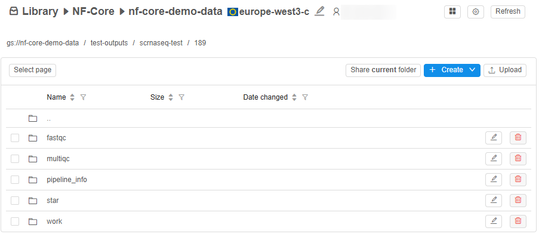

### Sarek

[**Sarek**](https://nf-co.re/sarek/) is a workflow designed to detect variants on whole genome or targeted sequencing data.  
Initially designed for Human, and Mouse, it can work on any species with a reference genome. Sarek can also handle tumour / normal pairs and could include additional relapses.

Features that need to be taken into account when preparing and running **Sarek** via the Cloud Pipeline platform:

Current deployed version - **`3.5.1`**:  
    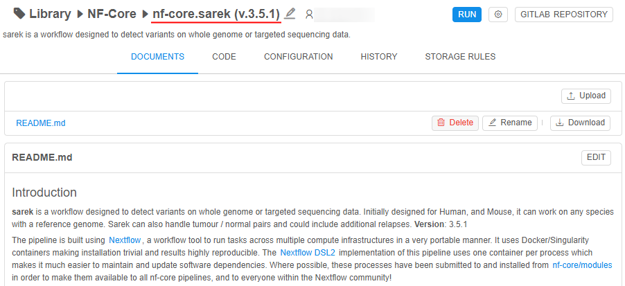

Pipeline parameters:  
    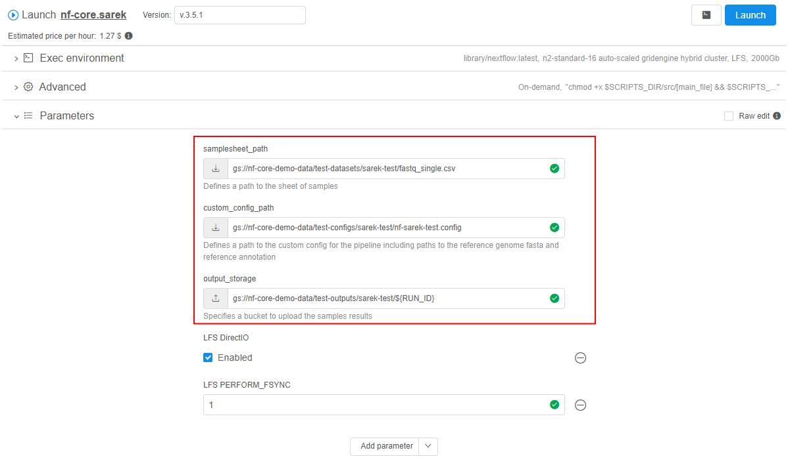

- **`samplesheet_path`** - input path to the sheet (`CSV`) containing metadata about samples to process
- **`custom_config_path`** - path to the custom Nextflow config for the pipeline including paths to the reference genome `fasta` and reference annotation
- **`output_storage`** - output path where the results will be saved  
    **_Note_**: there are several `LFS` parameters - these are Cloud Pipeline platform settings, they are required for the correct pipeline execution and should not be changed by the user

Example and format of the `samplesheet` file - each row represents a pair of fastq files (paired end) for a sample with patient ID and lane ID:

```csv
patient,sample,lane,fastq_1,fastq_2
ID1,SAMPLE1,LANE1,<PATH_TO_ID1_SAMPLE1_LANE1_1_FASTQ>,<PATH_TO_ID1_SAMPLE1_LANE1_2_FASTQ>
ID1,SAMPLE1,LANE2,<PATH_TO_ID1_SAMPLE1_LANE2_1_FASTQ>,<PATH_TO_ID1_SAMPLE1_LANE2_2_FASTQ>
...
```

Example and format of the `custom_config` file, more details about pipeline steps - you can find in the main **`README.md`** in pipeline documents.

Output results example:  
    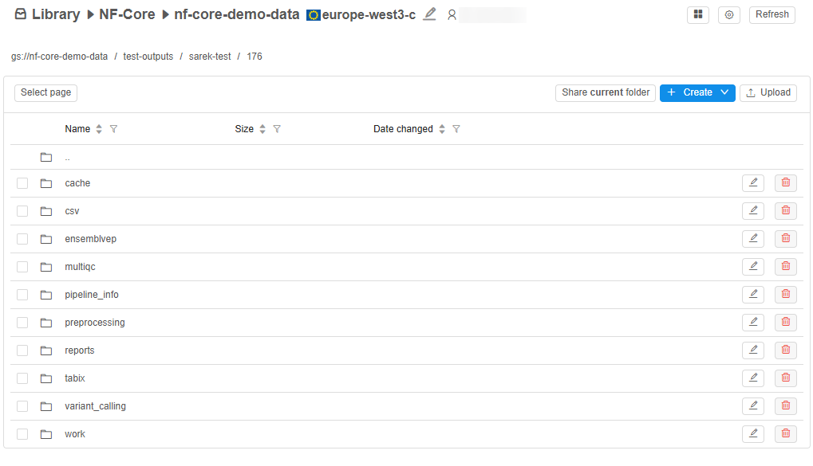

### Methylseq

[**Methylseq**](https://nf-co.re/methylseq/) is a bioinformatics analysis pipeline used for Methylation (Bisulfite) sequencing data.  
It pre-processes raw data from `FastQ` inputs, aligns the reads and performs extensive quality-control on the results.

Features that need to be taken into account when preparing and running **Methylseq** via the Cloud Pipeline platform:

Current deployed version - **`3.0.0`**:  
    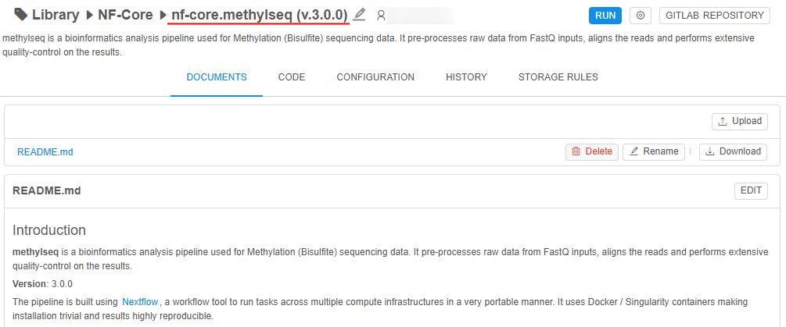

Pipeline parameters:  
    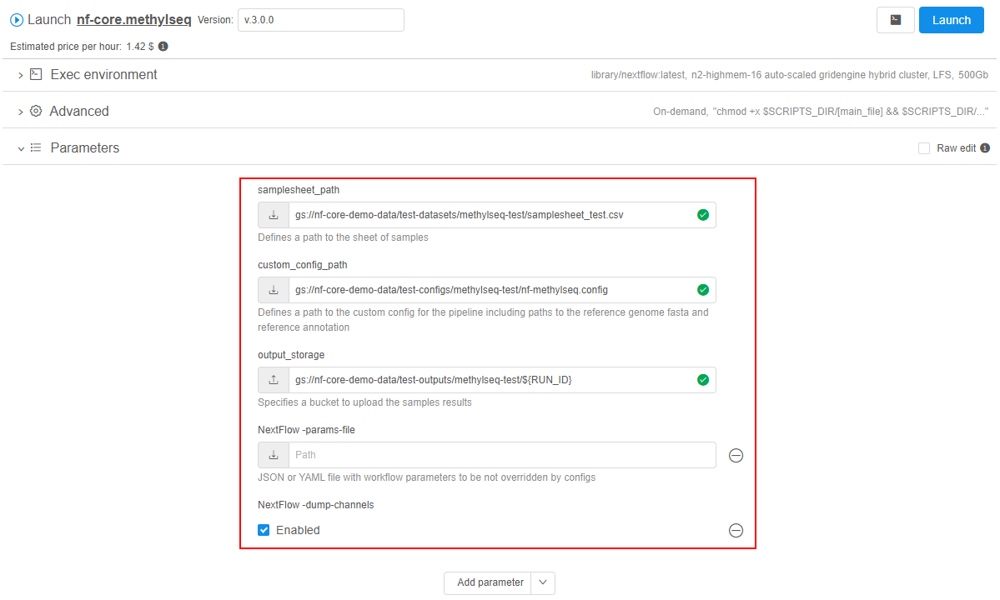

- **`samplesheet_path`** - input path to the sheet (`CSV`) containing metadata about samples to process
- **`custom_config_path`** - path to the custom Nextflow config for the pipeline including paths to the reference genome `fasta` and reference annotation
- **`output_storage`** - output path where the results will be saved
- **`NextFlow -params-file`** - path to the pipeline `JSON`/`YAML` file with workflow parameters to be not overridden by configs
- **`NextFlow -dump-channels`** - allows to dump channels output for debugging purpose

Example and format of the `samplesheet` file - each row represents a fastq file (single-end) or a pair of fastq files (paired end) for a sample with the genome name:

```csv
sample,fastq_1,fastq_2,genome
SAMPLE1,<PATH_TO_SAMPLE1_1_FASTQ>,<PATH_TO_SAMPLE1_2_FASTQ>,GENOME1
SAMPLE2,<PATH_TO_SAMPLE2_1_FASTQ>,<PATH_TO_SAMPLE2_2_FASTQ>,GENOME1
SAMPLE3,<PATH_TO_SAMPLE3_1_FASTQ>,<PATH_TO_SAMPLE3_2_FASTQ>,GENOME2
...
```

Example and format of the `custom_config` file, more details about pipeline steps - you can find in the main **`README.md`** in pipeline documents.

Output results example:  
    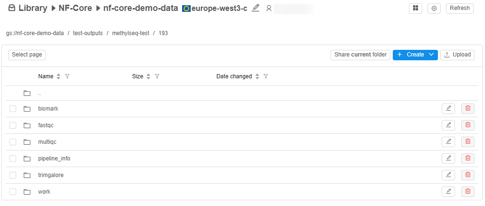

### Proteinfold

[**Proteinfold**](https://nf-co.re/proteinfold/) is a bioinformatics analysis pipeline for Protein 3D structure prediction.  
It leverages deep learning models like `AlphaFold2`, `RoseTTAFold` and `ESMFold` to predict protein structures from amino acid sequences.

Features that need to be taken into account when preparing and running **Proteinfold** via the Cloud Pipeline platform:

Current deployed version - **`1.1.1`**:  
    

Currently, two configurations are supported for the launch:  
    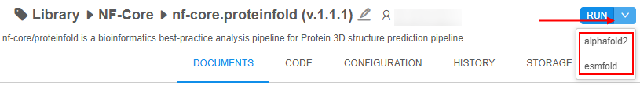

- **alphafold2** - uses `AlphaFold2` model for the pipeline processing
- **esmfold** - uses `ESMFold` model for the pipeline processing

Pipeline parameters:  
    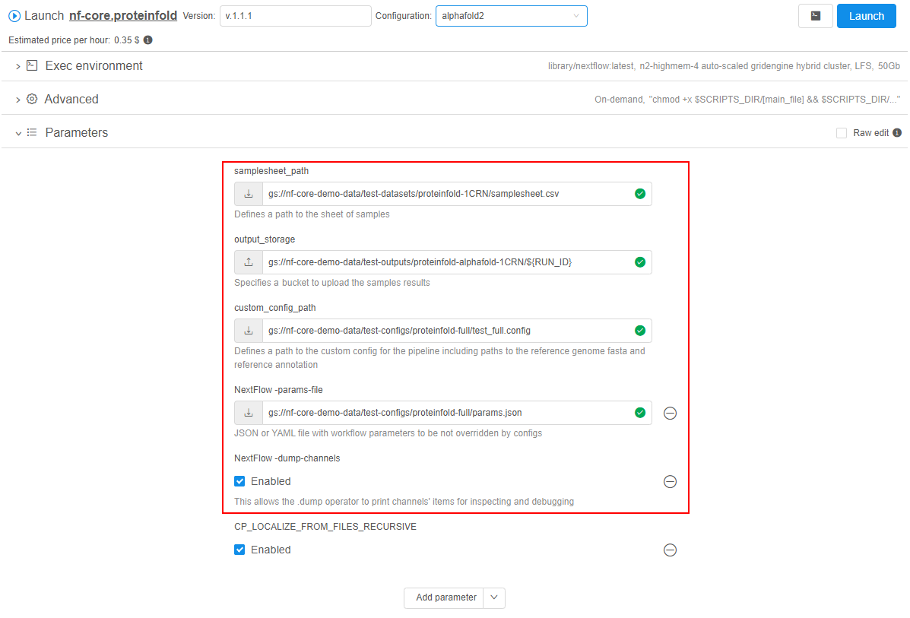

- **`samplesheet_path`** - input path to the sheet (`CSV`) containing metadata about samples to process
- **`output_storage`** - output path where the results will be saved
- **`custom_config_path`** - path to the custom config for the pipeline containing model settings and NextFlow executor settings
- **`NextFlow -params-file`** - path to the pipeline `JSON`/`YAML` file with workflow parameters to be not overridden by configs
- **`NextFlow -dump-channels`** - allows to dump channels output for debugging purpose  
    **_Note_**: `CP_LOCALIZE_FROM_FILES_RECURSIVE` - this is a Cloud Pipeline platform setting, that is required for the correct pipeline execution and should not be changed by the user

Example and format of the `samplesheet` file - each row represents a sequence with its fasta:

```csv
sequence,fasta
SEQUENCE1,<PATH_TO_SEQUENCE1_FASTA>
SEQUENCE2,<PATH_TO_SEQUENCE2_FASTA>
...
```

Example and format of the `custom_config` file, more details about pipeline steps - you can find in the main **`README.md`** in pipeline documents.

Output results example:  
    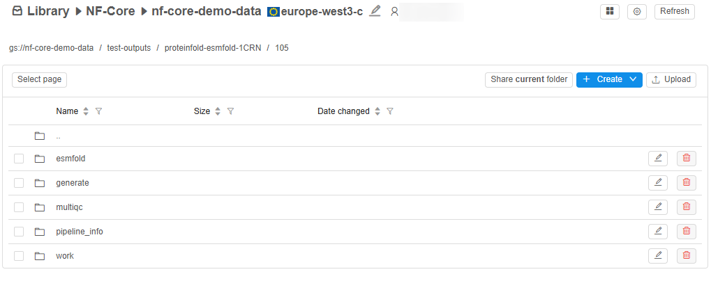

### Active Learning Pipeline

**Al-docking** is an active learning-driven molecular docking pipeline that ingests 3D receptor structures and a chemical compound database.  
It iteratively performs docking simulations (`QuickVina`) and trains machine learning models (`DGL`, `PyTorch`) over protein structure files to prioritize promising ligands, producing docking score prediction results, trained models, and a summary report with progress through iteration figures.  


Features that need to be taken into account when preparing and running **Al-docking** via the Cloud Pipeline platform:

Pipeline parameters:  
    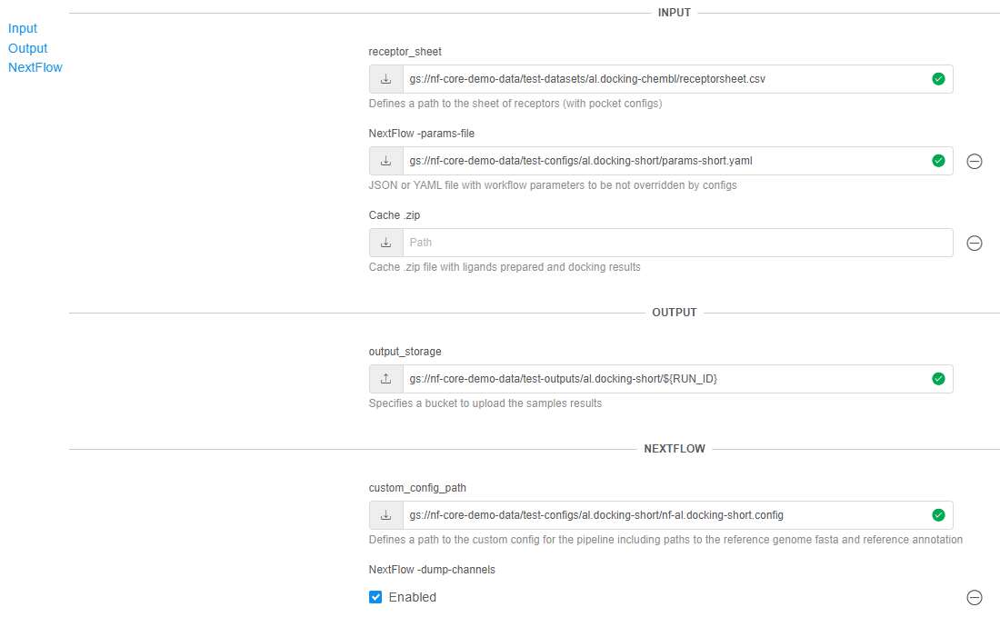

- **`receptor_sheet`** - input path to the sheet (`CSV`) containing metadata about receptor target structures to process
- **`NextFlow -params-file`** - path to the pipeline `JSON`/`YAML` file with workflow parameters to be not overridden by configs
- **`Cache .zip`** - path to the cache `ZIP` file with ligands prepared and docking results
- **`output_storage`** - output path where the results will be saved
- **`custom_config_path`** - path to the custom config containing compound database settings and NextFlow executor settings
- **`NextFlow -dump-channels`** - allows to dump channels output for debugging purpose  

Example and format of the `receptor_sheet` file - each row represents a receptor with its `PDB` path and pocket configuration for ligands' docking:

```csv
id,pdb,pocket_config
RECEPTOR1,<PATH_TO_RCEPTOR1_PDB>,<PATH_TO_RCEPTOR1_POCKET_CONFIG>
RECEPTOR2,<PATH_TO_RCEPTOR2_PDB>,<PATH_TO_RCEPTOR2_POCKET_CONFIG>
...
```

Example of the pocket config file:

```
receptor = <PATH_TO_RCEPTOR1_PDB>

center_x = 14.455
center_y = 75.815
center_z = 36.333

size_x = 66.724
size_y = 108.143
size_z = 111.314
```

Example and format of the `custom_config` file, more details about pipeline steps - you can find in the main **`README.md`** in pipeline documents.

Output results example:  
    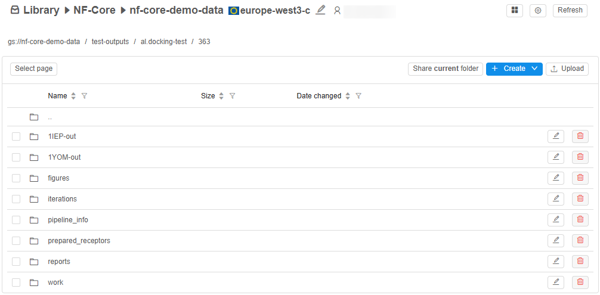
