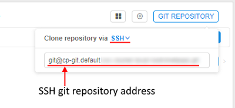
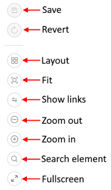

# 6. Manage Pipeline

- [Pipeline object GUI](#pipeline-object-gui)
    - ["Details" view pane](#details-view-pane)
    - ["Details" controls](#details-controls)
- [Pipeline versions GUI](#pipeline-versions-gui)
    - [Pipeline controls](#pipeline-controls)
        - [Pipeline launching page](#pipeline-launching-page)
    - [Pipeline version tabs](#pipeline-version-tabs)
        - [DOCUMENTS](#documents)
        - [CODE](#code)
        - [CONFIGURATION](#configuration)
        - [HISTORY](#history)
        - [STORAGE RULES](#storage-rules)
        - [GRAPH](#graph)
- [Default environment variables](#default-environment-variables)

**Pipelines** represent a sequence of tasks that are executed along with each other in order to process some data. They help to automate complex tasks that consist of many sub-tasks.

This chapter describes **Pipeline** space GUI and the main working scenarios.

## Pipeline object GUI

As far as the pipeline is one of **CP** objects which stored in "**Library**" space, the **Pipeline** workspace is separated into two panes:

1. [**"Hierarchy" view**](../03_Overview/3._Overview.md#library) pane
2. [**"Details" view**](#details-view-pane) pane.

> **_Note_**: also you can view general information and some details about the specific pipeline via CLI. See [14.4 View pipeline definitions via CLI](../14_CLI/14.4._View_pipeline_definitions_via_CLI.md).

### "Details" view pane

The "Details" view pane displays content of a selected object. In case of a pipeline, you will see:

- a list of pipeline versions with a description of last update and date of the last update;
- specific space's [controls](#details-controls).

### "Details" controls

| Control | Description |
|---|---|
| **Displays icon** | This icon includes: <ul><li>"**Attributes**" control (**1**) opens **Attributes** pane. Here you can see a list of "key=value" attributes of the pipeline. For more info see [here](../17_Tagging_by_attributes/17._CP_objects_tagging_by_additional_attributes.md). **_Note_**: If the selected pipeline has any defined attribute, **Attributes** pane is shown by default.</li><li>**Issues** shows/hides the issues of the current pipeline to discuss. To learn more see [here](../16_Issues/16._Issues.md).</li></ul> |
| **"Gear" icon** | This control (**2**) allows to rename, change the description, delete and edit repository settings i.e. **Repository address** and **Token** |
| **Git repository** | "**Git repository**" control (**3**) shows a git repository address where pipeline versions are stored, which could be copied and pasted into a browser address field:  If for your purposes `ssh` protocol is required, you may click the **HTTPS/SSH** selector and choose the **SSH** item:  In that case, you will get a reformatted SSH address:  Also a user can work directly with git from the console on the running node. For more information, how to configure Git client to work with the Cloud Pipeline, see [here](../12_Manage_Settings/12._Manage_Settings.md#git-cli). To clone a pipeline a user shall have **READ** permissions, to push **WRITE** permission are also needed. For more info see [13. Permissions](../13_Permissions/13._Permissions.md). |
| **Release** | "**Release**" control (**4**) is used to tag a particular pipeline version with a name. A draft pipeline version has the control only.  **_Note_**: you can edit the last pipeline version only. |
| **Run** | Each pipeline version item of the selected pipeline's list has a "**Run**" control (**5**) to launch a pipeline version. |

## Pipeline versions GUI

Pipeline version interface displays full information about a pipeline version: supporting documentation, code files, and configurations, history of version runnings, etc.

### Pipeline controls

The following buttons are available to manage this space.

| Control | Description |
|---|---|
| **Run** | This button launch a pipeline version. When a user clicks the button, the ["Launch a pipeline"](#pipeline-launching-page) page opens. |
| **"Gear" icon** | This control allows to rename, change the description, delete and edit repository settings i.e. **Repository address** and **Token**. |
| **Git repository** | Shows a git repository address where pipeline versions are stored, which could be copied and pasted in a browser line. Also a user can work directly with git from the console on the running node. For more information, how to configure Git client to work with the Cloud Pipeline, see [here](../12_Manage_Settings/12._Manage_Settings.md#git-cli). To clone a pipeline a user shall have **READ** permissions, to push **WRITE** permission is also needed. For more info see [13. Permissions](../13_Permissions/13._Permissions.md). |

#### Pipeline launching page

"**Launch a pipeline**" page shows parameters of a default configuration the pipeline version. This page has the same view as a ["Configuration"](#configuration) tab of a pipeline version. Here you can select any other configuration from the list and/or change parameters for this specific run (changes in configuration will be applied only to this specific run).

## Pipeline version tabs

Pipeline version space dramatically differs from the Pipeline space. You can open it: just click on it.  
The whole information is organized into the following tabs in "Details" view pane.

### DOCUMENTS

The "Documents" tab contains documentation associated with the pipeline, e.g. README, pipeline description, etc. See an example [here](6.1._Create_and_configure_pipeline.md#edit-documentation-optional).  
**_Note_**: **`README.md`** file is created automatically and contains default text which could be easily edited by a user.

#### Documents tab controls

The following buttons are available to manage this section:

| Control | Description |
|---|---|
| **Upload** (**a**) | This control (**a**) allows to upload documentation files. |
| **Delete** (**b**) | "Delete" control (**b**) helps to delete a file. |
| **Rename** (**c**) | To rename a file a user shall use a "Rename" control (**c**).|
| **Download** (**d**) | This control (**d**) allows downloading pipeline documentation file to your local machine. |
| **Edit** (**e**) | "Edit" control (**e**) helps a user to edit any text files (e.g. README) here in a text editor using a [markdown language](https://en.wikipedia.org/wiki/Markdown). |

### CODE

This section contains a list of scripts to run a pipeline. Here you can create new files, folders and upload files here. Each script file could be edited (see details [here](6.1._Create_and_configure_pipeline.md#edit-code-section)).  
**_Note_**: .json configuration file can also be edited in the **Configuration** tab via GUI.

#### Code tab controls

The following controls are available:

| Control | Description |
|---|---|
| **Plus** button (**a**) | This control is to create a new folder in a pipeline version. The folder's name shall be specified. |
| **+ New file** (**b**) | To create a new file in the current folder. |
| **Upload** (**c**) | To upload files from your local file system to a pipeline version. |
| **Rename** (**d**) | Each file or folder has a "Rename" control which allows renaming a file/folder. |
| **Delete** (**e**) | Each file or folder has a "Delete" control which deletes a file/folder. |

#### The list of system files

All newly created pipelines have at least 2 starting files no matter what pipeline template you've chosen.  
Only newly created `DEFAULT` pipeline has 1 starting file (**`config.json`**).

##### main_file

This file contains a pipeline scenario. By default, it is named after a pipeline, but this may be changed in the configuration file.  
**_Note_**: the **main_file** is usually an entry point to start pipeline execution.  
To create your own scenario the default template of the main file shall be edited (see details [here](6.1._Create_and_configure_pipeline.md#edit-code-section)).

**_Example_**: below is the piece of the **main_file** of the Gromacs pipeline:  

##### config.json

This file contains pipeline execution parameters. You can not rename or delete it because of it's used in pipeline scripts and they will not work without it.  
**_Note_**: it is advised that pipeline execution settings are modified via [CONFIGURATION tab](#configuration) (e.g. if you want to change default settings for pipeline execution) or via [Launch pipeline page](6.2._Launch_a_pipeline.md) (e.g. if you want to change pipeline settings for a current run). Manual **`config.json`** editing should be used only for advanced users (primarily developers) since json format is not validated in this case.  
**_Note_**: all attributes from **`config.json`** are available as environment variables for pipeline execution.

The **`config.json`** file for every pipeline template have the following settings:

<table>
    <thead>
        <tr class="header">
            <th>Setting</th>
            <th>Description</th>
        </tr>
    </thead>
    <tbody>
        <tr class="odd">
            <td><strong>main_file</strong></td>
            <td>A name of the main file for that pipeline.</td>
        </tr>
        <tr class="even">
            <td><strong>instance_size</strong></td>
            <td>instance type in terms of the specific Cloud Provider that specifies an amount of RAM in Gb, CPU and GPU cores number (e.g. "m4.xlarge" for AWS EC2 instance).</td>
        </tr>
        <tr class="odd">
            <td><strong>instance_disk</strong></td>
            <td>An instance's disk size in Gb.</td>
        </tr>
        <tr class="even">
            <td><strong>docker_image</strong></td>
            <td>A name of the Docker image that will be used in the current pipeline.</td>
        </tr>
        <tr class="odd">
            <td><strong>cmd_template</strong></td>
            <td>Command line template that will be executed at the running instance in the pipeline. 
             
            <strong>cmd_template</strong> can use environment variables:
            <ul>
                <li>To address the <strong>main_file</strong> parameter value, use the following construction - <strong>[main_file]</strong></li>
                <li>To address all other parameters, usual Linux environment variables style shall be used (e.g. <strong>$docker_image</strong>)</li>
            </ul></td>
        </tr>
        <tr class="even">
            <td><strong>parameters</strong></td>
            <td>Pipeline execution parameters  (e.g. path to the data storage with input data). A parameter has a name and set of attributes. There are 3 possible keys for each parameter:
            <ul>
                <li><strong>"type"</strong> - key specifies a type for current parameter,</li>
                <li><strong>"value"</strong> - key specifies default value for parameter,</li>
                <li><strong>"required"</strong> - key specifies whether this parameter must be set (<em>"required": true</em>) or might not (<em>"required": false</em>)</li>
            </ul>
            </td>
        </tr>
    </tbody>
</table>

**Example**: **`config.json`** file of the **Gromacs** pipeline:  

**_Note_**: In addition to **main_file** and **`config.json`** you can add any number of files to the **CODE** section and combine it in one whole scenario.

### CONFIGURATION

This section represents pipeline execution parameters which are set in **`config.json`** file. The parameters can be changed here and **`config.json`** file will be changed respectively. See how to edit configuration [here](6.1._Create_and_configure_pipeline.md#edit-pipeline-configuration-optional).

A configuration specifies:

| Section | Control | Description |
|---|---|---|
|  | **Name** | **Pipeline** and its **configuration** names. |
|  | **Estimated price per hour** | Control shows machine hours prices. If you navigate mouse to "info" icon, you'll see the maximum, minimum and average price for a particular pipeline version run as well as the price per hour. |
| **Exec environment** |  | This section lists execution environment parameters. |
|  | **Docker image** | A name of a Docker image to use for a pipeline execution (e.g. "library/gromacs-gpu"). |
|  | **Node type** | An instance type in terms of the specific Cloud Provider: CPU, RAM, GPU (e.g. 2 CPU cores, 8 Gb RAM, 0 GPU cores). |
|  | **Disk** | Size of a disk in gigabytes, that will be attached to the instance in Gb. |
|  | **Configure cluster** button | On-click, pop-up window will be shown:  Here you can configure cluster or auto-scaled cluster. Cluster is a collection of instances which are connected so that they can be used together on a task. In both cases, a number of additional worker nodes with some main node as cluster head are launching (total number of pipelines = "number of working nodes" + 1). See [v.0.14 - 7.2. Launch Detached Configuration](../07_Manage_Detached_configuration/7.2._Launch_Detached_Configuration.md) for details.  In case of using **cluster**, an exact count of worker nodes is directly defined by the user before launching the task and could not changing during the run.  In case of using **auto-scaled cluster**, a max count of worker nodes is defined by the user before launching the task but really used count of worker nodes can change during the run depending on the jobs queue load. See [Appendix C. Working with autoscaled cluster runs](../Appendix_C/Appendix_C._Working_with_autoscaled_cluster_runs.md) for details.  For configure cluster:<ul><li>in opened window click **Cluster** button</li><li>specify a number of child nodes (workers' count)</li><li>if you want to use **GridEngine** server for the cluster, tick the **Enable GridEngine** checkbox. Setting of that checkbox automatically adds the **`CP_CAP_SGE`** system parameter with value `true`. **_Note_**: you may set this and other system parameters manually - see the example of using system parameters [here](6.1._Create_and_configure_pipeline.md#example-create-a-configuration-that-uses-system-parameter).</li><li>if you want to use **Apache Spark** for the cluster, tick the **Enable Apache Spark** checkbox. Setting of that checkbox automatically adds the **`CP_CAP_SPARK`** system parameter with value `true`. See the example of using **Apache Spark** [here](../15_Interactive_services/15.4._Interactive_service_examples.md#running-apache-spark-cluster-with-rstudio-web-gui).</li><li>if you want to use **Slurm** for the cluster, tick the **Enable Slurm** checkbox. Setting of that checkbox automatically adds the **`CP_CAP_SLURM`** system parameter with value `true`. See the example of using **Slurm** [here](../15_Interactive_services/15.2._Using_Terminal_access.md#example-using-of-slurm-for-the-cloud-pipelines-clusters).</li><li>click **OK** button:</li></ul><blockquote>When user selects **Cluster** option, information on total cluster resources is shown. Resources are calculated as **(CPU/RAM/GPU)\*(NUMBER\_OF\_WORKERS\+1)**: </blockquote> For configure **auto-scaled cluster**:<ul><li>in opened window click **Auto-scaled cluster** button</li><li>specify a number of child nodes (workers' count) in field **Auto-scaled up to** and click **OK** button:  **_Note_**: that number is meaning total count of "auto-scaled" nodes - it is the max count of worker nodes that could be attached to the main node to work together as cluster. These nodes will be attached to the cluster only in case if some jobs are in waiting state longer than a specific time. Also these nodes will be dropped from the cluster in case when jobs queue is empty or all jobs are running and there are some idle nodes longer than a specific time. **_Note_**: about timeout periods for scale-up and scale-down of auto-scaled cluster see [here](../12_Manage_Settings/12.10._Manage_system-level_settings.md#grid-engine-autoscaling).</li><li>**_additionally_** you may enable `hybrid` mode for the auto-scaled cluster - it allows to scale-up the cluster (attach a worker node) with the instance type distinct of the master - worker is being picked up based on the amount of unsatisfied CPU requirements of all pending jobs. For that behavior, set the "**Enable Hybrid cluster**" checkbox. For more details see [here](../Appendix_C/Appendix_C._Working_with_autoscaled_cluster_runs.md#hybrid-cluster).</li><li>**_additionally_** you may specify a number of "persistent" child nodes (workers' count) - click **Setup default child nodes count**, input **Default child nodes** number and click **Ok** button:  <ul><li>These default child nodes will be never "scaled-down" during the run regardless of jobs queue load. In the example above, total count of "auto-scaled" nodes - 3, and 1 of them is "persistent". **_Note_**: total count of child nodes always must be greater than count of default ("persistent") child nodes.</li><li>if you don't want to use default ("persistent") child nodes in your auto-scaled cluster - click **Reset** button opposite the **Default child nodes** field.</li></ul></li><li>**_additionally_** you may choose a price type for workers that will be attached during the run - via the "**Workers price type**" dropdown list - workers' price type can be automatically the same as the master node type (by default) or forcibly specified regardless on the master's type: </li></ul><blockquote>When user selects **Auto-scaled cluster**, information on total cluster resources is shown as interval - from the "min" configuration to "max" configuration: "min" configuration resources are calculated as **(CPU/RAM/GPU)\*(NUMBER\_OF\_DEFAULT\_WORKERS\+1)** "max" configuration resources are calculated as **(CPU/RAM/GPU)\*(TOTAL\_NUMBER\_OF\_WORKERS\+1)**  E.g. for auto-scaled cluster with 2 child nodes and without default ("persistent") child nodes _(NUMBER\_OF\_DEFAULT\_WORKERS = 0; TOTAL\_NUMBER\_OF\_WORKERS = 2)_:   E.g. for auto-scaled cluster with 2 child nodes and 1 default ("persistent") child node _(NUMBER\_OF\_DEFAULT\_WORKERS = 1; TOTAL\_NUMBER\_OF\_WORKERS = 2)_:   **_Note_**: in some specific configurations such as **_hybrid autoscaling clusters_** amount of resources can vary beyond the shown interval.</blockquote>**_Note_**: if you don't want to use any cluster - click **Single node** button and then click **OK** button. |
|  | **Cloud Region** | A specific region for a compute node placement. Please note, if a non-default region is selected - certain CP features may be unavailable: <ul><li>FS mounts usage from the another region (e.g. "_EU West_" region cannot use FS mounts from the "_US East_"). Regular storages will be still available</li><li>If a specific tool, used for a run, requires an on-premise license server (e.g. monolix, matlab, schrodinger, etc.) - such instances shall be run in a region, that hosts those license servers.</li></ul><blockquote>**_Note_**: if a specific platform deployment has a number of Cloud Providers registered (e.g. `AWS`+`Azure`, `GCP`+`Azure`) - in that control Cloud Provider auxiliary icons also will be displayed, e.g.:  For a single-Provider deployments only Cloud Region icons are displayed.</blockquote> |
| **Advanced** |  |  |
|  | **Price type** | Choose Spot or On-demand type of instance. You can look information about price types hovering "Info" icon and based on it make your choice. |
|  | **Timeout (min)** | After this time pipeline will shut down (optional). |
|  | **Limit mounts** | Allow to specify storages that should be mounted. See [here](6.1._Create_and_configure_pipeline.md#example-limit-mounted-storages). |
|  | **Cmd template** | A shell command that will be executed to start a pipeline. |
|  | **"Start idle"** | The flag sets **cmd_template** to **`sleep infinity`**. For more information about starting a job in this mode refer to [15. Interactive services](../15_Interactive_services/15._Interactive_services.md). |
| **Parameters** |  | This section lists pipeline specific parameters that can be used during a pipeline run. Pipeline parameters can be assigned the following types: <ul><li>**String** - generic scalar value (e.g. Sample name).</li><li>**Boolean** - boolean value.</li><li>**Path** - path in a data storage hierarchy.</li><li>**Input** - path in a data storage hierarchy. During pipeline initialization, this path will be used to download input data on the calculation node for processing from a storage.</li><li>**Output** - path in a data storage hierarchy. During pipeline finalization, this path will be used to upload resulting data to a storage.</li><li>**Common** - path in a data storage hierarchy. Similar to "Input" type, but this data will not be erased from a calculation node, when a pipeline is finished (this is useful for reference data, as it can be reused by further pipeline runs that share the same reference).</li></ul>**_Note_**: You can use **Project** attribute values as parameters for the **Run**: <ol><li>Click an empty parameter value field.</li><li>Enter "**project.**"</li><li>In the drop-down list select the Project attribute value: </li></ol> |
|  | **Add parameter** | This control helps to add an additional parameter to a configuration. |

#### Configuration tab controls

| Control | Description |
|---|---|
| **Add** | To create a customized configuration for the pipeline, click the **+ ADD** button in the upper-right corner of the screen. For more details see [here](6.1._Create_and_configure_pipeline.md#example-add-pipeline-configuration). |
| **Save** | This button saves changes in a configuration. |

### HISTORY

This section contains information about all the current pipeline version's runs. Runs info is organized into a table with the following columns:

- **Run** - each record of that column contains two rows: in upper - run name that consists of pipeline name and run id, in bottom - Cloud Region.
> **_Note_**: if a specific platform deployment has a number of Cloud Providers registered (e.g. `AWS`+`Azure`, `GCP`+`Azure`) - corresponding text information also has a Provider name, e.g.:  
> 
- **Parent-run** - id of the run that executed current run (this field is non-empty only for runs that are executed by other runs).
- **Pipeline** - each record of that column contains two rows: in upper - pipeline name, in bottom - pipeline version.
- **Docker image** - base docker image name.
- **Started** - time pipeline started running.
- **Completed** - time pipeline finished execution.
- **Elapsed** - each record of that column contains two rows: in upper - pipeline running time, in bottom - run's estimated price, which is calculated based on the run duration, region and instance type.
- **Owner** - user who launched run.

You can filter runs by clicking the **filter icon**. By using the **filter control** you can choose whether display runs for current pipeline version or display runs for all pipeline versions.

#### History tab controls

| Control | Description |
|---|---|
| **PAUSE (a)** | To pause running pipeline press this control. This control is available only for on-demand instances. |
| **STOP (b)** | To stop running pipeline press this control. |
| **LOG (c)** | "Log" control opens detailed information about the run. You'll be redirected to "**Runs**" space (see [11. Manage Runs](../11_Manage_Runs/11._Manage_Runs.md)). |
| **RESUME (d)** | To resume pausing pipeline press this control. This control is available only for on-demand instances. |
| **TERMINATE (e)** | To terminate node without waiting of the pipeline resuming. This control is available only for on-demand instances, which were paused. |
| **RERUN (f)** | This control reruns completed pipeline's runs. |

#### Pipeline run's states

Icons at the left represent the current state of the pipeline runs:  

-  - **Queued** state ("sandglass" icon) - a run is waiting in the queue for the available compute node.
-  - **Initializing** state ("rotating" icon) - a run is being initialized.
-  - **Pulling** state ("download" icon) - now pipeline **Docker image** is downloaded to the node.
-  - **Running** state ("play" icon) - a pipeline is running. The node is appearing and pipeline input data is being downloaded to the node before the "**InitializeEnvironment**" service task appears.
-  - **Paused** state ("pause" icon) - a run is paused. At this moment compute node is already stopped but keeps it's state. Such run may be resumed.
-  - **Success** state ("OK" icon) - successful pipeline execution.
-  - **Failed** state ("caution" icon) - unsuccessful pipeline execution.
-  - **Stopped** state ("clock" icon) - a pipeline manually stopped.

Also, help tooltips are provided when hovering a run state icon, e.g.:  
  

### STORAGE RULES

This section displays a list of rules used to upload data to the output data storage, once pipeline finished. It helps to store only data you need and minimize the amount of interim data in data storages.

Info is organized into a table with the following columns:

- **Mask** column contains a relative path from the $ANALYSIS_DIR folder (see [Default environment variables](#default-environment-variables) section below for more information). Mask uses bash syntax to specify the data that you want to upload from the $ANALYSIS_DIR. Data from the specified path will be uploaded to the bucket from the pipeline node.  
    **_Note_**: by default whole $ANALYSIS_DIR folder is uploaded to the cloud bucket (default Mask is - "\*"). For example, "\*.txt\*" mask specifies that all files with **.txt** extension need to be uploaded from the $ANALYSIS_DIR to the data storage.  
    **_Note_**: Be accurate when specifying masks - if wildcard mask ("\*") is specified, all files will be uploaded, no matter what additional masks are specified.
- The **Created** column shows date and time of rules creation.
- **Move to Short-Term Storage** column indicates whether pipeline output data will be moved to a short-term storage.

#### Storage rules tab control

| Control | Description |
|---|---|
| **Add new rule (a)** | This control allows adding a new data managing rule. |
| **Delete (b)** | To delete a data managing rule press this control. |

### GRAPH

This section represents the sequence of pipeline tasks as a directed graph.

**Tasks** are graph vertices, **edges** represent execution order. A task can be executed only when all input edges - **associated tasks** - are completed (see more information about creating a pipeline with **GRAPH** section [here](6.1.1._Building_WDL_pipeline_with_graphical_PipelineBuilder.md)).  
**_Note_**: only for Luigi and WDL pipelines.  
**_Note_**: If **main_file** has mistakes, pipeline workflow won't be visualized.

#### Graph tab controls

When a PipelineBuilder graph is loaded, the following layout controls become available to the user.

| Control | Description |
|---|---|
| **Save** | saves changes. |
| **Revert** | reverts all changes to the last saving. |
| **Layout** | performs graph linearization, make it more readable. |
| **Fit** | zooms graph to fit the screen. |
| **Show links** | enables/disables workflow level links to the tasks. It is disabled by default, as for large workflows it overwhelms the visualization. |
| **Zoom out** | zooms graph out. |
| **Zoom in** | zooms graph in. |
| **Search element** | allows to find specific object at the graph. |
| **Fullscreen** | expands graph to the full screen. |

## Default environment variables

Pipeline scripts (e.g. **main_file**) use default environmental variables for pipeline execution. These variables are set in internal CP scripts:

- **RUN\_ID** - pipeline run ID.
- **PIPELINE\_NAME** - pipeline name.
- **COMMON\_DIR** - directory where pipeline common data (parameter with **`"type": "common"`**) will be stored.
- **ANALYSIS\_DIR** - directory where output data of the pipeline (parameter with **`"type": "output"`**) will be stored.
- **INPUT\_DIR** - directory where input data of the pipeline (parameter with **`"type": "input"`**) will be stored.
- **SCRIPTS\_DIR** - directory where all pipeline scripts and config.json file will be stored.
