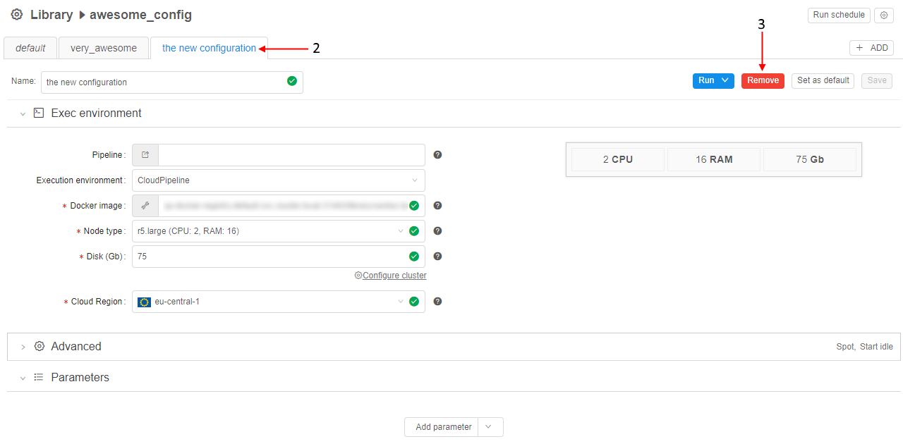

# 7.1. Create and customize Detached configuration

- [Create Detached configuration](#create-detached-configuration)
- [Customize Detached configuration](#customize-detached-configuration)
    - [Edit detached configuration name and description](#edit-detached-configuration-name-and-description)
    - [Edit detached configuration permissions](#edit-detached-configuration-permissions)
    - [Add run configuration to detached configuration](#add-run-configuration-to-detached-configuration)
    - [Edit run configuration in the Detached configuration](#edit-run-configuration-in-the-detached-configuration)
        - [Set a root entity and map configuration parameters](#set-a-root-entity-and-map-configuration-parameters)
    - [Delete run configuration from the Detached configuration](#delete-run-configuration-from-the-detached-configuration)

## Create Detached configuration

> To create **Detached configuration** in a **Folder** you need to have **WRITE** permission for that folder and a role **CONFIGURATION\_MANAGER**. For more information see [13. Permissions](../13_Permissions/13._Permissions.md).

**_Note_**: you can create a specific type of a run configuration which could be used only for a specific type of data. In such type of a run configuration, you can link type of data (e.g. Sample, Participant, etc) and the algorithm - a pipeline. To do that, you shall create your run configuration in a **Project** folder. Learn how to create a project [here](../Appendix_B/Appendix_B._Working_with_a_Project.md).

To **create** a Detached configuration:

1. Navigate to the folder where you want to create.
2. Click **+ Create → Configuration**.  
    
3. Enter **Configuration name** and **Configuration description** in pop-up window.  
    
4. Click **Create**.
5. The configuration will be shown in the Library.

## Customize Detached configuration

> To edit **Detached configuration** you need **WRITE** permissions for it. For more information see [13. Permissions](../13_Permissions/13._Permissions.md).

### Edit detached configuration name and description

1. Navigate to the **Folder** where the **Detached configuration** is stored.
2. Click  icon. The **"Edit configuration info"** pop-up window will be open.  
    
3. Change **Detached configuration** name and description.
4. Click **Save**.

### Edit detached configuration permissions

1. Navigate to the **Detached configuration** and click  icon.  
    **Note:** Also you can navigate to the Folder where the Detached configuration is stored and click **"Pencil"** icon.
2. Go to **Permissions** tab.
3. Click **Add user** or **Add user group**. In the example screenshots, we grant permissions to a user.  
    
4. Enter user's name. Auto-filling will help you.  
    
5. A user will be added to the list. Click User's name to manage user's permissions.
6. Tick appropriate permissions. For more details see [13. Permissions](../13_Permissions/13._Permissions.md).  
    

### Add run configuration to detached configuration

1. Select **Detached configuration** in the **Library**.
2. Add new Run configuration via **+ ADD** button.  
    
3. Enter the name, description of the new **Run configuration**. If the **Detached configuration** already has more than one **Run configuration**, select the **template** for the new one. The new configuration will be based on the **template**.  
    
4. Click **Create**.
5. New **Run Configuration** will be represented at **Detached configuration** details pane.  
    

### Edit run configuration in the Detached configuration

1. Select **Detached configuration** in the **Library**.
2. Go to the tab with the **Run configuration** that you want to change.  
    
3. Change parameters of the Run configuration.  
    
4. Click **Save**.

#### Set a root entity and map configuration parameters

- If your configuration stored in a folder with a **Project** type, when, to set a **"Root entity"** field, you shall add metadata to your project. After that, you'll be able to select metadata entity type from the drop-down list.  
    **_Note_**: learn how to create a project [here](../Appendix_B/Appendix_B._Working_with_a_Project.md) and about managing metadata [here](../05_Manage_Metadata/5._Manage_Metadata.md).
    1. Click "**Root entity**" combo-box.  
    2. Choose the object from default values: Participants, Samples, Pairs, Sets of Participants, Sets of Samples, Sets of Pairs.
- When you select "**Root entity**", you'll be able to map configuration parameters to the root entity metadata attributes. You can set it using expansion expressions.  
    1. Click an empty parameter value field.  
    2. Enter "**this.**".  "**this**" means that value is attributed to the selected **Root entity type**.  
    3. In the drop-down list select the metadata value.  
    

### Delete run configuration from the Detached configuration

1. Select **Detached configuration** in the **Library**.
2. Go to the tab with the **Run configuration** that you want to delete.
3. Click **Remove**.  
    
4. Confirm removal.
