# 7.2. Launch Detached Configuration

- [Launch detached cluster configuration as a cluster](#launch-detached-cluster-configuration-as-a-cluster)
- [Schedule a launch from the detached configuration](#schedule-a-launch-from-the-detached-configuration)
    - [Create and configure a schedule rule](#create-and-configure-a-schedule-rule)
    - [Delete a schedule rule](#delete-a-schedule-rule)

> To launch a **Detached configuration** you need to have **EXECUTE** permissions for it. For more information see [13. Permissions](../13_Permissions/13._Permissions.md).

**Detached configuration** represents a configuration for running instances as a cluster. For example, when you need different instances running at one task: master machine and one or several worker machines are configured. They may or may not use one docker image and run different scripts.

There are different options to run the cluster in **Cloud Pipeline**:

- To use **Configure cluster** button at **Launch pipeline** page or at **Detached configuration** page.  
    Click the button, configure cluster - you will be offered to start current configuration at several machines ("working nodes"). I.e. there will start several identically configured machines having network file system within each. It is impossible to run all configurations for the pipeline at once as a cluster. For more details see [6. Manage Pipeline](../06_Manage_Pipeline/6._Manage_Pipeline.md#configuration).
- To use **Detached configuration**.  
    Cluster configuration is a set of configurations for nodes that may or may not start some pipeline. Configurations in Detached configuration page are typically different.  
    From Detached configuration page, you can **launch all configurations at once as a cluster** or launch configurations one by one as via **Launch** pipeline tab.

## Launch detached cluster configuration as a cluster

1. Navigate to **Detached Configuration** details page.
2. Click **Run → Run cluster**. All the Run configurations of the Detached configuration will start execution.  
      
    **_Note_**: Select **Run selected** to launch only the opened Run configuration.

    Please note, that the current user can launch a detached configuration only if he/his group has corresponding permissions on that configuration (for more information see [13. Permissions](../13_Permissions/13._Permissions.md)), but the **Run** button may be disabled also for one of the following reasons:

    - `execution` isn't allowed for specified docker image;
    - `read` operations aren't allowed for specified **input** or **common** path parameters;
    - `write` operations aren't allowed for specified **output** path parameters.

    In such cases, hover over the **Run** button to view warning notification with a reason of a run forbiddance, e.g.:  
    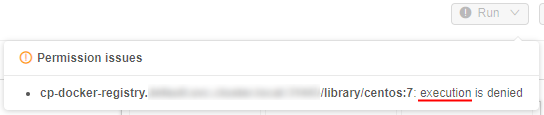

3. In case of launching **Root entity configuration**, a pop-up window emerges. Select an appropriate metadata in correspondence with **root entity**. If root entity is an attribute of the selected metadata, use [expansion expression](7.3._Expansion_Expressions.md) in the **Define expression field**.  
    Click **OK**.  
    

## Schedule a launch from the detached configuration

In some cases, the ability to configure a schedule for detached configuration running is beneficial.
User is able to set a schedule for launch a run from the detached configuration:

- Schedule is defined as a list of rules (user is able to specify any number of them)
- For each rule in the list user is able to set the recurrence:
    - _Daily_: every `N` days, time  
    or  
    - _Weekly_: every `weekday(s)`, time  
- Conflicting rules are not allowed (i.e. rules that are configured on the same launching time)
- If any schedule rule is configured for the detached configuration - a corresponding job (a pipeline (if specified) or a plain container) will be started accordingly in the scheduled day and time
- Configuration will be run from the user who created or updated the corresponding schedule
- If detached configuration has several entries (configs) only default one will be launched by the schedule

### Create and configure a schedule rule

1. Open the detached configuration
2. Click the **Run schedule** button in the right upper corner:  
    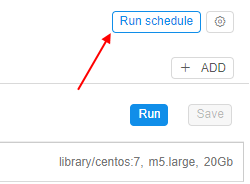
3. The "Run schedule" popup will appear:  
    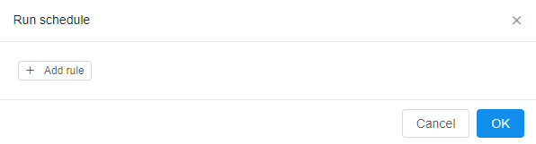
4. Click the **Add rule** button. The first rule in the list will appear:  
    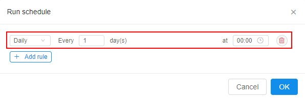
5. Let's configure the launch of the detached configuration every 3 days at 12:30. For that:
    - click the field next to "Every" label and specify the corresponding number in it  
    
    - click the time field, select hours in the left dropdown list and minutes in the right  
    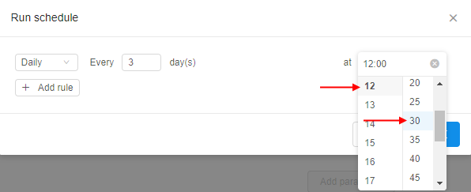
6. Let's add another rule and configure the launch of the detached configuration every monday and wednesday at 15:00. For that:
    - click the **Add rule** button
    - for the appeared new rule select the "Weekly" item in the recurrence dropdown list  
    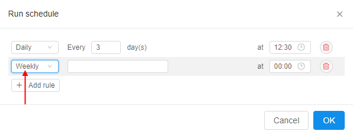
    - click the field next to the recurrence dropdown and select the corresponding weekdays  
    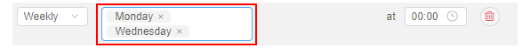
    - click the time field, select the corresponding time values
7. Click the **OK** button to save created rules:  
    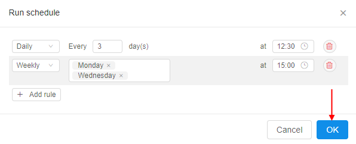

From now, the run from that detached configuration will be automatically launching according to the created schedule rules.

### Delete a schedule rule

1. Click the **Run schedule** button in the right upper corner of the detached configuration:  
    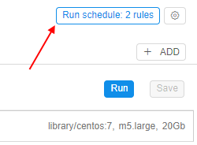
2. The "Run schedule" popup will appear. Click the **Delete** button in the row of the rule you want to remove, e.g.:  
    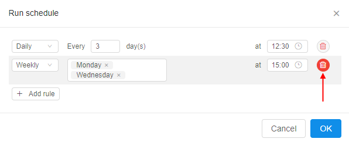
3. The row with removing rule will become pink:  
    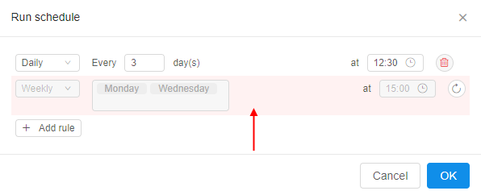  
    **_Note_**: you may easily revert the removal by button 
4. Click the **OK** button to save performed changes and permanently remove the rule
