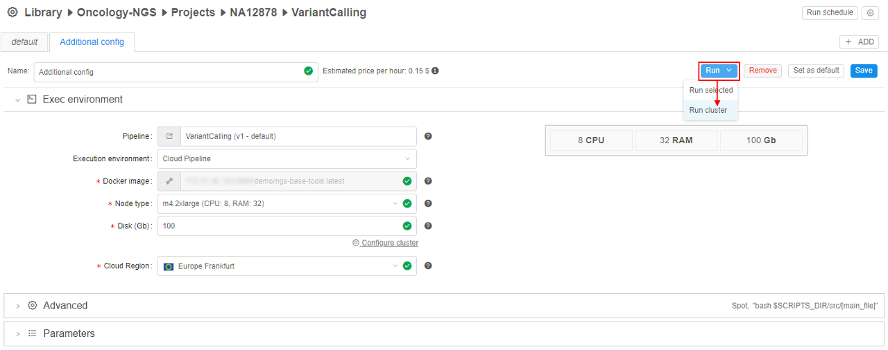

# 7.2. Launch Detached Configuration

> To launch a **Detached configuration** you need to have **EXECUTE** permissions for it. For more information see [13. Permissions](../13_Permissions/13._Permissions.md).

**Detached configuration** represents a configuration for running instances as a cluster. For example, when you need different instances running at one task: master machine and one or several worker machines are configured. They may or may not use one docker image and run different scripts.

There are different options to run the cluster in **Cloud Pipeline**:

- To use **Configure cluster** button at **Launch pipeline** page or at **Detached configuration** page.  
    Click the button, configure cluster - you will be offered to start current configuration at several machines ("working nodes"). I.e. there will start several identically configured machines having network file system within each. It is impossible to run all configurations for the pipeline at once as a cluster. For more details see [6. Manage Pipeline](../06_Manage_Pipeline/6._Manage_Pipeline.md#configuration).
- To use **Detached configuration**.  
    Cluster configuration is a set of configurations for nodes that may or may not start some pipeline. Configurations in Detached configuration page are typically different.  
    From Detached configuration page, you can **launch all configurations at once as a cluster** or launch configurations one by one as via **Launch** pipeline tab.

## Launch detached cluster configuration as a cluster

1. Navigate to **Detached Configuration** details page.
2. Click **Run → Run cluster**. All the Run configurations of the Detached configuration will start execution.  
      
    **_Note_**: Select **Run selected** to launch only the opened Run configuration.
3. In case of launching **Root entity configuration**, a pop-up window emerges. Select an appropriate metadata in correspondence with **root entity**. If root entity is an attribute of the selected metadata, use [expansion expression](7.3._Expansion_Expressions.md) in the **Define expression field**.  
    Click **OK**.  
    