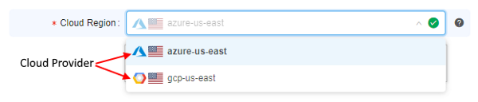

# 7. Manage Detached configuration

- ["Details" view pane](#details-view-pane)
- [Controls](#controls)
    - ["Gear" icon](#gear-icon)
    - [Add](#add)
    - [Run](#run)
    - [Remove](#remove)
    - [Save](#save)

**Detached configuration** is a **run configuration** or a set of **run configurations** that allows running tools and pipelines.  
**_Note_**: In comparison with pipeline configurations, detached configurations do not require a pipeline.

## "Details" view pane

At the "**Details view**" pane you can find:

| Section | Control | Description |
|---|---|---|
|  | **Name** | **Detach configuration (a)** and its **Run configuration (b)** names |
|  | **Estimated price per hour** | Control shows machine hours prices. If you navigate mouse to "**info**" icon **(c)**, you'll see the maximum, minimum and average price for a particular pipeline version run as well as the price per hour. |
| **Exec environment** |  | This section lists execution environment parameters. |
|  | **Pipeline (d)** | A name of the pipeline to be executed (optional). Click on the field to select a pipeline in the pop-up. |
|  | **Execution environment (e)** | An environment platform for execution the pipeline. Click for select from the list. |
|  | **Docker image (f)** | A name of a Docker image to use for a pipeline execution (e.g. "base-generic-centos7"). Click on the field to select an image in the pop-up. |
|  | **Node type (g)** | An instance type in terms of Cloud Provider with specifying amounts of CPU, RAM and GPU (e.g. 4 CPU cores, 16 Gb RAM and 0 GPU cores). |
|  | **Disk (h)** | Size of a disk, that will be attached to the instance in Gb. |
|  | **Configure cluster** button **(i)** | By clicking on this button you can configure cluster or auto-scaled cluster.  Cluster is a collection of instances which are connected so that they can be used together on a task. See [here](../06_Manage_Pipeline/6._Manage_Pipeline.md#configuration) and [here](7.2._Launch_Detached_Configuration.md) for more information.  |
|  | **Cloud Region (j)** | A specific region for a compute node placement. Please note, if a non-default region is selected - certain CP features may be unavailable: <ul><li>FS mounts usage from the another region (e.g. "_EU West_" region cannot use FS mounts from the "_US East_"). Regular storages will be still available</li><li>If a specific tool, used for a run, requires an on-premise license server (e.g. monolix, matlab, schrodinger, etc.) - such instances shall be run in a region, that hosts those license servers.</li></ul><blockquote>**_Note_**: if a specific platform deployment has a number of Cloud Providers registered (e.g. `AWS`+`Azure`, `GCP`+`Azure`) - in that control Cloud Provider auxiliary icons also will be displayed, e.g.:  For a single-Provider deployments only Cloud Region icons are displayed.</blockquote> |
|  | **Total resources (q)** | Information about total resources that will be used for running pipeline with specified parameters (depends on node type and cluster configuration). See [here](../06_Manage_Pipeline/6._Manage_Pipeline.md#configuration) for more details. |
| **Advanced** |  |  |
|  | **Price type (k)** | Choose spot or on-demand type of instance. The "Info" icon can give you additional information, which helps you to make choice. |
|  | **Timeout (min) (l)** | After this time pipeline will shut down (optional). |
|  | **Limit mounts (m)** | Restricts available storages for the tools or pipelines. See [here](../06_Manage_Pipeline/6.1._Create_and_configure_pipeline.md#example-limit-mounted-storages). |
|  | **Cmd template (n)** | A shell command that will be executed on the running node. |
|  | **"Start idle"** | The flag sets Cmd template to "sleep infinity". For more information about starting a job in this mode refer to [15. Interactive services](../15_Interactive_services/15._Interactive_services.md). |
| **Parameters** |  | This section lists pipeline specific parameters that can be used during a pipeline run. Pipeline parameters can be assigned the following types **(p)**:<ul><li>**String** - generic scalar value (e.g. Sample name).</li><li>**Boolean** - boolean value.</li><li>**Path** - path in a data storage hierarchy.</li><li>**Input** - path in a data storage hierarchy. During pipeline initialization, this path will be used to get data from a storage.</li><li>**Output** - path in a data storage hierarchy. During pipeline finalization, this path will be used to upload resulting data to a storage.</li><li>**Common** - path in a data storage hierarchy. Similar to "Input" type, but this data will not be erased from a calculation node, when a pipeline is finished (this is useful for reference data, as it can be reused by further pipeline runs that share the same reference).</li></ul>**_Note_**: You can use **Project** attribute values as parameters for the **Run**:<ol><li>Click an empty parameter value field.</li><li>Enter **"project."**</li><li>In the drop-down list select the Project attribute value. </li></ol> |
|  | **Add parameter (o)** | This control helps to add an additional parameter to a configuration. |
|  | **Root entity type** | **_Note_**: This parameter is only available for configurations that are stored in **Project** type of the **Folder** and the **Project** has to store **metadata object(s)** within. See [7.1. Create and customize Detached configuration](7.1._Create_and_customize_Detached_configuration.md). It defines an entity which metadata will be used to process data. Default values: Participants, Samples, Pairs, Sets of Participants, Sets of Samples, Sets of Pairs. |

## Controls

There are buttons at the top of the **"Details"** view:  

### "Gear" icon

Allows changing a name, description of the configuration and permissions for it **(a)**. See [7.1. Create and customize Detached configuration](7.1._Create_and_customize_Detached_configuration.md).

### Add

Allows adding machine configuration **(b)**. See [7.1. Create and customize Detached configuration](7.1._Create_and_customize_Detached_configuration.md).

### Run

Allows launching one machine or all machines as a cluster **(c)**. See [7.2. Launch Detached Configuration](7.2._Launch_Detached_Configuration.md).

### Remove

Allows removing machine configuration **(d)**. See [7.4. Remove Detached configuration](7.4._Remove_Detached_configuration.md).

### Save

Allow saving machine configuration **(e)**. See [7.1. Create and customize Detached configuration](7.1._Create_and_customize_Detached_configuration.md).
