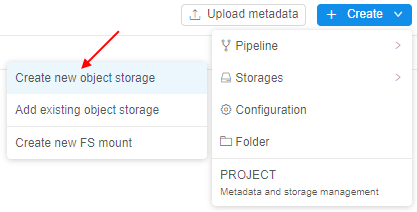

# 8.1. Create and edit storage

- [Create object storage](#create-object-storage)
- [Edit storage](#edit-storage)

> To create a **Storage** in a **Folder** you need to have **WRITE** permission for that folder and a **STORAGE\_MANAGER** role. For more information see [13. Permissions](../13_Permissions/13._Permissions.md).  
> You also can create **Storage** via **CLI**. See [14.3. Manage Storage via CLI](../14_CLI/14.3._Manage_Storage_via_CLI.md).

## Create object storage

1. Navigate to the folder where you want to create data storage.
2. Click **+ Create → Storage → Create new object storage**.  
    **_Note_**: choose **Add existing object storage** to use an already existing cloud storage for this data storage.  
      
    **_Note_**: how to create FS mount see [here](8.7._Create_shared_file_system.md).  
3. Fill in the "**Info**" form:  
    - **Storage path** - path to access the storage (cloud storage name).  
    If on **Data storage** tab in **Preferences** section of system-level settings **storage.object.prefix** (see [v.0.14 - 12.10. Manage system-level settings](../12_Manage_Settings/12.10._Manage_system-level_settings.md#data-storage)) is set - all new storages will be created with this prefix (e.g. "*ds*"):  
    
    - **Alias** - object storage name (if not specified, it is set equal to the **Storage path**).
    - **Cloud region** - location region of a data storage. This select allows to decrease time of data movement for huge data volumes by choosing the nearest region.  
        Please note, if a non-default region is selected - certain CP features may be unavailable:  
        - FS mounts usage from the another region (e.g. "_EU West_" region cannot use FS mounts from the "_US East_"). Regular storages will be still available.
        - If a specific tool, used for a run, requires an on-premise license server (e.g. monolix, matlab, schrodinger, etc.) - such instances shall be run in a region, that hosts those license servers.  
    - **Description** - description of the data storage and comments.
    - **STS duration** - short-term storage duration (days).
    - **LTS duration** - long-term storage duration (days).
    - **Enable versioning** box - allows to enable versioning for the storage files.
    - **Backup duration** - how long backup is stored (days).  
        **_Note_**: If you want to store data permanently, leave fields empty.
    - **Mount-point** - specific mount-point.
    - **Mount options** - specific mount options.
    - **Enable sharing** box - allows to share storage content with other users (see [here](8.8._Data_sharing.md)).  
        
4. Click **"Create"** button.

## Edit storage

You may change **Alias**, **Description**, **STS** and **LTS duration**, **Mount-point** and **Mount options**. Example:

1. Select storage.
2. Click  icon.
3. Change number of days in **STS** and **LTS** duration fields.  
    If you want to store data permanently, leave fields empty.  
    
4. Click **"Save"** button.