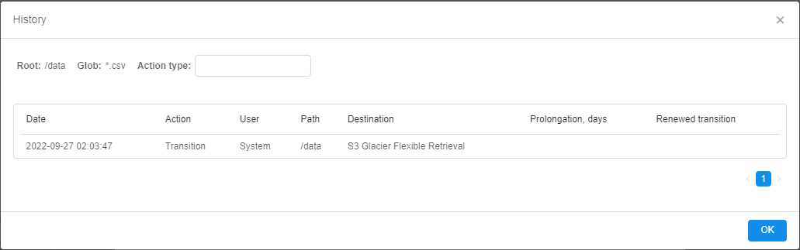
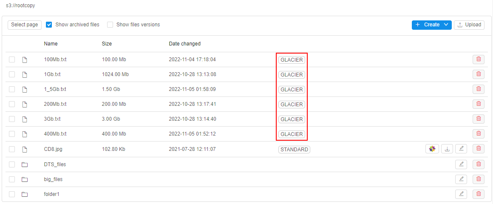
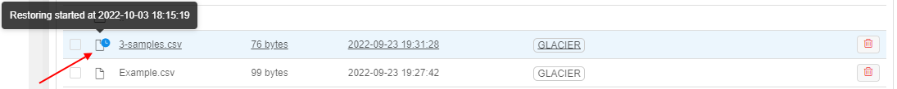
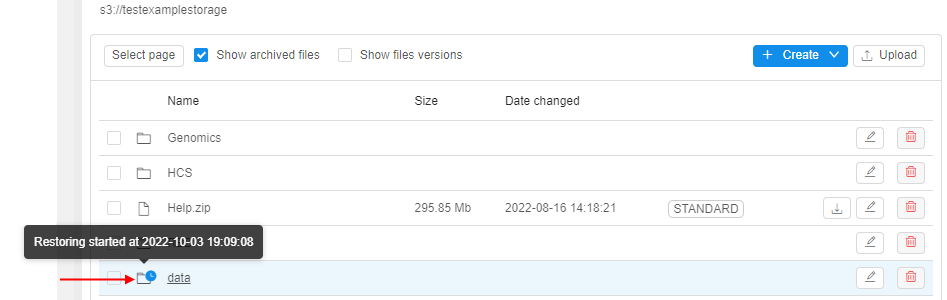

# 8.10. Storage lifecycle management

> **_Note_**: currently, described functionality may be supported not by all Cloud Providers

- [Archiving](#archiving)
    - [Create transition rule](#create-transition-rule)
    - [Edit transition rule](#edit-transition-rule)
    - [View rules and logs](#view-rules-and-logs)
        - [Rule logs](#rule-events-logs)
        - [View in attributes](#view-rules-in-attributes)
    - [Archived files](#archived-files)
        - [Listing via CLI](#listing-via-cli)
        - [View archive size](#view-archive-size)
- [Restoring](#restoring)
    - [Restore file](#restore-file)
    - [Restore folder](#restore-folder)

Users have the ability to manage the lifecycle of data in storages - configure the automatic data transition from standard storage to different types of archival storages by occurrence of a certain event and restore that data back as well if needed.  
That includes abilities:

- to create and edit multiple transition rules for a storage data based on file prefix and/or glob pattern
- to select an archive class as the data destination for each specific rule. **_Note_**: archive classes depend on the Cloud Provider
- to select the "deletion" operation as one of the possible data destinations - for the automated data removing
- to define the event by which the data shall be transferred
- to configure notifications:  
    - notifications on each lifecycle event
    - ability to delay data transition using link from notification email
- to restore previously archived files and folders

## Archiving

> **_Note_**: only storage **_OWNER_** or users with the **`ROLE_STORAGE_ARCHIVE_MANAGER`** or **`ROLE_ADMIN`** role are able to manage the archival rules

Data archiving in any storage is defined by the set of transition rules.  
For a storage, any count of transition rules can be created.  
Each rule includes:

- source path inside the storage where data for the transition will be searched
- glob that defines which specific data shall be transferred
- event that defines when data shall be transferred
- notification settings

Once the rule is created and saved - it automatically becomes enabled for the storage. All files matching the rule conditions will be transferred to corresponding archives according to configured dates.

### Create transition rule

To create a new transition rule:

1. Open a storage
2. Click  icon to open storage settings
3. Click the "**Transition rules**" tab:  
   
4. The tab with list of existing rules of the current storage will appear:  
   
5. Click the "**+ Create**" button
6. The pop-up will be opened:  
     
7. Here, the following fields shall be filled in:  
    - **Root path** - it is the path inside the storage, from which the search for files to transition (corresponding to the specified glob pattern) will be performed. _Text and glob patterns are supported_. Examples: `/`, `/some_folder/sub_folder/`, `/some_folder/*`
    - **Glob** - glob pattern for the file(s) to transfer. Pattern defines files that will be transferred by the current rule. Pattern will be applied in the storage path specified as root.  Examples: `*.csv` - any CSV file in the current root path, `/**/*.csv` - any CSV file in any subfolder of the root path.
    - **Method** - method that defines the transition process. There are 3 possible variants:  
        - _One by one_ (default) - each file matches the glob pattern will be transferred separately. For each such file separate notification will be sent (if notifications are enabled)
        - _By the earliest file_ - all files match the glob pattern will be transferred simultaneously - when the earliest file from them corresponds to all conditions of the transition rule
        - _By the latest file_ - all files match the glob pattern will be transferred simultaneously - when the latest file from them corresponds to all conditions of the transition rule
    - **Condition** - additional condition that shall be met to initiate the transition procedure. There are 2 possible variants:  
        - _Default_ - no additional conditions are required
        - _Files matches_ - if this condition is selected, a new field appears - to specify additional glob pattern. In this case, transition of the files that match main glob pattern can be performed only after in the root path the files will appear that match this additional glob pattern. Example - rule for the transition of `123.csv` file in case when `123.tsv` file appears:  
        
8. Next, the **Transitions** section shall be filled in. Here, you can specify destination(s) where exactly files shall be transferred and in which dates:  
    - **Destination** - destination where files matches the glob pattern will be transferred. Possible variants are depend on the Cloud Provider. For example, for `AWS` there are: `S3 Glacier Instant Retrieval`, `S3 Glacier Flexible Retrieval`, `S3 Glacier Deep Archive`. Additionally, there is the `Deletion` destination - to remove files once the transition event has come:  
    
    - **Date** - date when files match the glob pattern will be transferred. There are two variants (only one can be selected for the rule):  
        - _the count of days_ - days count from the file creation after which the transition will be performed. For example, if in this field the count `30` is specified - so files match the glob pattern in the root path will be transferred to `S3 Glacier Instant Retrieval` after `30` days after their appearance in the current storage:  
        
        - _specific date_ - files match the glob pattern in the root path will be transferred exactly in that date:  
        
9. By default, at least one item shall be in the **Transitions** section. You can add several destinations here (up to total count of available destinations) - via the "**+ Add**" button.  
    For example:  
      
      
      
    To remove the destination item from the list - click the **Delete** icon in the corresponding row
10. Next, the **Notify** section shall be filled in.  
    **_Note_**: notifications are defaultly disabled in case when `One by one` transition method is selected. To configure notifications you shall select any other method.  
      
    Here you can configure:  
    - disable all notifications for the current rule by the corresponding checkbox, if needed
    - **Recipients** - list of recipients (users and groups/roles) who shall receive notifications
    - **Notice period** - period in days before the transition (according to specified date in the **Transitions** section) - when the notification about further transition will be sent.  
    **_Note_**: if it is not specified - the default value will be used from the System Preference **`storage.lifecycle.notify.before.days`** during the rule performing
    - **Prolongation period** - period in days for which the transition can be delayed - it may happen in case when user clicks the **Prolongate** button from the email notification. This prolongate period will be applied explicitly to files for which notification is received. After prolongation period is over, a new notification will be sent. Prolongations can be performed any number of times.  
    **_Note_**: if **Prolongation period** is not specified - the default value will be used from the System Preference **`storage.lifecycle.prolong.days`** during the rule performing
    - notification template. By default, the template from [**DATASTORAGE\_LIFECYCLE\_ACTION**](../12_Manage_Settings/12._Manage_Settings.md#templates) email notification is used (this behavior is defined by the corresponding checkbox). If you want to specify custom notification template for a rule - untick the checkbox **Use default template** - fields **Subject** and **Notification** will appear, where changes can be made:  
      
    You have the ability to view/edit these fields and also preview - how the notification will be displayed in the email:  
      
    **_Note_**: if the notification subject/body will be changed via this section - this will impact only to the ending view of the current rule notifications and will not change the default [**DATASTORAGE\_LIFECYCLE\_ACTION**](../12_Manage_Settings/12._Manage_Settings.md#templates) template
11. After all fields of the rule are filled in - click the **Save** button to proceed:  
    
12. Just-created rule will appear in the list:  
    

### Edit transition rule

To edit an existing transition rule:

1. Open a storage
2. Click  icon to open storage settings
3. Click the "**Transition rules**" tab:  
   
4. The tab with list of existing rules of the current storage will appear:  
   
5. Click  icon to open the desired rule, e.g.:  
   
6. The pop-up with rule details will be opened:  
   
7. Here, you can edit any details except **Root path** and **Glob**.  
   Click the **Save** button to confirm changes.

### View rules and logs

To view rules configured for the storage - open its settings and switch to the "**Transition rules**" tab:  
    

> **Note**: if the rule has several transition destinations - they are shown above the special label within a tooltip, e.g.:  
>   

#### Rule events logs

To view all events performed according to the current rule - click the **View events logs** icon at the rule row.  
The form with list of events of the selected rule will appear:  
    

That form contains:

- info fields:  
    - **Root** - root path of the current rule
    - **Glob** - glob of the current rule
- **Action type** dropdown list - to filter logs table by performed action (`transition`/`deletion`/`prolongation`). Empty value in this field means that logs table is not filtered
- logs table with columns:
    - **Date** - datetime of the event
    - **Action** - type of the performed action
    - **User** - in case of system actions, there will be the stub `System`. In case of prolongation event, there will be a user name who has prolonged transition for a file(s)
    - **Path** - path to the folder that contains files with which the action was performed
    - **Destination** - transition destination
    - **Prolongation** - period in days for which transition/deletion was delayed (**_Note_**: applicable only for prolonged files)
    - **Renewed transition** - a new date when transition/deletion will take place (**_Note_**: applicable only for prolonged files)

#### View rules in attributes

If for a storage transition rules are configured - you can view that in the **Attributes** panel:

1. Open the desired storage
2. Click the "**Show attributes**" button in the right upper corner
3. In the **Attributes** panel, total count of configured rules will be shown, e.g.:  
    

> **_Note_**: you can check the count of rules configured for a specific folder - by similar way as described, you should open that folder and the **Attributes** panel for it.

### Archived files

If file was transferred to any destination (except `Deletion`) by some rule:

- this file becomes disabled for changing/renaming from the GUI/CLI
- content of this file can not be viewed from the GUI/CLI
- at the GUI, near such file a label appears that corresponds to the transition destination
> **_Note_**: regular files in storages has `STANDARD` label.

Example for `AWS` **Cloud Provider**:  
    

> Please note, archived files are not visible for general users:
>
> - only storage **_OWNER_** or users with the **`ROLE_STORAGE_ARCHIVE_READER`** or **`ROLE_ADMIN`** role are able to view the archived files
> - by default, archived files are hidden. To show them - the checkbox **Show archived files** shall be enabled:
>    

#### Listing via CLI

> For details, how to manage storages via the CLI see the corresponding section [Manage Storages](../14_CLI/14.3._Manage_Storage_via_CLI.md).

As mentioned above, archived files are disabled for changing/renaming/viewing/copying/moving from the CLI.  
By default, archived files are invisible for users that perform any `pipe storage` commands (including `mount` abilities).

For example, storage with archived files via the GUI:  
      
The same storage via the CLI (using `pipe storage ls` command):  
      
The attempt to copy one of the archived file (using `pipe storage cp` command):  
    

But if users want to browse archived files via the CLI, the special option `--show-archive` can be used. This flag allows to list archived files in storages.  
> **_Note_**: flag allows only the listing of archived files, still not changing/renaming/copying/moving.

The same storage as in the example above but with `--show-archive` flag via the CLI (using `pipe storage ls` command):  
    

#### View archive size

User can separately view the common info about whole size of the archived files.  
To view that info, open the attributes panel of a storage, e.g.:  
    

Here, the following info is shown:

- the whole summary size of all archived files - it is based on the sum of sizes of current and previous versions of files (for all archive types)
- the whole summary size of only previous versions of archived files in the storage (for all archive types) - it is shown in the parentheses 

To view details, click the corresponding hyperlink:  
      
Details info pop-up will be opened, e.g.:  
    

Here, the following info about archived files size can be found:

- **Storage class** - archive type. The type is presented in the table only if there are/were any versions of files of this archive type
- **Current ver.** - the whole summary size of all current versions of archived files
- **Previous ver.** - the whole summary size of all previous versions of archived files
- **Total** - sum of the current and previous files versions

> **_Note_**: info about the archive size can be viewed via the CLI `pipe storage du` command as well, e.g.:  
>      
> In the CLI, only total summary size of current and previous files versions is shown.
>
> To view details about archive types, use `-o f` option (`--output-mode full`):  
>    
>
> For more details see in the [`pipe storage du`](../14_CLI/14.3._Manage_Storage_via_CLI.md#show-storage-usage) section.

## Restoring

> **_Note_**: data restoring in the storage is available for admins and storage **_OWNER_** only

If there are files in the storage folder that were previously transferred to any destination (except `Deletion`) according to some transition rule - user has the ability to restore such files.
That available:

- for separate file(s)
- for whole folder

### Restore file

To restore a file:

1. Open a storage
2. Select the desired file(s) you want to restore
3. Click the "**Restore transferred item**" button in the management menu:  
    
4. Pop-up to confirm restoring will appear:  
      
    This pop-up contains fields for:  
    - **Recovery period** - to specify the period duration for which the file will be restored
    - **Recipients** - to specify recipients who will be notified about file restoring process (by email notification [**DATASTORAGE\_LIFECYCLE\_RESTORE\_ACTION**](../12_Manage_Settings/12._Manage_Settings.md#templates)). If this field was left empty - file will be restored without notifications
    - **Restore mode** - to select the restore mode (`Standard` or `Bulk`). This affects on duration of restoring processes and their cost.  
    Additionally, you have the ability to define - restore only the latest file version (default behavior) or all file versions - via the corresponding checkbox **Restore all versions** (**_Note_**: this checkbox is available only for versioning storages)
5. Click the **Restore** button to confirm
6. If for a file the restoring is requested - the restoring status will appear at the file icon:  
      
    There are possible states:  
    - **RESTORING**  - restore operation is in progress. This status is shown after the request for the restore was submitted and until the file is restored successfully or restoring is failed
    - **RESTORE FAILED** - restore operation is failed. This status is not shown at the GUI
    - **RESTORED**  - restore operation is completed. This status is shown after the file is restored successfully and till the date when the recovery period is finished.  
    You may hover over any state icon and view details of restoring process in a tooltip, e.g.:  
      
    
> **_Note_**: if file was restored for some period:
>
> - this file becomes enabled for changing/renaming from the GUI/CLI
> - content of this file can be viewed from the GUI/CLI
> - label of the file original destination doesn't disappear
> - after restore period is over, file becomes regular [archived](#archived-files) file

### Restore folder

When user restores the whole folder - all previously transferred files in that folder will be restored simultaneously. Also, all transferred files in sub-folders of the folder, will be restored too - recursively.

To restore a folder:

1. Open a storage
2. Open the desired folder you want to restore
3. Open the **Attributes** panel
4. Click the "**Restore files**" hyperlink:  
    
5. Pop-up to confirm restoring will appear:  
      
    Options are similar as for the [file restore](#restore-file) operation
6. Click the **Restore** button to confirm
7. All files in the folder that will be restored are shown with the corresponding state:  
      
    Additionally, the state of the folder restore operation is shown in the **Attributes** panel
8. You may navigate to the upper level and view the state for the restoring folder (similar to restoring files):  
    
9. Restored files in restored folder are shown fully the same as separately [restored files](#restore-file):  
      
    
