# 8.11. Sensitive storages

- [Create sensitive storage](#create-sensitive-storage)
- [Mounting sensitive storages](#mounting-sensitive-storages)
- [Main restrictions in sensitive runs](#main-restrictions-in-sensitive-runs)

By default, Cloud Pipeline platform allows performing upload/download operations for any authorized data storage.  
But certain storages may contain sensitive data, which shall not be copied anywhere outside that storage.

For storing such data, special "sensitive" storages are suitable.  
Sensitive data from that storages can be used for calculations or different other jobs, but this data cannot be copy/download to another regular storage/local machine/via the Internet etc. Viewing of the sensitive data is also restricted.

> **_Note_**: at the moment, only the Object storages could be used as "sensitive".

## Create sensitive storage

To create sensitive object storage:

1. Start create a new object storage:  
    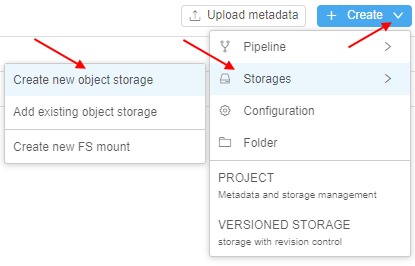
2. In the appeared popup, specify desired storage path and set the "**Sensitive storage**" checkbox:  
      
    Click the **Create** button to confirm
3. The new sensitive storage will appear:  
    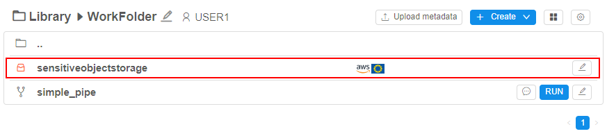  
> **_Note_**: to distinguish sensitive storages from regular ones in the library, the sensitive storages are marked by red icon .  
4. Via the GUI, the sensitive storage looks similar to the regular object storage, but there are some differences (even for admin/storage **_OWNER_**):  
      
    - Download buttons for the storage files are hidden
    - **Share** / **Generate URL** button for the selected storage files is hidden
    - Preview of any files aren't available
    - Editing of any files isn't available

So via the GUI, files/folders in the sensitive storage can be created/renamed/removed (by **_OWNER_**/admin) but can't be downloaded/viewed or edited by any user.

## Mounting sensitive storages

User can configure the list of the storages that will be mounted to the container during the run initialization. This can be accomplished using the [**Limit mount** field](../06_Manage_Pipeline/6.1._Create_and_configure_pipeline.md#example-limit-mounted-storages) of the **Launch** form.

By default, sensitive storages aren't available to mount - only non-sensitive storages could be mounted, e.g.:  
    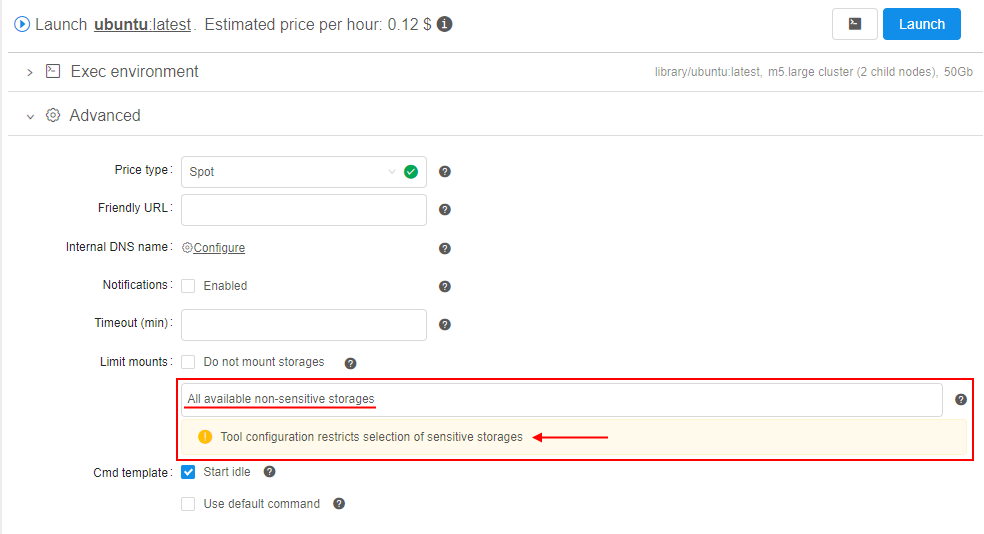

To change this restriction for a specific tool, admin or image owner shall:

1. Open the **Tool** page
2. At the **Tool settings** page, set the "**Allow sensitive storages**" checkbox:  
    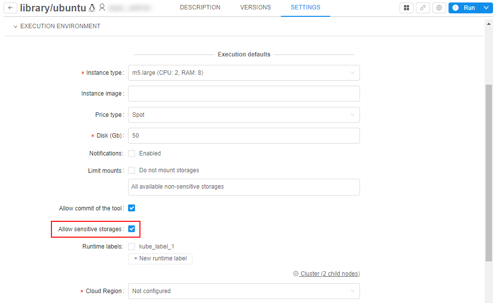
3. If this checkbox is set for a tool, sensitive storages also can be selected for the mounting for a job running - in the storages list, they are marked by the special label , e.g.:  
    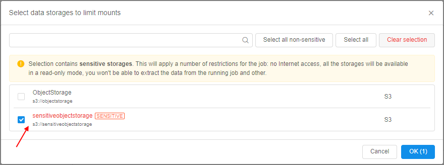

If at least one sensitive storage is selected for the mounting before a job launching - such job becomes "_sensitive run_".  
For sensitive runs, there are some restrictions - see the section [below](#main-restrictions-in-sensitive-runs).

> **_Note_**: by default, even if sensitive storages are allowed for a tool, only the all non-sensitive storages will be mounted to a job. Sensitive storages will be mounted to a job only if they were enforced in the "**Limit mounts**" field.

Before the launching a sensitive run, the additional warning is shown:  
    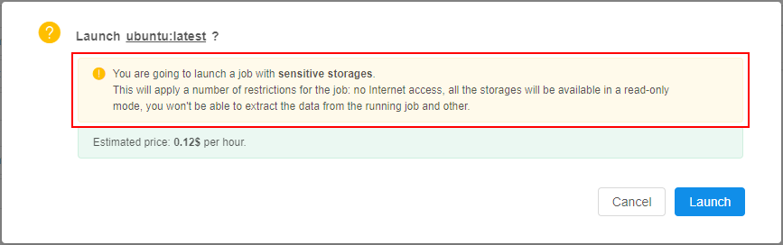

For the launched run, the fact that it relates to "sensitive runs" is shown by additional labels:

- at the **Runs** page:  
    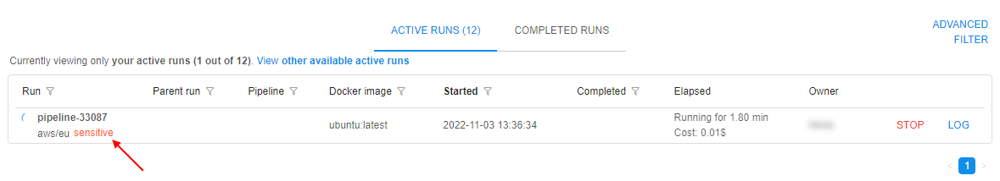
- at the **Run logs** page:  
    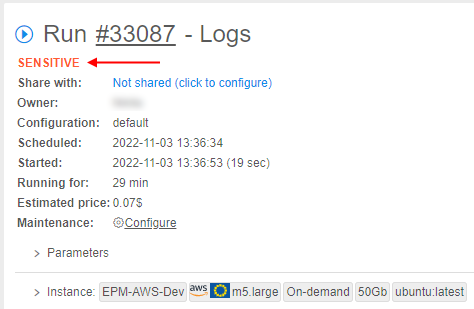

## Main restrictions in sensitive runs

For _sensitive_ runs (runs with at least one mounted sensitive storage) all selected storages for the mounting (not only sensitive) are being mounted in **readonly** mode to exclude any copy/move operations between storages.

Files from the sensitive storages can be viewed **_inside_** the sensitive run and also copied into the inner instance disk, but not to any other storage.

Files from the sensitive storages can't be viewed **_outside_** the sensitive run or copied/moved anywhere (for example, when using not the web-terminal version of [`pipe`](../14_CLI/14._Command-line_interface.md) SSH).

There are following additional restrictions while using sensitive storages:

- [**FSBrowser**](../15_Interactive_services/15.3._Expose_node_filesystem.md):
    - **FSBrowser** isn't being installed for the sensitive runs
    - **FSBrowser** button isn't being displayed in the GUI for such jobs  
    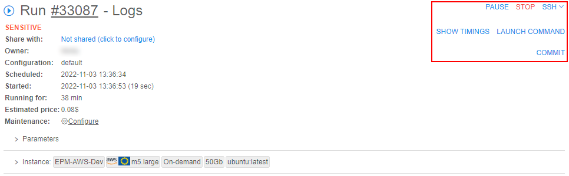
- [**SSH-session**](../15_Interactive_services/15.2._Using_Terminal_access.md) _inside_ the sensitive run:  
    - additional warning about restrictions is shown
    - `pipe storage ls` operation is available to list any mounted storage
    - `pipe storage cp` operation is available to download data only to the run's filesystem, even from the sensitive storage
    - `pipe storage mv/rm` operations aren't available for any mounted storage  
    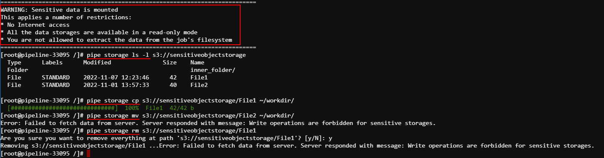
    - `pipe storage mount -b` operation allows to mount any object storage including sensitive, but in a **readonly** mode
- [**SSH-session**](../14_CLI/14.1._Install_and_setup_CLI.md) _outside_ the sensitive run:  
    - `pipe storage ls` operation is available to list any mounted storage
    - `pipe storage cp/mv/rm` operations aren't available if the source or destination is a sensitive storage  
    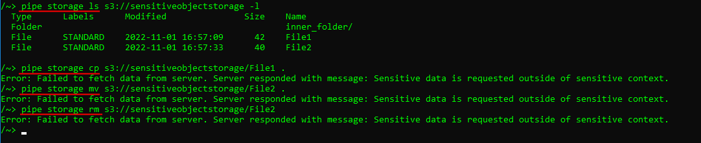
    - `pipe storage mount -b` operation doesn't allow to mount sensitive storages
- **Interactive endpoint GUI** - data transfer capabilities are also restricted for the following tools: [`RStudio`](../15_Interactive_services/15.1._Starting_an_Interactive_application.md), [`Jupyter (notebook/lab)`](../15_Interactive_services/15._Interactive_services.md#supported-services).  
    The behavior with the interactive endpoints GUI is similar to SSH-session _inside_ the sensitive run - user can list/view files from any mounted storage and copy them into the inner run's filesystem, but move/remove operations for any mounted storage are forbidden.
