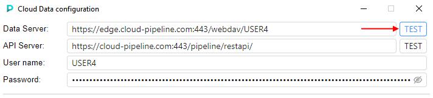
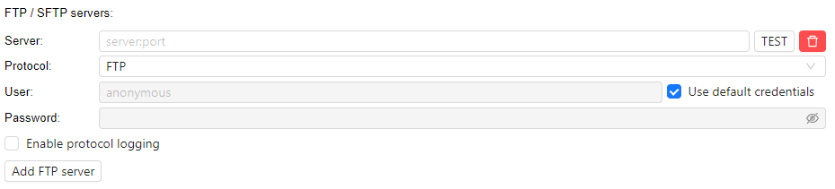
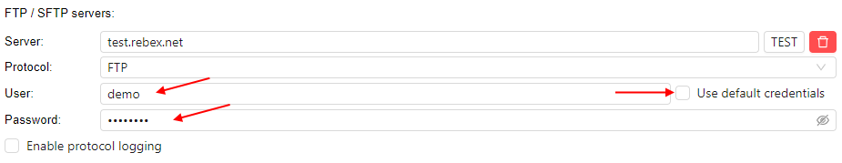
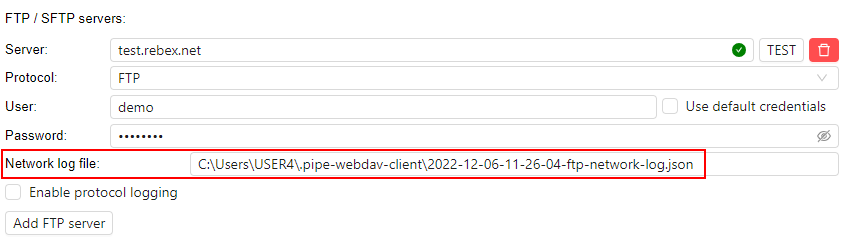

# 8.12. Cloud Data application

- [Installation](#installation)
- [Overview](#overview)
    - [Select panel source](#select-panel-source)
        - [Allow an additional FS mount](#allow-an-additional-fs-mount)
        - [Allow an additional object storage](#allow-an-additional-object-storage)
    - [Manage content](#manage-content)
        - [Create a folder](#create-a-folder)
        - [Copy file/folder](#copy-filefolder)
        - [Move file/folder](#move-filefolder)
        - [Delete file/folder](#delete-filefolder)
- [Configuration](#configuration)
    - [Configuration verification](#configuration-verification)
    - [FTP/SFTP server config](#ftpsftp-server-config)
        - [Add/remove FTP server connection](#addremove-ftp-server-connection)
        - [Connect to FTP server](#connect-to-ftp-server)
    - [Update application](#update-application)

As you can see at [8.9. Storages mapping](8.9._Mapping_storages.md), Cloud Pipeline platform allows to mount [NFS](8.7._Create_shared_file_system.md) data storages to the local workstation as a network drive.  
This way has some restrictions (such as OS of the local workstation and ability to map only FS storages).  

There is another Platform capability that provides a simple and convenient way to manage files, copy/move them between Cloud data storage and local workstation or FTP-server.
This is implemented via the separate application that can be downloaded from the Cloud Pipeline Platform and launched at the local machine - **Cloud Data** application.

## Installation

To start use the Cloud Data application, you shall download it.
URLs for downloading for different operation systems can be found via the [System Preference](../12_Manage_Settings/12.10._Manage_system-level_settings.md#base-urls) **`base.cloud.data.distribution.url`**:  
   

Copy the desired URL and download the distribution archive in any way you prefer.  
In the current tutorial, the Windows distribution will be used:  
   

Unzip the downloaded archive, open the unzipped folder and launch `cloud-data` executable file:  
   

> **_Note_**: in Windows, Microsoft Defender may prevent a launch of the Cloud Data application:  
>   
> In this case, click the **More info** button, and confirm the launch by click **Run anyway** button:  
> 

The Cloud Data application will appear:  
     

Please note, that at first launch the configuration pop-up will appear over the main application.  
The following fields *shall be autofilled* (check this and if they are not filled or filled incorrectly - correct):

- **Data Server**. Shall contain the address of the data server in format `<WebDAV authentication URL for <username>>`. Where:
    - `<username>` is the current user name
    - `<WebDAV authentication URL>` is the corresponding URL value configured for your Cloud Pipeline environment - can be found, for example, in the [System Preference](../12_Manage_Settings/12.10._Manage_system-level_settings.md#base-urls) **`base.dav.auth.url`**
    - user name shall be inserted instead `auth-sso` part of URL, e.g. if **`base.dav.auth.url`** value is `https://exampleserver.com:443/webdav/auth-sso/` and current user is `USER123` then the Data Server address shall be `https://exampleserver.com:443/webdav/USER123`
- **API Server**. Shall contain the address of the API server of your Cloud Pipeline environment. Can be found, for example, in the [System Preference](../12_Manage_Settings/12.10._Manage_system-level_settings.md#base-urls) **`base.api.host`**
- **User name**. Shall contain the current user name

To connect the application to the Cloud Pipeline, specify your password to the corresponding field - here, your Cloud Pipeline access token means.  
> **_Note_**: to get your access token - in the Cloud Pipeline, open **System Settings**, then **CLI** tab, and in the sub-tab **Pipe CLI**, click the "**Generate access key**" button:  
> 

After main settings are configured, click the **Save** button to confirm:  
     
**_Note_**: for more details about application configuration see [below](#configuration).

Configuration pop-up will be closed and the main form of the Cloud Data application will become available:  
   

## Overview

Cloud Data application allows you manage files/folders as in a file commander.  
For example, here you can list files from different sources, create folders, copy/move files and folders between local workstation and Cloud datastorage, or between external FTP server and datastorage.

Main application form contains two panels (left and right).  
In each panel, one of the following sources can be opened: **local workstation** / **FTP server** / **Cloud data** (datastorages).

Panels have the identical structure:  
     

Where:  
**1** - content management buttons  
**2** - panel source selector  
**3** - path to the current opened content   
**4** - opened source content

By default in panels, the following content is opened:

- in the left panel, the **_local_** content. This content shows files and folders of the local workstation (by default, _home_ user's directory). Navigation between and inside folders is available.  
   
- in the right panel, the **_Cloud data_** content. This content includes:
    - all FS mounts from the Cloud Pipeline environment - to which current user has permissions.  
      They are shown as simple folders
    - those object storages from the Cloud Pipeline environment - to which current user has permissions and "File system access" is allowed.  
      They are shown with storage icon
    - Navigation between and inside folders/storages is available  
   

### Select panel source

To select the source for the panel content:

1. Click the **Source selector** of the desired panel
2. In the appeared list, select the desired source, e.g.:  
   
3. Selected source will be opened in the panel:  
   

#### Allow an additional FS mount

To view the FS mount in the Cloud data list, user shall have corresponding persmissions on that mount.  
So, to get access to a specific FS mount in the Cloud Data application:

> Firstly, Admin or FS mount owner shall set permissions for the user on that FS mount, e.g.:  
   

1. Wait a couple of minutes after permissions are set
2. Click the **Reload** button in the application panel with Cloud data:  
   
3. Additional FS mount appears in the Cloud data list:  
   

#### Allow an additional object storage

To view the object storage in the Cloud data list:

- user shall have corresponding persmissions on that storage
- for that storage, "file system access" shall be requested

File system access for the storage can be requested for a certain period of time.  
This period is defined by the [System Preference](../12_Manage_Settings/12.10._Manage_system-level_settings.md#data-storage) **`storage.webdav.access.duration.seconds`**.

So, to get access to a specific object storage in the Cloud Data application:

> Firstly, admin or object storage owner shall set permissions for the user on that object storage, e.g.:  
>   

1. Click the storage icon in the right upper corner of the application:  
   
2. The list of all object storages available for the user appears:  
     
   Click the "**Request access**" hyperlink near the object storage(s) that wish to get access
3. When the access is requested, instead hyperlink the label appears with info - till which date and time the access is provided:  
     
   Close the pop-up
4. Wait a couple of minutes
5. Click the **Reload** button in the application panel with Cloud data:  
   
6. Additional object storage appears in the Cloud data list:  
   

> **_Note_**: "file system access" can be requested in the other way - using the Cloud Pipeline GUI.
>
> Instead steps 1-3, you may:
> 
> - Open the desired object storage via the Cloud Pipeline GUI
> - Open the **Attributes** panel of the storage
> - Click the "**Request file system access**" hyperlink in the **Attributes** panel:  
>  
> - When the access is requested, instead hyperlink the label appears with info - till which date and time the access is provided:  
>  
>
> To cancel the requested file system access - click the **Disable** hyperlink.  

If the file system access was requested from the Cloud Data application - this will be shown in the **Attributes** panel of the storage as well, and vice versa.

### Manage content

Below, the main abilities for data management via Cloud Data application are described.  
These abilities apply similarly independently of source/destination selected in the application panel.

#### Create a folder

> User shall have **_WRITE_** permission to the object where the folder will be created.

To create a folder:

1. In any application panel, select a desired source and navigate to the path where you wish to create a folder, e.g.:  
   
2. Click the button  in the upper side of the panel (or just press F7 key)
3. In the appeared pop-up, specify the name for the creating folder, e.g.:  
     
   Click the **CREATE** button to confirm.
4. Just-created folder will appear in the selected panel:  
   

#### Copy file/folder

> User shall have **_WRITE_** permission to the object where the file/folder will be copied.

To copy a file/folder:

1. In one panel select a source, which you wish to copy - select it by click. In the second panel navigate to a destination path where you wish to copy, e.g.:  
   
2. Click the button  in the upper side of the source panel (or just press F5 key)
3. Object will be copied to the destination path:  
   

> **_Note_**: in case of copying of a large object(s), you may observe the processing in the bottom side of the application, e.g.:  
>   
> If needed, you may cancel such copying process by click the cross-button.

#### Move file/folder

> User shall have **_WRITE_** permission to the object from which the file/folder will be moved.  
> User shall have **_WRITE_** permission to the object where the file/folder will be moved.

To move a file/folder:

1. In one panel select a source, which you wish to move - select it by click. In the second panel navigate to a destination path where you wish to move, e.g.:  
   
2. Click the button  in the upper side of the source panel (or just press F6 key)
3. Object will be moved to the destination path:  
   

> **_Note_**: in case of moving of a large object(s), you may observe the processing in the bottom side of the application - identically as due the copying of large objects.

#### Delete file/folder

> User shall have **_WRITE_** permission to the object where the file/folder will be removed.

To move a file/folder:

1. Select an object, which you wish to remove - by click it, e.g.:  
     
   Click the **Delete** button in the upper side of the source panel (or just press F8 key).
2. Confirm the deletion:  
   
3. Object will be removed from the source. Source panel will be refreshed automatically.

## Configuration

To configure the Cloud Data application click the **gear** icon in the right upper corner of the main form.  
The **Configuration** pop-up will be opened:  
   

This pop-up contains the following configuration settings:

- application connection settings (see details [above](#installation)):
    - _Data Server_ - address of the data server's WebDAV authentication URL
    - _API Server_ - address of the Cloud Pipeline environment's API server
    - _User name_ - user name who gets access the Cloud Pipeline environment
    - _Password_ - user's authentication token (access key)
- "**FTP/SFTP servers**" section - allows to specify credentials to connect the application to FTP/SFTP server(s)
- "**Ignore certificate errors**" checkbox - allows to ignore certificate errors of EDGE service and FTP servers (if they exist/occur)
- "**Enable logging**" checkbox - allows to store logs of all actions performed in the application.  
  If this checkbox is enabled - a separate logs file will appear on the local disk (by default, path to the logs directory is `<USER_HOME_DIR>/.pipe-webdav-client/`, logs file name has format `<current_date>-logs.txt`)
- "**App component version**" label contains the current version of the Cloud Data application
- updates section (_optional_) - allows to install a newer version of the application if it is available. See details [below](#update-application).

> **_Note_**: below, the possible scenarios of the application configuration are described.  
> Don't forget to save the configuration after updates - by click the **Save** button in the bottom side of the **Configuration** pop-up.

### Configuration verification

When application connection settings are specified - you can verify if they are correct and application can connect to the Cloud Pipeline environment.  

To verify Data Server connection, click the **TEST** button near the **Data Server** field:  
     
Results will appear inside the **Data Server** field - it will be one of two icons:

- when specified settings are correct (i.e. connection can be initialized):  
   
- when connection can not be initialized by specified settings. Hover over the icon - in a tooltip, the main error will be shown, e.g.:  
   

In both cases, testing connection log is created and placed to the local disk.  
Path to the current log file is shown in the **WebDAV Network log file** field under server settings (for each connection verification, a separate log file is created):  
     

By the similar way, you may verify the API Server connection.  
In this case, logs will be written to the **API Network log file**, e.g.:  
   

**_Note_**: do not confuse these logs files with the main application logs file that can be enabled by the corresponding checkbox in the **Configuration** menu (see section above for details).

### FTP/SFTP server config

Cloud Data application allows to copy files/folders not only between local workstation and Cloud data storages, but from FTP-server as well.  
To use the FTP-server as source - it shall be previously added into the application configuration.

#### Add/remove FTP server connection

1. Click the **Add FTP server** button:  
   
2. The section will appear where you shall specify FTP connection settings:  
   
3. To the **Server** field specify FTP server address in the format `<server>[:<port>]`, e.g.:  
   
4. From the **Protocol** dropdown list, select the protocol of the adding FTP server. Possible options:  
    - `FTP`
    - `SFTP`
    - `FTP-SSL (implicit)`
    - `FTP-SSL (expilicit)`  
    
5. If authentication (login-password) is required for the adding FTP server:  
    - untick "**Use default credentials**" checkbox
    - specify user name and password  
    
6. If you wish to store logs of the connection process to this FTP server - tick the "**Enable protocol logging**" checkbox.  
   If this checkbox is enabled - for this FTP server, a separate log file will appear on the local disk (by default, path to the logs directory is `<USER_HOME_DIR>/.pipe-webdav-client/`, logs file name has format `<current_date>-<ftp_server>.txt`).
7. When all settings are specified - you can verify the connection settings are correct.  
   Click the **TEST** button near the **Server** field:  
        
   Results will appear inside the **Server** field - it will be one of two icons:  
    - when specified settings are correct (i.e. connection can be initialized):  
      
    - when connection can not be initialized by specified settings. Hover over the icon - in a tooltip, the main error will be shown, e.g.:  
        
    In both cases, testing connection log is created and placed to the local disk. Path to the log file is shown in the **Network log file** field under server settings (for each connection verification, a separate log file is created):  
        
    **_Note_**: do not confuse this log file with the connection logs file described at step 6.
8. You may add any count of FTP servers - just repeat steps 1-7 for each desired server, e.g.:  
   

To remove the specified FTP connection - click the remove button near the **Server** field:  
   

#### Connect to FTP server

If you have added FTP server(s) to the application configuration - you may use them as data source in any application panel.

To connect to the FTP server:

1. Click the **Source selector** of the desired panel
2. In the appeared list, select the desired FTP server, e.g.:  
   
3. Selected FTP server will be opened in the panel:  
   

Then, you may use all abilities of data management described [above](#manage-content).

### Update application

When a new version of the Cloud Data application becomes available - you will receive the corresponding notification:  
   

Click the hyperlink **Install updates** to update the application.  
Don't close the Cloud Data application manually. Some auxiliary applications can be launched during the update.  
Once all updates are installed, the application will be automatically relaunched.

> **_Note_**: if updates for the application are available - they can be install from the configuration pop-up as well:  
> 
