# 8.13. Versioned storages

- [Manage versioned storages](#manage-versioned-storages)
    - [Create versioned storage](#create-versioned-storage)
    - [View and edit content](#view-and-edit-content)
        - [Create a folder/file](#create-a-folderfile)
        - [Edit file content](#edit-file-content)
        - [Rename a file/folder](#rename-a-filefolder)
        - [Remove a file/folder](#remove-a-filefolder)
- [Version control](#version-control)
    - [Commit history of the file](#commit-history-of-the-file)
        - [Download a specific version](#download-a-specific-version)
        - [Revert to a specifid version](#revert-to-a-specifid-version)
        - [View diffs](#view-diffs)
    - [Commit history of the folder](#commit-history-of-the-folder)
    - [Filter commit history](#filter-commit-history)
    - [Generate changes report](#generate-changes-report)
- [GIT operations with versioned storages](#git-operations-with-versioned-storages)
    - [Load versioned storage content to the instance](#load-versioned-storage-content-to-the-instance)
        - [Launch a run with the content cloning](#launch-a-run-with-the-content-cloning)
        - [Clone content to the already running instance](#clone-content-to-the-already-running-instance)
    - [View diffs of changed cloned content](#view-diffs-of-changed-cloned-content)
    - [Save changed content from the run to the versioned storage](#save-changed-content-from-the-run-to-the-versioned-storage)
        - [Save changed content with the conflict resolving](#save-changed-content-with-the-conflict-resolving)
    - [Update cloned content in the run](#update-cloned-content-in-the-run)
        - [Refresh cloned content](#refresh-cloned-content)
        - [Change the revision for the content](#change-the-revision-for-the-content)

In some cases, there is not enough to only store data in storages/place computation results there but also there is a request for the full value system of the revision control of stored data - to view revisions, history of changes, diffs between revisions.  
So far, for separate storages types (e.g. `AWS` s3 buckets), there is the ability to enable the [versioning](8.4._Control_File_versions.md) option. But it is not the same. Versioning allows to manage the versions of the certain file, not the revisions of the full storage, which revision can contain changes of several files or folders.  
For the needs of full version control of the storing data, there is a special storage type in the **Cloud Pipeline** - "Versioned" storage.

These storages are GitLab repositories under the hood, all changes performed in their data are versioned. Users can view the history of changes, diffs, etc.  
Such storages can be also mounted during the runs, data can be used for the computations and results can be comitted back to such storages - with all the benefits of a version control system.

## Manage versioned storages

### Create versioned storage

To create versioned storage:

1. Navigate to the folder where you want to create data storage.
2. Click **+ Create** → **VERSIONED STORAGE**:  
    
3. The pop-up of the versioned Storage creation will appear:  
    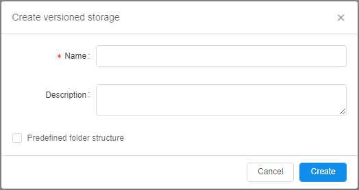
4. Specify the name of the creating storage (_mandatory_) and description (_optionally_), e.g.:  
    
5. By default, the creating versioned storage will be empty.  
    But you may define a folders structure for it before the creation:  
    - set the "**Predefined folder structure**" checkbox
    - in the appeared field, specify a structure you want the storage will have:  
    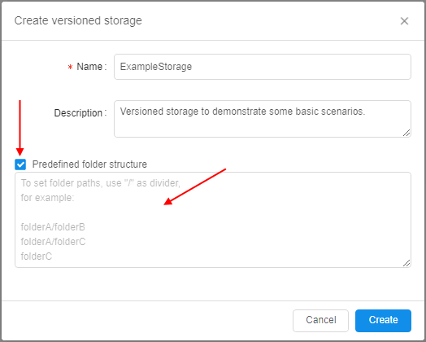
    - structure shall include folder paths in format: `<folder1>/<subfolder1>/...` (each subfolder is is delimited by `/`), each new folder on the same level from the root of the storage shall starts from the new line, e.g.:  
    
6. Click the **Create** button to confirm.
7. Just-created versioned storage will appear in the folder:  
    
8. If you have predefined the structure - you may see it is created as well:  
    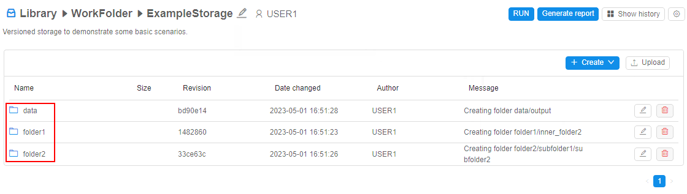

> **_Note_**: not to confuse with regular object storages, versioned storage icons (and all objects inside them) are colorized in blue color:  
>   

### View and edit content

The view of the versioned storage is similar to regular [data storage](8._Manage_Data_Storage.md#8-manage-data-storage) with some differences:  
    

- for each file/folder in the storage, the following columns are displayed:
    - _Name_ - file/folder name
    - _Size_ - file size (empty for folders)
    - _Revision_ - latest revision (SHA-1 hash of the latest commit) touched that file/folder
    - _Date changed_ - date and time of the latest commit touched that file/folder
    - _Author_ - user name who performed the latest commit touched that file/folder
    - _Message_ - message of the latest commit touched that file/folder
- for each file in the storage, there are additional buttons similar to regular storage - to download file to the local workstation, to rename the file and to remove the file from the storage
- for each folder in the storage, there are additional buttons similar to regular storage - to rename the folder and to remove the folder from the storage
- **RUN** button - allows to run the tool with cloning of the current versioned storage into the instance - see details [below](#launch-a-run-with-the-content-cloning)
- **Generate report** button - allows to configure and then download the report of the storage usage (commit history, diffs, etc.) - see details [below](#generate-changes-report)
- **Show history** button - allows to open the panel with commit history info of the current versioned storage or selected folder - see details [below](#commit-history-of-the-folder)
- settings button ("**gear**" icon) - allows to open the seetings pop-up where:
    - versioned storage can be edited (name and description can be changed) or removed:  
    
    - permissions on the storage can be configured:  
    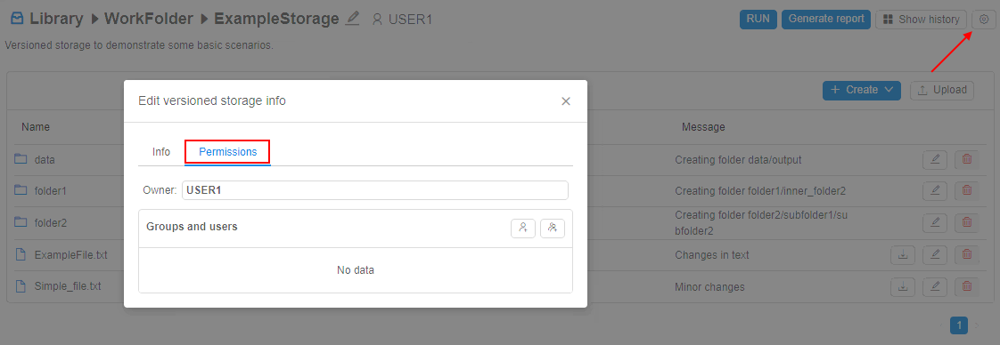
- buttons to create file/folder and to upload data are similar to the corresponding ones in regular storages

#### Create a folder/file

To create a folder:

1. Click "**+ Create**" button in the versioned storage
2. In the list, select the **Folder** item:  
    
3. The pop-up will appear to specify a new folder name and commit message:  
    
4. Specify a folder name (_mandatory_).  
    The commit message may be omitted. If it is not specified - it will be set automatically.  
    Click **OK** button to confirm:  
    
5. After the creation, a new revision of the storage will be created (contains only differences with the previous revision).  
    Just-created folder will appear in the storage:  
    

To create a file:

1. Click "**+ Create**" button in the versioned storage
2. In the list, select the **File** item:  
    
3. The pop-up will appear to specify a new file name and commit message.
4. Specify a file name (_mandatory_).  
    The commit message may be omitted. If it is not specified - it will be set automatically.  
    Click **OK** button to confirm, e.g.:  
    
5. After the creation, a new revision of the storage will be created (contains only differences with the previous revision).  
    Just-created file will appear in the storage:  
    

> **_Note_**: during the file creation in the versioned storage, you are not able to specify the file content simultaneously (as it is possible for regular storages) - therefore file is created with the zero-size. To add a file content - [edit](#edit-file-content) it.

Uploading of the data is similar to [regular](8.2._Upload_Download_data.md#upload-data) storages.  
After the upload, a new revision of the storage is being created. The commit message for uploaded files is being set automatically, e.g.:  
    

#### Edit file content

To edit a text file:

1. Click the file in the versioned storage
2. File preview will be opened on the right. In case of the file is large you will see only its part
3. Click the "**Expand**" icon in the upper right of the preview section, e.g.:  
    
4. Pop-up with the file content will appear:  
      
    Click the **Edit** button to enable the edit-mode for the file.
5. Change the file content and click the **Save** to confirm changes, e.g.:  
    
6. Specify the commit message in the appeared pop-up, e.g.:  
      
    Click the **Commit** button to confirm.
7. After saving, a new revision of the storage will be created:  
    

> **_Note_**: binary file can not be edited by the described way. In this case, only download hyperlink is shown for such files instead of the preview, e.g.:  
>    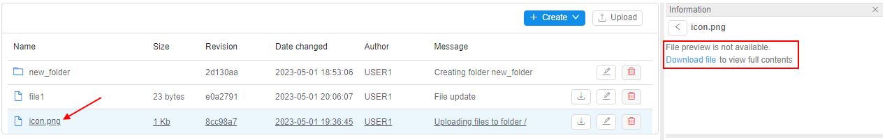

#### Rename a file/folder

To rename a file/folder:

1. Click the **Rename** button in the row of the file/folder of the versioned storage
2. In the appeared pop-up, specify a new name and commit message.  
    The commit message may be omitted. If it is not specified - it will be set automatically.  
    Click **OK** button to confirm:  
    
3. After saving, a new revision of the storage will be created.  
    File/folder will be renamed:  
    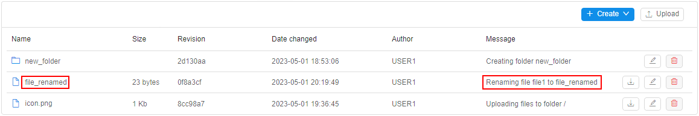

#### Remove a file/folder

To remove a file/folder:

1. Click the **Remove** button in the row of the file/folder of the versioned storage
2. In the appeared pop-up, specify a commit message.  
    The commit message may be omitted. If it is not specified - it will be set automatically.  
    Click the **Delete** button to confirm:  
    
3. After saving, a new revision of the storage will be created. File/folder will be removed

> **_Note_**: removing of the folder also deletes all child files and subfolders.

***

## Version control

Due to that versioned storage is a Git repository by the fact, so one of the important advantages of versioned storages in condition with regular object storages - ability to view commit history and all changes that were performed with the data in details.

### Commit history of the file

You can view the commit history of the file in the versioned storage - i.e. history of all commits that touched this file.

To open the commit history of the file, click it. The commit history will be displayed under the file preview section, e.g.:  
    

Commit history contains a list of records. Each record corresponds to one commit that touched the selected file. List of commits is sorted from the last commit to earlier ones.  
Each record includes:

- commit message
- commit SHA-1 hash
- user name - author of the commit
- date and time when commit (changes) was performed
- block of buttons:  
    -  - **Revert** button - to revert the content of the current file to the selected commit
    -  - **Download version** button - to view/download revert version of the current file corresponding to the selected commit
    -  - **Show diffs** button - to view diffs between the content of the current file in the selected commit and in the previous commit

#### Download a specific version

To download a specific version of the file in the versioned storage:

1. Click the file to open its commit history
2. Find the commit
3. Click the **Download version** button for the commit, e.g.:  
    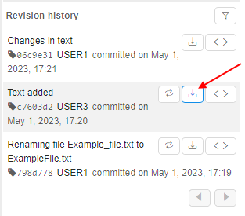
4. The file content in the selected commit will be displayed:  
    
5. Click the **Download** button in the upper side of the pop-up

#### Revert to a specifid version

To revert to a specific version of the file in the versioned storage:

1. Click the file to open its commit history
2. Find the commit
3. Click the **Revert** button for the commit, e.g.:  
    
4. Pop-up will appear to specify a commit message - for the operation that will revert the current state of the file to the selected commit.  
    The commit message may be omitted. If it is not specified - it will be set automatically.  
    Click the **Revert** button to confirm:  
    
5. After the operation:  
    - content of the file will be reverted to the selected commit
    - new commit will appear in the commit history  
    

**_Note_**: **Revert** button is available for any non-latest commit.

#### View diffs

To view differences of a specific file version conditionally to its previous version:

1. Click the file to open its commit history
2. Find the commit
3. Click the **Show diffs** button for the commit, e.g.:  
    
4. The pop-up will be opened with diffs between file version in the selected commit and in the previous commit:  
    

Differences pop-up includes:

- selected commit's hash
- file name
- state of changes that were performed with the file in the commit. Possible variants:  
    - _ADDED_ - new file was created
    - _CHANGED_ - existing file was edited
    - _DELETED_ - file was removed
    - _RENAMED_ - file was renamed
- section with details of changes:
    - new added rows are shown in green color, e.g.:  
        
    - rows that were removed are shown in red color, e.g.:  
        
    - not changed rows or auxiliary info are shown without filling, e.g. changes in a binary file:  
          
        or new empty text file creation:  
        

### Commit history of the folder

You can view the commit history of any folder in the versioned storage (including the root folder) - i.e. history of all commits that touched files in this folder and in its subfolders.

To view the commit history of the folder in the versioned storage:

1. Open the folder
2. Click the "**Show history**" button in the right upper corner.  
    The commit history will appear on the right side, "**Show history**" button will be renamed to "**Hide history**" e.g.:  
    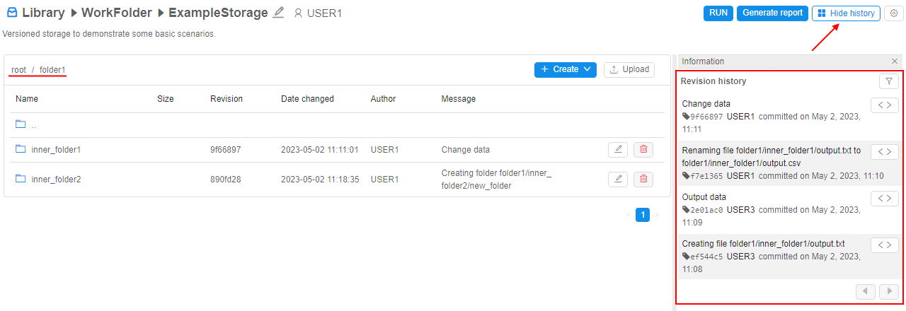

Commit history contains a list of records. Each record corresponds to one commit that touched the current folder's files. List of commits is sorted from the last commit to earlier ones.  
Each record includes:

- commit message
- commit SHA-1 hash
- user name - author of the commit
- date and time when commit (changes) was performed
- **Show diffs** button -  - to view diffs between the content of the folder in the selected commit and in the previous commit. Displaying of diffs is similar to separate files, you can see examples [above](#view-diffs).

### Filter commit history

You may filter the commit history (both for a separate file and for a folder) - for example, to find some specific commits.  
To open the **Filter** panel - click the corresponding button in the right upper corner of the commit history section - 

**Filter** panel has view:  
    

Here, the following filters for the commit history can be configured:

- by _Author_ - you may select one or several users to filter revisions (commits) by their author(s).  
    By default, commits of all authors are displayed.
- by _Date_ - you may select period (date `From` and date `To` - note that any of the date may be omitted) to filter revisions (commits) by their dates.  
    By default, commits for all periods of the object existence are displayed.
- by _File type_ - you may specify file type(s) to filter the revisions (commits) list by only the ones that touched files of the specified type(s).  
    File types shall be specified in a plain text format, comma-separated, simple masks are supported. Example: `csv,ma*,md`.  
    By default, commits for all files are displayed.

Once filters are configured, click the **Apply** button to confirm, e.g.:  
      
The commit history will be updated according to the configured filters:  
    

To reset (clear) configured filters:

1. Click the **Filter** button.
2. At the **Filter** panel, click the **Reset** button:  
    
3. Filters will be reset. The commit history will be updated.

### Generate changes report

For the versioned storages, there is the ability to generate and download reports.  
Reports contain commit history of the [current folder](#commit-history-of-the-folder) in the versioned storage and also can include diffs between commits.  
Such reports can be downloaded in Microsoft Word format (`docx` file).

To generate a report:

1. Open the folder in the versioned storage.
2. Click the "**Generate report**" button in the right upper corner of the page.
3. "**Generate report**" form will appear:  
    
4. You may configure filters - only commits that match such filters will be included in the report (by default - if no filters are set, all commits will be included).  
    These filters are fully the same as in the [**Filter** panel](#filter-commit-history):  
    - by _Author_ - to restrict the list of reported commits by their author(s)
    - by _Date_ - to restrict the list of reported commits by date of their creation
    - by _File type_ - to restrict the list of reported commits according to included file types
5. You may additionally include differences between files in each commit - by set the corresponding checkbox "**Include file diffs**":  
    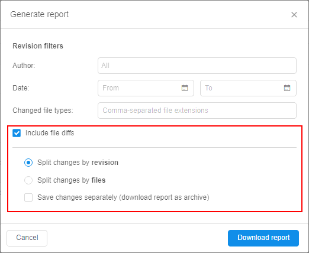  
    In this case, you may select how to split changes that will be include to the report:  
    - by **revision** - changes will be split by commits, i.e. from the recent commit to older ones, in each commit all files changes touched by this commit are included
    - by **files** - changes will be split by all changed files, i.e. for each changed file all commits that touched this file are included
    - additionally, you may set the checkbox "**Save changes separately**":  
        - in this case (no matter which split-mode is selected), changes will be saved in separate files - i.e. one report-file per each commit or one report-file per each changed file
        - summary report will be downloaded as an archive
6. Once settings are configured, click the "**Download report**" button.
7. Report will be downloaded automatically:  
    

Example of the part of the report without included diffs:  
    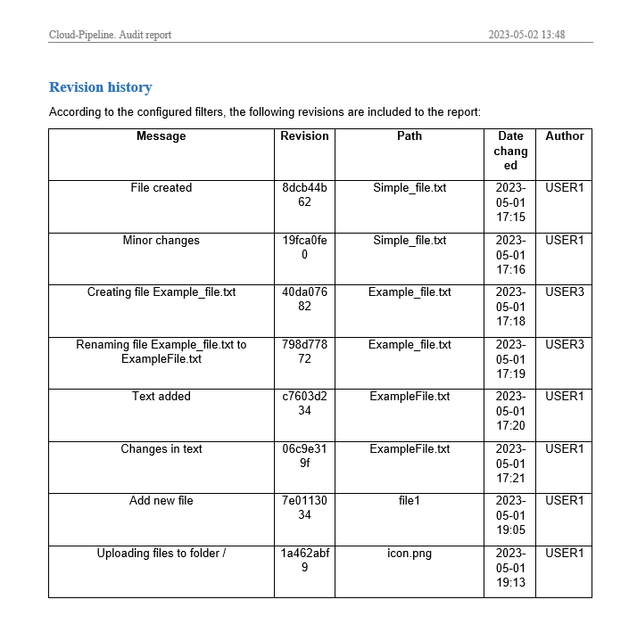

Example of the part of the report with included diffs (changes split by _commits_):  
      
    In the shown commit, one file was changed.

Example of the part of the report with included diffs (changes split by _files_):  
      
    Shown file was changed in 3 commits.

Report itself is being generated from the `docx`-format template.  
Platform has the "base" template but system admin has the ability to load own template and replace the "base" one.  
Template contains plain text and a set of predefined keywords that are replaced by actual values of the current versioned storage's data during the report generation according to the configured report filters.  
By this way, report view, its text blocks, tables, fonts, formats, etc. can be preconfigured for the customer needs.

***

## GIT operations with versioned storages

Users have the ability to launch runs using versioned storages.  
Users have the access to the version storages during the run - similarly as to the folder of any mounted object storage.  
Users have the ability to read and write data (according to the permissions) to the version storages from inside the runs.

But versioned storages have some differences to the regular object storages used in runs - especially in question of data saving and resolving conflicts.  

To manage versioning operations from active runs, there are additional controls:

- at the main Dashboard, in the "Active runs" panel, it is **VCS** (Version Control Storages) item - it is available when hovering any fully initialized run's tile, e.g.:  
    
- at the "Run logs" page, it is **VERSIONED STORAGE** item - it is available for any fully initialized run, e.g.:  
    

Both these items are identical to each other. In our examples below we will use the **VCS** control from the main Dashboard, in generally.  
By click such items, additional menu appears - its content may vary in different cases.  
Let's view main scenarios of using versioned storages in running jobs.

### Load versioned storage content to the instance

There are two possible ways to load versioned storage content to the running instance:

- launch the run from the versioned storage page with the automatic content cloning during the run initialization
- clone the versioned storage content to the already running instance

#### Launch a run with the content cloning

In this case, content of the selected versioned storage is being cloned during the run initialization.  
To launch a run from the versioned storage page:

1. Open the versioned storage page.
2. Click the **RUN** button in the right upper corner of the page:  
    
3. The pop-up will appear:  
      
    Here, the list of tools is shown. By default, this list contains tools from the user [personal group](../10_Manage_Tools/10._Manage_Tools.md#personal-docker-repository-tool-group).
4. Click the tool you wish to run with the versioned storage, e.g.:  
      
    If needed, you may select the tool version from the appeared dropdown list in the tool tile.
5. If you want to customize the tool settings (or you do not have the desired tool in the list) - you may configure the tool for the launch manually:  
    - click the **Run custom** button in the left bottom corner of the pop-up:  
        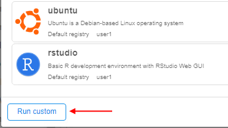
    - the **Launch** form will appear - similar to the one that appears before the [pipeline launch](../06_Manage_Pipeline/6.2._Launch_a_pipeline.md#62-launch-a-pipeline):  
        
    - you may specify options as you want
6. Click the **Launch** button to confirm the run.
7. Run of the selected tool will be launched:  
    
8. Selected versioned storage content will be automatically cloned into the running instance (during the run initialization) - by the path `/versioned-data/{versioned_storage_name}`.  
    Once the run is fully initialized, you may open the [SSH terminal](../15_Interactive_services/15.2._Using_Terminal_access.md#using-terminal-access) for the launched run and check that the versioned storage content was cloned:  
      
    Or via the [filesystem browser](../15_Interactive_services/15.3._Expose_node_filesystem.md#153-expose-node-filesystem):  
    
9. Click the **VERSIONED STORAGE** item at the "Run logs" page - cloned versioned storage will be displayed with its actions list:  
    

#### Clone content to the already running instance

You may clone the versioned storage content to the already running instance:

1. At the main Dashboard, hover over the active run's tile to which instance you want to clone the version storage content.  
    Please note, that run shall be fully initialized.
2. Click the **VCS** control.
3. In the appeared menu, click the **Clone** item, e.g.:  
    
4. The pop-up will appear:  
      
    Here, the full list of available versioned storages is shown.
5. Click the storage you want to clone to the current run, e.g.:  
    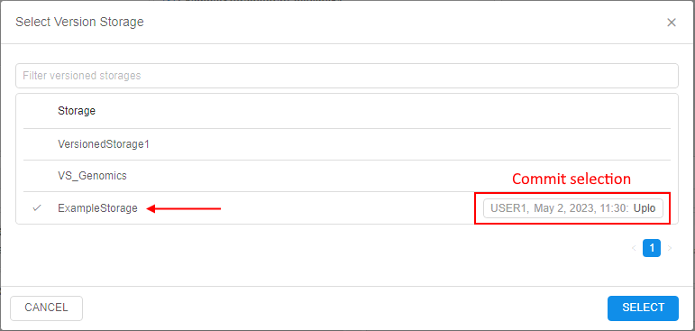  
    In the row of the selected storage, the field will appear where you may select the specific commit of the versioned storage you want to clone:  
      
    By default, the recent commit is selected.  
    Click the **SELECT** button to confirm.
6. Selected versioned storage content will be cloned to the running instance:  
    
7. Click the **VCS** control for the run - cloned versioned storage will be displayed with its actions list:  
    
8. Also as shown in the section above, cloned versioned storage content is available in the running instance by the path `/versioned-data/{versioned_storage_name}`.

You may clone any count of versioned storages to the running instance by the described way.  
For example:

1. Click the **VCS** control for the run with the previously cloned storage:  
    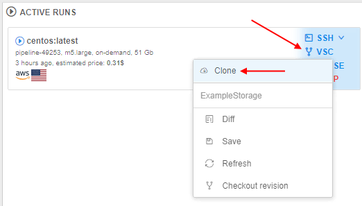
2. In the appeared pop-up, select a versioned storage to clone, e.g.:  
      
    If there are versioned storages previously cloned to that run - they are also displayed in the list, but can not be selected repeatedly.
3. After confirmation, all cloned versioned storages will be displayed in the list by click the **VCS** control:  
    
4. And all cloned versioned storages will be available by the path `/versioned-data/{versioned_storage_name}`:  
    

### View diffs of changed cloned content

At any point after the versioned storage was cloned to the running instance, you can request the diffs for that storage.  
These diffs will show all changes made by the current user in files of cloned versioned storage - i.e. differences between commit of the versioned storage that was cloned to the running instance and the current state of files in that cloned folder.

To view diffs from the running instance with the cloned versioned storage:

1. At the main Dashboard, hover over the active run's tile to which instance the versioned storage was cloned.
2. Click the **VCS** control.
3. In the appeared menu, select the versioned storage (if there are several ones) and click the **Diffs** item for it, e.g.:  
      
    Please note, that if there are no changes in the cloned versioned storage were made - this item will be  visible in the menu but disabled.
4. The diffs pop-up will be opened, e.g.:  
      
    Here, the full list of your changes in files in comparing with the cloned version of the selected versioned storage is shown.  
    Changes are split by files. Displaying of diffs for each file is similar to the described in one of the section [above](#view-diffs).

### Save changed content from the run to the versioned storage

At any point after the versioned storage was cloned to the running instance, you can "save" changes made in the cloned content to the origin versioned storage.  
Please note, if you will just stop the run with the cloned versioned storage without "saving" operation - all changes you performed in the cloned folder of the versioned storage will dissapear without any posibilities to restore the data.

To perform the "save" operation from the running instance with the cloned versioned storage:

1. At the main Dashboard, hover over the active run's tile to which instance the versioned storage was cloned.
2. Click the **VCS** control.
3. In the appeared menu, select the versioned storage (if there are several ones) and click the **Save** item for it, e.g.:  
    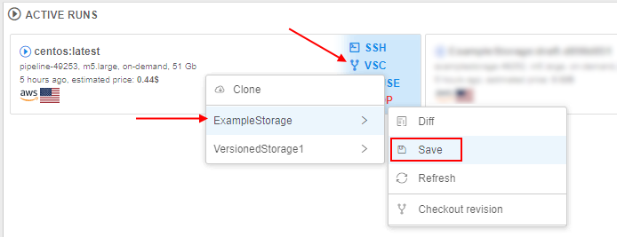  
    Please note, that if there are no changes in the cloned versioned storage were made - this item will be  visible in the menu but disabled.
4. The pop-up will be opened, e.g.:  
      
5. Specify a commit message.
6. View details of performed changes - here, the full list of your changes in files in comparing with the cloned version of the selected versioned storage is shown (similar to [Diffs](#view-diffs-of-changed-cloned-content) option).  
    You may expand details by click the file name. Displaying of diffs for each file is similar to the described in one of the section [above](#view-diffs):  
    
7. By default, all changed files from the cloned versioned storage are included to the preparing commit ("Save" operation).  
    But you can select only files you want to include to the commit - by the checkboxes near the file names, e.g.:  
      
    Or via the buttons above the list:  
    - **Select all** - to include all changed files to the preparing commit
    - **Clear selection** - to exclude all changed files from the preparing commit  
    Please note, if you will exclude some file(s) from the preparing commit, you can include these files in another commit later.
8. Once the commit message is specified and files to commit are defined - click the **Commit** button to confirm, e.g.:  
      
    The system tries to perform corresponding Git actions to origin versioned storage.
9. Changed files will be "saved" to the origin versioned storage:  
      
    You can check it from the versioned storage page:  
    
10. Changed files that were not included in the commit are still shown in **Diffs**:  
    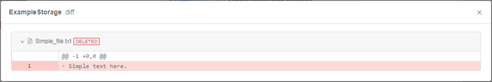  
    And can be "saved" in another commit:  
      

#### Save changed content with the conflict resolving

There may be cases, when any conflict is detected during the "save" operation attempt.  
Conflict may appears, for example, when you have cloned versioned storage to the run, made some changes and another user during this period of time made own changes to the same file(s) as in your current run and managed to "save" these changes (perform commit) to the origin versioned storage.

Let's imagine, that there are two users (you and somebody else) that both cloned the same versioned storage to their runs and perform changes in the same files, touching the same parts of these files.  
Herewith, the second user managed to "save" these changes (performed a commit to the origin versioned storage).

So, when you will try to "save" changes by steps described [above](#save-changed-content-from-the-run-to-the-versioned-storage):

1. The pop-up before the saving will have view like:  
    
2. Once the **Commit** button is clicked, the conflict error will occur and "**Resolve conflicts**" pop-up will appear:  
    
3. This pop-up contains:  
    - list of conflicting files (left panel) - please note that changed non-conflicting files are not shown here, they will be saved without additional resolving
    - 3 columns with the content of conflicting versions of the selected file:  
        - "**_Your changes_**" (left) - column shows changed state of the conflicting file (current state of the file in your run that you have tried to save)
        - "**_Changes from remote_**" (right) - column shows the state of the conflicting file from the most recent revision of that file. In our example - it is changed file that second user has saved to the origin versioned  storage
        - "**_Result_**" (center) - column shows the merging state (result) of the conflict resolving. When you will resolve the conflict, the version that will be saved will be shown here
    - all changes are highlighted:
        - _conflicting_ changes are in red color, i.e. in both versions the same part of the file is touched:  
        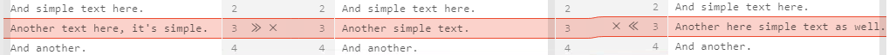
        - _non-conflicting_ changes (changes that are not touched the same parts):
            - new added parts and places where they mya be inserted are in green color e.g.:  
            
            - changed existing parts are in yellow color e.g.:  
            
    - buttons to revert/repeat performed actions during the conflict resolving: 
    - buttons to apply only _non-conflicting_ changes as a batch:  
        -  - to apply all _non-conflicting_ changes from your changed version of the file. They will be "copied" to the central column, i.e. to the version that will be saved after the conflict resolving
        -  - to apply all _non-conflicting_ changes from the updated current version of the file in the origin versioned storage (i.e. in our example, it is the version saved by the second user). Changes will be "copied" to the central column, i.e. to the version that will be saved after the conflict resolving
        -  - to apply all _non-conflicting_ changes from both file versions - yours, prepared for the saving, and theirs, from the updated origin versioned storage
    - buttons to accept one of the full versions of the conflicting file as a conflict resolve:  
        -  - to accept all changes (_conflicting_ and _non-conflicting_) fully from your version of the file
        -  - to accept all changes (_conflicting_ and _non-conflicting_) fully from the updated current version of the file in the origin versioned storage (i.e. in our example, it is the version saved by the second user)
4. You shall resolve all changes in each conflicting file.  
    You may resolve any change/conflict manually or use buttons for batch resolving that described in the previous item.  
    For manually resolving, there are abilities for each change/conflict in the file:  
    - to accept it - by the arrows icon near the change, e.g.  - by this action, the corresponding change will be "copied" to the central column, highlighting of the change will disappear
    - to decline it - by the cross icon near the change, e.g.  - by this action, the corresponding change will be declined, i.e. will be "ignored" in the central column, highlighting of the change will also disappear
    - to change the text manually (e.g., if both versions are not satisfied) - for that, set the cursor to the change highlighting area in the central column and specify a new text
5. Let's view different options:  
    - manually accept _non-conflicting_ change from your version by click the arrows icon:  
          
        Changed part from your version will appear in the central column, highlighting of the change will disappear:  
        
    - batch-apply of all _non-conflicting_ changes from the origin versioned storage (saved by the second user):  
          
        All _non-conflicting_ changes from remote version will appear in the central column, their highlighting will disappear:  
        
    - manually decline _conflicting_ change from your version:  
          
        Change from your version will be declined, highlighting of the change will disappear:  
        
    - click the conflict area in the central column:  
          
        Specify a new text as you want, e.g.:  
        
    - to finish resolving, decline _conflicting_ change from the remote version:  
        
6. Once all changes and conflicts in the selected file are resolved, the corresponding info will appear in the upper side of the pop-up and in the files list:  
      
    The version of the file displayed in the central column (_Result_) will be saved in the origin versioned storage.
7. To proceed the saving process, all conflicts in all files shall be resolved.  
    Therefore, open one-by-one each conflicting file in the list and resolve changes using instructions described above:  
    
8. In case of conflicting binary files, there is no ability to resolve each change:  
      
    You shall only select which version to accept for the saving - your changed version of this file or updated version from the origin versioned storage (i.e. in our example, it is the version saved by the second user).
9. Once all conflicts in all files are resolved, the button **Resolve** becomes available:  
      
    Click it to finish the saving process.
10. Corresponding messages will appear:  
    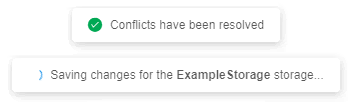
11. You can check that changes were saved - from the versioned storage page:  
    

### Update cloned content in the run

At any point after the versioned storage was cloned to the running instance, you can update the cloned content in the running instance:

- "refresh" cloned content up to the latest revision (most recent) of the versioned storage. It may be useful as the origin content of the versioned storage could be changed by other users during your run.
- also, you can change the revision to any non-latest one - just to "view" the state of the versioned storage in a certain revision.

#### Refresh cloned content

To "refresh" cloned content up to the latest revision (most recent):

1. At the main Dashboard, hover over the active run's tile to which instance the versioned storage was cloned.
2. Click the **VCS** control.
3. In the appeared menu, select the versioned storage (if there are several ones) and click the **Refresh** item for it, e.g.:  
    
4. The corresponding message will appear:  
    
5. Once the refresh is performed, confirmation will appear:  
    

Please note, that if you made changes in cloned files and did not save them, then 2 scenario are possible:

- if there are no conflicts between your changed unsaved files and files that were updated in the origin versioned storage - in such case:
    - revision version for the cloned content will be updated to the latest without issues
    - changed unsaved files in the cloned content will remain in their state, you may proceed work with them and then save, for example
- if there are conflicts between your changed unsaved files and files that were updated in the origin versioned storage - in such case:
    - the error of the refresh unable will occur:  
        
    - the pop-up will appear to resolve the conflicts
    - revision version for the cloned content will not be updated till you will not resolve the conflict as described in the section [above](#save-changed-content-with-the-conflict-resolving).  
    When you will resolve conflicts, new merge commit will be created and your cloned content will be update to this version (latest), previously conflicted changes will be saved how they were resolved.

#### Change the revision for the content

To change the revision of the cloned content to some non-latest one:

1. At the main Dashboard, hover over the active run's tile to which instance the versioned storage was cloned.
2. Click the **VCS** control.
3. In the appeared menu, select the versioned storage (if there are several ones) and click the **Checkout revision** item for it, e.g.:  
    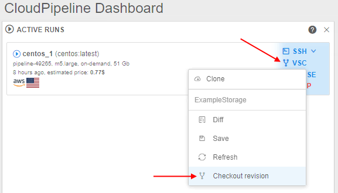
4. Pop-up with the dropdown list of all storage's revisions will appear:  
    
5. Click the dropdown list and select the revision, e.g.:  
      
    **_Note_**: current revision of the storage content is specified with the bold font.
6. To confirm the checkout, click the "**Change Revision**" button:  
    
7. The corresponding message will appear:  
    

Please note, if you have changed the revision to any non-latest one and then change some files, these new changes can not be saved by the way described in the [**Save**](#save-changed-content-from-the-run-to-the-versioned-storage) section, the corresponding item in the **VSC** menu will be disabled:  
    

In this case, to save made changes you may:

- [refresh the content revision](#refresh-cloned-content) up to the latest version and then [save](#save-changed-content-from-the-run-to-the-versioned-storage) changes
- or change the revision as described in the current section but to the latest one and then [save](#save-changed-content-from-the-run-to-the-versioned-storage) changes

Additionally note, if the revision of the cloned content is the latest, and you make any changes of the content and then change the revision to any non-latest - your unsaved changes will be lost. To avoid this, at the beginning, save changes and only then change the revision to non-latest.
