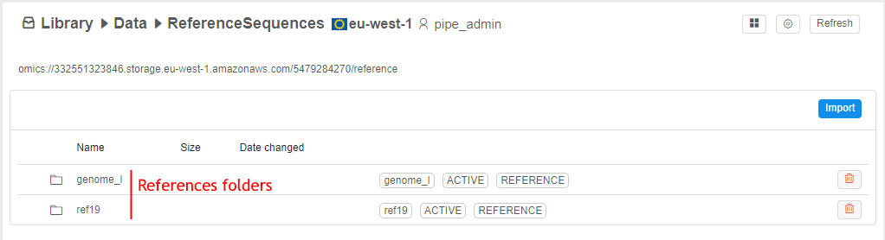
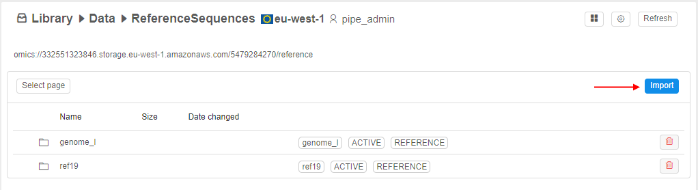
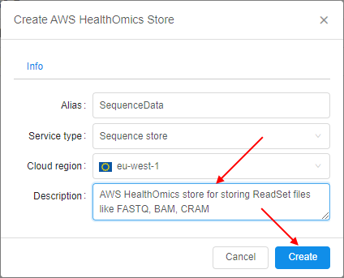
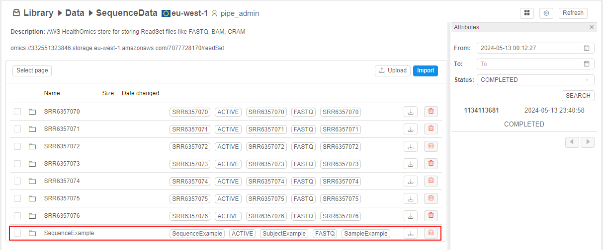
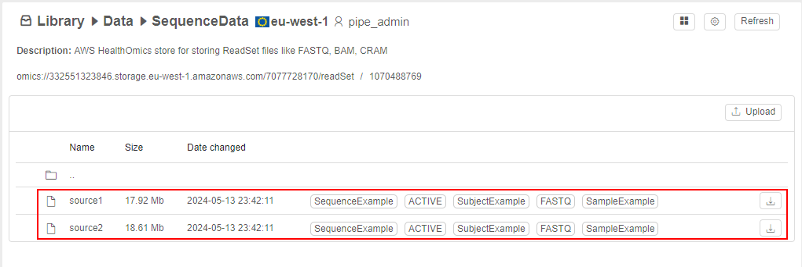
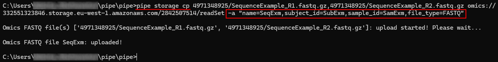

# 8.14. Omics storages

- [Reference store](#reference-store)
    - [Create reference store](#create-reference-store)
    - [View and edit content of reference store](#view-and-edit-content-of-reference-store)
        - [Import reference](#import-reference)
        - [Download reference](#download-reference)
        - [Delete reference](#delete-reference)
- [Sequence store](#sequence-store)
    - [Create sequence store](#create-sequence-store)
    - [View and edit content of sequence store](#view-and-edit-content-of-sequence-store)
        - [Import sequence](#import-sequence)
        - [Upload sequence](#upload-sequence)
        - [Download sequence](#download-sequence)
        - [Delete sequence](#delete-sequence)
- [Manage store](#manage-store)
- [Manage via the CLI](#manage-via-the-cli)
- [Usage](#usage)

**Cloud Pipeline** supports [AWS HealthOmics Storages](https://docs.aws.amazon.com/omics/latest/dev/gs-console-storage.html).  
These are specialized storages that allow to store Omics data.  
There are two types of AWS HealthOmics Storages:

- _reference_ store - for storing genome references
- _sequence_ store - for storing genomics files (e.g., BAM, CRAM, FASTQ)

Depending on the store type, management and abilities will vary.

> To create a **Storage** in a **Folder** you need to have **WRITE** permission for that folder and the **ROLE\_STORAGE\_MANAGER** role. For more information see [13. Permissions](../13_Permissions/13._Permissions.md).

## Reference store

Specialized storage for storing raw genome references.

### Create reference store

> **_Note_**: please note that for each Cloud Region, only one reference store can be created.

To create reference store:

1. Navigate to the folder where you want to create reference storage.
2. Click **+ Create** → **Storages** → **Create AWS HealthOmics Store**:  
    
3. The pop-up of the AWS HealthOmics Storage creation will appear:  
    
4. Specify a name of the creating store and select the service type as `Reference store`:  
    
5. Specify a description if necessary.
6. Click the **Create** button to confirm.
7. Reference store will appear in the folder:  
    

### View and edit content of reference store

Reference store has a flat structure:

- on the first level, there are only folders, where each folder presents a reference
- on the second level (inside the folder of each reference), there are only files of the reference itself and its index
- nested folders are not supported

Inside the reference folder:  
    

In the row of the reference file/its folder, there is a set of labels, e.g.:  
    

- reference name
- state of the file
- type of the content (`REFERENCE`)

Possible actions in a reference store:

- **Import new reference** - load a reference from the data storage
- **Download reference** - download reference files to the local workstation
- **Delete reference**

#### Import reference

> **_Note_**: to load a reference into a reference store, it shall be previously loaded to the s3 bucket available on the Cloud Pipeline Platform.

To load a reference:

1. Open the reference store.
2. Click the **Import** button:  
    
3. Import form will appear:  
    
4. Specify mandatory fields:  
    - _Name_ - reference genome name
    - _Subject id_ - source's subject ID
    - _Sample id_ - source's sample ID
5. If necessary, specify optional fields:  
    - _Description_ - reference description
    - _Generated from_ - reference details
6. Select the reference source file:  
    - click the folder icon near the **Source file** label:  
    
    - the pop-up to select a file from a data storage will appear:  
    
    - select a reference file in one of the regular storages available in the Cloud Pipeline Platform, e.g.:  
    
    - click the **OK** button to confirm selection
    - selected file will be shown near the **Source file** label:  
    
7. Once all fields are specified, click the **Import** button:  
    
8. Attributes panel with the section of import jobs will be opened automatically on the right side:  
      
    At this panel, you can check the state of the file import jobs:  
    - set dates (_From_ and _To_) and desired state (select from the list)
    - click the **Search** button, results will be shown as the job IDs list, e.g. to find newly completed jobs:  
    
9. When the import is already completed, reference will appear in the storage:  
    
10. Click the reference, to display reference files:  
      
    As you can see, reference folder contains the reference file itself (`source`) and automatically created index (`index`).

> **_Note_**: to show/hide import jobs section, you may use the special menu in the upper side of the store:  
> 

#### Download reference

To download at once all files of the reference to the local workstation:

1. Click the **Download** button in a reference row.
2. Download will be start automatically (please note that files will be loaded separately, not as an archive):  
    

To download specific reference file to the local workstation:

1. Open the reference folder.
1. Click the **Download** button in a row of the reference file.
2. Download of the selected file will be start automatically:  
    

#### Delete reference

> **_Note_**: you may remove only the reference entirely, separate reference files can not be removed.

To remove a reference:

1. Click the **Delete** button in a reference row, e.g.:  
    
2. Confirm the deletion in the appeared pop-up:  
    
3. Reference will be permanently removed.

## Sequence store

Specialized storage for storing different types of genomics files - currently, these are BAM, CRAM, UBAM, FASTQ.

### Create sequence store

To create sequence store:

1. Navigate to the folder where you want to create sequence storage.
2. Click **+ Create** → **Storages** → **Create AWS HealthOmics Store**:  
    
3. The pop-up of the AWS HealthOmics Storage creation will appear:  
    
4. Specify a name of the creating store and select the service type as `Sequence store`:  
    
5. Specify a description if necessary, then click the **Create** button to confirm:  
    
6. Sequence store will appear in the folder:  
    

### View and edit content of sequence store

Sequence store has a flat structure:

- on the first level, there are only folders, where each folder presents a separate genomic sequence
- on the second level (inside the folder of each sequence), there are only sequence genomic files - depending on the format, these can be one (for example, a single UBAM file) or two files (for example, a BAM file and its index)
- nested folders are not supported

Inside the sequence folder, there are sequence files:  
    

In the row of the sequence file/folder, there is a set of labels, e.g.:  
    

- sequence name
- state of the file
- type of the content (e.g. `FASTQ`)
- sample id
- subject id

Possible actions in a sequence store:

- **Import new sequence** - load a sequence from the data storage
- **Upload sequence** - upload a sequence from the local workstation
- **Download sequence** - download a sequence to the local workstation
- **Delete sequence**

#### Import sequence

> **_Note_**: to load a sequence into a sequence store, it shall be previously loaded to the s3 bucket available on the Cloud Pipeline Platform.

To load a sequence:

1. Open the sequence store.
2. Click the **Import** button:  
    
3. Import form will appear:  
    
4. Specify mandatory fields:  
    - _Name_ - sequence name
    - _Subject id_ - source's subject ID
    - _Sample id_ - source's sample ID
5. If necessary, specify optional fields:  
    - _Description_ - sequence description
    - _Generated from_ - sequence details
6. From the corresponding dropdown list, select the type of a source file you want to load, e.g.:  
    
7. Select the sequence source file:  
    - click the folder icon near the **Source file** label:  
    
    - the pop-up to select a file from a data storage will appear:  
    
    - select a sequence file in one of the regular storages available in the Cloud Pipeline Platform, e.g.:  
    
    - click the **OK** button to confirm selection
    - selected file will be shown near the **Source file** label:  
    
8. Additional field for a second source file will appear:  
      
    You may add such additional file similarly as described at the previous step, e.g.:  
    
9. If necessary, you may link a sequence with a reference from the reference store:  
    - click the folder icon near the **Reference path** label:  
    
    - in the appeared pop-up, select a reference from the reference store, e.g.:  
    
    - click the **OK** button to confirm selection
10. Once all fields are specified, click the **Import** button:  
    
11. Attributes panel with the section of import jobs will be opened automatically on the right side:  
      
    At this panel, you can check the state of the file import jobs:  
    - set dates (_From_ and _To_) and desired state (select from the list)  
      
    - click the **Search** button, results will be shown as the job IDs list, e.g. to find newly completed jobs:  
    
12. When the import is already completed, sequence will appear in the storage:  
    
13. Click the sequence, to display sequence files:  
      
    As you can see, sequence folder contains files named by the format: `source` plus the index.

> **_Note_**: to show/hide import jobs section, you may use the special menu in the upper side of the store:  
> 

#### Upload sequence

To upload a sequence:

1. Open the sequence store.
2. Click the **Upload** button:  
    
3. Upload form will appear:  
    
4. Select the type of a source file you want to upload, e.g.:  
    
5. Select the sequence source file from your local workstation:  
    - click the **Upload source file** button:  
    
    - the OS pop-up to select a file will appear
    - choose a sequence file and confirm, e.g.:  
    
    - selected file will be shown near the **Upload source file** button:  
    
6. Additional button for a second source file will appear:  
      
    You may add such additional file similarly as described at the previous step, e.g.:  
    
7. If necessary, you may link a sequence with a reference from the reference store:  
    - click the folder icon near the **Reference** label:  
    
    - in the appeared pop-up, select a reference from the reference store, e.g.:  
    
    - click the **OK** button to confirm selection
8. Specify mandatory fields:  
    - _Name_ - sequence name
    - _Sample id_ - source's sample ID
    - _Subject id_ - source's subject ID
9. If necessary, specify optional fields:  
    - _Description_ - sequence description
    - _Generated from_ - sequence details
10. Once all fields are specified, click the **Upload** button:  
    
11. The upload will take some time:  
    
12. Then, the pop-up will be automatically closed, sequence will appear in the storage:  
    
13. Please note, that the upload may take extra time - during this period state of the sequence will be shown as `PROCESSING_UPLOAD`, download button will not be shown:  
    
14. When the upload is already completed, sequence state will change to `ACTIVE` and download button near will appear:  
    

#### Download sequence

To download at once all files of the sequence to the local workstation:

1. Click the **Download** button in a sequence row.
2. Download will be start automatically (please note that files will be loaded separately, not as an archive):  
    

To download specific sequence file to the local workstation:

1. Open the sequence folder.
1. Click the **Download** button in a row of the sequence file.
2. Download of the selected file will be start automatically:  
    

#### Delete sequence

> **_Note_**: you may remove only the sequence entirely, separate sequence files can not be removed.

To remove a sequence:

1. Click the **Delete** button in a sequence row, e.g.:  
    
2. Confirm the deletion in the appeared pop-up:  
    
3. Sequence will be permanently removed.

## Manage store

To edit [reference](#reference-store) or [sequence](#sequence-store) store:

1. Click the _gear_ icon in the right upper corner of the store page.
2. The settings pop-up will appear, e.g.:  
    

Here, you can:

- edit store alias and description - specify new value(s) and click the **Save** button
- grant store permissions - for more details see the section [13. Permissions](../13_Permissions/13._Permissions.md)
- delete a store - for more details the section [8.5. Delete Data Storage](8.5._Delete_and_unregister_Data_Storage.md)

## Manage via the CLI

You can also manage AWS HealthOmics Storages and their data via [**CLI**](../14_CLI/14._Command-line_interface.md).

Currently, the following CLI functionality is supported for AWS HealthOmics Storages:

- _store creation_ - using [`pipe storage create`](../14_CLI/14.3._Manage_Storage_via_CLI.md#create-a-datastorage) command:  
      
> **_Note_**: to specify the storage type during the creation (with `-t` | `--type` option) use the following values - `AWS_OMICS_REF` (for [reference store](#reference-store)) and `AWS_OMICS_SEQ` (for [sequence store](../08_Manage_Data_Storage/8.14._Omics_storages.md#sequence-store)).
- _store listing_ - using [`pipe storage ls`](../14_CLI/14.3._Manage_Storage_via_CLI.md#list-storagesstorage-content) command:  
      
> **_Note_**: to specify the storage path, use `omics` Cloud prefix.
- _moving store to another folder_ - using [`pipe storage mvtodir`](../14_CLI/14.3._Manage_Storage_via_CLI.md#change-a-parent-folder-for-a-datastorage) command:  
    
- _store deletion_ - using [`pipe storage delete`](../14_CLI/14.3._Manage_Storage_via_CLI.md#delete-a-datastorage) command:  
    
- _genomic data uploading_ - using [`pipe storage cp <source> <destination>`](../14_CLI/14.3._Manage_Storage_via_CLI.md#upload-and-download-data) command, where: 
 
    - `<source>` - path to genomic data file(s) from the existing data storage registered in the **Cloud Pipeline** platform or from your local workstation
    - `<destination>` - AWS HealthOmics Storage path  
    
> **_Note_**: for loading genomic data, you shall use the option `-a` | `--additional-options` to specify arguments of the data file:
>
> - _name_ - genomic file name
> - _subject\_id_ - source's subject ID
> - _sample\_id_ - source's sample ID
> - _file\_type_ - type of the loading file

- _download genomic data_ - using [`pipe storage cp <source> <destination>`](../14_CLI/14.3._Manage_Storage_via_CLI.md#upload-and-download-data) command, where: 
 
    - `<source>` - path to genomic data in AWS HealthOmics Storage (folder or file)
    - `<destination>` - path on your local workstation
    

## Usage

AWS HealthOmics Storages can not be mounted to the running instances as regular storages.  
But these storages (and their data) can be used via pipeline's parameters - for more details see the corresponding [section](../06_Manage_Pipeline/6.1._Create_and_configure_pipeline.md#configure-pipeline-inputoutput-parameters-via-gui).

You may use data from AWS HealthOmics Storages in 2 types of parameters:

- **Path parameter**:  
    - select the corresponding parameter type from the list:  
    
    - click the folder icon in the appeared parameter field:  
    
    - in the pop-up, select a reference or sequence store, e.g.:  
    
    - then, you may select specific genomic data or the whole AWS HealthOmics Store:  
      
    - an example of the whole selected bucket as the path parameter value:  
    
- **Input parameter**:
    - select the corresponding parameter type from the list:  
    
    - click the input icon in the appeared parameter field:  
    
    - in the pop-up, select a reference or sequence store, e.g.:  
    
    - then, you may select specific genomic data, e.g.:  
      
    - an example of the selected reference as the input path parameter's value:  
    
