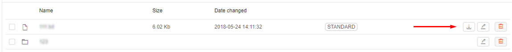

# 8.2. Upload/Download data

- [Upload data](#upload-data)
- [Download data](#download-data)
- [Generate URL](#generate-url)

> To edit a **Storage** you need to have **WRITE** permission for the **Storage**. For more information see [13. Permissions](../13_Permissions/13._Permissions.md).
>
> You also can upload and download data via CLI. See [14.3. Manage Storage via CLI](../14_CLI/14.3._Manage_Storage_via_CLI.md).

## Upload data

1. Click **Upload** button in the storage and folder of your choice:  
    
2. Browse file(s) to upload.  
    **_Note_**: make sure size doesn't exceed 5 Gb.  
    **_Note_**: you can cancel upload process by clicking the **"Cancel"** button.  
    
3. As a result, the file will be uploaded to the CP system.  
    **Note:** the uploaded file will be tagged with auto-created attribute:  
    - **CP\_OWNER**. The value of the attribute will be set as a user ID.  
        The exception is that the storage is based on FS mount. Files in such data storage don't have attributes at all.

    

## Download data

1. Click the **Download** button next to a file name.  
    
2. Specify where to download in the pop-up window.
3. As a result, the file will be downloaded via your browser to the specified location.

## Generate URL

You can use this to generate URLs for a number of files and then download them manually one by one or via scripts.

1. Select files using a checkbox.
2. Click the **Generate URL** button.  
    
3. A list of URLs (one for each file) will be generated.  
    