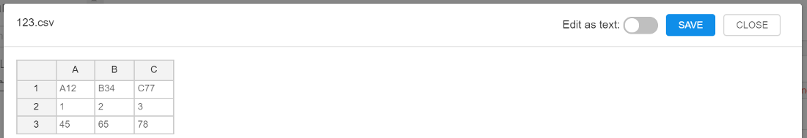

# 8.3. Create and Edit text files

You can create and edit files via GUI. It may be useful when you add some description or metadata about files in the storage.

- [Create and rename a file](#create-and-rename-a-file)
- [View and edit text file's contents](#view-and-edit-text-files-contents)
- [View and edit tabular file's contents](#view-and-edit-tabular-files-contents)

> To edit a **Storage** you need to have **WRITE** permission for the **Storage**. For more information see [13. Permissions](../13_Permissions/13._Permissions.md).

## Create and rename a file

To create a file:

1. Click **+ Create → File**.  
    
2. Enter file's name.
3. Enter file's contents (optionally).  
    
4. Click **OK**.
5. As a result, a new file will be created.  
    **Note:** the new file will be tagged with auto-created attribute:
    - **CP\_OWNER**. The value of the attribute will be set as a user ID.  
        The exception is that the storage is based on FS mount. Files in such data storage don't have attributes at all.

To rename a file:

1. Click the  button in the desired file line.
2. Rename it.  
    
3. Click **OK**.

## View and edit text file's contents

1. Click on the file.
2. You will see file preview on the right. In case of the file is large you will see only a part of it.
3. Click **"Expand"** icon at the upper right of the preview window.  
    
4. A pop-up text editor window appears.
5. Click Edit and change the file.  
    
6. Click **Save** to save the changes.

## View and edit tabular file's contents

1. Click on the tabular file.
2. You will see file preview on the right. In case of the file is large you will see only a part of it.
3. Click **"Expand"** icon at the upper right of the preview window.  
    
4. A pop-up text editor window appears.
5. Click **Edit** and change file in tabular view or in the text view.  
      
    
6. Click **Save** to save the changes.
