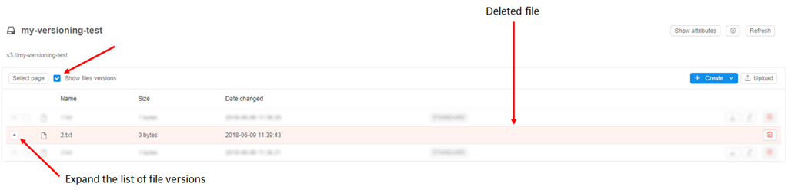
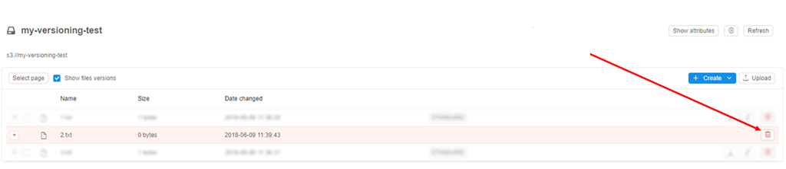
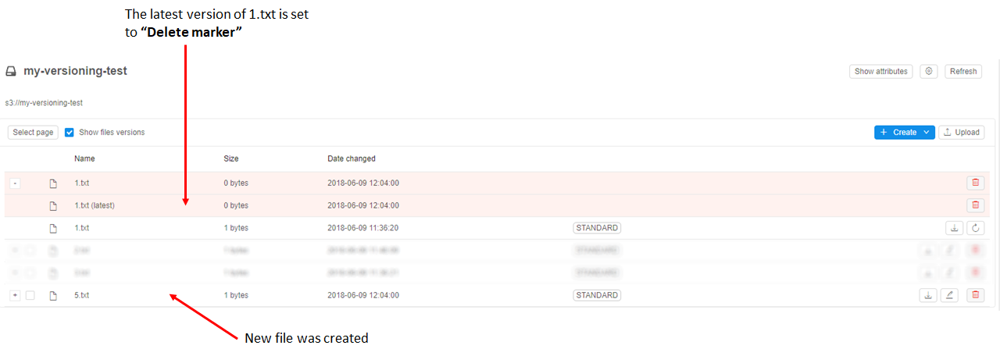
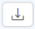
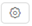

# 8.4. Control File versions

- [Versioned files management](#versioned-files-management)
    - [Management of deleted files](#management-of-deleted-files)
    - [Management of existing files](#management-of-existing-files)
        - [Object group level (not a version)](#object-group-level-not-a-version)
            - [Delete a file from a data storage](#delete-a-file-from-a-data-storage)
            - [Rename a file](#rename-a-file)
            - [Download a file](#download-a-file)
        - [Latest version](#latest-version)
            - [Delete the latest file version](#delete-the-latest-file-version)
            - [Rename the latest file version](#rename-the-latest-file-version)
            - [Download the latest file version](#download-the-latest-file-version)
        - [Previous version(s)](#previous-versions)
            - [Set a file version as the latest](#set-a-file-version-as-the-latest)
            - [Download one of the previous file versions](#download-one-of-the-previous-file-versions)
- [Change backup duration](#change-backup-duration)

File versioning management system prevents users from accident deletion of files and loss of data.
It allows restoring specific versions of a file.

> You can also control file versions via CLI. See [14.3. Manage Storage via CLI](../14_CLI/14.3._Manage_Storage_via_CLI.md).

## Versioned files management

To manage file versions in GUI:

1. In the **Library** tab choose an appropriate data storage.
2. Choose the **Show files versions** option.  
    **_Note_**: an **OWNER** or a user with **ROLE\_ADMIN** role are able to turn on files versioning view, other users will not be able to see/use that option.
3. After that, you'll be able to see file versions and files marked as deleted (but they are not actually deleted from the data storage yet).  
    Deleted files (i.e. objects where the latest file version is set to a "**Delete marker**") are highlighted in red ("**file2.txt**" in the example below). To expand a list of versions for each file press the "**Plus**" icon.  
    

### Management of deleted files

Deleted files are kept in a data storage for some time. See more details about backup duration later in this document.
Available operations for deleted versioned files:

- on the object group level *(not a version)*:  
    To delete a file completely from a data storage press the "**Delete**" icon.  
    
- with the **latest** version:  
    To delete a file completely press the "**Delete**" icon of its **latest** version (expand file version list to do it). Works the same way as for object group level.  
    
- with the previous version(s):  
    *These operations are the same as listed in the next section.*

### Management of existing files

Available operations for existing versioned files:

#### Object group level (not a version)

##### Delete a file from a data storage

To delete an existing file from a data storage press the "**Delete**" icon.  
If "**Show files versions**" is **ON** - you will have the following options:

- "**Set deletion marker**" - "**Delete marker**" will be set and the latest version of the file **will NOT be really deleted** from a data storage. Users (except "**ADMIN**" and "**OWNER**") will not be able to view this file after that.
- "**Delete from bucket**" - delete a file from a data storage.  
      
    **_Note_**: if you don't have **ROLE\_ADMIN** or **OWNER** rights, you won't have these options and you won't be able to delete a file from the data storage completely ("**Delete marker**" will be set).

If "**Show files versions**" is **OFF** - "**Set deletion marker**" option will be used by default.

##### Rename a file

To rename an existing files press the "Rename" icon . In this example, we will rename "1.txt" to "5.txt". To confirm the action press **OK**.  

After that, the latest version of "1.txt" is set to "**Delete marker**". New file appears in the folder.  

##### Download a file

To download the latest version of an existing file press the "**Download**" button .

#### Latest version

All operations below work in the same way as for object group level.

##### Delete the latest file version

To delete a file press the "**Delete**" button of its latest version.  

##### Rename the latest file version

To rename the latest version of an object press the "**Rename**" button of its latest version.

##### Download the latest file version

To download the latest version of an object press the "**Download**" button of its latest version.

#### Previous version(s)

##### Set a file version as the latest

To set a chosen version as the latest press the "**Restore**" button:  

##### Download one of the previous file versions

To download an appropriate previous version of the file press the "**Download**" button.  

## Change backup duration

To change the backup time in GUI:

1. Press the "**Edit**" button .
2. Turn on "**Enable versioning**" option.
3. Choose **Backup duration** in days. If not explicitly defined, the global default value will be applied (defined in service configuration).  
    

**Note**: setting such rule for a Data Storage (from GUI or CLI) will tell AWS to delete previous versions of an object that are older than a specified number of days. This configuration option will be available to users with **ROLE\_ADMIN** or **OWNER** rights.
