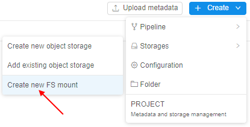
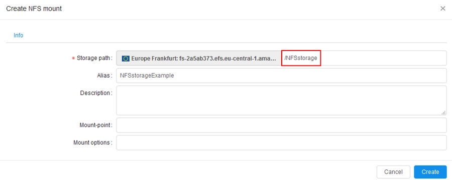
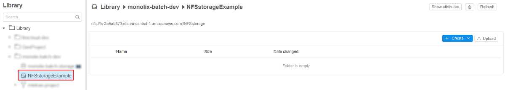

# 8.7. Create shared file system

- [Create NFS storage](#create-nfs-storage)
- [NFS Storage features](#nfs-storage-features)

> User shall have **ROLE\_ADMIN** to mount NFS to the Cloud Pipeline. For more information see [13. Permissions](../13_Permissions/13._Permissions.md).

A shared file system is a data storage based on NFS. It has several advantages over S3 and local file system:

- While S3 is a great option for a long-term storage, it cannot be used as a shared file system (FS) for high-performance computing jobs as it does not support FS-like interface.
- A local disk cannot be shared across several nodes.
- A user needs to specify local disk size when scheduling a run. If a user specifies a size that is not enough to finish a job - it will fail. Cloud-based shared file system could be used to workaround this issue.

## Create NFS storage

1. Navigate to a desired folder and click **+ Create → Storages → Create new NFS mount**.  
      
    **_Note_**: For NFS mounts - **"Add existing"** option is not available.
2. Specify **Storage path** and other optional parameters.  
      
    **_Note_**: Storage path parameter contains NFS mount path **`nfs://fs-2a5ab373.efs.eu-central-1.amazonaws.com:/`** and the name of the NFS storage to be created **`NFSstorage`**.  
    **_Note_**: NFS storages are just subdirectories of the mounted NFS. One NFS can have multiple NFS storages.
3. When deleted from GUI, NFS storage is unmounted from the Cloud Pipeline.

## NFS Storage features

1. For NFS mounts GUI doesn't display the following features typical for S3 storages:  
    - STS
    - LTS
    - Versioning and Backup duration.  
    
2. When a user selects **Input/Common/Output** path parameter for a pipeline run - it is impossible to set NFS storage:
    - NFS storages aren't displayed in the **"Browse..."** dialog for **Input/Common/Output** path parameters;
    - Value of **Input/Common/Output** path parameters is validated so that user is not able to specify a path to NFS storage manually.  
    
3. The content of files stored in NFS data storage could be previewed as well as in the S3 data storage.  
    
4. Since NFS isn't an object storage like s3, it isn't possible to add metadata tags to files in the NFS storage.
5. Use NFS storage between cluster nodes. If pipeline Tools contain NFS client, NFS storage(s) will be mounted automatically.