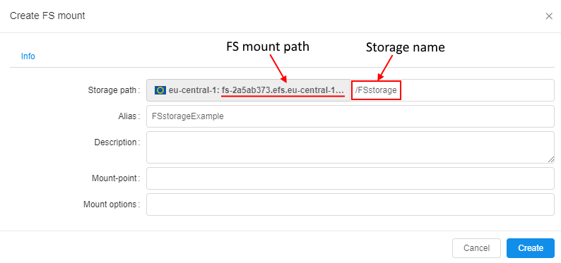

# 8.7. Create shared file system

- [Create FS mount](#create-fs-mount)
- [NFS storage features](#nfs-storage-features)

> User shall have **ROLE\_ADMIN** to mount FS to the Cloud Pipeline. For more information see [13. Permissions](../13_Permissions/13._Permissions.md).

A shared file system is a data storage based on network FS (NFS). It has several advantages over regular data storages and local file system:

- While regular data storage is a great option for a long-term storage, it cannot be used as a shared file system for high-performance computing jobs as it does not support NFS-like interface.
- A local disk cannot be shared across several nodes.
- A user needs to specify local disk size when scheduling a run. If a user specifies a size that is not enough to finish a job - it will fail. Cloud-based shared file system could be used to workaround this issue.

## Create FS mount

1. Navigate to a desired folder and click **+ Create → Storages → Create new FS mount**.  
      
    **_Note_**: For FS mounts - **"Add existing"** option is not available.
2. Specify **Storage path** and other optional parameters.  
      
    **_Note_**: Storage path parameter contains FS mount path and the name of the NFS storage to be created.  
    **_Note_**: NFS storages are just subdirectories of the mounted FS. One FS mount can have multiple NFS storages.
3. When deleted from GUI, NFS storage is unmounted from the Cloud Pipeline.

## NFS storage features

1. For NFS storages GUI doesn't display the following features typical for regular data storages:  
    - STS
    - LTS
    - Versioning and Backup duration.  
    
2. When a user selects **Input/Common/Output** path parameter for a pipeline run - it is impossible to set NFS storage:
    - NFS storages aren't displayed in the **"Browse..."** dialog for **Input/Common/Output** path parameters;
    - Value of **Input/Common/Output** path parameters is validated so that user is not able to specify a path to NFS storage manually.  
    
3. The content of files stored in NFS data storage could be previewed as well as in regular data storages:  
    
4. Since NFS isn't an object data storage, it isn't possible to add metadata tags to files in the NFS storage.
5. Use NFS storage between cluster nodes. If pipeline Tools contain NFS client, NFS storage(s) will be mounted automatically.