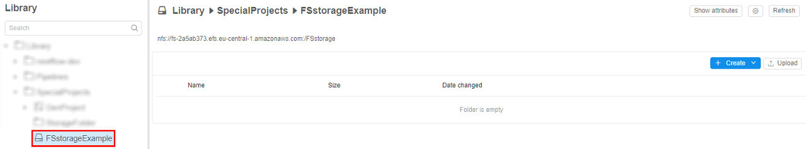
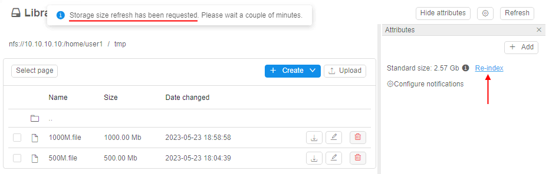
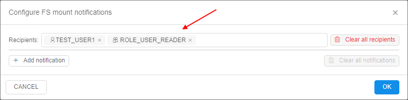
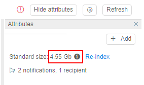
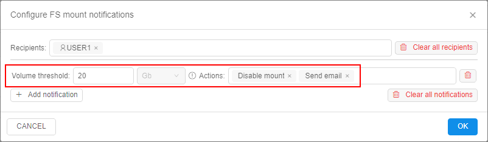

# 8.7. Create shared file system

- [Create FS mount](#create-fs-mount)
- [FS storage features](#fs-storage-features)
- [FS storage size](#fs-storage-size)
- [FS quotas](#fs-quotas)
    - [Setup the quota](#setup-the-quota)
    - [Exclude directories from monitoring](#exclude-certain-directories-from-monitoring)
    - [Usage examples](#usage-examples)
    - [Grace period for quotas](#grace-period-for-quotas)

> User shall have **ROLE\_ADMIN** to mount FS to the Cloud Pipeline. For more information see [13. Permissions](../13_Permissions/13._Permissions.md).

A shared file system is a data storage based on network file system. It has several advantages over regular data storages and local file system:

- While regular data storage is a great option for a long-term storage, it cannot be used as a shared file system for high-performance computing jobs as it does not support network-like interface.
- A local disk cannot be shared across several nodes.
- A user needs to specify local disk size when scheduling a run. If a user specifies a size that is not enough to finish a job - it will fail. Cloud-based shared file system could be used to workaround this issue.

## Create FS mount

1. Navigate to a desired folder and click **+ Create → Storages → Create new FS mount**.  
      
    **_Note_**: For FS mounts - **"Add existing"** option is not available.  
    **_Note_**: For the correct FS mount creation, at least one mount point shall be registered in the System Preferences for any Cloud Region. If no - the corresponding button of the FS mount creation becomes invisible:  
    
2. Specify **Storage path** and other optional parameters.  
      
    **_Note_**: Storage path parameter contains FS mount path and the name of the storage to be created.  
    **_Note_**: FS storages are just subdirectories of the mounted FS. One FS mount can have multiple FS storages.
3. When deleted from GUI, FS storage is unmounted from the Cloud Pipeline.

## FS storage features

1. For FS storages GUI doesn't display the following features typical for regular data storages:  
    - STS
    - LTS
    - Versioning and Backup duration.  
    
2. When a user selects **Input/Common/Output** path parameter for a pipeline run - it is impossible to set FS storage:
    - FS storages aren't displayed in the **"Browse..."** dialog for **Input/Common/Output** path parameters;
    - Value of **Input/Common/Output** path parameters is validated so that user is not able to specify a path to FS storage manually.  
    
3. The content of files stored in FS data storage could be previewed as well as in regular data storages:  
    
4. Since FS isn't an object data storage, it isn't possible to add metadata tags to files in the FS storage.
5. Use FS storage between cluster nodes. If pipeline Tools contain FS client, FS storage(s) will be mounted automatically.

## FS storage size

To know the summary size of all files in the FS storage - open its attributes:  
    

In the **Attributes** panel, you can view the whole size:  
    

> Please note, in the **Attributes** panel here, the _Effective_ size of all files in the FS storage is displayed.  
> To know the _Real_ size of all files in the storage - click the info icon.  
> Details about _Effective_ and _Real_ sizes see in the section [below](#exclude-certain-directories-from-monitoring).

FS storage content can be changed during the time, and the displayed size value in the **Attributes** panel may be outdated.  
To know the actual FS storage size currently, you shall "re-index" the storage:

1. For example, in the FS storage a new big file was added. But the displayed FS size is still previous:  
    
2. Click the **Re-index** button:  
      
    Storage size will be refreshed in a few minutes. You will see the corresponding message.
3. Couple minutes later refresh a page, and you can check that size is updated according to the added file:  
    

## FS quotas

There is a feature that allows to configure quota(s) to the FS storage volume that user can occupy.  
On exceeding such quota(s), different actions can be applied, e.g. read-only mode for that storage.  
This allows to minimize the shared filesystem costs by limiting the amount of data being stored in them and to notify the users/admins when FS storage is running out of the specific volume.

### Setup the quota

> To configure FS quotas, you need to have the **ROLE\_ADMIN** role.

To setup a quota and actions on quota's exceeding:

1. Open a FS storage.
2. Click the **Show attributes** button to open the **Attributes** panel of the storage:  
    
3. Click the **Configure notifications** hyperlink to open the notifications/quota settings for the storage:  
    
4. The pop-up with quota settings will appear:  
    
5. Type the username(s) or a groupname(s) in the "Recipients" input to choose who will get the FS quota notifications via [emails](../12_Manage_Settings/12._Manage_Settings.md#email-notifications) and [push notifications](../12_Manage_Settings/12.9._Change_email_notification.md#push-notifications), e.g.:  
      
      
    In the example above, one user and one group were selected.
6. Click the **Add notification** to configure rules/thresholds:  
      
    
7. Put a threshold in `Gb` or `%` of the total volume and choose which action shall be performed when that threshold is reached.  
    The following actions can be taken by the platform:  
      
    - _Send email_ - just notify the recipients that a quota has been reached (notification will be resent each hour)
    - _Disable mount_ - used to let the users cleanup the data:  
        - GUI will still allow to perform the modification of this storage (`read-write` mode )
        - In existing nodes (launched runs), FS storage mount will be switched to a `read-only` mode (if it was mounted previously)
        - This FS storage will be mounted in a `read-only` mode to the new launched compute nodes
    - _Make read-only_ - used to stop any data activities from the users, only admins can cleanup the data per a request:  
        - GUI will show this FS storage in a `read-only` mode
        - Existing nodes (launched runs) will turn this mounted FS storage in a `read-only` mode as well
        - This FS storage will be mounted in a `read-only` mode to the new launched compute nodes
8. You may add any count of quota rules by the described way. The notification/quota rules can be combined in any form.  
    E.g. the following example sets three levels of the thresholds. Each level notifies the users about the threshold exceeding and also introduces a new restriction:  
    

> **_Note_**: [email notification](../12_Manage_Settings/12._Manage_Settings.md#templates) type for FS quota-related processes is **STORAGE\_QUOTA\_EXCEEDING**.

### Exclude certain directories from monitoring

Some of the tools (e.g. `RStudio`) use a home directory to store the suspended sessions data.  
This may make the data storage to exceed all the quotas, if this home directory is the FS storage and some quotas are set for it. While the user will not be aware what has happened.  
To address such issues - admin can exclude certain "well-know" location(s) from the quota evaluation procedure.

The system preference **`storage.quotas.skipped.paths`** is used to specify which storages/paths shall be excluded from the quota-related processing.  
Preference value shall be a JSON-formatted list:

``` json
[
 {
  "storageName": "<storage_name>",
  "hiddenFilePathGlobs": [
   "<path_to_dir>"
  ]
 }
]
```

Where:

- `<storage_name>` - can be one of:  
    - exact storage name (e.g. "Storage-USER1") - rules will be applied only to that storage
    - wildcard (e.g. "Storage-\*" or "\*") - rules will be applied to any storage which match the mask
- `<path_to_dir>` - path to a directory or a file within a storage, which will be skipped:  
    - absolute path (e.g. "path/to/dir") will skip only exactly that directory/file
    - wildcard path (e.g. "path/to/dir/\*") will skip directory and it's content recursively

E.g. to address the `RStudio` issue (described in the beginning of the current section), the preference shall look like:

``` json
[
 {
  "storageName": "*",
  "hiddenFilePathGlobs": [
   ".local/share/rstudio/sessions/*"
  ]
 }
]
```

If the preference is set - you can view the following usage metrics of the data storage in its **Attributes**:

- _Real size_ - a real size of the storage, i.e. summary size of all files in this storage. This value is used for the billing reports.
- _Effective size_ - a real size minus the volume of the directories, specified in the **`storage.quotas.skipped.paths`** preference. This value is used to evaluate quotas.


### Usage examples

> Please note, examples below are shown for the "general" user.  
> **_ROLE\_ADMIN_** users will not be affected by the restrictions. Even if the storage is in `read-only` state - admins can perform _READ_ and _WRITE_ operations.

> Also note, transition between the FS storage states (`ACTIVE` → `MOUNT DISABLED` → `READ ONLY` and vice versa) may take up to 5 min.

For our examples:

- we have selected a data storage with a known effective volume (3.55 GB)
- we have setup two thresholds for this storage:  
    - 4 Gb - disable mounts, but keep GUI available for changes
    - 5 Gb - make the datastorage fully `read-only`  
    

|  | Action | Results |
|---|---|---|
| **1** | Create 1 Gb file in the filesystem (FS exceeds 4 Gb threshold) | _Active jobs_: filesystem mount becomes `read-only` and a user can not perform any modification<br>_New jobs_: filesystem is mounted as `read-only` by default<br><br><br>_GUI_:<ul><li>Permissions are not changed. Write operations can be performed, according to the permissions</li><li>"Warning" icon is displayed. It shows `MOUNT DISABLED` state<br></li><li>Storage size is increased by 1 Gb:<br></li></ul> |
| **2** | Create another 1 Gb file in the filesystem (FS exceeds 5 Gb threshold) | _Active jobs_: filesystem mount remains `read-only` and a user can not perform any modification<br>_New jobs_: filesystem is mounted as `read-only` by default<br><br>_GUI_:<ul><li>Storage becomes `read-only`. User can not perform any modification to the filesystem</li><li>"Warning" icon is still displayed. It shows `READ ONLY` state<br></li><li>Storage size is increased by 1 Gb:<br></li></ul> |
| **3**	| Delete one 1 Gb file (**_Note_**: this action can be performed only by admin) | _Active jobs_: filesystem is still `read-only` and a user can not perform any modification<br>_New jobs_: filesystem is mounted as `read-only` by default<br><br>_GUI_:<ul><li>Permissions are reverted to the previous state. Changes can be done.</li><li>"Warning" icon is still displayed. Wording is reverted to `MOUNT DISABLED` state</li><li>Storage size is decreased by 1 Gb</li><br><ul> |
| **4**	| Delete second 1 Gb file | _Active jobs_: filesystem is remounted according to the user's permissions<br>_New jobs_: filesystem is mounted according to the user's permissions by default<br><br>_GUI_:<ul><li>Permissions are not changed. _WRITE_ operations can be performed, according to the permissions</li><li>"Warning" icon is hidden</li><li>Storage size is decreased by 1 Gb</li><br></ul> |

### Grace period for quotas

By default, FS quotas are being applied immediately as they had been reached.  
While this is totally correct - users may face the compute workloads to stop.  
To address this - there is a grace period for the quotas restrictions to become effective.

The system preference **`storage.quotas.actions.grace.period`** is used to configure such grace period.  
Preference value shall be a JSON-formatted list:

``` json
{
 "READONLY": <VALUE_1>,
 "DISABLE_MOUNT": <VALUE_2>
}
```

Preference allows to specify grace periods for both states: `MOUNT DISABLED` and `READ ONLY`. Value is specified in minutes.

If that preference is specified - actions for FS quotas will be delayed. That means that restrictive actions will be applied only after specified "grace" period and the user has some time to free storage space up, i.e.:

- when the data storage volume exceeds a threshold - storage's state will not be changed to `MOUNT DISABLED` or `READ ONLY` until the grace period exceeds
- if a certain state does not have a grace period - for that state, the immediate state switching will be in place

Example of using:

1. Let's suppose that **`storage.quotas.actions.grace.period`** is configured as:  
      
    I.e. for `MOUNT DISABLED` action grace period is 1 hour, for `READ ONLY` action grace period is 2 hours.
2. Let's suppose we have a storage with 10 Gb volume and the following quota is configured:  
    
3. User uploads 15 Gb file and this information gets into the index.
4. "Effective" storage size (25 Gb) exceeds the threshold configured for `MOUNT DISABLED` action.
5. So, the quota monitor will perform the following actions:  
    - will send a notification to the user, that a quota has been reached, but the state is still `ACTIVE`
    - will not change the real state of the storage
    - once 1 hour is elapsed and the size of the storage will be still 25 Gb:
        - storage state will be set to `MOUNT DISABLED`
        - user will be notified about that event
