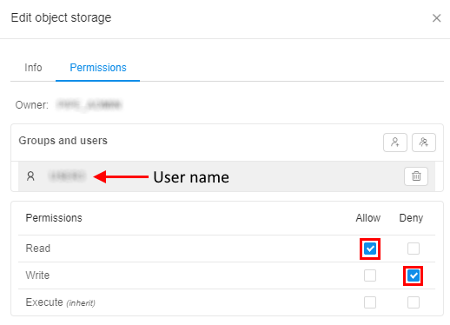

# 8.8. Data sharing

- [Create shared storage](#create-shared-storage)
- [Upload data to shared storage](#upload-data-to-shared-storage)
- [Download data from shared storage](#download-data-from-shared-storage)

> To create a **Shared storage** in a **Folder** you need to have **WRITE** permission for that folder and the **ROLE\_STORAGE\_MANAGER** role. For more information see [13. Permissions](../13_Permissions/13._Permissions.md).

Users can share data storages within a Cloud Platform for enabling of getting data files by the external partners for processing.

## Create shared storage

> For the ability of getting data files by the external partners, users should be considered, that external partner has own CP account and R/W permissions for a storage.

1. Start creating a new object storage (for more details see [here](8.1._Create_and_edit_storage.md#create-storage)), fill **Info** items.
2. Set **Enable sharing**.
3. Click **Create** button:  
    
4. Open created storage by clicking on it in the folder tree (**1**). Click icon in upper right corner (**2**):  
    
5. Choose **Permissions** tab in opened pop-up window:  
    
6. Click on  button, enter user, for whom you want to share created storage. Confirm by clicking "**Ok**" button:  
    
7. Click on user name.
8. If you want your partner can only download data from creating shared space, set **Allow** checkbox for **READ** permission, set **Deny** checkbox for **WRITE** permission:  
    
9. If you want your partner can download data from creating shared spaced and upload on it, set **Allow** checkbox both for **READ** and **WRITE** permissions:  
    
10. Close pop-up window.
11. Click  button.
12. In the pop-up window generated URL will be appeared. It can be shared with the external collaborator.  
    

## Upload data to shared storage

Shared storage's collaboration space can be used to exchange large data files (up to 5Tb per one file).

For storage **owner**:

1. Uploading data to shared storage is doing in the same way as on a regular. For more details see [here](8.2._Upload_Download_data.md#upload-data).

For **external partner**:

**_Note_**: for uploading to shared storage, user account shall be registered within CP users catalog and granted **READ** & **WRITE** permissions for that storage.

1. Open new browser window and insert URL, that you receive from the partner.
2. In appeared login page enter user credentials and sign in.
3. The following page will be opened:  
    
4. Click  button.
5. In opened pop-up window browse file(s) to upload. Confirm uploading.  
    **_Note_**: make sure size doesn't exceed 5 Tb.  
    **_Note_**: you can cancel upload process by clicking the **"Cancel" **button:  
    
6. As a result, the file(s) will be uploaded to the shared storage:
    

## Download data from shared storage

For storage **owner**:

1. Downloading data from shared storage is doing in the same way as from a regular. For more details see [here](8.2._Upload_Download_data.md#download-data).

For **external partner**:

**Note**: for downloading from shared storage, user account shall be registered within CP users catalog and granted **READ** permission for that storage.

1. Open new browser window and insert URL, that you receive from the partner.
2. In appeared login page enter user credentials and sign in.
3. The following page will be opened:  
    
4. Click  to download required file.
5. Specify where to download in the pop-up window.
6. As a result, the file will be downloaded via your browser to the specified location.