# 8.9. Mount Cloud Data Storage to the local workstation

## Introduction

Cloud Pipeline platform allows to mount data storages, located in the Cloud, to the local workstation as a network drive.
This provides an easy way to manage files, that shall be processed in the Cloud or downloaded locally.

- [Authenticate within Cloud Pipeline platform and obtain mapping token](#authenticate-within-cloud-pipeline-platform-and-obtain-mapping-token)
- [Map a storage as the network drive to the Windows workstation using built-in tools](#map-a-storage-as-the-network-drive-to-the-windows-workstation-using-built-in-tools)
- [Map a storage using CyberDuck tool](#map-a-storage-using-cyberduck-tool)

``` bash
Please consider the following limitations and prerequisites to map a network drive:

1. Network drive mapping is only supported for Windows workstations.
2. Internet Explorer 11 shall be used for Authentication section of this manual. Once authentication is done - Chrome or other web-browser can be used to further work.
3. Only NFS data storages (e.g. EFS/NFS/SMB) can be mapped to the local workstation. S3/AZ/GCP storages are not supported.
4. The following limits are applied to the data transfer:
   - Max 500 Mb per file
   - Max transfer duration: 30 min
5. The following requirements shall be set for the user account:
    - User shall be granted write permissions to any of the NFS data storages
```

## Authenticate within Cloud Pipeline platform and obtain mapping token

1. Open **Internet Explorer** web-browser
2. Navigate to the Cloud Pipeline GUI - `https://<cloud pipeline adress>/pipeline/`
3. Click the **Settings** button in the left menu 
4. Navigate to the CLI tab and select Drive mapping section in the left menu:  
   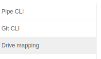
5. Authentication prompt will be shown:  
   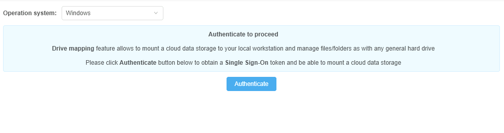
6. Click the **Authenticate** button
7. If authentication succeeds you will see a popup window with a link to map a network drive. Copy the URL shown in the popup, it will be used in the workstation configuration section:  
   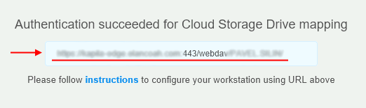

## Map a storage as the network drive to the Windows workstation using built-in tools

1. Open **This PC** (**My Computer**) view
2. Click the **Map network drive** button:  
   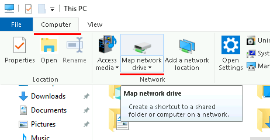
3. **Map Network Drive** dialog will be shown:
    - Select a Drive letter (it will be used to address a drive, e.g. `Z:\`) or keep the default value for the "Drive" field
    - Paste a mapping URL (obtained from the Cloud Pipeline authentication dialog) into the "Folder" field
    - Tick "**Reconnect at logon**" checkbox
    - Click the **Finish** button:  
      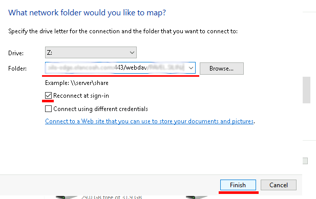
4. Drive will be mapped and opened. Further you can address it using a Drive letter set above (e.g. `Z:\`):  
   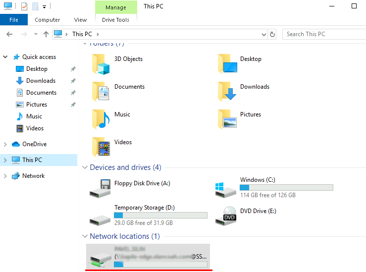

## Map a storage using CyberDuck tool

**_Prerequisites_**: get a mapping URL by the way described [above](#authenticate-within-cloud-pipeline-platform-and-obtain-mapping-token).

1. Launch [**`CyberDuck`**](https://cyberduck.io/) tool.
2. Click the **Open Connection** button:  
   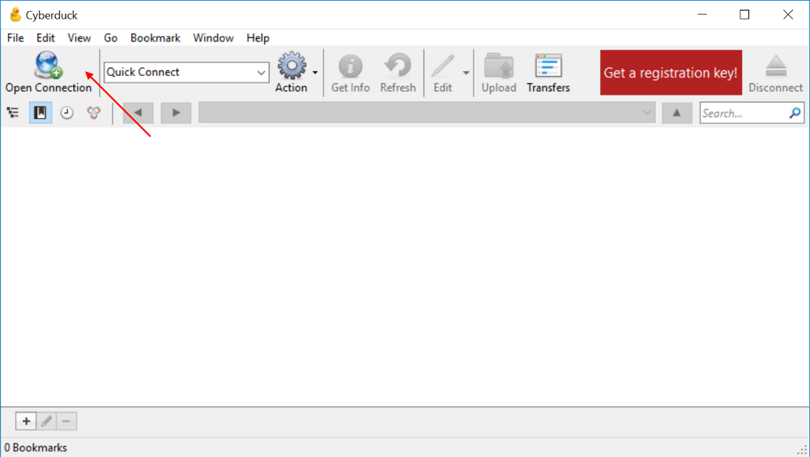
3. In the appeared popup, click the upper dropdown list with connection types:  
   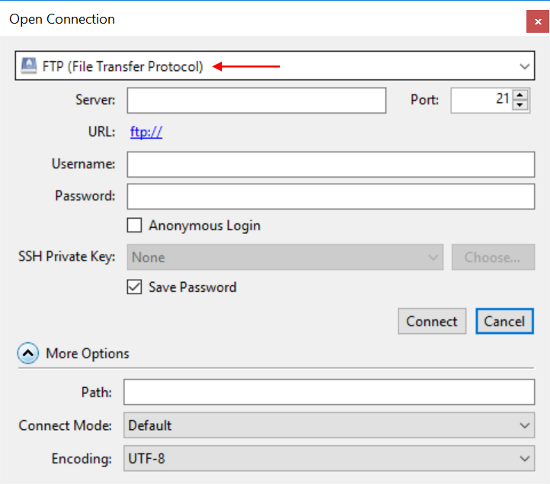
4. Select the item "**WebDAV (HTTPS)**":  
   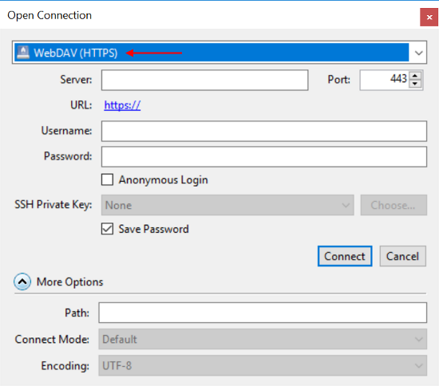
5. Paste a mapping URL (from the prerequisites) into the "Server" field. Fields "URL", "Port", "Path" will be filled in automatically:  
   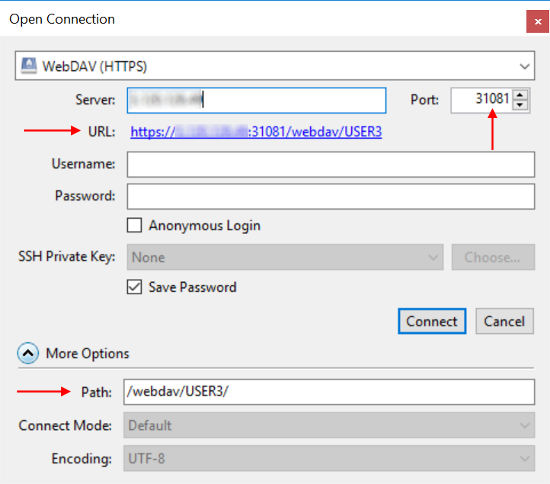
6. Specify your Cloud Pipeline credentials - **_username_** into the "Username" field, **_access key_** into the "Password" field:  
   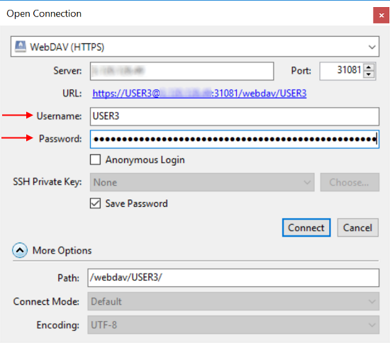  
   **_Note_**: to get your access token - open **System Settings**, then **CLI** tab, and in the sub-tab **Pipe CLI**, click the "**Generate access key**" button:  
      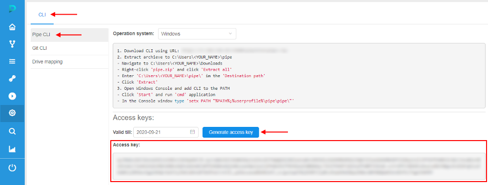
7. Click the **Connect** button to confirm.
8. After authentication will be done, all available to the user FS mounts will appear:  
   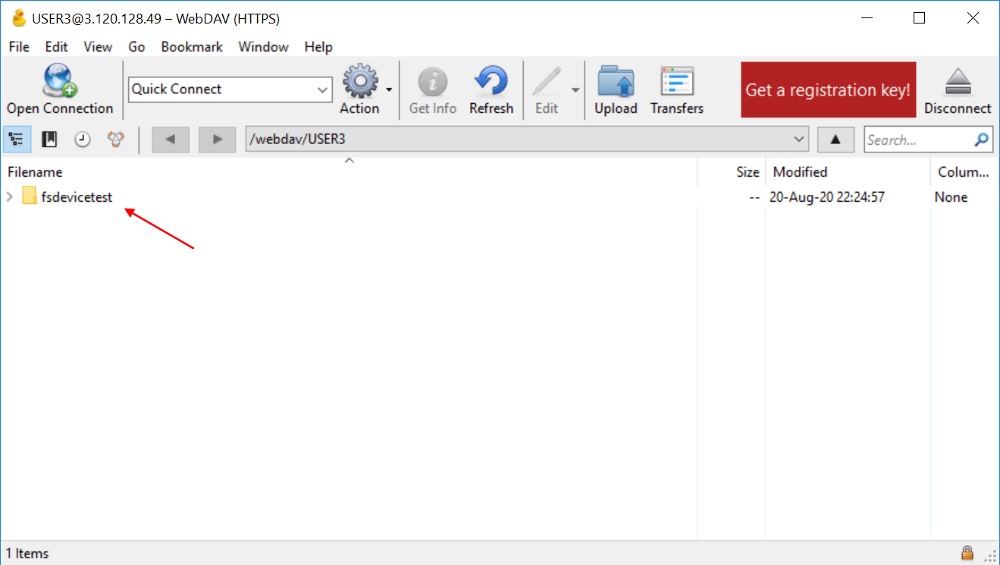  
   They are displayed as folders.
9. Double-click the folder you wish - FS storage content will appear, e.g.:  
   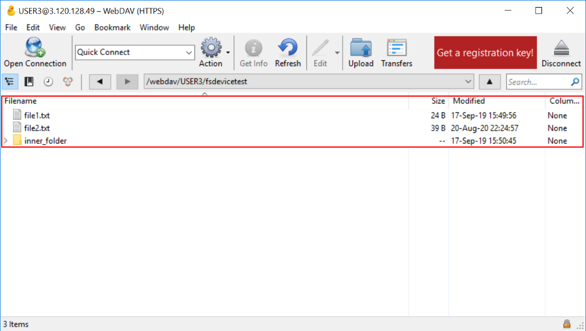
10. In this window, you can manage files/folders as in any file commander, according to your permissions on that FS mount. More about `Cyberduck` functionality you may see [here](https://trac.cyberduck.io/wiki/help/en#Cyberduck).
11. After all, close the connection:  
   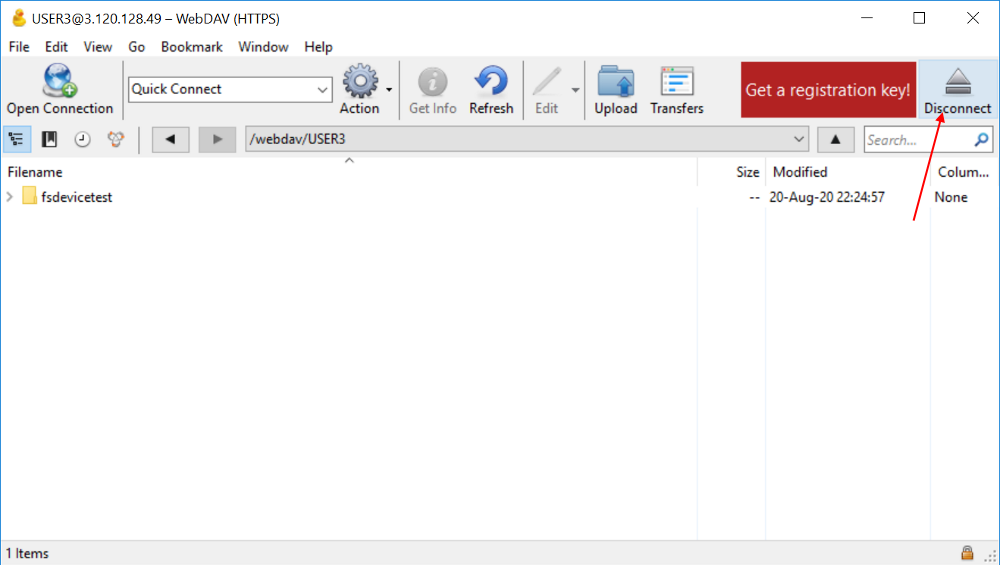
